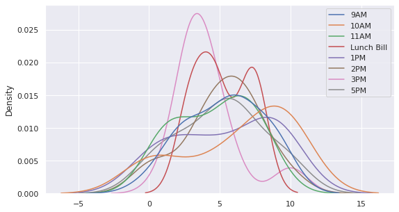

# Supervised Machine Learning

Among the two pre-eminent supervised and unsupervised machine learning techniques, classification is a popular method of the supervised algorithms -- where labeled examples of prior instances by humans can guide the training of a machine. Below, we introduce classfication with a few hands-on examples.

# Agenda

 - [Public Datasets for ML Exploration](#datasets)
 - [Public Jupyter Notebook Zoo](#modelzoo)
 - [Python Data Science Handbook](https://colab.research.google.com/github/jakevdp/PythonDataScienceHandbook)
 - [BQML, AutoML](#modelspectrum), [Colab, AI Notebooks](#colab)
 - [Simple Challenge -- Garfield](#garfield)
 - [Pandas for Data Exploration](#pandas)
 - [Seaborn, Matplotlib, Plotly for Interaction Visualization](#visuals)
 - [Training, Testing, and Scoring Datasets](#train_test_scoring)
 - [Factor Plots](#factorplots)
 - [Data Shaping/Curation](#curation)
 - [Data Visualization with COVID Data](#covid)
 - [Data Encoding](#types)
   - [ID Attributes](#idattrib)
   - [Leakage Attributes](#leakattrib)
   - [Numerical Attributes](#numattrib)
   - [Ordinal Attributes](#ordattrib)
   - [Categorical Attributes](#catattrib)
   - [Text Attributes](#textattrib)
   - [Temporal Attributes](#timeattrib)
   - [Spatial Attributes](#spatialattrib)
 - [Leading Indicators](#leading)
 - Model Selection
   - [Numerical Labels (aka Regression)](#numlabel)
   - [Categorical Labels (aka Classification)](#catlabel)
 - Algorithmic Selection
   - [Logistic Regression](#logreg)
   - [K Nearest Neighbor](#knn)
   - [Naive Bayes](#bayes)
   - [Decision Tree](#dtree)
   - [Random Forest](#forest)
   - [Gradient Boosted Trees](#boost)
   - [XGBoost](#xgboost)
   - [Support Vector Machine](#svm)
 - Measuring Performance
  - [Accuracy](#accuracy)
  - [Confusion Matrix](#confusion)
  - [Logloss, Precision, Recall, F1-Score](#metrics)
 - [MNIST Example](#mnist)

<a id='datasets'></a>
# Public Datasets
There are numerous ML datasets for explorations in the public domain: contributed by many commercial and academic organizations. A few examples below.

 - [Kaggle](https://www.kaggle.com/datasets)
 - [Google Public Datasets](https://console.cloud.google.com/marketplace/browse?filter=solution-type:dataset)
 - [Google Dataset Search](https://datasetsearch.research.google.com/)
 - [Open Data Gov](data.gov)
 - [Awesome Public Datasets](https://github.com/awesomedata/awesome-public-datasets/blob/master/README.rst)
 - [UCI ML Datasets](https://archive.ics.uci.edu/ml/datasets.php)
 - [FiveThirtyEight Datasets](https://data.fivethirtyeight.com/)
 - [Google Open Images](https://opensource.google/projects/open-images-dataset)
 - [Coco Dataset](https://cocodataset.org/#home)
 - [Google Research Datasets](https://research.google/tools/datasets/)
 - [AI Data Labeling](https://console.cloud.google.com/data-labeling?project=project-dynamic-modeling)

<a id='modelzoo'></a>
# Models & Notebooks
There are even more contributions of prebuilt/open-source models (some represented as notebooks) in the open domain. Here, a few examples -- 

 - [AI Hub](https://aihub.cloud.google.com/u/0/)
 - [Colab Examples](https://colab.research.google.com/notebooks/intro.ipynb)
 - [Analytics Zoo](https://analytics-zoo.github.io/)
 - [Kaggle](https://www.kaggle.com/)
 - [Google Experiments](https://experiments.withgoogle.com/collection/ai)
 - [Jupyter Notebook Gallery](https://github.com/jupyter/jupyter/wiki/A-gallery-of-interesting-Jupyter-Notebooks)
 - [KDNuggets](https://www.kdnuggets.com/)
 - [Azure ML Learning](https://docs.microsoft.com/en-us/azure/machine-learning/)
 - [Github Central](https://github.com/topics/machine-learning?l=jupyter+notebook)

<a id='modelspectrum'></a>
# Pandas, Scikit, BQML, AutoML

<table><tr><td></td><td></td><td></td></tr></table>

Previously, in BQML model, we developed in-database classification model directly in the big query data warehouse, so continuous training, continuous scoring methods are totally opaque, managed, and seamless to consumers. 

```
-- Jump to https://console.cloud.google.com/bigquery?project=project-dynamic-modeling&p=project-dynamic-modeling 
-- and key the model as following
CREATE OR REPLACE MODEL
 `bqml_tutorial.cardio logistic_model` OPTIONS
   (model type='LOGISTIC REG',
    auto_class_weights=TRUE,
    input_label_cols=['cardio']) AS
  SELECT age, gender, height, weight, ap_hi,
    ap_lo, cholesterol, gluc, smoke,
    alco, active, cardio
  FROM `project-dynamic-modeling.cardio_disease.cardio_disease`
```

There is also a managed service in Google Cloud Platform (GCP) -- called [AutoML tables](https://console.cloud.google.com/automl-tables?project=project-dynamic-modeling) -- which provides a total seamless experience for citizen data science.


> ![automltables.png](data:image/png;base64,iVBORw0KGgoAAAANSUhEUgAAAnEAAAGqCAYAAABknBJJAAAAAXNSR0IArs4c6QAAAARnQU1BAACxjwv8YQUAAAAJcEhZcwAADsIAAA7CARUoSoAAAP+lSURBVHhe7J0FYFZVG8efNTC6Q0JAQETCwMRCJSREQkBQSsDCwE5UDEQsQLHwQxRpFKUF6Ua6u3sMBuvtfvd33veMl0lssME2np+O995z++T/PKf8IiMjHVEURVEURVEyFX4JCQkq4hRFURRFUTIZfomJiSriFEVRFEVRMhl+jot3W1EURVEURckk+Ht/FUVRFEVRlEyEWuIU5QzExMTK4tVrJTAw0OtyAbipzN9P5Maq13gdFEVRFOXCUBGnKGegyn1NJDQ4SPz8XPWVBhyPjJKOrZrK848/5nVRFEVRlPMnVSJu294Yuar9aombUMO9Mm0KtnPxevcn5cM+X3v3MjaThnwnOarcI7Wqlpfvf/5NHn+0lffI2dm9eblsPBgid91cyeuSNuzevl1KlC7t3RMJ27tN5ixagVFI4uJipeqNt8tVpYqaY7Mm/SHxuUvL3bdUN/u7Ni6T2f9ukOAgjxUqKDhESpUrL9Wurmj2p/41SoKKVJI7bjzVsjT773ESlpBTGtW50+sisnfTBlm0eo0bZ/wlNiZGbr+3gRTNl90c+2fCGDkRVEga3Hu72bf89ftwKVKxptx4dRmzv/rfubJ6024JDAww+yEh2eSqKtdJhdKe9x83ZqRkK1JWat96ndn35cjOLbIzwk+qVr7S6yIyesQQKV7xBrm5agWvy38pcWtdqVq2pDD2JzEx0bj5ud/g7+8niQkJxh89bn6SPBkFBAQYN5w5H6KiY+Se22rKOy88bfYVRVEU5UJIcZ+4HftipPxjq2XiB+UvmoCDzz77xruV8Zk7+VdZvG6v2Z4ybpL5PRPvPd9Kxi7YY7bDtq2TpRs2me204MMXO0qZovnlijKnCqzBvV+V7h/1lbmzZ8nfk6fIzr1HjXuNYiHy87SV8kuvZ+T6xh6BERN5TPYfOCAHDx6UiBPR8v0H3WTAn8vNsStC/GTMkh3y9etNpVrzV4wb1CgWLAMnLpHlU3+WwELVvK4ivbs/Kr1/nSCzZ8yQKZMnycEjcca9eLCfDJ+3WRaP7iv+RU++a343fi3YcFBef+QOefTN741bZMTRpPeJikmQV9s9INM2HTPHcrnnz9+0R0Z9/pKUvulR4+ZL/lLl5LXew8x2wqFN4u8XJLuOxspX3VvJvR3fNu6nI8DfTR6uCHPET/LkySOFChaQhPhoiYmNl5DsOaRA/vzGLTQ0h/nNkzun5MmbV4oUyi9x8fHi6jwJdJOK7wBwf+6pKIqiKGkBlrhzsWNftBNc51/nn6VHvS7pQ8yRnc7AgQOdTbtPPqdQqOcVf/3fQGfHoSizbVkyc7IzeNho757jbFqzyNmw+YBn58RRZ96yNZ5tl/Gjxnm3TiUh6oizeO0258Dm1c5Pg4d5XR0n4vBuZ/GmXc6q+dOdVZt3G7fIA1udH34c6ByJNrtJTP59uLNw9U6n70vNnb6jZhu3aXMXmF8PMc7ggT86S9btMHsbVy127qhWymn/Ui9n18FjzrGwvc6GrXvNMeBdfhz4Pyc8zuvgMmfqeCfR/R07bLCzcNVmj+NpiXPGTZxgtrLlymF+LU89eJ0zaVmEd8/D5r8HORXu7+Ldc5yKef2cNacJ5iLZPfda/seXTtUGz5htKORGoR3x7saBqY6UutPj6FKvgjhzdvPGjlOnWn7n1Kc6TtjKcY4Urevdc5xq2cXZcMJxxvV7wWn1+gCvq+OEuPf38YYksuUuZX6XjPrMqf5gN7MNxdzzd8Z6d1ze7lDP6dCpk9Ok00dmf+Q3PZzBU5eZbThbEih5Wz3n/haPOQ+83c9xEo87Q8ZOdBIS4py6dR9w1rifNmXKJOevKf84H309wBk1frKzYXeEs275EmfC5HFO1XsfdL78c4ETu+Nfp3r9lk6d1p2cOx5q67z3eX/v3RVFURTlwjinWQALXI2u62TSR2Xlruq5XRdT7iX7u3A2zhkh2UrfJnnz55VbyueRDwdPNe7xJ0Tqt35cTkRHSKmC2WV9uHGWprXKyLsDp0jM/nXi5xcs8a6b397lUvvRF8zxP354V26p7m2i2zlLGr7cx7OdDP/o3XLD1WXk/QHDZMeq6aZpDI6snC03lL9CHn/tI9l7OFpWTB4gpW9pKvny5JCy+QNk0Y4Ic96d5XNLvzFzZdqIb+XlT0dIaI4cxv2eW28zv9G7l7r3DJG47LnlpSY3SpcPBkmu0Ozi5x8gTmKCBIVkk1ljvpVn+ww25w/99Bmp0vAJyR0aIMWC/OTvpR5r3ZMP1pera90nuyNipE6VcvLduCXG/b8ESv06dd3fWIlPNgXgls07ZPgvX8gD9erI0EmLjNvanTuk4rVVzDa0bnK/zJ29wbvnYdlfX8vVrT0Wty0bd0vViiebfVs8eKXMXbRDpNA9UuzoKtm0P1JiDm+XpWFl5dbiHr/cvTVBen/YQ+rUayizVrrnuuSrUleC9k+XPcdi5cTB9bLGr6Bc5Xrd5vXbpErFq8w50Khmdll+wLvj5Zf32suTH3gstCtWbZCa19xotqHWLYVk9YZDZjt69wIZsTG/vNj2TomMijVuTbu+I23u8VoJj28Vv3xnbk61+LtxfMn82dLxxbdl+vrDUrFUHomLTJCXen4iT/foJWMnzZEPv+wv42aulQljRsubX/4sQe5VTW8oJQsjCkvp7ImSoNMxKoqiKGmNV8ydkeLNlzvXd17tFGixwpE6//7374aFzrHjmGIujE+fetC5s20P757jzJiz2PzmCjz5it+81ML5YPA0J2bj307+a+p7XR1n5v/ece569C2zLRJsfu+98Sqn4f23GSvRsF5POG//MMW4Jyfh8HInR+V63j3H+aBLHee1H/92Di343SlQs6XX1XHyuF5lDXCbp/7PqVz3ScfZO8/JXemkNenjrvWcvqPnmm3JVtD8NrwmtzNkzkkrW6uHu5rf51re4brvMtvjB33oNH/FY6E5JUhObHQk55Vms3oecRZ4jYzLJv3g3Nj8Rc/OGYl2AkOze7c9fPrqE843g/90dmxb6+Ryn/Pz9I2OE7XZfWaI94woJ7vr/ts/2737HsrnCnD2e4xqTszO+e75QZ6dhKPmff9Y6rFU/vpxV6foVdWd6hVLOE/3HGTc4OXObZwxU+Y765fONecv2OaxqH72TAundNWaTtUyeZwnenmsoDsWDHekUHWznXhkuzl/VbjZTcLVet4txxn03hNOhzd/8u45TrObCziT1hw221flCzVWvFkjv3Dqtn3fuBnijzo3XXWVufe6Q16302AtcXVf6+PuxTr/rlrvfvMxp8atdzvzw+OdjevXOlt37XGefq6Tc0ujh53+o5Y4/T9+z7mtcWvnoTf6On/+9rVT98WvnL+Gfefc1qStWuIURVGUNOWclrgl31wtWw/EybAXS4ozscZ//xbdILlCPZ3NL4Tu/cbI/SXDpGK5MlKu+m1Steb1xj3I59ZOkL8EBomsWbZK7r2rntdV5LrbasncNZ7+WneXF9kfkygbIkvKd+90lv4/TJbfJ8ySxx+51xz/DxTl4um0DlWr1pQtSzZJQIC/BISe9B56j3Xu+Jg0adLEfdex0qHlPbJh4Sq567Z7PCe4JPCPud9JNm88JldV93S+hyFDPRakuPgEiYmJNtvg6St1SArm9ljwDDncjzm+27Pt3jfeO9NFQpyfBHg7y6eG7h99LV3bNJCSpSvJ3Kk/ykcffCqSrazMHPmpFCteTJq1eVkeuPsaKV2puPcKkcNrJklk5WZS2Pu44CtuknHfvi9F3PNbdHpLalcvJRXKFpewFX/K88MOyt4NS2Xpul1yaPQ7Mmqex+rW69vB8uC9N0mF6rfI+AFvyGf9BsvhxSOl98IE2bZ8gSzfGi4rBzwm41cekpI1m8uPL9WR4kWLS6fev8lNFcpLGVdBW+YN6yU3dfnQu+fpbxbg5zMFiBuUoTnzyNBeHaXG458KRw4fPS5x0Sc8xyEgt8zfsMFVgrFSqeC5/TEoKFiWLpwudVo+Ju8MXiZdmt0jQW5oP/r0c/JAmy7y7/YYN56evE90TJQ8XK+eVKx6h7z/6L1S9/56cvRopPeooiiKoqQN5xRxRQsEyZofr5YH3t4qE+Z7OsKfSurFxOkY+n0f6fbBl7J+8zaZ/8UTUqZaQ++Rk2CnSnDFT9UbasiEyb97XUVmTpks91S7wWw/+9xLclvNa6TdMy9K0VsflXE/vCvbY3LKFdnM4f/C69MW62XB/H+kwk2VJd59jvg0gbnaUQb9OEjGjBkjY0aPku6PNZUyVcvL1OnjPCe4JMbGJzXHWipWLiBrF+3y7ol07epployNj5OcuWie9uAZ/VhQDh2b43GAsFUiuct6dzzfb37d/1I/tiRRrq56UiCG798v+QrmNdu1mj4te/fslZG/fCV/zj0gtxQ9KYraNGkpQ3/70bvnoX7nV2S/e/7wgV/K1GUHpJL7GevXbZbSFTwjV6FSpdKyeSvfHSb3N2rvcXTZt2+P5C9cQLZu3ChXVajsdXXPv6qEbNjqEawdXvpY9rjn/fhBF1kfkVNCjauHZo+9KiMHvObdE7nhhqryz7wZ3j2RaQsPS/WSAbI/IrcE7popD7dsJZ9/O1QW/DNEfho9XX7+6Hn5Y/4W79lBUsL9d79n5ww4kuh6do2ad8qA3h/Km21ulYmzFkv2PMHy8VuvyRc935DH7rtFomLjJHu2UMkeGCCRAXmkxW1F5P7HX5b23V6UWYdzykM1i7vC/WRlQVEURVEuGK9F7pzsPRzjBN63xBk7+4jXJW2ZNepzV6Jkd7794XunXPFczrsD/jTurlYxv9Dn2Qec174eZbbb16no1Kzf1vn4nRfd6wJOdn6P24rUcfZ7dxtVze007va5d+80HN9gzn/8+Vedd15o724HGudNE35yAms0MNuw8M/+7rEgp++Ab50a5Qo4nwz1DGBoUrW4c2O9Vs7zXdo7rvRx+v8+37jzThB/aI25f6++3zrVSudxnv1kiHH/9e3OTt7S1ZzV2486Ewa+69R9+hPjPu6715zgwpWcAV9/Ya6bs8rT3lfG3Z7mbU6dN6qfU/mBpzw7ZyTSXO/L+53udgrVuNf59vOe5tg27wCGfdvWOI+3a+m6+Tuz1h/0OLrEbF/oSK6K3r2T7Now3+nY5mFzj0WbT46CKBEiTttnXnfeev5xR7IX9bo6TtvaFZw7mnR0w6q7ucY2vrvC2On68jvO693aOBJw8vyNy6Y7bZo1dvz9g53dx72OLmsm/+AUv+FkE7eloHufzq++7zxSp4ZzVe0nva4nmTWij3PXw++a7WPbl5h3+Ojzr50W91dzqtd51rifDppT67bu5NzbsoPzQJvOzoMdnnLufugR567m7Zz7W3Z0Grd/0rg1fLSLOadO646uewfn/kced+q0dM9p5e67f/e0aOfUd6+v9VAbbU5VFEVR0oxUzRO352CsXNVxjZwY65lLLM2JC5chIybI7fc2klKFPfaXmf9MlTvurm22d29aK7GhBeXKYoXM/qZl82T5zghp2vB+s2+ZMXWu3Fn7VrN9eOsWictdRIoWCJW3ujaRMXO3SrZg5FaCHPYrLFtnDZCCd74kh2Z9J0P+miOtm3osgBHhB2TV1sNyS42rzb4h7qj8NmKc3Fm/mRTPG+x1FJk3dZwEF68mlQomyBG/3HJFwXwyftpMqX/PHd4zREb99qtcf3dDKVP0pPVt6oTf5eob60oOOSh7jvhJ5auuMO7Rh3bK6Mnz5OHWLcS2Ji+YM8099x7J7T72aNhe2XcsQCb8+KJ8//tyyR6CnTBRDh0OlI1bFxqrIfvTps6Re2rXMnuW3ZuWy4xFW6R1qyZeF9eP9m+Xecu3S4P7T74v7Ny4RGJzXCnlSuT3ung4sGONLNxwSBrce+r5MHvqX3IkMa80vO/Ued/WLZ4rq/eES9NG9b0uHqaPHysnshWQB+45aSXcvXGlrDsUK7Vv8TSpW9Ysni8FK14rhXP52uY8TPlrjIQULi931LzW63KSsAM7ZNfBBKl6zcl54n4fOVRKVK4pN1Y+aelMjivipMqVV3jmifMmEyytZl64xMSklnPXxcwF55uU2LTzw1n36Bj3m26/Sd5+/imzryiKoigXwmW/YkPi4WUScH03cbbN9LooiocSN98nVxUvkiTWLpTIqGipf++d8m73Z7wuiqIoinL+qIg7vlPe+nqifPDy414XRfGwdNVa+X3GPAkJ9tg2LwSSGVOVdG/XWoLT4H6KoiiKomunKoqiKIqiZELOOTpVURRFURRFyXioiFMURVEURcmEqIhTFEVRFEXJhKiIUxRFURRFyYSoiFMURVEURcmEqIhTFEVRFEXJhPiFh4dnuSlGdNYURVEURVGyOllOxPn7+0u2bNlUyCmKoiiKkqXxO3HiRJZSO6xrmT17du+eoiiKoihK1iRL9YlT65uiKIqiKJcLOrBBURRFURQlE6IiTlEURVEUJROiIk5RFEVRFCUTkmIRR3+zU/+8B1z+e8zzZ0nu5rvvcTt1/6S7oiiKoiiKcjpSNDoVQRUQFCLZggMlKjpWsmcLlriYaImNT3TvIBKaI4dIQrwk+AdKgLtviY6KkkT37jlynBwtGh0VKe7N3HsFeV1EYmNiJDgkxLvnIT4uRmJi481o05TCezLFiI5OVRRFURQlq5MiS1xAULAc2ThXOr/6kWSXMLm+YmXZcMSR4KAAI+AeuP06+WXOGpn35zdyf92G0rx5M2nXpZvE+GczAu7jN56XB5s0kc7dXhf/7Dkkau9quf3Oe+ThFs3l4TYd5Igrvjo3bCBNmzaVBo0flIYP1JMZK3e69w/0vsHFodXza+W6J9dJ5Y5rpGrndTJ4eaTUe3KFXN9to1zdbqX0nxLmPVOk52cb5e3Rh7x7IlVaLTe/nV9fLR9NOGK2l845IO2/3We2LzaP179Hfvh9tndPpP+7z8hj735utpf8PVKaPPigNHu4jaze5XnXdi0bSfMWD0ub9o/L1oOu0HZ5qVMz95yW0rTJg9Kz/8+y/K8h8smQieaYh0R587kn3XNaSLcXe8ilsJ1uXzNX7rnvfmnVqpU0aNBIVsxbJA0efcl7VOT9Z9rIrLUHzPaL7RrKpKU7zLbEHpCHmj3j2YboTVL3oW7eHZH7azb0bol8+mIHGTRhsdn+4OV20qz5w9LYjadNH2wsv81ZLh+91F6aun7X7KEm8mTPL815F5MdsydL/UaN3XBqLM3c92je4Rk5umOZ1L6vjvGXB+rcJRtjRKaO7C/NmjWXlo88JruOxssXPbq639JCGjXyfEu/36d67yiydt4EafRgI+nx2UCvi4fd8/6Wx3v29exEbJFGHV80mz9+2sONP82l3ePPCLFn2ujvpb4bHq3cuHFHk7bmHEVRFCWNwRJ3rr+omDhn7+pZTpfXejlO1F6nWYP6To8vBzmwacEE59469zm/zVrhTBvxmTNw1CLjPv/3gU6Pb0c5M4f3d977ZpRxWzR+kNO9149O1J6VTqc3PjFu2/+d5HTs/r7ZPrxkptPx/a/MdlxMtHP8+PHTvs+Z/jg/MjLSXH/eHI1wary2xbvjOFVbLvZuOU7xBku8WwlOrSdXO3e9uM677ziVH1lufp9/f61TqOkKJ9rdXr3ggNP+u33G/WLTvd0jTpvO3b178c4jTeo5XT/5xt0+4tx0TzOPsxPr3HNfA7PVosVD5tdxjjt1GzY3W50aeX4tc4b/6PT+baJ3z3H+HvOF806/kWZ77p+DnMkL1pvti8nmZdOdVz/73rvn4ZEGd7hf6eG+Og96NqJ2O50ef8J59pUPPfuxB52mzZ/1bEP0Jqde05P7dW5u5N2Kch7t8Ljz5NMvefchxmnZ9gXvtuN0a3WPd+vS0u+1x52lxzzb25dOcd79cqBnxxDllKta17MZt89589OTftbioSe8Wyd5rk1L89u8tefXsmfe307nD/p5do5vcZp0ecP9Xe3Ua/+mcQrbuMAZNHa28/fwr51JC0+mD0VRFCXtSXGfOFo1TctmfLwUqH6nHFo2w7j/75cR8mjTByUmNlb8AwJk786NsmPHdpmx6F8pW6qUzFq0WBo/cK97Wbxcf8d9snXFCgnKlkP2b1wpv/46RPr/b6TUq1fP3OvYiUhJiIsx2zFxqWtKTSuiTyRKYsJJm1Ku7AHywe9h8smQXXJdjXzGbe60/dKs+RXS4qogmb7V877+3lc9Fpkgo18rLne/uU2K5Av0+Nkl4LBfLqlXNb+sOSiydMoQub/xY+KXmCAbliyR+o3res8KkhsKZjOWkwA3JiQYt1C5tmCCnHC3Chf1l05dnpC2bVrJorVHJSSY7zn5QbUf7Cq75/8mTz33quS8pr7cV7OC98jFIygkRJZP+1Oe7NJZWj73pnFr1ayxTJi6UnYu/lNuafiIcRv504/y9Ht9JX/0RgnHwd/f/f/UwPH9Nj8/T9KYOeJ/8vBT70i1ovGy/lCccZP4Y24cifdsu+QrXEw6dO4qj7ZtI3/PX+F1vfjExLnhFhFttoOCQ2T+lD/kCddfOnR71XXJJu93vlUebP6IDBu/St7v3smc51bjJNHxhLwvzz7XTipfe718+vWvXhcvrhf5+0bqRNcfQivLXUXCpG2HJ2TxgezyaMPb3JMC5fs+70qnju3lk28GeU9WFEVR0pIUi7gk3Pw74kiktG5yi/w+dZYcDikrJYMd0/ctICBINq9bIiNHjJCyNz8obeveIEFuZh5+IkYCAwPFiY+WAPq+uWIiW56Ccv01JWXVzkRpWvt6iY1PSFaI+hQUl5A4V9Ddc22ozJhzRL56qbRx+3rcYdm6M0q2RIn0G3uySRXi4xKl3HUFpHH+OOkxPlxyBl+a74gLPyot2rWT4UN/kZF/LZKH698skTFxUig0u+wL9xT0cDQmUuhB6LgBG+BxkvCIeFfKiRxxP+2bb7+Rwb/8JjdenUdiXZHg72/PcuNBRIx8P3ikfP7BK/Lje11l2vKd3iMXj3i38lD51nvl62+/k6Ff9DRuD7R+RP4e/6f8+dff0qZlE+M2atwMWfrPaIl2o/yI0XPcyBrsuvqEjRvfEn32E+I8gm34mLGyxa2wHIpMlBEj/zBup1zncuzwQfn8uwHy8+Bf5N6bq3pdLz68lX2zuLhYqVHrPjf8vpOBX33sOsS4YvQt+X3ErxIctkye7tHfe+ZpSDwmb/T/U4Z//a77/X9Iq8d8mkMT3HTqpnNDtmwS7xWzL3/UXwYP/ErWT/lJvvtjngT4OdLq8Wflhx9/kpefeMycoyiKoqQtKRZxia7wio6JZUOOHTsmtzRsJx8+20matu0gh48cljhXhEVFRsh1tzeWF7q/KA/Vu9Mt9OOlVdvH5LN3XpV1GzbK66+/Iy3cAuHE8WMSkD2nVKpeS+peEyCDXJERHBjgVurjPc+4hCS6avREzElL3BFX0NxcLkSGvFxSGr+9xT0hWuYfC5Rn7swtXZsUlXULDpvzomISk34PhyfKKy+Ukwn/HBEfo95F5cTxCAkMLS5RS0eJU/YWCY6LkGMRxyVfpVtlz8xRMnPxGpn2x09yosRNpuCPiYqU9dv3y1+/DZCACrXMPWLjImXV5u2ycf162Xk43Axa2bdru+zYtkXWbt0pq6aNlPYvvCfHohOlUIGcEnnipDi8WDhOohzav1d279opa9esccMuQSSoiJSIXCmTtwfKVQUCZPeyqRJa6W6pdWN16dT1KRk75Hv3yhCJOn5Ydu/ZJWvWrBIJLivZIlbIwlWbZfa4QVL8rjtdT9wquwMryAN31ZRWHZ+UBX8N9jzUlXtR0R4LLMS7wmbtmh2yaeN62bB5t9f14hMbEy3x1KZcHDedHvT6y7r1ayUmIkxq3VlXNm7fI8WLl5DjJ7C1mjMlOipZuMXHybEjYXLF9ffKzqk/SKGyrl94KXbL9bLh7z9l88498mu/7+W22++R2D0rpX6LjrJ7X7gUK1ZIIo9Hmvxix9Ytsn3bVlm5fL33akVRFCUtCXjjjTd6eLfPiuP+lz1nPrmqdAnxD8om115dUYoWKCT31r5FElwBV/iKUlIkb27Jk7+IFC2Y0wi4RLdwy1u8nNxRvaz8NWGi3NWkvdS9+RozwjVbjtxydfkrpUr1GrJq3QapXqWiWxgmSmi+AlKxdHG3wu8RRakFC15Q0MmRr6nGFSq5cgTKdeU8I1yzB4hcWzm3hObNJiFRMRIT5ycNa+WX6uVySP48QVK1eIDEhgZK6VyBUuPqnBLo7yeVy+aU0CB/qVMtuxQoECIVimH1ubgEBgRK5WuvkbJly0jNW++WnNn8JDhHHvfdSknLR9vI3CljJSqkhLz1fEdzfo7gAFn27xLJV7q6PN/pYeOWM0+grFi6QrZs3iwHXM1yS7Uqsm/nFtmwcaMs37BDWroC/tri2WX02Aly6wOPyr01K5rrLiYBgUFy3K1ErF3nCihXbJapWF3yhAbJlWVLy7U33iqlihaUjRs3yH0Nmku50sUkX8FiUiAwRoqWrSjBEi4rV62XjRvWSpHSNaXrEy1l6p9j5FhAYXn7ufaybtVKqXVfQ6lUvrTkc+NlmULZxS//lZLbvX9gYDa5pvJV5h1Cc+WVlcuWyGbXn/Yfjpfq15Y37hcbfzfMS5erKHlCAiTQTQPhh8OMv6xfv1rKVLlfnnu8gYwdNVKO+hcy3+fBcf0wRKq46S+JgBxS945q8uuvw6Rh22ckb8I+ubJKVTHDjPxySPOGd8mYUaOl4NW3SIemtSUgVxFpUKuqjHTd8pWvKY89eJf4+QfKTlfAbdy0SVav3O6KvRvMrRVFUZS0I8UL4Pv5B0hwoL/pd0PfqOjoGMmWLbup/Qe4BYafW/NP9PMXf0k0VrkkaGYNCpRg95x4t4YfZ/q6+ZuRrdGxcaZ5LoTtmFjxC3CfEeA+w3U/HxydYkRRFEVRlMuEFIu4zICKOEVRFEVRLhdSP7BBURRFURRFueSoiFMURVEURcmEqIhTFEVRFEXJhGQ5ERfku3iroiiKoihKFiVLDWwICvST1TvipGOfPZInR+bWp8w31/LeAvLsg4W8LoqiKIqiKCfxO3DgQJYRcQH+fhJ2PEF+X3xcsgVlbotcbIIj1Utml5sq5pDY+CwTRIqiKIqipBF+cXFxWUohsAaon39WaSV2JF4FnKIoiqIop8GPVfC924qiKIqiKEomQUenKoqiKIqiZEJUxCmKoiiKomRCVMQpiqIoiqJkQlTEKYqiKIqiZEJUxCmKoiiKomRCVMQpiqIoiqJkQlTEKYqiKIqiZEJUxCmKoiiKomRCVMQpiqIoiqJkQlTEKYqiKIqiZEJUxCmKoiiKomRCVMQpiqIoiqJkQlTEKcolIjw83LulKEpmICwszLulKBkDFXGKcomIi4vzbimKkhmIj4/3bilKxkBFnKJcIvz8/LxbiqIoipJ6VMQpiqIoiqJkQlTEKYqiKIqiZEJUxCmKoiiKomRCVMQpiqIoiqJkQlTEKYqiKIqiZEJUxCmKoiiKomRCVMQpiqIoiqJkQlTEKYqiKIqiZEJUxCmKoiiKomRCUiXi5syZI7fffrs0btxYoqKivK6KomREZs6cKTVr1pT69etLw4YN5bbbbpNPPvnEe/TCiIyMNH/nQ1BQkBw5csS7pyjK6ahdu7YcP37cu3cqp1vtxbrVqFFDtm7darYjIiLMb/fu3WXw4MFm+3z56KOP5J133vHuXVrIPxITE717lzcpFnFbtmwxAm7o0KHSqVMnyZEjh/eIoigZkerVq5v0WqVKFdm/f78MHz5c2rZt6z16YXz44YfnnaGz/mRAQIB3T1GU5KxatUqmTZsmn332mdcl5YwaNUquvPJK+euvv4wQhNdee80YXy4E0m1GWTu2bNmysmfPHu/e5U2KRZytEVxxxRWmVr9s2TKzb9X/4cOHk7b5bdKkifn95ptvpFKlSmabc6ZPny7ly5c3BUuuXLmkX79+kidPHqlYsaK5duXKlVKiRAkTSO+9955xK1eunBGQTz31lISGhkpMTIyJTPZ5iqL8l9y5c5t0VKpUKcmfP79JV4UKFTJpr3LlytKgQQNz3pNPPmksdmXKlDH7BQoUkKuuukoqVKggkyZNMm7U7vPlyyedO3eWgwcPmsLl66+/NunZQs2Y67i+a9euxm3y5MmSN29e8zdlyhTjBrxbs2bNjLCEnDlzmnRNQUPekT17dmnXrp106NDBpPP+/fub86g8tmrVyrgNGzbMuClKVuPpp5+W2bNnS8+ePb0uYkQd8b5u3bpeF5Fx48YZN8pkC2Xl7t27pWPHjrJo0SL5/fff5f333zfiDlq3bm3yA9I3zJ8/35S/N9xwg7kX5TSQT/B37733mn0qXhz3JSQkxBzHHcs/kG4p84sUKSLHjh0zeQD3t9fSInDNNdeYPAc+//xzufXWW00+Rb5EBdHf31+aNm1qjvMt5D38TZgwQX755RcJDw8394EhQ4aYfI2/o0ePypo1a6RkyZLmeeRJDz74oFx77bUmL4QXX3xR2rRpY7azBE4qcD3P4RI3cJwdO3YYN3uLI0eOJG3b3xUrViRtf/DBB46bsTtupHLcADVujz32mPPII4+YbTcyOAsXLnTcADB/UVFRSde6Gb4zZswYs809+vbt6wwePNhxA8K4KUpmxBVD3q30xc0knfvuu89s79y505k3b57ZditEzt69ex03s3dcsWTcXGHn9OrVy2y7GaozY8YMp1u3bs7LL79s3FyB5qxfv9756quvHLeAMW4WnvH999+b7VtuucWJiIhISsOQPH/gWa4QM9u4JSQkOLVq1XKGDh2a5LZ//34nLi7uP9cuXbrUcTNps60oFwvi48XAxnNX3DjLly8327iRpuy2/Y2NjU3ahqCgICcsLMxxRZXjCj7j5go3Z9CgQY4r6BxXPBm3L774wnErTc6GDRucwoULGze3kuY88cQTzokTJ5y5c+caN1fwmTTfu3dv54033jBuFvtM8hW7PXbsWJNmX3jhBfPcWbNmmXsAOoF9V1w5rpBz/v77b8etECbpALRBv379zLbvNybXG65INN8I1m3lypVOtWrVTJ5m3bZu3Zq0zbcvW7bMbGclUmyJo/btejS+IW4gGNXsS3BwsHfrJNS2ixUrZrapnds+NChmwA2FDlgJsK7R747njBgxwrgDavrmm2822++++66x7lEz962lKIpybg4dOiQtWrSQ7777zli1Sc+ueEqqFVOLffjhh802tdnAwEDjhkWOGjdWcfIC0nJ0dLQ5z4IV3Vr33AIgRX1WbL7hW8unBm9xCxfzDsnBcqdNskpWxFqYH3jgAdm4caN8/PHHZh+I98mhj6kvpAvSNf3hXDFl3LBskdZIl7ZLBRY5WtRId6RroEzmWixdWLC+/fZbyZYtm3E7G7TQWbAi0op24MABY6kjH8DyBuQbWOApv3G3eYTVCQULFvyPtoBnnnnGNA1jUQO+i/yHbl5AvsM56AlX1JoWAaB1AWs/z3cFaNJ7ZCVSLOL+/PNPk5nieTSN+EJgTZ061bt3Es61AyDYprAg0Gg2AX5tQcAvkQWR1qNHD1PQWDjPXkOm7tYSTMFSunRp46YoypmhckTGBog3xBjNoqRbsBkicOytt94y2//++69Jr7Vq1TJpza01yyuvvGKaMUjXtvO0pV69eqbzM9AMQyUOtm/fbgqj5FCoLFiwwGyTN1CYkM55HwuFx+kKkIzUP0dR0hK6DdF0OmjQINm8ebP89ttvxh0hNm/ePNmxY4fZt5BON23a5N3zlKWkW9LNrl27jBtpBQFFEyVNq/Dqq6+aZljOt+U0+QTl/Pfff2/SeZcuXWTfvn0mbZ4pzXEtzZy2nzzvh4jjGlvuWwMOTbtXX321EXoIRd6Re9rynXexeZWF7lbkV2gM2w+X89euXZvURDp27FiZOHGiPPfcc6brl/0eRCt9A1evXm30BQYgvof9rEKKRRx9U2h7vu6666ROnTqydOlS407gUYsnItlOlLSHAyr8jjvuMNtY2sjYcbO1fvrG2UCgTZxIunjxYqOYX3jhBbnvvvvMMX59axtErCeeeMK7pyjK2aBmS38XoB/btm3bTObdvn17M+ChatWqSTVpat4UAFjjihYtavrHvP322yatUgu2/dooaMggffvEDRw40GTMpHOb2e7cudNUyKj9792717iR1slk6dtCfxks740aNTIZ/k033ZRkbWDbFkbWEk/fPEAA2r46ipJVIL5jjbr77rvNL/3GSacLFy40FnDKYfqQ2bhPWm7ZsqX88MMPpmwGymeEE5Y8rO1YoihzsbLxi8BCSCGy+vbta0QUaQ2wXDEogvRLfzbuwfPJB3C35bUvVOzoZ4bgBPq0kadgyScPof+dvT/9b/ku3h9LH99LBdFaAnk/DDVAWuc7yFP45mrVqiWNtqUyai2KiLkbb7xR7rnnHvONiDXbX468Bu3B8euvv95Y60aOHJnUPzArYDqVeLczBf/8848JLAoBAktRMis0bZKhZSToTI2wouJEBYyaMRUvRVE8rU5WZCieQYyZTEJkOVJsicsoUPPApKwCTlHSHka20W9k/PjxZqSXCjhFUc5Er169vFvKpSLTWeIUJauQES1xiqKcGbXEKRmNTGeJUxRFURRFUVTEKYqiKIqiZEpUxCmKoiiKomRCVMQpiqIoiqJkQlTEKYqiKIqiZEJUxCmKoiiKomRCUizifvzxR3n++efNjMfMuswcUr4w8zJzuCUHN2aBTymdOnXybqU9zNTMSg92vTXWZ2XfvjfLdrC8x4YNG8y+omR2WBvx008/Pe2yeMyG/tNPP3n3zsz69eu9W+fP6NGjk5b5uhDOlTa/+OIL79bZ2b17t/n95JNPzO/ZCAsL+89SQKnFLn9kYdkfu+pNcv73v/+ZpQXPxJ49e7xbFxeWTkqe719MWB1kxYoV3r2TpDTMFSUrkmIR17FjR7P0BUtosHQP65mxED5rlgFrknXt2tVss/wGa69Z7LppFjIp1lMEZoQfMGBA0ppsnIubXR9uyZIlZmkg7omQBO7N8hsUQhQwLDliM1kyxqFDh5pt1mXkXkBGzD15T5YRYu01lgFinzXkYMyYMWY5D5YQUZTMDnGcNY+JzyzZY8UYaZZjLJRt0w1rm7JagwXRR+UGMdG7d29ZtWqV94hnfUXSSnKhgTBioXwLadGujUr6Zk1GFskHKlKkX9L1/PnzTdoknbNmJJA/sDYrS3tZSMO8i70HhTprKPvCPVkCkOW+LPiBzQeAd+Q+gB+Qjx05csTss+4i5/tCnvDzzz+bbfzQCmKEGaKStRhZGgh3KzLJn+x9eF5yocG7s6yQzQfXrVtnfrmeJQbxS9aqtXBvuz4mE6yyqobF+of1C/zWLo/Gckn8gX0GsFQR2HvatW15vr2WsOHbWFoRWFbNN19fvny5+eUcu16lLQ+o1Nu1dVlKERCuVCos3J+KM8utEWa+YYk797XwvfixhXdinkW4UIGd0SA+UiaOGzfO65I+PProo+aX8hDO5Y++S+ydjtOtq5pa7LS1xFn0hnJuUtWcSsZP4oRff/3VZBasnMBaaQ0aNEhar4zM66GHHjKWO9Z+Y01UC1Y81k3r2bOniTStWrWSxx57TO68805znBniyUgQb4BAI4H/8ccfUr16dbPkFtewnhs8++yz5lnsU0vE6se6bSQC1mC0kQLxyfuwQDf34Dms/2jfnWsrVqxoztXJHJWsAHEc8UJhwPqKxG8Wv2aheqxz9hwKWwp10gsFCGuasp4hhTnpokKFCmYVBwsWbdLMxx9/7HURI8BY3Lpy5crGuocgRBiRsVPgZs+e3TyLdAwcJz+hQsg6jogDBAUijHUieWeejWiyQoM0bNdwpULHRMkIA1+hR8HP+o8sHg58J2tJ9unTx+wD+QN/gLBhzUnyAfjqq69M/sCvhXNZ0xERgRWMtRgRKzwbkZo3b1754IMPzPqQVhz269fPrH/J991yyy3GXyz4Ff4L3AcRQ74E+BXrXdrWgpkzZ5pn4EcUovgpa0Da9wfCAxDWiMIZM2aYNS5ZF5P3tf7nKwoQSfDaa6+ZX1boQJQjfllrF8spIg0BRtghKFmHkvUrLTwHWIeStWzx47vuuitp3VziEgwbNsyUG/379zfraVq+/PJLs7Qb+TBrbLJQOedReCNwKWNsJYLvJZ7mzp3b+C3vYq3ICPGsBGuHs+wdBg3WMLYgWm15ht9Y8QW+lRZfkluAbWUFEN7QvXt380vYUiaTZomTvhB3WOvUYitFVg9QRpPHWHytxdyL81iLFewayhbf/ZdeesnEF9ZA9W2V8xX0yqmcd584asyIr/vvv98EIIkQwQZkvgQECTB5AiNAWWzbZtr169c3mUSTJk1MIHM+f3ZZrRw5cpiMnYyYzIsMlsKmSJEiJiLhTubO+VgHcefZNItS8HBvC+u8IfZszZXnsKAw7+8rNBUlq4C4qFSpkskcbSH922+/mQICywmFLyKBTBfxRJMnYgWx9Pjjj0vx4sWNZYi0YyGDpcD1tW6xpjEL3VNIk8awrpFWqdhhcbH5AELO/nJP8g3SLSIHEUThTGFNXkKljTRvLUlg0zPijoX2mzdvboSOpVixYiY/aNasmXkHLFpY5rGMWUsBz7OL7CNsEU0IPyqPfNPw4cNNHmbhXRBqXIfFEHGD31GgNm7c2BSU5EPcE4GJVYvjdNfALxEe9nmAX9uKIsd4fxbzpqkQ/yKc8DuWQKPgJr/Ef9nmvvZ9LIhExCiFMEIO/2dBce6D9ZMwBuv3gDCnokzFdtGiReYZ+APfwnvY1hPeg8XDeTbP9H0ufo+4430Is7p165rvIe7w3Tas+CUPJ2yJOxbCnPydfJp4RnjjN/gr+TiFOMKVvJ14csMNN5hjWOwQv4gQCvfkZUxmh3Ag/PDffPnymTiJMKZcI54htKhAWMs6RhEEM4LYFyprpFPKWEDYkxbID4B0DU2bNjXpg0oV1nMEvbWgWwYPHmzyDWsBbtSokfklLMhjsNTb7hLcj7hP2gUW0afbAnH8kUceMe9Qu3Ztc4zyF0u1NeJQeSH+EX+siCN+8/x27dqZfeVUUqVcSEDW5EomQMAR+CRMMkgSla0t2X5zKHBfM61V+NT2ycgoOIBMiuu4B5mCNe9zDzIAMi8gYwKbidrMhnOIAGQk7777blIkszUFaqhEJDIDmmVoXvrss8/MPpGPZ1pzPjVlRcnsUMPFokSBgIUEkcI2zSj0baVwJR1RgGM1ouJDIUFaAjJyau6+6RdIq1S6bNoCBARrGgNWniuvvNIIKNIa6Zp0T3q1tX/EAiKOggP45Y9ncZ7NJ+y+xaZ3m+dQmPFNFltjnzNnjhFoWJX43m7duhlBA9yPfAtsvsIvApT3RgTxZ8E/eA++G0GDX1Gw8nzeB6uabTngu3gmBSb3oODhu+x3A+9uLSIIHkQUBfGbb75phAr3tH7BOw8ZMsQUflgAeSbuvgKaPA+LGtZRhJC1THIeYUw8wD9t3gkU+FjGEFYUzhSUfJ+tKNvvs++BHxDevvdAMGOh4Zl8M98B5LUIaWsFsiLc+rXFfoP95VkICxv2NCEj1K3fcV/eg3BCEBCm5N/J75uVIB5RcaBMI50SXxA9WL2sOMMqhxj2bS4H/JVrrAUW4UQfcCyYCClrKKGCQfmHuKMiRdlJBcJCmGP1RhTa/u1WzFNB4I/3qVWrlknvpAdayGhto+sU+3RZoswnDlNxIJ0B1mKEKu9PmiAuW4seYcs9uI5KKOGt/JdUiThqPFbtv/LKK6aWRHMBAUvtgUhD4JBxEFEIDGp/ZBAWMo4ePXqYRE7EoDB5/fXXjaCChg0bmgyBDIOmVO5BxKVmBkQUQN2T4O29sQgS4RGWRHhqINSobWZNRCKScoxmoEKFCpnzeRfb1NKlSxdjyqafnKJkdihkybjp00WGTRMV1jW6GlDZAprpyLCpAJFmEVZkwGxjGSeDRRzYfmBAdwb6iCE8LNyHc+k3hcihNo6oo+aOiCL9Ye2m6Yz8grRI+r355pvN9Vhj2Ce/4JhtviXd8x0WChjehfyHzB1rPhYLCwUbVgDyDN6HZ/P9voOuyKsQR4glRAwgXsi3aFrl/RAuFvIc8jrEDc2LCEe+F/HINbw3zyXPYZ9vQNhwH4QJ+3y7FUDkb/Z9EG3WH8l/AGse96RwxEL49NNPmzBDvPDe5H2+TaNg80XEOuFGczPNbVyPVYOmcY5ZKLTbtGljtrEmYgkj3GiVoKUCKxkimHhjwwQ/TS4UeFeaOvlurCl8M5UBwA+wHtEMx/f7NgEDfg0IYyA/5psp5Mn7CXvizXPPPWfuS6WfCgGCgJYcawCgqTurQosXBhPEDeFEekZcI1ytBZIyEj8mrC0IYeIIfmytXLYyhCgmTO2+/SWung6MHzzvrbfeOqVvLNj7cJxf4q0V4TyHfVvZ863IWKgM8l2Eoa0U2e/iOuKDrbj5WoGVk+gC+IpyiaCJShfAzxogXilkEH/WknA2sHohWhApFwrWDkSWFcQXCwQGrRgp+d6sAt+b3n2mEWoIL7ohYP3Cf+m3hshBRFMR4xyEO6IKQwbGD/q7+lolsapj3OAcKmVU4higiBWOPqlUzqh4IBCxnmM5xkiDgYWuA1b0U9Gwg1MQ+FyDRc32a0WsI7yJg/StpRWO41S2iOf0WaePJZZZ+qgyyIfKFRVBKoRXXXWV6SvLH+fQP5V3pPLCObZrAd9v+64qJ1ERpyiXCBVxWQssEFgeUgoWMyxLFwqFm20qvphcqudeSi6GiIPT+S2WqXP13aY49+2/6hsn6cNuB/ycCZqrz9XH0D7jbO+TmrRg75P83X1JyXtdrmhvfkVRlDQgNQIO0kLAwaUSUpebgLuYnM5vzyXgILkI8o2TvqNLz0RKhJJ9xtneJzVpwd7nTAIOVMCdGRVxiqKkGDt4wU4vcToYXebbpyw12M7xZ4M+MnaeM6BJx444Tw3cg47YqSUl73ipwT+wXtiRu2eaWDi1+I4EttDnzvaxvBCw3iTvc6WkHfQ/U7IeKuIUJQtj54NLK+wUA3TsTw6juxnRSgf2czXbnAk72e/ZQCD6CimaY6y4TAl0kgf67dDBP7X4DvJIb5gSxs7plhoYoUpHcjs/HX2T4EJ7z9i5NH2hWwAjny2IbEbUng92sIKiKCkjoAfDMxVFuehQ2DG0Pr1gFCUTbzPyCwsKc0khQOyk3MDQfablQHwxQpNh/FhwKOyZvBdRxQhORkcyEpQOzjTLMDUAnY0RiVhPGHmJsELI0eGaZ1Pg22YhhBMdtbHSMaKRTstMPcGca0xPwjxY7DOdAh2ZgW06OCNI6PzMe/IejKRl5CLNkUwMy0hPOmLbEa18I/OX8e58K52hmTYIYcE+nbwZhMD38Mu7Mu8YIzh5d0ar8yw7ApeO3IzaxPqIXyI07Kh45mVjPjo6ZTPCE6sgUz4wxQnvw0hZRBjH+Bb8j22+iT/m5GLqDNzxOwQwI/XxF6Z+4Jls4ye8N+9BvGGKJPyUgRE8G39lNQQ6mQP7dEhn9gDCiQ7xiF3CCuGKyObefAfNWJyPYET48b2ECaN/OUYcYnQu53I//JCRr4g3vp8O8MwEgJCjnx/hgV/SsZ6mMjrbM7Ev/swoVqyEHOePWQKIa4Qj/sBoWOJHRoV4zuhmRckoqCVOUbIoiAhEAVN0ILAYmYYosctrIdYYUcZIMQprOlNTeDNqjRGPjFpDKDEHGgUto+SsJYY+L9yT0W9MKcF8VEx94TuxKKLNwgz0FH52ElEsRMz1hVji/oxgY4JeRsZZ7HxrCC3OQVQyH1rr1q3N+/COTHvAfXznL+Nc3ol7IpT4Bu7N6DuOMQIPYYNFjykSECmMqOOPUXQICa7lexA/iBQEFSIDfPvucA/OpS7MfGsINKZZYnoT/If3fPnll40b1ku+D6sh7owoZKoUxBWTniIqeT8EKscQbXwrYgjBRLMloxWxhnINc9DhP4gmxCXf6AvvyXOA+yIUCS/EH7/ED74diCeIMO7F9/OOTP3AqFv8gT5JiGpEGN/FtC784bf4AeKXKVIQaNyb6UqsgOca5h9jQABikHcijjFVCIKYFSeYI4+O93Z6CkVRUoaKOEXJwiDMwBbmCLfTdUjGHRAHQAHMtQgYhFvy4wgE7mP3sSja+ZwsVuzwbJZmouC2I/vs+3APBILdt/cDLFpMm0FfHo7b97bn+t7fF997+Qoua2G0k8smxz7DXoOgQIAwbyTvzsSzyeFcez7iB0GCxYp35nn2GBY3rGa+yyhxf97FdtrmXPwcYYn1ivnR7KTA3Iv7cz5rVPNrBQ9r4yIyky/mz/fY52PxsvN02U7nCEDfueN4NoIMIYrgQ6DhHzwHQY+o5j2IG75+zraNH/bevuGIBZhrEIXAO3FPruHbfcPV976KopybFIs4aoXMVcNkuEzYidk8OZj4k4OJ/nz7R5wLOtPyLtQyfWGW5+QZGpNf2kyP2jXn+EINnElOfSck5Fvt6g2Y/mlqSl5QKUpGhvhKMx1NYDQTYgmxE9xSgNLExQTciBUKWjvhJ1YdhBfNjAgERBpNaXapH6xCNL8yezz3ZYUVrE2kMyBt2pUUKLQRB1xvrVnWcsZk3DQBkv7IY3wHGmBdYrF37km6ZNUCJgZnCR7uh+UHAZO8/x0iimZemvrY5l1pGsSqhD/QF459xANiiImJWbuUNTlpKuZ8sEKDSXZpDrQWTJ5twd8Qm7wHVjMmV2UycSar5RvtPfArJh3GD7ieP4QOf/Z+fDsWKyxy+Cv5FFZU3hXrHOHF2qo0ffoKJya+pUnVt58i4c45dt4wLIPk30x2jpUS/+Ze9h5AGPM8/MiufIH1laZSO7kw+T7zjfE8mputX9lvsAKZeGYnWsfKxz2wAOIfxDG+m/fjHCypWFgJZytoFQ9W2Opf1vxLE9wbpYo333zTu+U4bmbizJw502wPGDDAqV+/vtk+dOiQM2zYMLO9ZcsWx83kzTawv2DBArO9du1a559//jHbS5cuNb8bNmwwv24m4rgZhONm3s7QoUONmyuozL0tHTp0ML/Nmzc3v+CKM+fff/915syZ4/Tt29e48Uw343bcDMvZsWOH88orrxh3y4wZMxxX9Jlt+w0NGzY0v+BmXE6nTp3MdqtWrcyvolwobqXHu3VpiI+PN+k2PXCFhXfr0uOKKu9W2uMKLJNPXU64Qszksa5AdD7//HOv6+UBZVB64wpcU1bp3+XzR5jzdz6kqjnV1tKBmhm1KzrK0smZ2jTLsgBWMJYKob8HJnnf2hVrt1Gbp1ZLnxY6KdNZmdo10G+Hof/U2mg+YEZnapjUdKkF2uYFoOZGLZU11iy8DzVFrA10AgY6ClMDpeaNVZDaIH1LbFMTfWTo4A00MXAcqyLPps8IVgbb14cO1IqSFSA9YPlJa5jOgj5eGQXfJsO0hnwvNXNiZQVsUzsDNWjyVdIGtzxOss66BbvxY/3Lun/oDLtNeBP+/KWWVIk4X2hqYZkPRBmjnGhGQAAB653RBwTBldw8zvpumM/JAGh2ILOnOZTMAFFI0wZNl3wYfUPoaE3TBM9CJFqhaGEkkzXpg68nMAqLJT7o/EzHYEz+dM6l+YemhOQDcxF2CFI657KuIB2Vaarhe+x9z8eTFSUjQjOnHc2YllCJsv2cMgLpIVQtDA5IzxHGGRXWO2VghZJ22EKcso+0qX9Z+4880v4i3BF1/KZWY6Qqp+XmPAgYjbZ7926zTb8QrHQcY0QafU7ou0I/FvtyFttnguuxwgHX0u8EQcgIJQQXHaBRp4x6+uqrr4y4A98PpI8HIo9Rb5wLiDzWX+M9EIx00sX6xpQDWO0otOivg6XN16pGfzc7UosRe3TsBd6dkXRMIwC+feYUJbNg04eiKBkPK+AobzAaYO3Ewqt/Wf+PsCbMEXPnY5FL1TxxCDKsa4zSYgg5zaZY3GgO5SXoOEztjE6vDENHYHEuFjBrQWOgAPMXMcSfzsLMScToL+AjWNgXdcq1jKhizieaWhmIQCds1q5DmAEfzz0YOUbzLdYzOifTdEqTDhY4asqMcGONSobE08GYOYmYx4m5jugcTQdq5nJiPiY6/DZq1MhYAWmGxXsKFChgOvpiEWSfJmJFuVDofJ7eVhwqL1jIR4wYcdrRlRcCHfUZvEC3B0W5HEjPeeIowLHCUZYqlx/oH4xc6BprrUsJWWYBfEbBYtFL3tx6LijkmDtLUS42WJzTcwF8+oT27t3bdFugXyfxnG4QWKHpJ0a3ATIOrNxHjx41XQeonPlOtkrfVyzXTGtB5kKFDQs2/UWxcDNHGhUiKl/0c6UvKhUivo0JehGqjLakskSFjEyKihhztu3du9d0oaCSlZ5NnoqSVqTXAvgYSBBwpBfmRVQuT5jwnPyVbmgpFXEZp+PKBUJzbGoFHKiAU7Iq9FNlig3mJ2OuLkDYIciwWGOZpnsAf0x9QZcChJat1zFRLv1KWV2B6TqwYCPGEGrMh4YFDmGHhRwQilzLRLFMIEy/U6arYIoJVhNA7DFxLMKRfqzcj2l9fPu0KsrlCmkHIadcvtjm1NSQZUScoij/xfZHpe8FMN8Y2Dnc6BrAqG8sDMz7hcCyc34xipyuBoDgw7pG7RBRSPcCO2jJ3ts2q9INAugbixtzlPEM2w0BSwOWP5bDogvG+SxCryiKkhUhj02NkFMRpyhZGIQX2AFFNNeAnWzX9sFA1NEXlL6o9AcFmkjpj4qFjWZY+rLS15UBQFj47CAfLGn0lWUwECLQPsNONIuQ5M/u0+2Bfj/0OWWkOpMRK4qiXM6k1gJnyTJ94hQls5HefeIAixmWNcz0rKhA/zZ+GRnOgAeOYxnDYkb/UPrDWWsdMAKdaxiIBIg4LGosxcUx5mik5shi88zniPXNPoPVGbDaIfZ4B6xvuPNM+n0wqp0mV0agsyqEomR00rNPHBUdVrA4W57w+GfbZe3+GMEIXrZYNnnpgULy0CdbpVi+QKlcIrv0f7qkzNsQKb9OOSyVS2eToXOPyNHwBDeNB8gdV4fK+21LeO/k5g2HY+WG5zbIrsGeAU+fj9wvv8w+ItkC/KR97QLSqX5B6T36gAydGSahQX7y2F35paP7vJGzjsj+sDhZsTNK1u2JlWPHEiRHTn95u0URGf5PuLzQrIhc4z679UdbZbv7jPKFgmXQK1fK/PUn5InPd8jSAZ6VRW59dp3M/bKS2V689rg88+0umfeFZ7/j59ulQ72CclulUweR9B51QIbNCpOcoQFSJMRfhr3taVGo2mWNDH/9SqlUOrsci4iXqt3Wy1WlQiTKfbdBL5WWcsU9rQRFWq2UJV9WlCsKB8ua7dFye/f1sv+3ayUoyGPP4vg/H5eXeatPSP9JhyRv7gA37xR5s2lh6eH6T2REouTK7S8lCwZL4+vzyEej9ku+PAESH+vIzF5XSal2a6RimRCJdP3822dKSpVyOaTzp9tl3aFYKZDNX8b08Lzv6UCK0V+Z9ZWpDPOXIhBxiqJcfC71ig2KoqSO9Fqxwa1kOdHR0efMExq8ttGJjz05s/+0xUedp/rtMNvvDd7jfDpiv7Nie6TT9oMtxg0qt1vp3TqVtwbucu59YZ0zd02E2X9n4G7nj7me1UfueGG9s35HlPP+kL3OX3OOGLf67rNXbznhjJkd5rw7aLdxcxITnTueW+/Zdmn+ziZny74Yp6f7Lr2G7TNufUbuc3q591m1Pcop3my58/mIvca9RpfV5hfa9dri3P3cOmfPoRiz/9jHW51Za46bbV/e+GmPM2G+5x2/dO/L3173mtru+z755Xbjfig8zrnvJc/KTxvdb7j7Rc/2rNURzp3uu77y3S6zv2JLpFOhzUrn27EHzP7oWWFOudYrnVVbo5w+w/Y6ExYeNe6+8K3HoxLMdm/3nN9nhpltD4lOtc5rzFZkZJxz09NrnXmrIpwOvbcZt1HTDztDph0226fDFfImfrli3sSHlKLNqYqiKIqSCSiQO0Aa9Nws9/bYLOMXH5XsIf4SG+9pTGt7XwH5Z+kxCQ70Fz+fkv1MTW2TFh+TKZ9UkE+HHzD7GH5ORHvmk2xft6BMdo+HBPnL8ehE49b2/gLmGtz8vQMnI04kSILPA/zdA8Hu8Rkrjkube/Mbt5Z35ZfZq46LKz2lU72CMnb+UXF3zH0Mrvuew/Hy86tlpPcI77u49z/d2MzAAD/ZfTBGEmITZN7aE1K5VDb5eNh+Gf1uWVmx2dONI8g950B4nAyfdUQ+GrpPHr4nn3HvNXS/TOtTQf6Y5z7fJd791Ma355FRsz2rQP08OUwevT+f65+JkjN7gPQculfq9dzi/nrWEYYE1yvCIz1+FJotQHqNPiD13XPeHbLXdfFz/S/RfW6YvD5wjzS/I6/cfE1O2XkgRpq+u1muKplNWt3t8ZO0REWcoiiKomQCwk8kysCnSsrfPcpJ/RvySHSsY8QXHItKkByuqEtJ/6g5KyIkyBV7Y+aFy6zlEcbN34/VAzzSKfx4vCtSPPcKcEURHHMFW67s576/44qynO55x6I84i8yNlGyB9NZX+SoK4D+6lle6r+xSXK67wq//h1mxOgMV+iNmO4Z5EQXDftcX0KC/GTskgh5atA+aX5nPrn3RleEzTgiE5Yck1BXeP3lfk+I+6yQYH8pVyJEZiw/Ll1c4QjTl0bInwuOGCE8z31WNvc8/O+O6rlkmiuIyxYLFv8A9/vc94yMSZRuDQvJhDfLypstTy7r6UuU+11P1Ckg491z3mldzHVxjMikSXf8gmPSvXlROeGGyWRXKP/QvbS8+O1u+WNu2o/EVxGnKIqiKJmAuPhE2bw7Rvbuj5aDYbGu2HEk/Gi8hIfHyqMfb5NXWxeVCFcoxbjixBLptaT58t4v+6T7w0WkWJFgecwVIj9NOuyKOj85cChWNmyPlE+G7Zf2rvg57oqQ/YdiPG5D90mnBoXN/WPjPPdPdH+iXMFjiXaFzXFXvD37UGFp12ubHDocKx0/2S7dHioiEa471+bIFiC3XpNTlnstZ5+O2C/Ptygs5V3xc3uVnDJn9XFx9aXs2httvnPPgZNrtoe7QrLdPfllwOMl5KFa+Yzoq1Mzt5QukU1ecO/x8dD9xhKHFr2+bA4j9AZOPCw/uX+P1i0gRQoGu88qIu8O3mssgUci4uV1V6TVfnGTvNaqqOx13xdrW3yCI7sPxrrvHyNbd3kGZAHfmshHu5hzDsWZc7bvcc9x3XGrWiq7PN2kkHw8ZK/MXHFc7nlxg+QMFClTOFj2u2GV1qRqxQZFUdKOi7Fig6IoaUd6rdiA9YrBDQwAOlueEBLiL1PWRMrM9VGyZk+MPHB9blm7L07+XhUpfToVl2tcIRQX77j38Jdry2Q318S54uI2VzT5stMVa53rF5IrCgTL7deEypJtUeZ37uZoWb0rRka+daURQ37u38JtMbLGdfvtNdfNFXoJ7v0K5AmScsVDTJNnvCu4bqro8ZNY9xgDKqq4z656ZXbpM/6wvNqskGlWjEsQ1+/85RpX5NxRNZfEuFqoVuUcctx1b31nfrkif5DcfHWobHC/q/pVOWTG+kiZsS5StoUlyG2VPH4S7/pTyULBUtQ9FxZuiJSnGhaSCsWzSbli2WRfRILcWC6bJLjvWbNCqNxZNafMWHNCcmT3lycaFJKrioVI5ZLZZJv7/TXddw4Kdv3pyhxSuECQ3FnNfSdXwFUqGeJ+X6As2BojM9ZGymTXbxu7QhGi3O+7xb0OARjgPmPpzhiZ7p4zY22UCQvk3u3uN9x0dU6Z6go4mo+vdu/30djDUrt6Tnm0dgFznzNBmcCALyyR/KUEHZ2qKJeIizE6VVGUtONSj05Vsi5IsfMZnarNqYqiKIqiKJeQlFrekqMiTlEURVEUJROiIk5RFEVRMgDna41RsgaEP82qqYkHKuIURVEU5RJDHyhdAP/yhVV1EG8pXqnBi4o4RVEURbmEUHhb68v+/fvNr3J5wTKFLH+YWnR0qqJcInR0qqJkLtJrdCrFMH/R0dGyZ88e2bVrl5luRIvnrE9AQICZVoa1rAsUKGD2U2ONUxGnKJcIFXGKkrlILxEHFMVMNRITE2PmC0PEWXfbV0rJGtjwtBZY5objLzAw0Ag4a5VNCSriFOUSoSJOUTIX6S3i7K/vtpL1sZY3K+pSg4o4RblEXCwRd+zYMYmKikp15qAovlBUBAUFmclIL1fSU8RZtEi+fDmfPFpFnKJcIi6GiFu3bp0ULVrUmOo1qSsXCiPodu7cKeXLlzdNP5cbF0PEKUpqUBGnKJeI9BZxjHYqWbJkqoesK8q52LRpkxFylxsq4pSMhubuipJFoZO0CjglPbgcrXCKkhHRHF5RFEVRFCUToiJOURRFURQlE5JiERcWFiY7duww23SjW7Zsmdm+UIYOHerdUi43hg0bZjreW8aMGSOrV6/27okMHz5cNmzY4N07CecB8yjZbWDJmt27d3v3PMTFxcmQIUPk559/TpoJfdSoUbJq1SqzjdusWbPMtoX3UhRFUZSMTopFHIVd+/btzTYibuzYsWbbrvXG5IRs0w+Hzp/AzNO+7N271/xS+FK4Mjt1o0aNjBvociOXDy+//LI0a9ZMJkyYYOLL999/L7fffrssWrRIDh8+LJ999pk0bdpUZs6cmRRvANFWu3ZtE4e++OILadKkiXFfuXKl9O3bVyZNmmT2LYg1OmA/8sgjUqRIEXnvvfekXr16snjxYjPKjvvnzp1bjhw5IuPGjTPX1KlTR0aMGGG2FUVRFCWjkmIRh0B7+umnZcCAAaazdM6cOWX+/Pmydu1ac5xCd/bs2fLDDz+YgvT999+X9evXyyeffGKOf/rpp+bcP/74w1yH+4kTJ0xBDO+++64sWLBAfvzxR7OvZG169uxplhex019g6S1UqJDUrVtX5syZIy+88IKZ34y4lidPHu9VYpajQXQh5q644grp06ePcb/22mvlueee+88C0laoff3112b/tddeM0ucFCtWTIKDg00HbYQjz3zggQfMOXnz5pXNmzeb7azKRx99JB07dpSvvvrK7D/22GPmV1EURck8pFjEMT8QhSYF3LZt28ykjxSC/AKijonqsHK0bdvWWD3uvvtuU0DTDIulgykVpk+fbgpmChDWCcuVK5cRfV26dDFWudatW5v7KVkb4g7xAvFGHLDiCysvcQ2YxuDo0aNm22KXokGcPfzww9KtWzf58ssvjRsT2iaHOPXiiy+aX5pnia/79u2TrVu3mjiKJQ8LM4Lyl19+kTVr1pjr2M+qjBw5UkJDQ02FKSIiQv7991+TfqdNmybffPON9yxPs3OvXr3MNudYCzvnwfjx400Ybtmyxez/+eef5nfu3LnywQcfJFXwlIwLYdy/f3/53//+Z/6+++67U+KAoigZmxSLOJpJyfBbtmxprGd2ZmGaRYFCmAKYdd/svv0NCQmRW2+9VVq0aCGff/65HD9+3DSl2uNYYGx/O6xxStaH5vfRo0fLU0895XXxQJ82FgJGcN14442mImD7rwHiD4gzWHIRZcRNIP7ZbYtt9s+XL19SnETEdO3a1WwD/TIRjm3atLks4t/9999vLOcU4G+88YZcd911pu8hojY8PFwmTpxoCnS6N7Rq1cpUzJilnwJ+ypQpxiIPAwcONM3SK1asMPvW6k4ljvvSHG7zByVjQhgRnlRk+KMy/eCDD3qPKoqS0UmxiMOiRu0dXnrpJWNNI/OnICAzL126tBFr/IFdmoXCk8IB0UaTKs1WWPOsBY+mMe6zfPly08RGAa5kfXr37m2sXVhsaM6kKZQm+IULF0q1atXkmmuukY8//tiIhJo1a3qvOrkkDc1/NN0TZ55//nnjRpwkPsHvv/9uLL/33HOPuc+3335rrLw0vyIsPvzwQ9P8D1j0EDb0qePZkFwMZiXwI6zppEnSG35aqlQp4+c0KWNxw6r25JNPGneOlylTxvQ7nDp1qvF7xC4VOvzJpnmseUBlDQhb+jwqGRvCN1u2bGabOEFXA+XSQXjYP9JXVv/z/V4l9eiKDUqmgr5qrESAOEsvEB6VKlWSK6+80uuSPqT3ig00GZ/uGxDLWMYZIILYRdTyzVTGENGMEF6yZIm8/fbbZnZ6xB1uWCrZR5xREcPqjjWVXyx2iG2ub9eunbHk0WWCe1DBUzI2WKkZiIZoTwlUAhD2lxvpvWKDFTNufZQ943Z54OcKOu+WX+oXgb+cURGnZDoQcuXKlfPupT1Me4KIS28ulYiDzp07G39EYCHe3nzzTWPVpOkawYZ1snHjxqZPIlO0FC9e3DRDY21j8AlWODs9EFZMCjas7lgzb7vtNrPcV8WKFc2AJSXroSIu7aEoxjIVEOAnOw5GyZYD8RLg54o67/Gsi5+EhvjJ9eVCxXGFnOPu06qipAwVcYpyibiUIi69wCpH87YdDaxkTVTEpS0nBZzIy9/vloETwqVgzoDLxhYXG+dIgYKBsrhvOVfIuQLOz1+tcSlERZyiXCKyoogjOzl48GC6Njkplx4VcWkL6cZPEmXTnuNyS7cdUr5o0GXVmIr9LTwiUbo8mFeef6iIK2j91RqXQtSXFEVJM6g9q4BTlNRhbCl+jqzbEyUFc/pfZgIO/CQkyE/2HGEKqaw7qCw9SLElbsOeBHn/jxjJFaImzszO0ShHvu2YTeITyDy8jsop0BMld/YACUzH6eKyoiVOuTxQS1zaQlOqv1+C/Llwv7z89THJ4wq5y42oGEfuvyVIencoIQmJwcYSp02q5ybFIu7fLQnSql+U5MvhdVAyLYeOO7Ls41A3oXgdlP8Qn+BInhwq4hTldKiIS1uMiJN4+XPRgctcxAVK7/auiHNCVMSlkBSLOGPtVf/MMsQn0gcDi5NyJvzdCO+fjnE+vUUcKynovItKepDeI8QzKpdSxCW4FcvjUafWvLOH+BnxY3DzqtAQfwkM9DPNs5xLE2VwkL8kuvsRkYmSM7u/cc/hnhfknhcZkygB7qNC3HMgMjrRrdw7ksutwEJsXKK5f64cnuMn3OPuq0pIsJ9kc6+Jik00gxJ4djbXjftEufc0bl5yZHPfMdaR3N57ngmec99NgfJpRxVxqSHFcl/9MmsR6KqTAPePX/07/Z/7f6aGaT5Yv1hR0hLWL2bJROXigYArnC9QRr53pfR/oaR89ewVMrzHlVKpTDbp93xJ+d9rpeX77qUkb+4A04oQfiJRPuxUXK4tm11iXKFFQf/jS6XMsR9fLi1F8wbKsRMJ0r5+fqldI5fEuGINAfdInfzy4eMlZN/ReCPgrrkyu7m3n5sZIvh6diguv7xZRu6qmlP2hcdJ87vzyvcvl5JBr5aWGuWyywHXreFtHjeuG/HulVKyaIh8+fQVEnbcs5yikrbo6FRFuUSktyUOmMSVQldR0gqWvLOr91xuXCpLHMU0le4g1/3FRoXlymLB8ni/nRLs+MmMzyrI9U+ulbb3FZDnmhSWIi1WSuUSwfLP5xVl5dYoafD6JinmCsD5X18tVTqullU/XiMHj8RJhUdXy/je5WX1pij5YvQBI/D6vVBa7q2WS+58YYPs2BcjI98pK9dXDJWr2q2SCe+Xl0MR8fLNHwdl0GtXSosem6Vjw4ISG+PIiBlH5GfXrfEbm+TRegUlb6i/vDxwj4Rm95cSuYLkt7eulOItV0qpAp6Vmk6HscTdHCif0idOLXEpRkWcolwiLoaIUxQl7biUzakU1UePJ8jrjxST8leESJsPtkrhAsEyv29FqeCKsya35pVeHUtI7sbL5YfnSpomzMfqFJAaXdYKM84t/rayVOmwSlYNrCJHXTH24ZB9cnuNXLJ7T4z0G3vQiLivni8t15fJJmMWR8jHP+2WTb9ea6yANzyxVpZ+V1mqd14j4REJ0qtLCdNa4RfAOtiJ8sI3u+Szp0pKXle07T+aIDdXziG/uMIuLjZRNmyNlrEflFcRl06kuDlVURRFUZRLA4KG1Rzo5oG2Ydt0bHYZ6Io2BNyNT62V3CF+0uLu/DJi7lFZuTXSFXL5JdoVUx48Fzz4ziZXiF0h+XMEmD5wlhzBftJn/GHpdG9+aVE7vwyectjzTK9SQOjRzy7WvV8gz3eh73BIoJ/ExCRKthB/IzYReHnc83Kavnbe87x/StqSaj/FepBe7Nu3T/bu3evdOz3UWOhUq2QNCE/LsWPHvFsewsPDvVunwqL4cPz4cbeWeLKfBYt3sw5ock53H9/nRkZGerc8sLi7oihKRgQxh3DybJsfqfXsRlm9LVoeub+g3HpNTuP28kMFjRXt6UaFzbRSvuw8ECc/jj8ot1XJKXHuORYjDF2BNnPlcfmwQwnpO+aAcY+IdsRx88xH7isgkbGOtK5dQOatOm4EXXhkgsS7Qq1j/YIybl645AoNkAUbIuW1gfvkg5EHjcCD3QfjZf2hODnhij0l7UiViOvRo4csWrRI3njjDdPXJjnffvutd+v8oJ/FufpaUGhPmTLFu6dkVubPny/PPfeczJo1y+xPnjxZ/vjjD3nvvffM/i+//CLTpk2Td955R06cOGHcAAGXK1cumThxoowdO1Y+++wz08SxceNGE/9Yu3Pnzp3es0XGjBkjkyZNSrrvsmXL5OWXX5a5c+ea/d9++80s4o6oW7p0qXELDAxMEoqKoigZBSxisbEJboU1wYwqtQV42WIh8uzXO+W5xoVcMVVA+v1+QFp/sE0avbHZjFa9uZJnbjAj0lwK5A6U93/ZL3ExCUbo+ftjbfOTqKgEye4Ksx/+OiSHjsTJ5j0x5vw8of5S5+VN0q1hQdk59FoZP/+oDJ4aJtFRifJkowKyd3gVGTTxkAyfGe6+W6I8WjuvOBOqStyfVSV7LkaluiJw4rVyeFgVue86z0AKJW1IcZ84CtlSpUqZhcFZVoe/3bt3y/bt2431gwWzKZS7dOki1atXlwEDBpiC8aWXXjKFKKPk9u/fbwQgC2zPmTPHCLLu3btLr169TO2iVq1aEhQUJEWKFDGFK8dfe+01+fXXX93IFWU61LIoNwt2d+jQwftmSmbl33//NQus33333fLBBx+YuEEn/LVr18oVV1whV199tak0ZMuWTa699lpzzVdffSXdunVL6puycuVKs14ngg9xBgi5Z555xmwj8l544QVzTyx1NWrUMFNvEG957uDBg80i8MRVpuMgjsNHH31k4l56on3iFCVzcSn7xHlwJCLKkQS32Kb/GUa0g8cSpEgeRqWKHD6eINlcEUZzZs7sTDXivrN7PG+OADlyIkEK5Q4w5xd2f7HisR2azV9Cg90d939GtQa7oo8m2+OuGCvgCjD6uHE+84oexeqW6EiOIH8z7cgxV8RhmeNtc4S4z3TvxXXHY5wkKyHvybMZ4Qr53Ouw4NlmVov2iTs/zhRT/oPvsHLEVOXKleXmm282Ez6uWrVK8ufPb/Zvu+02U3B26tTJbFO4rlu3zhS8FMpE1qlTpxrBV69ePZk3b565JwUwhSxWEApW9p988knTxHrfffeZQt1aT5SsAeLLYhMrCRfLG3EFsLpaAQe2zkFGijUO69sNN9xgBL/FdzsgIEDWrFkj48aNS3oG8cxuN23aVEqUKGGaZomntmmVeKgoipKx8JNcrjhDGKGSMKwxXQjuQQFsB0je0AAj4HAjnyuSJ9AVTZ7z7PnoKY4Vdo95BJznfEaV0i+OOd8K5vbc157PvHIFXTFXNG+Q5HbP4/o8riAr5j6ziHtOLlfA4ZbLfTfcirrCkj/uxehYu386AZdEikxKii8pFnHly5dPmqqA3w0bNhiLx7333itVq1Y17rGxrHvmKWixfFCY1qxZ0xSkEBwcbH7tfs6cOZOEm8UWrpAnTx7Jly+fDBo0SOrWrWvmvQLfc5SsAeIeiEPEC8BC+/rrr5ttiz0PKx5xAsvcsGHDJHv27MYdsOZann32WfOLlY2KQHJy5Mhh4ipxiriMBVhRFCXj4pZ/tgz0/pofzz9m/+Svxbuf7DqD73bSvT1uSYdObpzm17t9yjnn+js9p7yKkiJSLOLuuOMO0yzar18/01RaoUIFI7D69+9vmloRbIiuP//8Ux599FHT14mCFstK8eLFzXWzZ882BWyVKlXkiy++kB9++ME0ae3Zs8c8A2vIkSNH5IEHHjDNWfTBQ/jRlPrdd9/JkiVLzHkRERHmV8ncEK42LOvUqWOaVL///nsjpmjKRNBh1V24cKE5B4hPwGCFTz75xPSZw6LbunVrcw1Nsu3atTOWN5r8gXjLvWzTJdu+gxmw9FERIY5Za7OvNU9RFOVi4DNQ9LLEVNFVyaWKizJPHM2tCLc+ffqYZlRriVOU1PL3338bq3B6rtvImqObNm0yzfjpifaJU5TMRbr2ifNLkGlL90unPsekcN4U21eyDCeiHHnw9iB5v10JV8x5+sQp5+aiiDgsbf/73/+kRYsWpgBWlAuBfnLpKbAY9dqoUSPvXvqhIk5RMhfpJeIohrH+OzGHpdarh+TYiUAzwOByAQtkRGS8jO8RKleVKSr+AUEq4lKIrtigKJcIFXGKkrlITxGHNS46KlKOHNwl3/x5QI4ci3eFjPeELAwKJDDQX1rfnVcqVywl2UPzmNY67fueMlTEKcolQkWcomQu0kvEASIOa1xk5AmJPnFUoqMjPQrHK2ayWlFtRJr3++grnz00r4TmzG0GOnJMRVzKUBGnKJcIFXGKkrlITxFHUWz/EHOIOoRMVi+irWCj+ZQ/FXCpI8Uibv/xAzJ56zQJCQzxumQ9EtxEUzi0oNxZ8jaJiovyuiqXJW4ekiMohwT4p98gHBVxipK5SE8RZ8nqou1cqIBLHSkWcf/uWSaNRraS/NnyuXtZM5LFJMRKrVK3ynd1v5ATcZEsFOI9olxOuPVAiU2MlTzZ8kigf/pN+pveIo6lyCZMmGBWVmGORQaDMA8eU/dcCEzr8u6773r3Ts+KFSuS5o88HbwXy6fdfvvtXpczgz/99ddfZuqYC4Hpjxo0aHBehQTT3DDn5fnCMnNXXnmlWY3mTDD59Zdffpm08oiFOTlZZYR5EX05lx/7MnLkSDOVTsWKFb0uJ2HKnW3btplpo5LDSjzMw2jp3LmzmYqHKaKYacCXIUOGmMnZmTaI6aaSH+e7mBbIQhwiLp0vTG11//33S8+ePeXNN99MWs0lPbkYIi45WVnUqWC7cFIs4o5GHZUNYZvcQu3kRKpZDcdJlOzB2aVCvnJG0CmXN1ids4IljnVj3377bbPN/ItM98Nzb7nlFgkLC5MRI0ZIw4YNzXyOFsQeEyGzzB38+OOPZjm966+/3hTEFMgLFiwwS+jZJfAQCvRn4V5du3aVhx56yMzhhwBjTsDmzZubJfp+/vlnc769H1D4MyqYQpnpYxBNLKmGcEMUsMoLIoOVPBAdiBpED/dD5DC3JN/xyCOPmBU/duzYYdbC5fqQEE/rAevhsroH1zLCOfk3I0KYaJqRyRTWvA9LAeIP+N+LL74o11xzjVnXl+XZmDuTMPz999/NPnNe8j4cZ/UaBBbzZXIO17EyCJNSM1LfrniD0P7nn3/MuyDwvv76a3n66ae9b+Txd+YuJLwQvPgd/sN7Pf7442bFEfwYv4dmzZqZ3+QgcPg2wgr/YtWdvHnzGj9GDDIH5+eff262CVf8ke9u0qSJmb+R92UJPOZxRMQhmhBPyWGeT74ZPyTchg8fbq4lrnEf/J8mMyoUvXv3Nssy2vB47LHHzBJ7o0aNMsLFfsvhw4fNnI8s+Thz5kzj7zwDf+Hedmk93guRmZ5cChGnKGcFEacoysXHLZi8W+nLO++8491ynGeeecb8umLO/H788cfmt1evXuYXfv31V2fr1q3O2rVrHbcAdT788EPj/uWXXzrx8fHOF1984bgiyXFFjnH/4YcfnDFjxji7d+92Nm3a5LgCzBk2bJg59scff5hzt2/f7vz999/O+++/b9xdweS4osBsgys0za9bEDtuoe64gszsc350dLS5D+/likHjb25Bb87du3ev44o1p1+/fuZ8vmfNmjXmet7VugPvDa5wML/2HYHzwsPDHVfUOK6gMd8A1p++/fZb89u3b1/zy/u4wtNxxYzZ79Gjh+OKS+eNN94w+wMGDHCOHTvmvPLKK2Z/6NChxi9dAWz2XdHlHD161Jk7d67Zf/31182vvT/w7ISEBMcVsOY8VzA7iYmJjisCzbu6Qtuch5+7YtycM3nyZOPmy+bNmx1XnCX56aRJk4wfcy/CLjIy0pk4caLjik1n4MCB5hz7Pq6wM3/gCkHzbHjrrbfMb3KIA4QNzJ8/3/zauOUKf/M7ePBg43c2PPr3729+eY4rzoz/79q1y8Q/C/6/fPnyJP/FP11Ba7ZdEWd+bRilJ/v37/duKUrGQCdiUZTLCGt5wirEkncsoceydnZJPGD1C6wx06dPN2siYyXDAuTmF8a6wkgy1qOlCQ5LEZYJtrl3uXLl5MYbbzT3BtyxorFqBs2nWFqAJdDouA2s1FK0aFGzjXVpzpw5ZtUOwNqCdQuw4PCe/NkRbFivsCqxrJovV111lZmmwHeuKbscG2sys+oMfmDBIkkTIFbK6667zrw3FjK7vq9dwYOmadZ2xt+wOllLKlZCrI12xQ+aPrFy2aXeeA/8z/ozFrTcuXObJd9YyYZj4Nu8xDO5Dj/Fr1xRKOPHjzfPdQVqkv9hmcSSxTvZ9/QFSyFWNCaw5lmEAdZJnoWfcC/8iknZa9euba6x4UE44sdYw7AAYuWElDSDYYHkvfAX3hXLH9x1111mnWL8gncmfv30008SGhpqrI2u4DdWUN8JvfEHJuHGAmmbxa2fKcrljIo4RcniWEEFFKj2l8IckUEz1k033WTc4Y8//pDbbrvN9KNbtmyZESg0jdInjIIYMUGzGKKH5kr6WSF+EH7z5s0zTXIU2oiNatWqmWYwmmXpEwYIJpbks9DMhzhCrLE8H02jNOcePXrULI+GYOMbEGs0idpl2BAviBaus2KLX0QJx8D+gt1G1NDcS7OdBaHEeyPcEDts02yHeAG+GWi+Q+jceeed5rtY/o370nTLd/DOvAP9yPBTu6ycfTZiie8fOHCg+TYEC6IXwQP2OwABjZicO3euEVv8IoAQUnw39+T5CDTugajB32lK9v1u7kkz6quvvmrugSjDH5cvX278lXsjkHhfmmWJG7wjcP9WrVqZZlWafK0/8A48i+/1FVO4WdFNXMCvuAcg1tgeOnSoiUvci/hHnGrfvr35BppL8dcaNWqYsLAUK1bMNKmyPB8VBwSfjcvWz3y/WVEuG9wEqCjKJeBiNae6gsm75TiuKDO/GzduNL9uoeuMHj3aNG/5Mm3aNMct6L17jjNu3DjTTAk0OQLNpDQruoLC7LuFdlITqSsOnOnTp5ttmjtpSrVwDc15NN9Z3ILfNMO5BbPZpzntr7/+MttuIW3OB5r9ePc9e/Y469evN+9//PhxZ+fOneY4TW6uUEi697p168wv2G2O07ToFvpm3+IKCPOuwD3Hjx9vmiL5PprRrN/hNzT5AU22XEdTIM2SgH/a51u/4v3tcfyS7wOaH12xkvRu1o8tnEvT9oEDB8w+Tdj4O82n+Jn14wkTJhh3/IFmSPwMOM8+C2wTJe/Ms1yRaPanTJlifomTrsg122C/k+ZYWLVqlfmliZcmYZp0eQ+LK+6S7onf2LDm22n2pcl3w4YN5rj1G5qVCXv8HGbPnp3UzGxxxbBpOgf7DvY+dp/4kN5oc6qS0dB54pRMD9YS24yVFqT1/c4E1peLMbBBST9o3qSzO819jz76qNdVyarowAYlo5FiEUcTC6Z9mj0wxz/xxBNm9NKZsKOIFOV8oLmH/js0jTEqEMHz8ccfmwyU5jZG+4FbMzYj6+ijw0g/mqtofuvSpYs5zrq9TIeAKKOvF9Gdpi7OY0QbC+pv2bLFjGqz4o1Rjvfcc0+6CzkVcYqSuVARp2Q0Um2JY3i8na+JbQrZTp06mc7R9K2hACSS0+ejT58+Wkgp5wV9ouiLQ38fOmHTz4ZKA1NM+EIc6969u3dPTJ8fOmXbju4zZswwHdjLly9v9u20BvQHQsitX7/eTHNB3x76ATFNBHz66adGPKYnKuIUJXOhIk7JaKRqYAMFKaINEHBMBElnVzoKMydS//79TedjOv1ihdMCSjlfEHBA52biFp3w6dDO5KBYzizJR8lNmzbtlJGKdDang/Vbb71lrHZt2rQxHbyZy4vO+IhC5jrjnszbZaGDdmaH9Dpx4kTv3n9hVCgiF6un7cAPjDzduXOndy9lYNE83cjIs4FQB+YtY/46BPW5oM5J2NBBnmemFzyHyWSTQ/NpSiAe+na0Z3Su7wATYNADI3FTAt/MBMkMQGCAAKM3LwRGeMLpvif5AAGb5xMnSCvnIvl3phbiraIoKeO8R6cyUujnn382kzli+WA0EaOOGD0Fqc3QFSU5jEKz/YwYIYmll1nefQtXX7GFdS35CgAIwLZt28r7779vCn0mnqVZltGJTH/AaENGyDHaDbFnhUVKplDI6OA3jH5klCggTBgRCYwMROAyCnXz5s1JI/0Qc1gk7ShEC/dJDoW9HXnIiE7rZ4yO9IUmbQvCxU5TUb9+ffP77bffGmHtO+UHU09YeGf7HCZ5ZYoPRjQygSzw7vZ97Xcg2H1BWPBsK0iwqFi4vx1FCmwz4hF/Aa6174zg9IV8zj7T/iJC8C9+rd/feuutSdOr2G/D/3hPXwEN9lutGOKXsKOJHwHHuzA1icXmtXR1AfZ5tr2Pr18C32u/jSk7gGdYP2T6Fd/706qC0Oc6voe838Kz7HMsWLGxMgO/VhRyvfVH3Ni3fuZ7n19//dU8T1GUc5MqEUdGYodzM0ScTJdCk9nKSbhjxoyRXr16meNYNmyGqSiphWZ55hUjsyfjx2KACMOCRoXhdDDjvq1EIOi4Fisx1jwsxzSbIjSYNgNLCdMWAIUXc3YxpQbWKbAFY2aGebhojqZAxBIJdgkllneioEcQIWD5w2/xK6xGVnAAaRthZtM2YJVhhn+mpGBqEZq66dzPFCFYi1ghAJjVH/9mHjDyBETyN998Y0QOvxTkCAgKe1YrAIQ64cc77t2711QUmQ4EAYX4QkRQ4Nt+ulxHwc81hCsihPfytXKx1BhLX7HSAO/AH30pma8MEUl3EKY94X58A3kZqyvwLI7hT7yjr78ATfK0QACVBeDbmX6Fd+ZdEFHEZ2Af/yA8ENH0Hea98EsLKxAAFQ0g7iLI+eWd8Gf6fVrwE5r+sVT37dvXiFD6ePLurLBAX1Ebdqy0gb9YUU58QBgSFqQfwpI0gCi3IA4Jb+IIll3mD+Q6wo3nYRXE74E0R9hwTwQ3FSMqTUDXB/yRSgIWdeYPJG5xDX7OfRCPXO9rbVcU5cwEuJlbihdSJPOgPwC1YCZipEAkwdMkRebCXEtkTFjmmBMK0UfCV5TUQg2dSgAFIAIBSwb91oh3zD1mYUJV5iwDKhU05wMChbiHJQ5LB5Y8/pjIlWY7rmFCWChdurSxxjHZKfOhUWBS8J1JLKYVCJizDQ66UPADhAfLXfFtzL+FGKMZGWGHn+IX9DmkIkZ/wo4dO5o0jEiwfkk6Ruwgoqz17OeffzYDQ/BP0jvzpOFfnEtBjEhgwl6EBfdH4BCeNN9iQWPJLZ6H6OZ8lmFCVCGkCTfmAyOc8+XLZ+6NkEdYYznkfjwToYCgoI8jc4zREsCgK66lOweCjucA877RlI5AYKJYLFC8CyIXAUSlFGGCeKGPJeuM0nRI0zLwbIQM38c3+4KAIb7iX3ZyXyoGPI9v4DjfTvzjWxhgQ5cT3oU8lSWqEDvWsoio4RuZvw3LF6KMCgjvw3cjJPEzwg94FvmvvQ+Dfsij6R6AoOQahCNhjP9i0SN+My8cv9yLgWqkCc7lvQg7Ozky747/kP64Hv/F3whj4jDlAPGLsEHUYnll+TTKCgYn8Q10ceBZrG2KuGXgEfGQeEUaJ3y5D/GR98aPM2LZwXtqmaZkJFJliSOR+c6iTSFoJwm1BZ7NNBF0thBQlNRCgcKakA8++GDSoATiWPIFvCkMaO4BmkYtFDYUhMC97D2AApQCLTm4A824dj3QzI5tIsMqg2C0zVm2qQ7Byh9pG/EAiAbECiAEsc4weMlXcGIlpbAHxB3XY6VHiHEuIoLCHwHZsmVLY13DYoQFinChSdxak+xzOR8LFuIMKOARiwjA9u3bm3exLQGAsEJwWngHvoVzEFXsW7g3cIzn2Wa85JY1RKN9H87lOKKLVR4QZYiW5BDXEMUM+Hr++eeNAMJ/fd+D9+J7bbMt4hA/tt9j/RsQSVjMeC7CDWEKfC/nca/klmL7zggmnme/jwoK/UsRc1RybNOqjQfcBwFoz0docS9fv7NCjWf7xhuuYxJgwvuZZ54x7mDvhZWN9Ilo5Dn2nZnEGAsr8P3ch8oT92HdWCx1iqKkDF2xQcn0pLXgYumnrACigQKZZiwsTzSvYjmnSY9BRxTKiCYEGYVyixYtzCLlCAcrjrDGYHlABPhOuYJgQezSTEeFjeZoxBkFMk1sXMfzEWssmI+Y4zwGMGCdwVLDs8FW9hBQPIs/7sv7MXiK/oxYyXBHMNHUyTEE1lNPPWXOpckOKw/fiDUI7P3BDrJCXGL9QpRwPdfwTlyPgGDh9w8//NA0ofJeCCn8Cz9EtNp39W3+xOqHBQvs6Gn8g2fwLrw3+zyX7+ZZ9EnD3+07Jp/OxlaGsWZhZQTenXfGb30HjbGPhQ9/wJ/xG54HrJSB/9NUap9B87MVr4QXIpvmVM7DYoaFzzbpAhY2mox5X74F+GWqn9GjRxu/sf3xACsaz7N9WLHSIaLtqE6sufRN5Rzc2cc6Z5vtscTxPoqinBud7FdRLhE0deoI7swHViSaFmmezgggfLAEYs3KDGAFpCkbIYg/0gycWdApRpSMhoo4RblEqIhT0gKsrQgjLJmZBZrMaeqnn2BmQkWcktFIsYiLjk+Q/VExEuif8qkXEhIdKZAtWIL8/SVRVCsqmQvibYBP36C0RkWcomQuVMQpGY0Ui7j5e8Ok1h9zpECIZ8RSSgiLjZNJD9wiNxTJK4lq8FMyEbGJiZI3mApI5hdxTJ2RfETl+cCow+LFi3v3UgYWF9tfLC2hg74dCXo2mIfNDgw4H8geGd18oeFEZ336qdnBHGeDJkb60vkO2lAyBirilIxGigc2FM4RIi9VKytPVymT4r8Xq5aTou51FINkhvqnf5nhjwpHoJ+fibeZHTq7207u5wvztMH5dDb/7rvvvFtpi+8EwqeDiZyBeckuBEZP2u8/G+d6DvOr2Yl/zwVTryC804o7X9ro3VIUJauhfeIU5RKR3pY4hM5rr71mRmAyeSojCJ977jkzaSz9kZo1a2YsQ4wUZOoLpnBhnjQsQIxUBTtR8g8//GAmymUOMkY2cpzJXBkVyehMO5qS/lkIN0ZmMnLUrm3L6FJEDJODMz8Y59CPixU5GKHI5LyMLGVkMNNvMMcbIz1r165tRjEyRQrzuzHCFexazYxoZNQlozxtx34meOabeGcmlaXfFe/ctGlTM2E092caEDslDdYV3o/Ro7wzc8rR8Z45Bpl2homKmeKE0biM7n322WdN2PFe+FXdunXllVdeMdNs4IeM/sSdOfeYcoVBB4QF8+rZ0ai8I/PO4XfMJcekvPgH38TzOY850xidi6DjG5kDjhHAhCP+zShf5ndjHjqshYwqJqyTi/a6b26SiT1PTrHz44SDsmJrlDx2XwGpUjq79Bi8R2LiHfmoQwn5a364TF9+XNrULiAD/wmTfCF+UrFkdml3v2dk6x/zwmXj9ijZsC9WGt6QW/5ZfVxurRQqze7ML1+O3i87DsRKg5vzyl3Vckr7T7fLDRVySONb80rvkfulaN5Aeb2VZ4LtzIpa4pSMhk4xoihZFJo+ESJ2olgEHKsxMHErhT1CiLm7aO5EmIwbN85M1+Jr5br77rvNXJBMY8EfosvOps/8cdzHdx1PpuNgqg7OY84xO90H02QwXxgrF9C0yNxjzKmGpYtpKpgKg3WYqVMicLgHU1PQtIjY4f3sXG9g5ztDGCKwmLDWwtyCTOUBTKHBtCGcz/xlTO3BOyPALAg4hBiCCRHK9yDIEE92HjPWGuUcRCbXMn8d92HqFkQTcxHir0xPwrsiHJlgF9HIXGnMqWnnSWNVCOAZ+AXPY7JjwueLL74wz0NQIlwBccd7Id6Yl42J1JlrjaXK8Cv8iDBCJLKKRXJ8bcrb9sbIjv2x8uWTpeST3/a5Yeovze/IJzVdIfbdhMOyLyxBnm1SWK5zxVdctCvsOl4hv04/aUHceTBO6t+UR75+qqT8ueiYfNalpCv8jsrmXdES7N6rT9eS8sOEQxId40juHAHydOPC0rHPDvnqiZLGbcPOC1tXVVGUU1ERpyhZGCt8sHIBlgQ70TGT9yKa7KTI1ipo5xCzWPFhJ/tlaghEGCIDcYOAsSA4gDnFEC7MPwc0JyJseBYChLnJsHAh0LAm0XeOZb94H4QN92VicSxSiCCEk10qCqw45DlgvwGYFNi+s53XjPOY5w0xh2jyXWMXMYWFjUmjuQ4rG5Y83h+LIoIKyyXNnHwHws1+F+dgdbOT9vL9LBHHPfBn+368h230QHjaJd8QyXwXk/KC73dYcOM97DHf/nJs2znvePfT9blzXz+JA0fjZV94vPz892FpVaeATFh0VLbvj5HqZbJ7BvG4/+cI8Ze4eEfy5PT4cbbgkzfgXoEBfmbQWuF8nmdx/q7DsVLxCk+8KZw3UGJiEyR3qOf6yOgE+W16mJQu4YZ97nP3CVQUJeWoiFOULIxdscH+0uTIOpWIFIQDgsfOsG9XYLBCzIJFDTGI0AHOQ9AxYADhxz0sWKuw8NE8iOXI3pu51einxkADBA5rl2IBxIpEnzPuaUUOza2IN+7Lu3AvRI+1TIFd+cB+l90HLIY0YyK07LfwHO7BNBxM2Otr1UM88l4IIt6BZlYm1mV1Au6FqGT1EO6BKOO9WJYLKxgT5CKe+MNCycS1CDr2+QYEINY4mmfZBppcaabGnaZq1jmlWZj70bTKt+BvrLCA24QJE8x11v95LyxzvCtimj++h2fyy3qsvmG47UCcTFhwVH51hVuNctklLsGR/LkCJcIVczlC/GTBhmj5dWqYRLhiKyIqUWLd42jUQ8c9QvhghOcXjnPcFXjuo+TICY/7viNxcme13PLjxEMy9J8w8fP3k9DsAXLQe32dmrnN/bbsjpGCKuIUJU3RPnGKcolI7z5xQAGP4LK/gLihDxVihoKffcSKPQcBQZOehX0EDufi7nv8dCNWEVbcj3PsPRE+CA/ug9UIoYNYsd+PhZB+XxwHLHP0PUL48Fz8yneUafLv8v0+QPDwfJ7L83zfGXGJQPIFgYjoshZLRCciEysXool78P58m31n3glRaN8ZCxv7CFK+31oBEYhcw7dwPwvPsBY5xBfXWVHMeVjV7LXs26Zd3oNj3A83fq0FjmvxL97XPisiMkGOuoIL61npIh5rHtY3u334WJzkc0Ud1rcAY2nziM2oWDe8gwPkhCvuQrN5vjEu3o0rgdzXfZ/YRAkJ9jeWthze4zsPxErJwh4/jHaPWyvensOxUjBPoAQHZm67gfaJUzIaKuIU5RJxMUSccnkT5Qqs+LhEYx0DhBxb/u4+20zfGeBuMyIb0UdxYEsEf3cfd85N5FwXdKHZcv/hljjb4xwz903wnGuPA8/geSEh/pItxCP4MiMq4pSMhoo4RblEqIhT0pul6yJl0dZICQpAul1asPTdVClUqpU9aeXNbKiIUzIaKuIU5RKhIk5RMhcq4pSMRubuoKAoiqIoinKZoiJOURRFURQlE6IiTlEURVEUJROiIk5RFEVRFCUToiJOURRFURQlE6IiTlEURVEUJROiIk5RFEVRFCUToiJOURRFURQlE6IiTlEURVEUJROiIk5RLhEsPK8oSuZBFzhSMhq67JaiXCLi4+MlMDDQu6coSkYnLi5OgoKCvHuKculREacoiqIoipIJ0eZURVEURVGUTIiKOEVRFEVRlEyIijhFURRFUZRMiIo4RVEURVGUTIiKOEVRFEVRlEyIijhFURRFUZRMiIo4RVEURVGUTIiKOEVRFEVRlEyIijhFURRFUZRMyDlXbBg8eLAsW7bstEuNxMbGSq1ataRJkyZelzOzaNEiCQ8Pl4SEBLn++uvNfv369aV///7y1FNPSUxMjISEhHjPVhRFURRFUc7GOS1x+/btk127dpnf5H+4HzhwwHvm2ZkxY4bcdNNNUr16dcmVK5fccccdxt0uAt6nTx8j5AC3iIgIs81adejMqKgos68oiqIoiqKkYu1UTvPz8/Pu/Xf/XAwYMEC6du3q3RPp27evPPPMM/L1119Lhw4d5JNPPpG2bdtKgQIFZPTo0VKwYEEpVaqUREZGyvz58+X++++XypUre69WFEVRFEW5vElRn7g333xT/P39jWizf+wjxFJKWFiYDBkyRH788UeznyNHDvNL82q2bNmkaNGicuWVV8rIkSONeMufP7/MmjVLgoODTXOtCjhFURRFUZSTpEjE9ezZ01jekv9hSUsp+fLlk9atW0vHjh3Nvm1GtcTHx5tf7nvLLbfIrbfeavrKYYmj752iKIqiKIpykhSPTp07d65UqlTJ9GurUKGCrF+/3nskZSQXYljggD5vgOWNZ7Rp00Z++uknGTt2rCxdutRY/ZILPkVRFEVRlMudFPeJ27Nnj0yePNk0fWIde+ihhyRv3rzeo2kD1rjAwMD/bCuKoiiKoiinkmIRpyiKoiiKomQcdLJfRVEURVGUTIiKOEVRFEVRlEyIijhFURRFUZRMiIo4RVEURVGUTIiKOEVRFEVRlEyIijhFURRFUZRMiIo4RVEURVGUTIjf3r17dZ44RVEURVGUTIZfZGSkijhFURRFUZRMht+JEydUxCmKoiiKomQytE9cGqOrmCmXE8nju8Z/RVGUi4da4lwCAgIkJCTEu+chOjpaEhMTvXspJ0eOHBIZGendU5SsDemG9GMhzZB2lNQTGBgowcHB3j0PUVFRKowvMvi3n5+fd+/CScn9NB1deoKCgsyfL5kh/V2QJc5GTt/Il5xs2bJ5tzImJJ7jx4/L22+/LXXr1pUGDRpIr169zHeRqaYUzkfA9enTx/wqSnrg7+9v0ltaFjLnC/F8xowZ0q5dO7nvvvukbdu2Mnny5EwR//FHC9vJM2rcEFTkAafL33zzNa61mX/27NnNb2ryDuC6Q4cOyauvvir333+/NGrUSL788kvzDmfLX7Ma+LuN2/ir3cc/zxXnU5ouOMeGf/JwZ983bNMirZ2rDCS9zJs3Tzp27GjCvlWrVjJ27NhMU47YcEotxG0bthbuldygcjbSSl/g15s3b5Zu3bqZMGjatKn89NNPJl1eaPinN+ct4vBsMi4+cvfu3cYTkgckgTFq1KikTCh5grnUEHn2799vAmzp0qWmMGrRooX8/fff8sADD5jaUEoiJ4GMP1CQvfjii9KhQ4dMkwCVzANxESvvvn37zLYVDL6Q1s4W90izKYmb50qr3OObb76R1157TfLnz28yvzJlysg777yTKSoycXFxxi9Iu1TifIUSfhseHi6zZs2SDRs2yJYtW045TsExdOjQJKsZvwsWLDDh8fPPP5t8b/ny5eY3Jf7Ae1CAkPesW7dOOnfuLI0bN5bff/9dmjdvniIBkxXA3wkLfvle/AVrFNurVq1K2j4dhM/WrVvlyJEj5vozwfWcS/gSboSlb1wPDQ01Ago3wo60xvmcm9ryi+v5GzFixGnjgX0GcaZ79+4mvjzzzDNyzTXXyEcffSTvvvvuaa/LSPAN+M+xY8dSFUfxz6lTp0psbKwsWbIkKcxIQ6NHjz4lvZ0J4sfIkSPPKfp8w+10YUgcmD17trRv397EnyeeeELuuOMOGThwoBHWp8tnMxLnLeLIWDA1FitWTD744AMpXLiw8XgbcfljHw8hwNgnkK2773n2zx63fxZb8Ng/AtxuEwD8+R63f2C3TxcQvBcWOJ5LgUQAlyhRQnr27CkJCQnmN3kiTw7Xcu+77rrLZOSAgn/00UeT3kFR0gLi4pVXXik9evSQ6tWry5w5c5Lit/2jcKLgT+5OHCYdrV69Wp5++ukk99OlRdK2TbP8JS8UOb5z504ZNGiQVKpUST777DNjkXv//ffl1ltvNRkrYoTnZTR498OHD0vu3LnN+5F2CxUqlJSHANtUTL/++muZNGmSTJs2LUmQWf946qmnzL3Y5z5U/MgLqAjip+QFCJJHHnkk6TqbvyWH619//XXj5+QdvF+VKlWMVY7tvn37mvc8Wz6UFcDfCQvyZL4X/8iXL5/89ddfRsQhFHC3/ulbDhA+69evN5VyG5bJz+GP61u2bCmvvPKKHDx40Ihx67eEG/Ga+IuYu/nmm+XNN9+UcuXKmfiMm72PTTf88mzfZ9q/5557zlQCrr76annhhReMm28Y2rj47bffStGiRU18mzlzpnm3e++918S9xYsXG3/IyPDtpUqVOiVs+LN+BPz65il8OxW+EydOGAFl0wbh9fzzz5tzbdnK/X2vtX+km06dOv3nOfZe9s/3Wq7xDQPO5Zm8C3nC4MGDTTx66KGHjKgj/IYPH27eI6Ny3iKOiPvss89Kv3795McffzQZDR/Mb7Vq1aRZs2bmvLx585pab82aNY0nksmjvsuXLy916tSRJk2amBooCQWPKlKkiGmWIRPjfJ5DhkiC4h4UFAQaoskKJ2oy9erVM5YAEg7PsNawBx98UK677rqkgLABSOARgXjnAgUKmBoQ704hGBMTYyIOCepccE/eC0semQzwDCIDFj7eQVHSCgo5Cvq1a9casQZ33323+aNJBkE1ZswYY9lp06aNSReIAQogMrAPP/zQWAa++OILk5aorNCFgMywdevWcsUVV5ja6K5du4xQJG4nt0iTKU6cONGkG9IQVmtbgSGt58mTR6ZMmWKelxEh7SMOsJwD34O4feyxx0x6rVGjhsmH8DPyAb4HP8Uv77zzTnMNGT5iABELtDgAhRNgxfvkk0+MVeeXX34x4o68wuZrFvKyPXv2GEGBRZN863//+59ERESYfIhzEciXC7Vr107Kd4mnFSpUMH6Af5KvUsAT34irhA1hWKtWLSOiycuxVFMuUAAjLDiHCjr+Thkyd+5cE/5YuwYMGGCMEDZuU9YgoPr37y/jx48315CPT58+3VhW//33X7n22mtN/OBc0tzRo0dN+fPrr7+a98JygyGApnHcsbBRHtr0wbMtxDusUcQltkmHVMxIb6Qj3KlA2DiVkcEfgXKd8ptwIx9BjBJ+uGMpxcJF+WzzCY4h0vHPhx9+WBo2bGjSAv5Eenn55ZeNRRr/w9pP/oY/cy6QZkgruHEvwobryPvIv4YNG2bSF2FF2BFHfPMltrk3cSBXrlymGwPPQ6OQ/nLmzGnCyDfcMhrnLeIAz6lYsaIJEDyVhIGiJcITQIsWLTKBgwfh0WA7CnKcmgYBiMAiEhw4cMAEIAkH8UdBQiYXHx9vMsuFCxeaxILHUxMm0n/88cfmOIG/Zs0aU7iQULkHCZ9zSXwUUr4BwbbtOMo230AmTiaNBY4MHDd7/EzwLah2EjOBbgkLCzORVVHSEuKbjZe28CEt0PyG1YD+nFSOqBTRt6Zr167GDbgOKwfij8oOaQRLxJNPPikbN240lbE//vjD3IdMEIsEGTJWIgpDXygsbbog/ZGWqQQhHklzpPOMChk0hQutB+QRZPqIWZsf8O7kOxaO3XDDDUaIIVqxygB+hz/xS+UPrJ/gD+QjCD/OoXBGDFBI+ML5PI9f/ng3LKWEH33iKJhws+dmdchDEXI0YX///fcm3+b7KRcQOsRRWn6wbFHOUEZgEaYcQjSQPjiXig6GBMoM4jyWPMIQCysi+Z577jFCi+ux3lmhRJlG2UN6QMQBYYFFlT7TK1eulE8//dRU+hFbxBPSFWmA5/J+CM358+fL448/Lr179zb3IK7xbN94BTbseW++EwExZMgQ8218b2YbJIdfkq9QwaOMx9+3b99uhHbx4sVNXoW4pmJDnkIehvEDCyjn/fnnn+Y8wF9pyaNZ87fffjMVHAQ6QhlxayuX+J81oOCfGFQof5ctW2bCgDhApY1mWoQxfm3hWtuED4TBV199ZeIB5/OOGTkvgwsScURuIiuZNgUFZlECDvAsIqD1MOtJNiPiGiDBAPuci+gD+2uxhQiRY8KECeZZNFnaQAQCwz6fzI99IgeJlgwR7LlEABvRbGIkQWNdRMCRcVN7AN9ATw4BjKXDJmQL96AWRqavKGkJaYXMxtYSydCogNgMycZX27fKpjUgs7PxlJop/W7q169v4i8FGfdkmz8yVK5F9PnGbdIG1gWbuZHWvvvuOyMAifeIIQpA0lVGhcKGCiEii2/G75IXsPgjfxxHENPhGSFgCw+wIsvuW79nn4orfgVYjLAeYVnwrexxvGzZsuZ8riUMNm3aJC+99JLJm/D3lORDWQWEFZUIKg8IM/yW78Z/OEZFHYsOFfiqVauaOIqljQoEYQGIHyA8uc7uU6YQdlhcEAUYDm688UZTobHljfVjDBIIb8AYgSikTAOuJ+4TdtaKRvwh7Gx4s28NF8Cx5OmBsCUN2nTEO2A5QuBwX+JJ5cqVM0W423e0/oifkA8QjrS20QLQpUsX05JABQr/4RobtvgF6QzYB9xIG5TLhAWWNUQcRhPc7fVgryHM0R179+414p4WB8Q3zyc/xGJr4wOQz2G9s5VS8jsqdugZwoDjhEFGxvPl5wEBRMKhVkLNiRrE7bffbgKMX9rysWpRQyUC4zlkhGRQeDyJE2xNg308zNaGicA20nPMunM/ApMCg0hBQHMdv/zZ+1JYkUETqFgUUNZgA91GAGp6ZA48jwIPix73IJMncXNPAvdsINROl0BxP9e1ipIaiKdkgqQBRoLShWDcuHGmdko6sMJuxYoVJhPCCoQ7EEcpGOmDQ/ymeaJgwYLmGAUT6ZPmDqzpNClhESDtcB/f+M07kJliXaAA4hhphdou+5yPMLRpNqNB2uQbAPGJX1CY0oSGf9kCml+bJyHCyB+wONr0jnUGSwuVSaxAwL05xv3xB2rz9LF54403TF5HpdUW9MC55BEUdvSP4jq6l5Cnso1FAesF73E55CXk21TYt23bZuIn+b0NL9yJowg3xDQtN3RZwWpnxRB/VjyRj/NHxZwyiXRCWQR0syEdff7556cU0qQH/JxjlA80w1FBolwjrOmaQ1ghDvilhYhykPtSgeJdCSu2aYmx3YoYIEEzq2864jzuRxombhDPsPDRlM93IDa4PqOmI1+sn9t0xbcRlgz0wzKGYCbPIJ8g/+E8/Iq0QBjT15dtvpfw9IW0R/Ms3HbbbSbssFRyD/yGPA8rHuGBeOMc8iYs5LjTzaR9+/bm/hiekqc/mmRpveA9SNtYeamkcn/CEZ1hvysjckHzxKF+SVgEBpGYiGebJhBPeDDH7S+JgoyIfRQ7v5zPdRwn4Im47HOcBIgncy/uzz7ncX+bGLkn59g/WwPgvva59v2sYPSF2huB/cMPP5hzeAcEJzVmTO6nu+Z08I68Hxk375TS6xQlNRBfbfoiroK1tBHviIM27fjWOG185DqOcy0jS+knRMaJVYMaqLX+kLZt7ZZzuZ+viLDHsTbTbIE4IROkQKTfCmnJN7PMSPDe+IHNr/guMmncLOzjrzZ/YZtfrj3duezb/MbmbzYs8AesRYQB+cqZ8iHyIKyDNk/EqvnWW2/JTTfddNlUCPEHGy7EQ74Zf7f5v/VX4rbNq2164HzCCzfuwS/X0Z8REUcFhW0KciAsuYZ7Eiacj+CmSRRxB7bssM/k/rxT8n37DoQ959uyCGgNIhxpEUoejmwTZxA7NPuRjuiag6WJdyAO8A4ZFfv9vuHGL99EusCP8Qd7zJ5P2PmGqU07No1xPueCTaOEEc/xPYdj9lp7b7tvw86eD4QTxznPF+6L9Y1WPvyccELQ44bA5JqMSoac7NcGxvmS2usJQCITnZtJyJjSgUiT0vtwHpGGWgZKPiMHupK5Ia7ZDC45KYn7FDb03yGuMrgBKLhopiBTJNPzvc+Z7knGSGaJlYGCito2AyOI+9xD8fgRBRaWOPranE7AWWxBSJMh4YAgxh9xO1eYKqeHQpzmV6xoDETBwnauMEBwY11N7uepLVeAcGQABX2ziAenS7fck/OwLGKBxBJXunRpI4IyakXIl/Pxl4tJSvIyIOwR0PSHpDJ71VVXmTDjLyOjKzZ4IWBJ8AQyCYfMM7URk/NJjGfLJBQlI2AFGHGVOE8GhvhiO7UgCrkfaSYzFDoXm9TkC775EJXCsxU6SsrAP7EGETcRRueCsEI4pwWEH/fjuedKW5qOLj34P+Fg019mQEWcoiiKonhJa+GsQlxJT857YIOiKIqiZDXSWnCpgFPSE7/jx4+rJU5RFEVRFCWT4RcWFqYiTlEURVEUJZPh55yrt6WiKIqiKIqS4dA+cYqiKIqiKJkQtcQpiqKcg5GzDssfc4/Jxv1xUjDUX2penUO6Nykkodkz5iL/iqJcHqSJiJsxY4ZZYis9YIkVZoJnaQ1+mXXbzrh9odhFkllaiGU5Ugrz+LBczwMPPCAlS5b0uqY9LJ3EbPhMNsiSInYG8HPB+nD4ETNNpxSWJmGSQ76NpZluueUW7xFFuXwJOxotD7y5TQ4eiZdc2ZlDyk+cREdi4x0Ji0yUPp2LSst7CnnPVhRFubhccHMqAoM10ZJPjJd8Ystz7Sdf4cDus2Ya68t98sknUqtWLTNxosV3QkTWOPMFwXcm7HWsPcmakczkbbFrwJ1pxQWuZaki1lpjqRQW4mc5FdbSsyR/tq9OTv6eLO/hi+9xZnln1mjW4MMf7Dv5ziDtu8gy8H6sPGHXcjwd9hrWmWNRb2AR/+uvv96sGVe8eHHjlnxiTJ5r/Y7vZkFvOFM9wLqfLSyU84N1CdMblqBJCaz8kFkmxvTl7yXHpM/wfdLzl73ywa+n/n04ZK/0HLxTbn5mk8TGOlIwT6CEBPtLoCvigoL8JTR7gFyRP1C6D9gnf8097L2jopyKbzlHBflsNhMWeqfiDr7XjR071rulnA/Jy8izrcCAv7PYPviWf3/99Zd3K+NxwSLu6aefllWrVplFmoEleBA4PXr0MGsosoxFgwYN5O233zbLzgCLzPfs2VN+/vlns/wPC9qyBiNLo+zevVsaNWpk9vv162esQiyDxTIk5cuXl/nz5xt3wBKGNQ0xwfmIKmCh6oEDB54izixYDVmc+9133zX7vB/vOmrUKPNc3hOxyNIrLCGUPNEhupjRGSvXsGHDzHshaBYsWGCO821ff/21WcAaWJj54YcfliVLlpj79+nTx/wBizjzLSzWCwhBFlNmzVZgRn0sYldffbVZGPnff/+VokWLSocOHUwEw/qJn9nvZnHo9957z6y/yGLL9h0Qa3YhZgQhgph1M3lvwgtYBBh/rlGjhvkm/AO/YCkm/Ij9l156yTyDZYFmzpxpFheGG2+80fzij5s2bTKLRbMwNQmC5Wu+//576dy5szlHuTDI5OvWrWvikA3T5BBW06dP9+6dPzZenot//vnHFFCZiUGTDsnSTZESHOQneXMGSJ7QU/8K5vKXZZuiJKcr1oICTz/PF/N/lSgQKM9+s9fdO7eI9a10+oL/YQW3a2smB2u87woCFEqkcSXjQrlBHksZYcOKsorl7YBF4ZPDcdYw/uWXX8x63q+//rpxx2jAmq9K6sEQQmsea6AC5Tr+S6XTCmZfKKtYQJ80yVrGlIFoFDQMZXNG5IJFHAsGU/gvX77c7COmxo0bZ4QCgoZ1RFGxn376qSl8sPjUq1fPWO8oiFDFiKLnn3/eiATWj6PZkPsgEC02A0RUTJs2zTT/IV6wTn344YfGGoDIYZ08MkKsSuwntybxzEmTJsk777xjRBLPxhpHokMAsegw1jD7PlacWVjgnoSJQESs0pyKSEPckDDvu+8+k/jatGljFD0F4fDhw837cP/q1asbIcl9Eb6vvPKKEaMwePBgqVmzpknIJFoW4O3WrZuJiBTKCDCELOdxLZGTeyLSyNj5HsTpY489ZjL9QoU8zTysB4uo4724L+tlInSbN29uMgjAz5599lnp2LGjWUf2o48+MmKScOJ8RBniDOFIQnjyySeTmtDz5ctnfmnyJuwQhAgJBDlWOEQe33y2WqiSMgifiRMnmnCmMnL48GGTKRF2xEGgEkF6A9IG6zZ+8MEHZp84wD5pkbS2ZcsWcx3pirRI2iLD8i1wsAS0b9/exBkgo+N5xHFgAesLmdCUOM4C5eQLVCJI2+nJxl3RsjcsTrKH+J/2vXGKdf1iy954CQrwOp4Bf38/CXQvGDE9zOtyKr73J52fzgpAJZjKFGn8dMdZe9M3HyPPs9YCJWOCFZs0wx9lEtDCwbqolBMsc+cLguKmm24y2wh6Kupcy30oQyhnldSxYcMG46cYeWz6wd8rVapk0lzy1irK0Lx585ptjBSUsW+++aaMHj3auCW36GUULkjELVy40HzYW2+9ZQp+Ih+eZJtWEA6sRWYFGPtYZygksBIh/EJDQ02Bj6UK8UFzHn3UyMifeOIJc11yypYta8QWixmToVkrAL8EFgUBAoOITwHjC+voWax52/7Z5kpED/BNvufDokWLjECipoSYojAjo+aPb7VwrW8GTsHHN1EQcn/EjvUnK26s9QyhiWA6dOiQsWZSACPYwH6rr7+S8dt3AHs/e3+aoHFDsFo3LIm8oz0Xf/ryyy9Nwc27IVYRqYQBgoBMBQsd7887+Jr7LXyXvR8gDLE2IgTXrl17in8o54evdYwwKVCggFkonbArVaqUWYieMKMSRCaFFYe4R0aERZVwYJ+KAvGha9eu8ttvv5nj3I8wolLiW/h8/PHHRtRhaaViREWD57FINCIyeRpJLVjoN2/ebMRpu3bt0r0/5rqd0RISdLasz5HwiDhJMEnt3HE2JNhPlmzEUvbfSgrfgn8ClTLSCP4MK1eulEGDBhl/JCxId6RVKlpY3q1opuCnIsf+3LlzTR5r8zX8i7CaMmWK2VcyBmFhYf8RanSJoWyiBSN5f2VEHGUfUBm3v9Yyi6HhTJZc5fRgQLDphHRHOUlFkfS0bt26//TjJ2+k1QusBgDKSShTpozs2bPHbGckLkjEkdEgvrDUkLmjeOnwTzMPNX6aNGkixOKDBQ7Rg/gi08G8SWFCPwAyJ1QzVioUMjVWMnUUs8W3rxhWMqwIQEJB5OCGAOIa+oRxfywOyeG9ECdY4rgnggTxxp8NLKu4EYTJa8ZYlbDQYQHj/vgBgYtlhESIgseKNX78eGM5wxQLFLRYJDHP7t+/3yRmxCvNobbpi/OxzJHJI4Z4j+TPt32hKEQpHLgf34wVjMKUzB4zMGKtRYsWxq+xdPAthNMjjzxivp1woNAg8+dYclGGpa1Lly7y3HPPybZt28y3YV2lIEfEUquk+Qew+PH9PJd3sBkP30jmhH/gT8qFg7C34LfEWcKB+EYGQ7whLInXWHcQ+7Y5gWvpngBYSykUbIEBpAHOt6IMYQG2jyThSf9U4iyCCwGXVmBNtha+9CYh8b9i61T8XL9BwaWs0sFZceb8U+9LGqRPK5VNui7YQh0xDYQRacW38ocbg5JousFaiiWGMKX7yR9//GHSO0KPe5G/krcisGm6UzIO5Mc277aVV8KVShXpCUsqlScLccWmN3sd4e4rQnwryMq5wUBkhS9+RzqjEozmoMz8/fffk8ow8A0Dex37Nj8kLDKikE63KUb4WOshkHwf4WAjKOCBvjX65Pu+YC2iMKIJhsKJpiAyS18okCigaDrFAsazCVSad1MD70HGybWIF/p2YfFI/v54o02s9tnnArM6BSO1A9uJ/GzffTpI8MlrDYgzS3J/h+TX+L772Tjdu9lrkz/Xl+R+pZw/9COlIKA5H3M/lmGaDMiMEOg03dNncerUqUboUzGi8kDfSyxqWOAoPKgAICywgpGhUWnCwo04QOwh/hkJTqWEZltEBJUlhBbuVEDoy8pxuj3wXpkljJdtipTJS45JjpAz12Fjoo7J4GlxEhKEhdvreAYiIhPlmcah0vXBUu7eyZNJL3RDQHwh5OhjSzghvEaMGGFaLhhJjpUFv+cYlWDyKCp0VJCxYtMPGJFG+kLY0V2FyhRijntyfbFixZK6RiiXHgwEtKKQTqlEYRmnXCDMqfxg8aGbgjU0kBbJp7HcUkmiKxJxhMovTXy4YTxQUsfLL79sKoYYLWwXE7r2kG4wkixevFg6depk3DEMYVDB+EEXFaylGJXoI48RhhYywjGjkenmiaO5CA+2Nc9Zs2YZAUeH/8wGfeuwYNL8hTVPUVICg0ewNtvmNqw3FBRUahDt1DYpIBhIAzT9U1Gg2Q7LD9diNaW/HE18CDGazxF8ZGTUWHEnA6tSpYq5B/fDCo1Y4BkIQ55HZQCLH301fS1KGZ2vRu+X+ERHggJOdkM4iVtrd2Lk91nhEhYVLIFn+Sxyz/3hCTL/80JStMipA0GoLDH6m07SWEepCJLdUnBT8UTc4ecU3uRhCLghQ4YYN6xs5HEU4lRCeUcKEkQ7YpyWB6zfFEBUZLGoq7U7Y0F3BtIa6SQ5CHMqX75xjxYLW64h6ghvLOZUBmjFomKlpA6MC/gl/buTQ3cu8i3SpQXhbQ09VKJoZcJoA7REIQozGplOxCmKcv4g3LC00aRjRzVfjpDtDZ5yWHYdipMAI9JOFqamXHUSZd+eXTJueU7JE+ov/sl1ngs5Z3iknzStGSUfPlnZdTnVEs0z6Htj+9mwbbuIIIqxulCIcx5WNbpZUJlD1GHppHsI1htEM1Y4ChUscRTqVGaxFBCWFFJYRZXMDVYhLOGIN1+ohJ1upgUl7SFd0WcxufCmwsWgRdslIiOhIk5RlMuWyOgEOXI84T8ijUzRLzFGxv+zSj4Zl0eyhwRKcGBiktSLT/STiCg/qVn6sAx8uawE5yziPaIoinLxUBGnKIpyJhKiZPa8f+WbiXGydn8+ORabTUIC4qVErgh58Prj0q7R1ZIjbwnvyYqiKBcXFXGKoihngOzRz8+RiCP7Ze+eXXL8eKQEBQVK4cKFpHCx0uIXoAN2FEW5dKiIUxRFURRFyYRknuFkiqIoiqIoShJ+hw4dUkucoiiKoihKJkObUxVFURRFUTIh2pyqKIqiKIqSCVFLnKIoyjn4a0GY/D73mGzcFycFQwOkZuXs8kLjQmakqqIoyqUiTSxxCxcu9G6dnTfffNO7dWaYjXzMmDHy66+/muH9acW0adMkLCzMrCdpFxhOKaxVyQzqFpa9URQl63M8MkZuf3adPPvVHlm8JlJOhMfL1l3RMnhcmJRpu1Z+n33Ye6aiKMrF54JFHEKLNeCSCy67v23btqQFZt944w3zezpY/xFYh5GFZq+//nqz3hkLc1sQeJZrr73Wu5UyEGK7d+82i3X7Lv5uYWmb08HC37///rtZM5LFw+G5554zvyxOrSiXgjPF17SEik9KYJ1P37SZWZi+LEI+G7lP3v9lj/T8Ze8pfx8Mcf9+2SHXdd0okdGOFMobKNmC/SUw0E+Cg/wlZ44AuSJ/oDz11W6ZvCjMe0dFOZXUpFPKvhUrVpht3+tYp1g5f1KTN8XExJhl7MBX04wbN867lfG4YBH31FNPmUXc+QXW8rv33nulW7duZkFnIqCNmLizfuB7771n9m+99Vbzy+Lcr7/+uhFvuXLlkooVK5o1Blk42i7qzLVYwHr06CFr1qwxVrWlS5cakfjoo49K69atzULRyWER8FdffdUsIIwQa9asmXGvUKGCed51111nxCWLUnfv3t0c8wXxx5ppvOvEiRONG4tXs47hjh07ZOvWrbJgwQLp2LGjcWdfUdKL9evXm7TwyiuvyCOPPOJ1PRXW+bMZ0YWQLVs279bZmTRpUlIlLLPwy9+HZeG6ExIY4Cf5cgZK3pwBp/wVyuUvyzdFS87sARLsCrfTwbqnJQoEyZN997p75y9iZ86caSqrtD6wUH5yWESdNVQtERERMnz4cO+eklFhMfvvv/9ehg0bZvYpD9kHWyb6wnEMBZzPtl0MH4MGa+0qqeett96Sn3/+WT799FOz/8033xi/RSSTrpLz7bffmnVTyT8///xzow2OHDki9evXl/79+3vPylhcsIhDUNWoUcMIOcBKNWHCBOnbt6+JkFjh7r//fnMMgYY427hxo4SHh0uLFi2kX79+ZiHoBg0amMW5WQjatxYSGOjpc0Jt/4YbbpA///zTLBDMvXluly5dpHnz5vLwww8nRXrL8ePHJTQ01Ii/9u3bS1RUlOTLl88cu/nmm41oe//996VatWrm/gi25IwcOVKmTJlirILWMsE7krC4B4tQU6DyLU2aNDHbipJetGnTRv7++2+TKdWqVUsOHjwoI0aMMJWdtm3bmnO++OIL+eijj8w253Xo0EF69+5t9qlAkSYbNmwoBw4ckF27dkmrVq2kadOm5vj06dPNYuo//PBDklBApLVr1y7pHDJFnocbhISEGEFzvpBnkEdwf/KC01XG0pLNu6Nl54FYyZGNhe3/+944xcbFyaa98RIU4HU8A/7+fsIpo2ae3hrn6y916tSR2NhY795Jli9fLnv27JHJkycbS0Byvvrqq1NEHNtUcJWMC2Ug6aNr166mvIPSpUtL8eLFTXjbcs2CoLjxxhuTtp944gmTbjEcYHygnFVSB/6OZsAfT5w4YdxYwB7dsGrVKpP/+YJeQKPA1KlT5YUXXpB33nnH5K+k46NHj5pjGY0LEnFYwrCI0dcNT8IqRoZuufrqq02t0WLNk+XKlZN3333XZN4UQmTgNMkePnzY/AUHB5vzyPAQTDt37pRPPvlE6tatK/nz5zfHbL82f39/o5K5BwVQcpInFovNXMkQrWi0z/UFNY71DwH3v//9z7jxTLDX8c1k0Fj5tIaspCeFCxf2bokpIAoVKiQlSpQwlSYKCdIKVvEXX3zRVJSwGFNBISMik1q8eLERaFi7AwICTAb322+/mT6fWLRJo1RGEHpY/YCMjLhPBWXRokUmXfO8vHnzmvR6uu4JqQHRSb/a0aNHGwGJkEtP1u6INk2jZ8aR8Ig4iTfJ+9ziNCTITxZviPLunQoFMyIZCCvymM6dO5t9CpJffvlF8uTJY8KCfIRCBgHw5JNPmnCAIkWKmDwW4U34kSfafJYWgMcee0xmzJhh9pWMAekCA4IvZcqUkSpVqsiWLVuMIcIXylJahYDwBSzhpFlAXPgaN5RzgwXNtiaQ7tAM6ATS29q1a+Xuu+82xyy4XXPNNWbbN0+zFSvy1717sbpnLC5IxNEEiVmYfmMrV640zYmYI8mIyXQwHZNxDR061JyP4AMKGTtQAHMlipeMnMKCiI+1DesZmRamZTIsIjnWBTI+IEIj2rAwYAXDikdh5EvOnDmNuEQwDhgwwIgvCjawgUEisYFEwksO70+zFfewVjz7HTSdUmuiwKQAROzRNKIo6QXdFSx0TaCig/ih8kDNExGGxZn0gXWH46QL0iN9bihEoGDBguYc3yZTKjSkEVuZQVhAyZIlzW/NmjWNKCEtYaGmO8GFWOB8IV0iDC+GJTs+4VwDpvwkITHR/Tdl32Ysd/E0J5/apExfHAprmmcQqbZwtvkMx6nd20ohEH6Ezddff21aJxB0gAWVfBH/QeiRTyKsEYiDBg2Sl156yZynZAwIH9sXy4YvFSfKryuuuMKEqy0XgXOtwcG3D5dNi/xmti4LlxrSifUz0hXhgFUTwxEtguSZpB0LIs/meVYws2/dyCt9wyajcEEijlq5L9T6iYh0AkSQIW5g06ZNxhPt+QgjCgAgcs6dO9cIO4RS7ty5jcDCSkczDmB9mDNnjmkuteKL5gT6qVEoIQjffvttk6GRyZHhIQ55Hwo43DBHY7FgH2i6AGqxtlmIjJZ3px0dQYb1j+Yr+qpwD6wZgKkVOJ++dfSZo4kJIXnHHXeYY4qSHlBxIi5SeWjZsqVJP1RmaNonnZHJUHmhCwACAqFHn1Piavny5c3IbyzmWICoHNEtAXHw2Wefmf6jWM5t0521olNpwSpHtwUyQNIi1jJqrmSSVJTSooBh0NHFoFQRt1Z+FiHnZlUSGsLC916Hc4DFrlwRstL/XoA4JW8jzMgDwRYKFPS+Ag4IE8KIwoUC3xYihCkQ3rZAQqTTl46w7NWrlzmuZAxq165tygTKORvepCvKINIV6ce3ea5s2bIm/QJlKGmUOECXCSAeXajF+3IDbUALGpUm8i0bDhhtSHsc9+2+QAshVlKg4orV+6effjKVMCBMEOAZDZ0nTlEyGVRI6L/JYB6g1ojFmoIDMUVtk1o+Ig9oPsVKTlcELHNUmjifShMVJCo0NDHQpQFhQGZHEx79XG0TD9Y8MjMyN2qsWOJ4HgULo74RjMkFSUbmi5H7hYzPM81bcvHliiQnRkbPDJej0cEScJbPIvfcF54g8z4rJMWLnmzqBvyJbhYUJBTcVFDJbqk00oxNGCGiKbQR2LRcUGHELxkR/+yzzxphS3hxDn15EOcIblovsK4iEOkzx/kXSwQrKQOrOf3fSCfJofkbgeabZmh9YhAe0O+VvtoYPEjTiAmazpXUgXAm/dHlKjmINKyjth8c2LQF9M0lf0TcARUlKmMZDRVxinIZgYUcQVGgQIGzTvmT1UlMdOR/Ew/L3iNxrpA7VcR59hJlz+5dMn5FLsmbw++MVrnwE37S8Poo6f3M1e7eyf7AQNZKIV69enWzzzYFMyCKffvk0PSDGMayj4jGikPBg6UAMYiFjkIFMc4+FgMKIJrIaRk400hlJfPALAcIffqc+jJkyJCkCpuSvmzfvt1YT60F1EIlCTHuK/gyCiriFEW5bDkelSCHj8UnE2nujpst+jkx8te0VfLZxHxmqpGggETx9xySBMdPjkX5SfXiYTL4tdISkquY91pFUZSLh4o4RVGUM5EQKf/MWiLfTEyUdQfzS0RciIT4J0ixXMekcY0I6fxQJcmRN+P1k1EU5fJARZyiKMoZIHv083PkWNhe2bNrpxw/HilBwUFSuHAhKVq8jPgFpmxCZEVRlPRARZyiKIqiKEomJPMMJ1MURVEURVGS8Dtw4IBa4hRFURRFUTIZ2pyqKIqiKIqSCdHmVEVRFEVRlEyIWuIURVHOwd9Lw+X3OUdlw744KZgzQG66Ooc827ige8SzlI+iKMqlIE0scXZR+uSwGL4vrFvK4tyKoiiZAZYpu7v7eunce5fMXnZCDh+MlbWbo+S7MYfkipZrZOKCMO+ZiqIoF580scT5+fmZ+ZSSwzIVdrF4YJ2/Dz74QPLmzet1URRFuTTMXhkhizdESkRUgsnDfGFlBnHiZdDkoxIa4i/BQTiceg553s6DcfLrGyXl7ur5vK6Kcn6wSPvevXvNerq+TJgwQerVq+fdU9ITlrRbuHCh3HbbbV4XDxMnTpS6det69zIWF2yJ69atm1mg+ZlnnjH7R44ckSpVqpg1Go8dO2bcWAT6tddek/HjxxsBd/PNNyd5SPPmzaV79+5G3AHrCXKvl19+2ezfd999ZiHoF1980ewryuVKZGSkSRu33nqrNGvWzKSLc/HLL7+YxfKVUxky7bDMWX1cWH88X85AyRsacMpfwVx+smJTtCvgAlwBRzZ5qoADhN8VBYOky+d73L14j+N5QP65bds2GT58+GlbKjZs2GDWULUcP37crOWoZGwo87766isZNWqU2adl6rvvvjPbq1evNr++fPPNN0bAcf6XX35prodrr71W/vrrL7OtpA50yIABA+SLL74w+2zzl5iYKOvXrzduvnAMATd//nz55JNPTBigY9AhhE9G5IJF3IoVK+SWW26RxYsXm31EHR7w7rvvSrFixWT//v3GUz766CNp1KiROeeKK64wynbQoEFSpkwZadmypfTt21cSEhJMZsXC3L169TIZWnx8vBFw7CvK5QyLpJNOOnfuLG+//bbJ6Ekzjz76qBF1QIUoOjraZFpz5swxGQ9pMSPDOz/44IPSpk0bueeee0z+kZ5s2Rsj2/fFSg5XoPmfZmV7nGLj4mXjHhbH9zqeAX9/P/FzRH6ffcTrciq+Fj4qrjTPJoe8k0W3x40bZ8IuOX369DlF3LE9adIk756SEaF8e+yxx0x5uGbNGmO1LVeunJQsWVJWrlxpRIQva9euleuvv95sU+migtauXTsTzpSXZ+qypJyZTZs2SY0aNaRr165y9OhR40YeWrNmTeOfpDlfqCSHhoaabfwdQ1KPHj1k6NChEhAQIGFhGbPrxAWJOAQcJuA333xTwsPDZdeuXRIcHCxBQUHmuL9bzaWQyZbNszQN+77gKXfddZdUrlxZdu7caSI6tdJ58+bJww8/LNmzZ5d//vnHROoWLVp4r1KUyxsK8RMnTpjttm3byk8//SS//vqrPPLII6bAJ60sXbrUVJ5IR9aqnVHhnSdPnmy+4Y477jCW+vRk7bYoCQl2xdd/9ZsXR8Ij4iUuge0znpRESJCfLFgX6d07lerVq5swgoIFC5r8kW4lgDXmt99+kzx58khgYKCEhISYPG/atGnyxBNPmFYKKFKkiBHtVILJczmHc6FLly7m/uSZSsbh0KFDkjNnTrONkOevaNGiUqlSJdm4caOxrvmyZMmSJBGH0LC/ERERZpt7JRd+ytlBX1i/JN1hEKKSSNoh7WFd8wWxfc0115htq2EIN2sFL126tGnuzmhckIjr0KGD8YyePXuamkTjxo3l66+/llq1ahlLABlO8eLFTa0Es/LPP/9srrOK9vnnn5fevXvLjz/+aBQvTbFci0dxHc0Gd955p+zZs8dY9RRFORVM/UOGDJH//e9/8txzzxk3Mv6HHnrIbGPZoZ9HRodaMM0X5APpTWyC40qzs4kzP0lITPCcc24NZ8RgbBwF7KmFLIVGtWrV5LrrrjMVUcQX2IKAcCEvpJbvCwUIFtT69eubvBMQcWPHjjV5JgUTf+SnCPbBgwcbdyXjQPhgwABrjaWb0bp166RUqVLy559/yogRI4w7EBescLDXgXVDePi6K+eG9Gb9zPbZx6qJrkBMU4GymgSwklv/toKZtGnTJ/fLiHnpBYk4rGa+0AxCZKNjILXNLVu2GHdqlu3bt5fDhw+b/SlTpphfmD59uqlJ0ieuUKFCMmvWLGNRQARS+5gxY4Zpbu3Xr5/3CkW5vKFmiEAAapYINaxuCCEK+o4dO0r//v3NcTIlmlUzAy+99JJ3K30pVditlbtC7kyQ34eGsPA9Ox63sxHvlhNXFiEr/a/io4UCgYXAtoU5VjegoE/eOkH+SesD/af+/fdfc5xCJHfu3OY4FgUKJNxovaDyTCWYvj9KxoF0SX/Uffv2JYUx6RSrKnGC47Y8hLJlyyaVl4DQ5/rbb7/d7HONFRhKysDaifagUnvgwIGkdEfFl2ZTLJ++3ReuvPLKpDDAaIQRigoS3cVg+/btRgRmNC5IxJGh+OIbyZJHuFy5cnm3POrWl3z5Th3ZRfOCL8n3FeVyhv5jV199tdl+4YUXpGLFiqaGj9UaEUDfMvpxYCVHQOTPn9+cq3i4vkKoBLg5X1z8mRSaIzmyBUuBnHGSeA4Rh+A7HuPIgzfTZeRUEYfYss1hTK/0/fffm23yzUWLFhmhjbCz1lKayNmn8H7ggQfMYAfEOhYCWizop0OfKqwLtFrQF5JKLy0gnKtkHBjAR2WKbg12gALdirDK3nvvvab5u1OnTsYdSLsIDqB7EtfRJ65AgQLGTWd0OD+w7OOvdmAD0IxaoUIFI6LpbmJBuCHUgLAjjdG1g351QOU5eaUrI6CT/SqKctmBgPvfpENyIDxeggP/a0Hzk0TTx3fiylySJ8eZ+88djfSTutWi5PPnENWefmoWslbEGh2pgZYK29+PfoxYY6jQItywymFZo08ObljiGjRoYEScbWqbPXu2aaVA1DFileY5Ch2mcaJri5K5wWKOaKOpzxfb31VJf7DE0X3LWkAtf/zxh+m/nxENSiriFEW5bAk/Hi+Hj8UbIXUqjvglxMjYaaul35R8kjOHvwQFOOLv57jizE8S3L+IKD+5pkiY/Pp6Kcmep7j3OkVRlIuHijhFUZQzEX9CJk9fIgMm+8nGQ/nkeHyIBPsnSOHQY9Kw2jF5otlVkit/ae/JiqIoFxcVcYqiKGeA7NHPL1HCD+2RnTt3SUREpAQFB0rxooWk2BVlxD/QM4WBoijKpUBFnKIoiqIoSiYk4w21UBRFURRFUc6J34EDB9QSpyiKoiiKksnQ5lRFURRFUZRMiDanKoqiKIqiZELUEqcoinIOZq86KmPmHJMN+2OlYI4AublKDulSl9n0T119RlEU5WKSJpa4jRs3erdOhUW5ffnrr79OWassrdi/f7+ZDZ2/xYsXe11TBrOfsxixpU+fPt4tRVEudxLiY6Xuqxuk7Yc75e9FEbJ7V4wsWx8pX/x2UMq0WSvT/j3iPVNRFOXikyYijnXITsfPP//s3fIwYcKEdBFxrE84ceJEs6RNtWrVvK7nZvPmzVK3bl2ztiRr2vFudj07lr9RFCXrMn/tcek35oB8NGSvfPzbqX+9hu6TT4bukqqdN8r+w/FSJF+AZA/xl+AgfwkJ9pc8OQOkcK4AafvxLpm9Itx7R0U5f8LCwmTlypXevZNMmTLFu6WkNyxzhzEoORk5DC64ObV79+7SsGFDGTt2rHz22Wdy9OhRs5hvo0aNjLBauHCh2WbB7lGjRsmmTZvMGmTZs2c3oq5169ZStGhRKV68uLz44otmcVoW9GZR/Pfff1/q168v5cuXl5w5c8qHH37ofaoHFpBmvbnAwECpVauWWXOQBaIRj9xzyZIl5rk8a9myZfL33397r/TA+6xatUreeecdsz4hC9yyuDiLh/PM7777Tlq0aGHWMCxdurR57+bNm3uvVpSLCwukv/rqq7J8+XITv1mw+csvv/QePT3E5cqVK0vVqlW9LgqMmBEmW/bEGGGWfMUtluAKCkiU6csiZN3OeAkJOsPCqS4JiY4cj06UtT+x3uX5Na2SRxKe//77r9SpU8fkV76wuD35IwvnA/Fg+vTpZpF8JePy1ltvScGCBaVMmTLSuHFj+f77703cwlCwfv16U875QnnHNZSlW7dulUOHDhk3wn/dunXG4KCkjp49exojDTLnqaeeMmU62507dzZGHMp5X9AUnMeax//884/RM6+99ppZuxhd8fjjj3vPzDhcsCUOoYS4mTdvntnv1q2byWDee+89KVKkiBw8eFBq1KghvXr1knr16plz8FQE3ODBg00EJ1J//vnnpmkTaxgR9/XXXzeZFW5E7DfffNNc68uIESNkyJAhRoRxLpkcnp2QkCC9e/eWadOmmabWTz/91DwHd1+aNm1qAvHuu+8274tQRAiS8K699loj4J5++ml56KGHTKC//fbb3isV5eITGhoqffv2NYudkx4QcGRIHTt2lFatWplzXnnlFVMh+eabb2Tu3LnmfNJHRgZhSmWODJIK04IFC7xH0odt+2Jk4+4YyZEtQPz9Wdw++R818gTZsCtOggO9F52BAPf6hHiRsXPDvC6nwv0sVHbJz5JDzZ+CevTo0adtqaDyGhkZ6d0Ts+3bBUTJeEyePFlatmwpzz77rKxYscKk07Jly0qJEiVkzZo1p4QnIOqqV69uthEQXEeawAJE2YURQkkdiDQqsE8++aQcOHDAuGXLlk1uuukmY7zhuC9RUVHmOIwfP15efvllk8/+9ttvEhISknSPjMYFiTgi4759+4y4OXz4sOzdu9eIoBw5PEvRsE2mhTgCLGbg7+95LDWNG264wYgm7oUAmzVrlrHgdenSxRRaWM9QxLaZ0xdbY7X3Sw6mURsoNoP2ZdKkSfLII4+Y+xcoUECmTp2adD5WOeAdr7/+eilcuHC6Fy6KkhLIbKi0wKOPPmoE248//mi2qSw9/PDDMnv2bLn11lvNNplRRubjjz+W4cOHyw8//CBVqlQxmWx6smpblGQP9oi10+IWuOERsRJn6nxntsJZsrn3WrD21ELZQrcMRDbkzp3bVDSff/55s7927VpTEc2TJ4/JG8l7yNNoXaDgIW8CrHRUMps0aWKu4TybT1FpbteunalMKxkHCnzCFWzZQzl31VVXmTDEsOELfbkpC8GWn5SbWILsdmJiotlWUgaaxGoP0gt64I477jB6YfXq1cbq7QsaBNEHaBFAw9iKValSpYzeyWhckIjDIoCZlwxmw4YNJpP56quv5J577pEBAwaYGgg1D1QtGTSWNzhyxNMZmAwIS8G4cePMgAIiPlYxLAm5cuWSY8eOSe3atZP2k0Okx0rXo0cPE8Ep2PDw8HBPHxUsbwQkkBiSiz2aXqn5826///67eRaWOyDBYeX79ttv5YUXXjDvOGjQIHNMUTIKpCVqisTNrl27Jrn9v73zAJCiWMJwXY7ckbNkFRCzAmbMCiJm9D0j5hwRFAkmVDDxUFAUESMgSDAgBiSoSFRykpzj5Xx78/qr3T6WI3uEO+hPj52ZnZ2d6Z7u/quqZwsvANAeaD8lHTrY559/XgXdgSYvnxkkuxFnZsDN9xWYPcw+e9ZwKgazchlgtx9kuabTTz9d5wwzaFijc8WKFfqKoUifx0BhYbBHpPfp00f7IwxNaN++vQwfPlwjAxi3DPT0T0w34QEytjtKDtS1jfxY5wHztZcuXapTc0aOHKmeVwvODhsuD44YWTGBJ6hoJMmxe6gDK3ztrDG8mpQ1bZJ+8/PPP9ftQF9JOYP9HG3Ttk/a3M486YeaYom4opP9WEf5Esa8+eabVdgBni5CCXi1gKdUgcLhPebB2fCrXSc2jeWKdwxhh5jiD68fwm3w4MEadqXzYgDD/Yy3DnWNIAMqhI4P6PCYj0d8m8EC7wSqm3NhrgEhYODcAeHJeWBNcQ50lg8//LC+53AcShj8EQhg54JedNFF2snjxb7lllvUOAI8PMy5Kg0crOkKR1WKNCJt11OB6e9jI0l8z4p/2+7IN/19ncp0pTsqPgQ1IW76KTsY2IgEg0JRw5JBG68aIg7vDAKAzxEpAPo0BiS2MW+KPpa5VnyHo+TAmMV8VMY8K+IQCcz15p5gzAkOzyEuqE+gfpmGxOfPOOMM3YYTwgo6x97BlCjGdcqdsrbtjjrBEGratOl2Ye26desW1gGRNxxU1AH7wcqVK9UpVdJwvxPncJQymMuBZ5qOBph/Q8fEHBqMErzLdFr8EZ5k7hxGjmMbbwxZb4RQiISbvx3xJLQgW4ZOSJG0nEgJ242pS++5PtknE3tUlFo1qwS2+sEDyjxgpoTg4ScsSndLmBTRRWSifv36OrgQZkOMffbZZzpPl3lyTCkhFEt4lcEfrx6TqwmfEx3gD4OU6AcPaREZcZQcGPSZy8aDfUWhzfIAoPX8QI8ePQqnPjDnkYeR8NoBDgzuB8e+QVQOJwxRwqIGE1O3cORYAwl4OJN2BTilaLOIQXjllVfUCVTScCLO4XAcceTkeTLgh02yNdUnEeFFhJxZDfEKZOWq1fLjnARJjDXrO9N6hpTMELmoSZb0fpKnU/3z1CyEZHi45Oyzz9Z1ogx4aIDpJizbuW1EMPACMFcKLxvCDO8/y3heGYAYdBB1hHQIz7Iv3gK8DUQhrKfBUToZP368PnFe9Ce7iCIxPaKoCHHsf/BsYxAznzgYnhg+66yzthN8JQUn4hwOxxHL5pR82ZKav1ORFlKQJSN/ni/vjysvZWL42RFCrJ54XogUmL+07BA5pmKSfNmppsSVLXlhFkfpA+HvxNqhBUlkQ+ClASfiHA6HY1fkp8t3v8yQ938KlaVby0mmL1IiQnxSISZdWh6fIg9fX18SK9UJ7OxwOBwHFyfiHA6HYxeoVS4+2bpptSxfsUZS0rIkKjJcalarIDVq1ZOwiLjAng6Hw3HwcSLO4XA49hq6y9ITanE4HIc3LvjucDgce40TcA6Ho+QQsnHjRueJczgcDofD4ShluHCqw+FwOBwORynEhVMdDofD4XA4SiHOE+dwOBx7YOrCVBn+e6os3pAnFeJC5czjYuXWC/nhT2cHOxyOQ8d+6YFWrVoVWNoefmnawi+M87c/4BfMbR5WC7lUHQ6HY3/iFeTJVZ3/keu6rZBvjYhbsjRL/pyVIS8P3CBH3zZffpuVHNjT4XA4Dj77xRPHrxvv7DAXXHCBJpQnVYzNP0ZyZ3IGFoeFCxfKxx9/rLnMLBdeeKHmSHM4HPsHjK7jjjsusLZrhg8frvkhbYL30sL0RRkyZUGGpGUV7JCxgfUw8cnHP6aYTlIkOoodtt/JV+DJ2i358nW3WtKscWJgq+NAYUeYg/F8cEHmeslbP16i6rUNbDl0ZM5oL7Gn9AysOQ4kZMyYNm1aYdJ7CzoGPVMSKbYnrmPHjjJ69OjCxL0ZGRly2mmnSdeuXSUrK0u3paSkyGOPPaZ/t99+u24j79+ll16qyxdffLE88sgj0q1bN13n8/DQQw9JWlqaXH/99fpes2bNNL9gbGys5hqEM844Q5NAr1ixQtcdjsOZtWvXymWXXSYPPPDALpPak7iZjqi4LF68OLC0e7788kvx+XyBtdLB1xOT5KfpqZKb70lMZIhERwT/hUqZaJFpCzNNB2nWo+gmd5QOYaEhUr18uLR7Y7VZ+/fXj2G7evVq+e677yQ7OzuwdRtr1qzRZPoW+lgSqB/O5G2aLskjj5fk4cdKQfoyyVs3VjL+eEqypr8iWz6NMiJreWBPkezFH8rWITUkZ9VIXS/ITpEtn4RIypgLJGPyA+pgSPq6vqT+3EYypj6g+6T+eKFZv0yXc1d9o6/B8B4CLnNGJ0n96UpJGlZPfGnLAu+KpE+4zuxzlSR/6zdyfBmLzHdGme88XzKmPavbksy5p3x/nmQv7KPr4BX4ZMvAEEkdc5E5xs26LenrupI27mbz2bN0PWPKY+bYrfQ7C7K3SnjVVpL5t39sdOwbr776qrz77rvywQcf6Hr//v0Ll9ESRXn//fdVwP3999/So0cP6dy5s+oYtMdHH30U2KtkUWwRN2nSJB1USM4MCK8xY8aosCpfvrwma65evbq+R6HQYUFCQoLu98ILL+h2Ej5PmDBB34uJidHXyMhIzSOHYEPETZ48WZ599lkVceyDN+61115TwVi/fn39jMNxOHPdddfJDz/8IH369JHKlSvLpk2bNAE6RtATTzyh+3Tv3l3bBHzyySfqCR84cKCu00ndc889cvfdd+uUBAwsDCtrXJGwnfcHDBggs2fP1m0Iwnbt2sl9992n6xhttPOnnnpK10niXpxcg3SUnCPXcMMNN8iUKVMC7xwYVm3MkQWrsiUuOkyFGOce/Efqyvz8fFmwOk8iIwIf2gVhYSGmjxP5blJSYMv2BJfLNddcs50Ys/z++++ydOlSnRJiDd9g6PvS09MDayKZmZny9ddfB9YOTzL+uF7KtpktZa9eKKnjrpSIahdI/JmvS+ypz0hYQiUJjd2W6iy8wpkSc6wRZ16BrvuSZ0nsya9J4qVjJa5ZH8nfOE0SLv5VEi4aaQTVe7pPWGJNCa90omQv/VR8KQt1myVv4+8SUd3vYPClLjOfHSXx55q6mfuibvPy0sz2eeZ4IySy6tlGYI6WgrQlEtf0TfOdv0rcad2NkHtK4pu/L4ktx0vWrG0Ro4L0dRLdqJ0kXPqzOeZnkrN8iMSd3kvKtPhMvIx5uo8vY5U59nfmevtI9pzXJbJ6C8lZNkjfc+w9iLQGDRrIgw8+qEYSoCkQaXPmzJH58+frNgsGVESEv8GPHDlSHVM4qT7//HOJi4tTA7okUiwRR8b/devWaSfDYMIfVg8CDejAKDT2Awpl/PjxuhweHq6vycnJUqVKFV223jU+A1FRUfoaHKbB4redLRZphQpMLpbCwnc4DmfKli0bWBLp1KmTVKpUSYUYRhDthvaIl+7JJ59UQTBq1Ci1PrFGESZDhgyRfv36aZvCQLrxxhvVGOrbt6+KN+abnnDCCXLHHXfIb7/9pt+DeMMKbd26tQosQg7vvPOOGmhJSUmFbfnfQv/B8Xv37i1Vq1bdIZSxv5m1LEuiI+lDAhuKYvqw5LQ8yctnZc/iFE/epPkZgbXtOfroo+X+++/XZQxP+qkOHTro+oIFCzQUnZiYqGWIGOZv6tSpKpKpA6BM8Cgg4P/555/C/aB9+/a636xZs3T9cCEksor4MjdKQdYWo6o2BLYacTf9cSPktnm2ILx8Y1NleEL9AVfPlyI5SwZK8sgTJXNWd4mocrrZlicpYy6XmOP8ZR9e+Soj/i6XvFVDJaaJ3xix5K76ViJqXKzLZVr453Vn/vmAxJ7kF2MhEWWM0PJHfrz8bPFyNpuBqUCyFr6r3sPshe8bodlQ8rf+FdgnRV/By9siOat+lpTvmknG5Pslqs4NEnnUleY6V5lrPkr3STh/mL5mTHlCok94RpdDY8uZ4xhrwbHXoEesFqG90P+deeaZ2n8h4lq2bKnvWebNmyeNGzfWZasneLWGVa1atWTDhm33YkmhWCKOzgOBRidM54Kl+dZbb2mYlIGBQoHzzjtPOy7cmDbsYh9MwBN30003yWeffVY4GCDOGGzo2BmYGKRY/u9//6udW2pqqn4ehX3XXXfpAxR2wHE4Dme2bt0aWBIVbLZDQqghCuiosChpZ3h38PzwHp432ijTD6BOnTq6rzWUEBgYVAi7ihUr6jbbkVkvd6tWrVRgYYjhqVuyZIkabcHepn8DgpLzpY9AjB5ocvPIh7qbczbXk28GZd1nLy6Ny8/MwQvk9wRZKN+zzz5bIxGEpm2EwRq11BOh0mAjlfJnoEAkn3XWWRoap3zp64YOHaqCGq8A0Qj6SPpW6sJ6SQ8XEi4eJxmT7pWsua9JaLx/PjXkLHpbImteGVgLZtuc7IgaV0jZq+ZK2TYzJXv+G7otvGx9Sbx0tOT84w+lRdW9WvI3j5aIqhdK+uSOkv6HXzArRnSFhJYJrIikjf+vxJzUWUKj/c4GiGv2oaSNu1V8SXMkJLa6+c5WUq7NPPUeZs54SqKPuUt8yXMkY2pHCYmqGviUudfLnyjlr10hia0mm3PxewXxIKZ8c7IkXrFNiKeOvVJiT+8joZH+8wgNjzNC1Im4fQHhRv8Ids4+fRntCeMK3cBUEAtizRpHdn/apm2fOJkwcksaxRJxuByDwcVfrlw53Y7VzuACzzzzjFqMPHxAKAgIAQEFw3Lz5s0LQwR//vmnnHrqqeq+ZCChYG+++WZ5++235dxzz5WaNWuqFwIIwZ5//vmyfv16XXc4DmcwlBA6WJmXX365Dvp4c2655RYVYQgHDJ8ZM2boQwkrV67UUCWdT8OGDbWNEY4bMWKECjisSzw/dGjnnHOOGlB2XhbLwNPniEeEBO2M9n3rrbeq2KCTpPOzneW/hevA23QwqFExwoi0bYN+Uei/YyMRp6z4t+0Oo/ekdiW60h0VH+VGuBgvZ7B1D4i6YAEHvIc4po4JYzOYsI+NVlC3dhuinD9C5LuaH1laCQmPkvjmvY0QWiCxJ3fXbVlznpeYE/3LkP3PZ4Elg8/cswX+UHX27B6SMa2DzqsLi68nuat/MILrWinI2ipeXqru4+Vnat16ueslpslj4kvdNv8zrPzJZt0/dmVMflDCEo6ViOqtpCA3TfI3/CEFOZslss5NEt34IbOcLBGVL5TMv5+VzL+6St7GP43orKufjT39TQmJLCfRDfxTFXLX/CC5K0dK+sSbjE78R0Iiyuv2LV/GSGLrReb8/I6NjD/ukfCK55rjniUF2Vt0my9jk4RG+SNVjr2DhynRB/SJ9FXWSYSuwAjCSAqeplC7du3CufUYsrTDYcOGqRYB+lI7NawkUSwRZy12C6EdKFOmjIY5KSgL+9arVy+wJir2LChjYtfBoJhtB3f66adr52WPT2XYY9PpVatWrVBBOxyHM0xJwOWP6EJ8AYYR4dBevXpp22jbtm2hUGCuKnNOL7roIl1nDuu3336rAg+xhljAg4cx9fDDD6vQw7sDzD8F5skxL+S2227T0B7HxFNkJ/oSLrTfVxpo2tAMhkZv7U7IxcVESLnYPCnYg4hD8KVle9KmKf3P9iIOsWUHCeYmvvdeYD6W6dfwxrGNvg+BjccUcY2YpR4R3kQgGIAIWyPUmBNMH4hgRrBfe+21Gu1AULPP4Ub2P4Mkrvm7RtA00/WQ6AYS09gfXgQvb9sAHFm7rYRX8IfhY45/2iyfLvnrx0tiq6kSWfMyiarfTrIXfiBlb0jTfULCY3XeXMzx3SV3ySCJP2ebRya6wd2Ss9jvsQtLPNV8b23Jnvu+5G34UzKmtzdfXCAFqUslf9PvUvaqJbpf7Endzb6NjMibLGVb+z1quStHGyF2usSc8Kz40lZL9pxuElW7jRGAt0ju8qFS7oYtRpwtl9gTe0vO0q/N+X1u1tdIaPmmRuBVkqx5/SRv7UQ9VmiUX/A59h7a1uOPP65CrGfPbU/3EkZt1KiRRiratGkT2CrqHLIPO9x77736KxjoEB5qAIxVKwRLEu7Hfh2OIwi84jR5RMMbb/hDTUcihD8H/LBZUjJ8EhG+vfhiLUQ8Y5Wvkp/mJUhCDAOC/72ipGaFyHkNs6Tv0w3N2vaGJGKLKIP9aQIeCMF7CkQViCBg8AKveNXsfEDqhn3x1jF4UGeIZ7yhiL6ZM2cWPkWHt4FwuQ3XOopP1rzeEhZXx4jD1oEtfvI2jJeIKn4jZ1/wpS2WkKgqEhrpn6O1L6SObW1E5iAJjYgLbHEcKHjYgelaVrhZMHxpbzxMVtJwIs7hcByxrN+aJ1tT83cQaXSKIb4sGf7zAhnwW3lJiA2R8FBCrJ4RVCFSYP7Ss0OkTvlkGdypuiSUr+n/oOOwwfNlS0jYoY/w8LMkIaHbh90dBw7m5xad5oBMwrNXEnEizuFwOHYBc6hG/PiX9PslQlYml5UcX4SEhfqkbFSmXHZckjx6Q10pX2XbNBGHw+E4mDgR53A4HLtALXAvXzZvWClLV6yTLSnZEh0ZJnVqlJOjateX8KhtTzE6HA7HwcaJOIfD4dhreAq3WM+DORwOx37D9UYOh8Ox17gu0+FwlBxCNm7c6DxxDofD4XA4HKUMF051OBwOh8PhKIW42IDD4XA4HA5HKcR54hwOh2MPzF6aLsN/T5FFG/KkQlyYnN0kVq4/h6wzzg52OByHjv3SA5HHcV8h8TO/UG7hF+SvvPJKzVcG06dP1zQ08OOPPxYmzHc4HI6DhpcvbV9cIld0WiZfjUuRuQszZdz0NHm23zpp3G6+TJnvz8XpcDgch4L94onjl4z35TAkukbEkU918eLF8tlnn2lC+6uvvlpOO+00TYb/xBNPyJdffilPPvmknHDCCZKQkKB5HklVQ2Jbh8OxfyGXIEmgi/5a+eHK30syZeqCDEnL9O3wa+yshoX4ZOCPyZKbT0J8s6HIPj6fJ+uS8mXUi7XllGP2PZ2SwxFMWlqaJlknr3EwpFU799xzA2uOAwk6ZsaMGYVJ7y3jx48vzCld0ii2J+65556TESNGFCbLJs8fOcY6d+4sZ5xxhm7r2LGjPProo7oNyAHYu3dv6dq1q66Tq+ynn36S/v37a77BjIwMueGGG2T48OGa2B7xtnz5cvn666/lww8/1M+Q2PaRRx6Rl156SdcdjiOBk08+WX799VddJvl59+7ddXl/MHv2bE05cyQw6o9kGT05RXOokjs13OjWbX8hEh3hyeT5GZJviiM2ynSTO0m5E2b2q1ouXG7vudqs8ftx/w7yoK5du1YjDtnZ2YGt2yDSQSJ8CxGKsWPHBtYcJZUXX3xRc+RSrzBgwAD5+OOPddkmWg+GMREBx1j41ltv6eehSpUqhW3esW+8/vrr8s4772jZA+X/wQcf6DKCuSj9+vVTATdnzhx57bXXVKOQq5h+95NPPgnsVbIotohDkLVp06bwJnvooYc0WSw3YNmyZbXDIUTarVs37XiSk5P1prScdNJJsn79ernqqqvk6aefltDQUOnTp49cccUVcvvtt6tnDmGYmJgoN910k4o3jpeUlCTPP/+8DBkyJHAkh+Pwp379+oUGU0REhERFRaml/scff+i2xx57TF/vuusuad++vRo5DA60Jzslgc/feeedKhxI+Eybpc2tXr1aIiMjZcWKFZpQHSPpYPDCCy/od3Xo0EHb/JQpUwLvHBhWb8qVOcuyJD4mTMJCQ9QLF/xnNkmBEbMLVuVJZMSO4i0YBF9mVoERhFsDW7Yn2MOHYcq0kaKQJJ+pJZ9++qn2dUV55pln1EtjwcgdPHhwYM1REvnll190ehDt8c8//1QPT926daVatWoafdqwYUNgTz94wRs1aqTL3A+Mc4yrjJnHHnvsAW8ThyM4fmrVqqX9G+UL4eHh6lzCAJ41a5ZusyDW0B8wdOhQ7Y+eeuopjRQSCdyZ6CsJFEvEIaYIi9IJc1Nu3bpVLfly5ZjwKzrAsI3M/7yPGkbYBd/AWKH16tXTzis3N1dWrVolRx99tApBhN+DDz6oBUgjQBDSKXLMSpUqqfj76quvAkdyOA5/8FTj+b755pt1OgKdEm0mPT1d3ycUABs3bpSePXvKd999J23btpVBgwZpp/T555/LmWeeqV7vO+64Q0UFx3nggQfkt99+08+2a9dOrVU+N3r0aN12IEFsIjR79Oih14Mn/0Aya2mmREch2AIbdsCT5LQ8DaOavQLbdg2euj/mZgTWtofwtBXDXBvC20YkFi1aJN98840aqLwXExOjkQcGFwaee++9V/dj4KcuqQ8GJvpV9gUiIQjyBQsW6LqjZMDYVKFCBV1GGDBuxcbGylFHHaVjHlOGgpk8ebI0a9ZMl+Pj4/WVcZSxDvgsbd+x99AHojcgLi5Otcnpp5+uWoOoA4ZtMAi7xo0b6zLGLNDW7Nx8BCHHLGkUS8TR2dMRdenSRS3Ja6+9VjsbLAgGCzqcmjVrysKFC1UJM3AA8X28buwLdGB46FDC3OR45VDCuDOxZvC68V6NGjXUPU1F/PXXX+oxsG5Sh+NIgHaAJ5t2wnQDOhkGCAZ/sK9Vq1bVV4wdjCgGBgQE7Yb2+O6778qtt95a2K6Adgj2s2eddZZcfvnlunwgQZBwHogdO13iQJKT6+1enJnyzMv3+ffZs4ZTMZiRwwC7/bxgQqAXXnihGqH0hVZ4EaoBBgf6MFvuwHxEPDWEgAjr4NGhfvGs4n3DQ0pdciyml9AX0q8i5BwlB9qlnZpgvbEYJ4gAPHLDhg1TR4WFMDqfgWCxZu8N2vWRMtVhf0GZ2bLkFUcQXk3aDhENNEqwRxsPN2IZ7Bx/2qOdI0y729l0h0NNsUQchWDdj7wSDsB6eO+996Rly5aFg8PPP/+sA4+dv4NHgDlyiDU+A4R9rDsZ9zPeOLZdeumlOqeOwYhwxD333KP7cEy2vfLKK7rucBwJWKuQ+56HfuhsmK8xcuRI9YojAIAOCfDQsQ8DAMbQjTfeqJ5wPG+0VcST7ZhsKI/PMthgRNEWDwZYvr169QqsHViqV4yUfN+uH8Si/46JMv8w9u56t0J8ZpyoVXHnam/Lli3aj+H1tIM0YhoYTIo+RMI6c+CYEzVt2jStN7bZvpRyoj45BqFwoiGEwq3XzlEyOOecc9RjTnu1QoK2Rv0xrQGHBx50C0aZXSciRRvk84h0SElJKbxvHHtHkyZNCqML9HlWEDMfEbHWokWL7aYp1KlTR40qwINH+HTUqFE65QuoH7ziJY1iiTi8bMGwTniGBxEIGQwcODDwjqhVGdxh0Skh1CyEFIJv0hNPPLHQHU2B2gqwQg84prVyHI4jAYSbBa8aoVHaBJ098+Lef/99fc96ZvB4A0YWXhzmmBJGeOONN9QjTsd10UUX6T4YSAgEBg/Cr7SvomGfw4FmjeJUm+1ayHkSHxMu5WLzpWAPIg7Bl5btSevT/R7QYChLK6bxlvXt21eXqQsGC8oYGNzpNxHR9JGIZ7ySDOZ483hlQjZhOIQ3ooDIBUYwHj4EnBWIjpIBTgscEITLCXkDdUR7ZTvigCkRFtogXldgrjdeOry4VrwTDnTsG7QzjFWcTfwihqV169YaNp07d660atUqsNWvX+zcOaZx0b8SlaDOgLZcEoW0+7Ffh8NxxMHPinw8ZrOkZ/mfTt0eAqk+WbZ8tfwyP0ESYvwh052RliVyxjHZ8mHHY82aP1xqQWzxZOJll12m64Q/r7nmGhV3zP/DE1C+fHl9j5Ar89oIYSPceJ/PYcAyeLCNnzlgojWiDy8d+06aNEl+//13FeAcw1F6GTNmjDo2mCMeDD+1xX3jhPqBh7lyGFNF5+Uyt/iUU04pkZ44J+IcDscRy6pNuZKUmr9zkebLlGE/L5LPJ1WQhFiR8FDP7OcZERaiHrqMnFCpkZAiXz1XVcpWJCrhogKO4oFHtqi3B2PATltyHHgwmILnqYKd1lAScSLO4XA4dkFBbooMHf2XfDA2WtakJkqeFyZhRsjFRWTKJY22ypM31paK1eqbPZ2AczgcBx8n4hwOh2MXaPfo5cmmdSvkn2XrZGNyrsREhUr9mmWldt36EhGdGNjT4XA4Dj5OxDkcDsdew5OGeN2c583hcBx6XKDd4XA49hq6TCfgHA5HySBk48aNzhPncDgcDofDUcpw4VSHw+FwOByOUogLpzocDofD4XCUQpwnzuFwOPbA4tUZ8vXvKbJoQ55UjA2Ts4+PldbNypl33Pw4h8Nx6NgvnrjU1NTAUsmBnGjBCYPJPccvnc+YMSOwZUdIb2PzRx4s+GFBUuf8888/mguxKLw/bty4wNq/54svvggs7T323MjPaCF5Or8Wvy+Qg47PlQTGjh0bWPLDL+qTwmhfIK/ookWLZP369frK5/m19WAmT56sv/LtKO3ky22vLZULnloqn41JkumzMmT0pFR5vPdaOeGe+TLzn225Fx0Oh+Ngs19EHHlPDxbkZWXg3BMky7cJhfkV7DZt2mieVXLW7QpyTx6sJNyWwYMHy+OPP66DflGBAZz7Bx98EFj799hEyvvCr7/+qjnkOK8LLrhAt5HLr3bt2rq8NyB4LrnkEpk6darmAkRMH0reeeedwJIf8o6SDHlfQHBzPeQhpd4QqaRJCmb16tV7dZ+WJEigb5N1HwnMXZ4lH43eLL2+3iD/K/LXe/gG6TtirTR7cLHMWJQtNcqHS1xMmERHhUpsdKhUTAyXyNAQuaLTcpm9xAk5xzay5m7fxxSXrNkvBpYcBwNyphaF1HYllWKHU0nWy0BIMlmW8Wadd955mtB3woQJmu/vjjvu0MTNLE+fPl2uvfZazQf4ww8/yH333acpRchVdvvtt8vZZ5+tCWfxkPz999/y8ssvS2ZmpgqyTz75RN9r1qyZvPXWW5okGm8Ribptwm/LjTfeqIKvcuXKuk7uOXIX8nn+EBNFxdGff/6pudNICv7uu+9KmTJl5LjjjpOOHTvKQw89pANcdHS0vPnmm5pY3OY0JOn4TTfdJE2aNNHzJsEuXjVyGXKeffr00QE9KSlJBg4cGPg2P+TF4/rbtm0b2CJ6XTbNB9dAsl5EKB6wn376Sbp3766exsWLF8vQoUM1f+JLL72kefdI2dKzZ09Nbk5ZcvNR7v/5z3/0ei+++GJNao736KOPPpL33ntPy5l1m5DbgnjDC0fidF75PEm3qQuuB4GGp+7444/XOsLbVtT7hLeKc7Pi6frrr5evvvpK2rVrJzExMVoXnOstt9xSeJzq1atrMmi8W9TB1VdfrTkmOXfqlaTGpEVBSP3888/6WTyoJBmnnhCZHIvv4JUclJw/9c/5c/8MHz5cpkyZIp06dZL27durMKOuuCbOjzLj/qSMSUZNvReFOhk5cqQuc15169bV8h4wYICWD8d8+OGH9f39BefO/UfeTO4xEmzbJPfFZciQIXpNR0KOxu8np8jfSzIlzoiykCKmLJlTw8MKZNKcNJm5LE9iIndt65JE31fgyV/9Gpq1f2cTz5kzRypWrKi5U88444wdyp+2STuwaX+41+kLzjnnHF137J6c5UMke+674uVtkISWf0hopD9frZebJhnTnpD8Tb9L2TbzdFt+ymJJH3+DRDd8VKKPuV2y5vSU3LXjxctcYj47WfJWfS156/+S8IoNJar+zVKQvU7C4o/Rz0Lu2h8kf/0fEnvKC7qeMeUx8fLTJP7M/rruS10iab9ebb7cJ2UuHCVhZepL8qjGEhpr/uLLSHzzAZKz5BPJXviROd8tUvbKWZKzcpQUpC+SmOPa6zEce8/bb7+t4yvjx80336waAo1y1113ydq1a3WsCYYxjvGOtjhixAjJzs7WMYLxdvTo0fLf//43sGfJodieOAZbvF42nITnZtiwYfLiiy/qII1YooNi4CGBLOBdYoDEC8XAx3uvvPKKigaOhVfDensoNAZZQqEUKBXBoMXgjTDkswy+RYmLi5Nnn31WBdhjjz0m8fHxKowQDK+//vouQ2h46+gkr7vuOvn00091QEeoVKhQQcXY+eefr4MzIPTwxiAm6HipbMQKQgRBMWvWLN0PIcZ3IgJnzpyp2yx4gThOhw4dCkUlQhePINfJZ0488UQtH24+QDCyP9dI+Xbu3FnF0xtvvKHn3rt3b+nbt6+KPTsgsJ1jHXPMMVpmNryJsEHIUcZ4j4pCuUP9+vVVkDGQUH/p6elavogY/jhmgwYNVKgWhf0tLOMNRZhyvlwHwvPSSy/V82ZA497h/LmPqLuPP/5Yy/Pzzz/XsuWcKFMGMep0w4YN2sBoqJQb9UBjBYQ1ovbkk0/WeqS8n3nmGf0u6hcbhnJEbHF8ypF645puvfVWFXDcdzsDAW+hbqgjDBc6CO63AwGe0CeeeEKXqQs6KDzIeATBCjquh2XuO8oS8WrveYwtOqpNmzZpZ/Xkk0/qPtxL3C90bvfee68mWz8YUG60027dumn/QXs6kKzdkit//ZMpZWLCTBmGSKhp88F/5n/xCnwyb2WeREXsfs5buPl8WmaB/Dh1x/se6E8s9GXBbcFCH0p75B7n/i4K9RPswabtffbZZ4E1x57InPyAJLYaL/HnDpHMqfcGtooUZK2W2JN7GjG3KbDFlO24q424+kkFHOStHSuJl3wrcWcMkOw5z0vumqESf1YvI+R+kvTfrt9OwEHm9KcKBVxB5lrJWzfB3APbvNvpE683gnGWlL1qrqSNv1J86SslrmkfSbhoqOSuGKL7ZEx9VBJbjpO45r1VBEbVbiM5i/wi0LH3rFixQqpWrapOEfo5oL/EUMIALtrP0IdbnxYODfok+lrGCcaWpUuX6nsljWKJOAqJgR9PCwM8c+MoCOv9wnvBNqt2sSbBCgs+W7ZsWfUEff/99+rhOeqoo/Q9OwgiLhhU8LwgQujk6BgJ/SDiEEUMvkWho2MAe/XVV1WNo6SpIIQlREZG6uuuoLKB/bk2Kyrxsm3ZsqXwPBGhnLc9Lp00Hjiw18t78+bNU0GCtywYvHmPPvqovPbaazqwAp06IoRr5zzsudrEyHTqlB1lQllYC90O6nT4DPaAQAF7PdajZEOIlD/gzSxqlYD9bkKG3MjUAd/JH8uAwAVbBkUJTibM91Kftt4R7pyvvQa+w8L1cv/YcD3HR4hUq1ZN1zkWdWqvCXGNcKXu7T1m76OaNWuqwLTbEX+cF+XCtdhz5HoR+ngpEYsYFbsS/MEEJ62mDXDMAwXiFi8jxhHfu2zZssJzxJsMeB4xhvCuXXnllSqEEWUYThgFGAx4MDlXyu/+++8vDOdjKOFdbtWq1UGZ14f3lPsfcUkd/ZvQ/74wc0mmxET5xdrOCBFPklPzJNdodLxyeyI2KlR+m5MeWNse7lUrhrlXqS+MFOB+xfjg/mY79zf3JwMOItx6cTkGfRjGG22HfWxb41gYDSV1gCkRhPv7j5CoikZYbdFlCEtsJKEx9H/+gdvLz5X8pLmSt/pr2Tqkini+fEm4ZLS+lzmjg0Q3fELimw+WjGkvS3jFpmZ9Rw+4l7tNbKeNu0YSLv7RHCdonnV4GXMO63TRy95gRGAtCU04VtIm3ieR1S/X7RLm70tCY44yQtM/JSgkJtGc3zaj0bFnMO7teGKdODiSGFOIuBF1CIYxGucC2HGPvpExGmrVqqWGb0mjWCKOMCkW5HPPPafhI7xXWNWESwnz4flA7DDoIEzwaoEdcLD22UbhIsRuu+029ZKwL+EsQCDRceHhQCAhEPGIsS8DDN4QQmNFQbTZ7+FzLPM9DPAQbNlaGNDwWOF54RUQcIQfGdR5wICBjZAWHizWEQ2EagnDAcewlY7YAwQLlc/DBVY8WejYCYkRhqWcuJ4rrrhCPUfchGDP1V4PZcJ7lBGilkGa8yD0jChhjh1hSzxe9mEJPsux7bG2bt2qr4gNvKgco6iXAJHGNeKVYmDH27Z582YtGxqC9UTZY3FsKxYtiDPCloSBCYcyGOHhoiyoD0QG2DKznjzKkfLj3mJ/7hNEO0KTkCXHQ5DQ2OxnODfKhe+zgxrXhrDB20iZsg8g0LgO7gde8QTijSK8j2eL8DzbseR25l0EWx9AeeAdRJAjxnlvZ16V4sJ5I0gpCwwfBnTq0ApZ+8o+wPkj6LkHEapYn4SIOVcEKsfDEAErZK1IxuvM/X6gwdih/im3f/MAzr6SlePtXpyZ8szL9/n32QstjhhMz8ag2X5mCu3j8ssv1zaB0WmFF5524N5DbAcbOSzzPp5ivMgIaz6PF4+pF/R7DEgci/bNdI8PP/xQBbljF3j+CEZIiDF6A8bizvByt0pkrVYSfew9EnviC5K73O/Nz5j0gEQdfYeExtaQkMg4iTutk/iS/pacFcMk9debjChbrvspIf7vypr1ooSVO0fyN80UX8Y608/rZilzwWhJn3CLZEx+XELj6+i2sNhqRhy+KXlb/PdF4S0XYj4U4jc6QyMStheDjj1CX2gdDYyzLCPS6Avp8/Bmo1MstEfr9GB/sI4RoJ9iTChxmJP91xhLMrDkxwwO+moGUM8Mpl7Lli113Ygwb/Xq1Z4RO7rOssUIB88IhcCa5y1btswzwsk777zzAls8zwzKnhkQPdPR6/q0adP0FexnjajyOnXq5HXp0sXr1auXZwZVzwgBfc9UXuF3GjGlr5zf33//7RnR6HXr1s17+umnjaGT7xkh4hkBqJ8HI0T1FYxoCiz5CT5v00nrK+dpRI0ur1y5Ul/BCAM9rrEAvI4dO3pdu3bVczWDqGc6bW/y5MnexIkTdV8jbrY7NuUHweXG/uaG0jLhj7qYNGmSlgFQjkYEeWYg1nU+y3G5blixYoW+ghFFWkacB+XBub3wwgtaHmyj/C2UC9dhRKvWHdjrNALJM6Jer48ybd++ve5DOXP9wVA39hqNaNZzBXtelKMRT7rMcY340GXg/mA/Yyxo+RlRG3jHX1+s2zIzhoa3YMGCwnvBlqFpsHot3A/2OubMmbNdGXPdvM9+3B/2mrhHILgMKQ/Oc+7cubrO8e35709sfUJCQoJnhGfhPcX3m85J3zODvr6yP3VLXbZt21brunPnzvqeEcJ6zxlBp+uUJ7Ru3dozItQzgnuHejscmDQ3zes5eJ3Xe/iGXf699tli74S75nlN75/vNXtg93/H3THXe2Mw/USB/wsCcF8Za1+XW7Ro4T344IO6bIxdfTUGlmcMUu/TTz/VejEiVutpwIABXo8ePbx27dp5xgjR+442AvSp7EMdvvTSS7of9devXz9937Ejyd+e6uVtne+lT37cy1r8judLX+3lp/jHKtjyeWRgySwPKme0UpKX/M1pni97q5cx8wUvfVpHfa8gN11f0/+8T19Tfmrh5awY6uUsG6DrsHVoLX3N2zLHy1n9q5c5r5+XPOo4ryA/28td+6u+V5Cb6aVNbOflrvvRy1kzxkv58ULdvuWLaH1NGnWCl5+81Ev7404ve+mgwm2OfYP2xxgLjzzyiL7C8OHDta9nHPnggw8CW/39+YgRI3SZNrVu3Trv22+/9SZMmKDb6A8Zb0oa+/134lCzzNHCwufVhgKwOJnDhPW/O/DE4UVjP8Jajj3D0zR4MvFe4WExnbzOC8Mzhlfu2GOPDex5eIAnFg8w8xF354Hg1sY7iTfvcAEPMJ5fIBxnBKaGCHiYgpAcoTlC/sw55YEOvKh4WYHQnREB6vVlYjwPiHCPcAweAMGzzft49phH2LBhQz3W4chrg9ZJdGSohIXuzNXmSUhBlnw1Lk0y8iLMPoHNO4Hec32yT35+uYIcXbeK2bLteGYQ0fLEa8z9SnlyT9K34WmjzqgvvMlMsyDEzfwbpm6YAUU9kzzUg+eZ93mYhXsZDwIhWiIheC4JmwffF44dyZjeVcLiqkl0w/skb/04kdAwiajsfzAke/7bEt3oMV02Qk0y/+oiUbWvkoiq50rWrJ7ihSSIl5cmoXGVJObY23Q/yFv3q+RtniWxxz8a2CKSNvFGiT2ph4SVqaXrXl665G2cLOEVmkrar+dK4uV/Sca0zhJZp7VEVGyq++QsH2T2mSUxje4xn/N75zKmdZKwhAYSfcwdup7y/dmS2PI3XXbsPbQjfmWBtmGnOVmIZNDv2alRwPx6xkwg+kPkjwc1gbGEcbWk4X7s1+FwHHGkZPhkwA+bJTu3QB9OCAYRG+L5ZMmy1TJ2QYIkxLAt8GYR0rNFTq+XLQM6YShtPyeU8A0PxlgRjaFFWBQjiwGhRYsWUqVKFRV2hHh4wp9thGyYloIIr1SpkhrGTPEYN26cGsYsM0WAfRmgCP8zDcDOTXUcWlK+P88ILv90IIsvZa6ERFaW0JhKgS17T+q4qyS+eX8JjXb1e6BhnjbGV9F5uRjACD47TaUk4UScw+E4Ylm+Pke2puWrcNse0y3mZ8rQnxbL4KkVpGysSFioZ/bzjOji0QeRjJxQqRybIsM6V5HylbHmd6H0HEcUni9PQsKY57h/7ge8eSERB+Zpd8eOENGyDzZYEHbBD6+VJJyIczgcjl1QkJMkX3z7t/QfFyvr0hONeAs1Q7Mn0WHZcuGxW6TDf2pK5Ro8ce4EnMPhOPg4EedwOBy7QLtHL082rFkqC5esl/VJeZqx4dhaCVKn3tESqT9R4XA4HIcGJ+IcDodjN9BF+sOtdJX8ZAHLxfp1JofD4dgvOBHncDgcDofDUQoJ4fetAssOh8PhcDgcjlKC88Q5HA6Hw+FwlELcxA6Hw+FwOByOUojzxDkcDsceWLkhS77+PUUWbciVinFhck6TOLn4FPdkqsPhOLTsF08cP45X0iDtV7A+5VfOOc9Zs2YFtuwICdn5Ub+DCedI8vzVq1dvd77BkOi+uEyYMKEwUf2+wK/Fc278+ryFX57fF0gEzzFKQvJgEuCTrioYUlPtK6tWrZJNmzZpkn6uzf6KfjDPPvtsYMlRevHJPW8ukzMf+Uc+/GaL/D49XUaMT5F731gtp9w3X+YvTw/s53A4HAef/SLioqKiAksHHvJmFh2Ed0abNm00bxogzC699FJdHjZsmL7ujIkTJ8obb7wRWDs4kPvw9ttv1/yKF198scyfPz/wzjaef/75wNK/p1atWhITs31aoL2BPI5jx46Vtm3bagohaNKkib7uLeTMJW3Jww8/LB9++GFg66Fh6dKlej3BkJdyXxk6dKjm+SW/JXkrEch9+/YNvOuH7aUJBO6R5JhfuCpLPvlxi7wzYoO8O3Ljdn99Rm2Uft+sk7MeXiR/zMmSmhXCJT42TGKiQvV34iqXDZdQU1SXdFwmC5yQcwSRveAD/TGa/UXW3NcCS46DAam3ilLUQC9JFDucSg5AEsgimMjrhzeLhLHk9Zs8ebKKE/L6RUdH6/qkSZPkxhtvlKSkJBkzZow89NBDKrLY/6abbpILLrhATj31VPUcsf/rr7+ugwt/CIAzzjhDmjVrpkn1n3zySfUUnX322TskQuc7SDJN7kEgAS6DKoKCvGh46t599119z0JFzZ49W+rVq6cDMuKUJOskxOW7MjIyNMfhq6++qteKJ4ZUHHzPrbfeqonmf/75Z01aTVJ6kue+9tpr0r9/f70x8NaQ5DoYRBzfc+211+r6nXfeqcd+8cUXtUy/+eYbLT9EGLkTOa8GDRrIbbfdpgl9bZlxvVWrVtU8ilOmTNHvRKzw+1aUDd/PcR588EE55phjtOxHjBih5UPZcF0c45JLLtHzsDRt2lSPByTgJhn3hRdeKL/88oueB9/PsXmPOuvYsaOce+65ur+lVatWmlwdOFfOC+/ioEGDZN26dXoeV111ldYLx73uuutk6tSpUrduXenSpYt8/PHHel2U9/Dhw2Xt2rWag5J6xyNGWZFUnO+hDth32bJletynn35aQkNDZcaMGfLmm2/qfcg9Rx2Tt7Jr167Srl07+eijj/SVumB7t27d9NpIUN64cWN55JFH9PyD4Xrxwv3nP/+RtLQ0vVfIk8k1kaT8pJNO2mmHUBy4fzE0qBeSqiOsuTf3ByRfpxwPplF2qPhxaopMW5SpgmyHHPimzUSEFsif89Ll7yW5Ktx2RX6+J555e3pfcqf+O5t4wYIFmvd00aJFeg8VLX882dy33MdAPzJz5kztBx17JnfVKMma9bp4eVsksdUkCYnwJ0L38jMlc3oHyds0Ucpe4W+nvrQVkvbrVRJ97MPmr51kze8tuStHi5e1ShKvmGyONVLyVv8uEVVPlsh6N0lB9joJi6uvn4W8Db+a/cdI3Omv6nrG9GfEy02S+DPe03Vf+kpJ++VKvlzKXPS9hMXXkuRvT5LQqHoSllhV4pr2kZzlQyR77rtmlxQp28aMG0uHiJezTmIabUu079g73nnnHc1VXK1aNXVEEEUiInTXXXfJhg0btK8PhnHzjjvuUGMfQx2dwHhMxMU6M0oaxfbEIQYQMHaQfuCBB3Rwfumll1RApKamqgcI0cVgCAgvPkchMZi+//778sILL6hIueKKK6Rnz54qgIBBkUGajos/BEmHDh20QBEefBahV5S4uDgVFPwxAMfHx6vARAQymBPC3BmcM2KN76XCGdgQClzDe++9p50sFcw+rDdq1EgFAp/r1KmT9OrVS70yAwYMUCECDLoIPb4fkRgMx/3yyy/lk08+kZYtW+oxEGoICAQwIBAoA66ZckU4Up5cN68kzua8WEbswZAhQ/T8qRvqgIGAQYABA2HUr18//U4EAOIYEYMgKUpwGDU2NlZfEdSAAOS8EDrc+N9//71eZ1GC7QTEBw3j0Ucf1es8//zzVaTZ8uvRo4cen/JDxAPim/PlvBHBjz32mCb+5rsxBihXhONzzz2n9xjHOPnkk7WsU1JSVHT/+OOPet+Eh4er2MOji+cVCLMjVPEwck4kOaa8EI3UMR7SncH9yLXYZRKWc+8Cn+e79jcVK1ZUEQqUGWVLOdl7jQ4H2rdvr9dLfVC/CGPuI6A87rnnHklOTlbhYO85joWAoPzvv/9+3X4woMxo/9Qb5z1t2rTAOweG9VvzZOqiDCkTG6bJ70ONitvuz4g6z/PJvJV5EhW5+3Ra4eEhkpzqk5+nJwW2bE9YWFhgSdTw2tl0DfrCefPmaR1w3xSF+qauLNQj7dWxd2T8cYcRbxMk/pzPJXPq3YGtpm9LWyrRx3UyAm1NYIsp27GtJOGSiSrgIHf5MEm89HuJO+N9IwQ7G4H2qTnOO5K79ltJn3i9hMXW0f0sGVMeKRRwBdmbjOj7RkLE30dA+gRjMBthVvaqOZI2rqURjcsl7pTXJOHiryVn2ce6T8af95jzHS9xzd80x3tcouvdIDkLtvfyO/bMypUrpXz58jpeBI+7GP+Mgxj7wdA2GUsYJzHC0Q6MUwMHDtSxjr6yJFIsEcegT0F1795d1qxZo8IGlYtHCBBSDLJ16vhvdAZ7sGG95cuXqyDB+4LowPOEqAO8TIBHBK8WAy2Cws6r4nsZcBA2DLRFQSginhiw/ve//2nHxyDFOUHRBLdFsQMwwoXrxOsEDIYIwPr1/dZXw4YNVdRZgYPqR1yCvQaukRsGoYN3KRiuC2HZunVrFUFcP947PkOYlTIJtsDZjhWOF5HvRZxiUdjzYx2sCC5Tpoy+MuDzZ6+bm5VjIfC40QFPVFHsdwNlCnabrUfqwQ5W9vuC4XsteKaspwHP54knnqhC0wo96tgew5YfVhRQNgjq4ONxDXzWnstbb72l3kLqm/2CvRrUqRUqYO8FtlPHtk6x0qjPwYMH6/2DobAnOK49XzydHC+47PYXHJO2glcVQcf1M73AznfEEALuEe4jOiBEKG3kiSee0OkEhI8RxXgQuae4ZxFt3H+ANw5BgTC2IfQDCd5nPKKITq4Fg+RA8vc/mepdC7qNtoPcqMlpeZKT55nl3Ys4iIsOlQmzdh5SLVeunIbdgUGC+qJeYMmSJWqo0S+ynXuOexMvMoYn9QXVq1dXj8LNN9+shgVt2N7vHIuQ/s4MMEeAcH9/HBJdWXyZm3QZwso1kbB4xip/30Piet/WuZKz5APZOqSyeAWeJF7ub09Zf3eRqGOMQGv+pRFW3SS8YnNdl5BtIh283JTAkhGEv1wpiRf/Yo4bNBc4NNqIO78R7GWvl7AydSSs7EmSPukxiajmn/IjYf4+OjSmthRk+qcEhUQniGfaqWPvYVykjwTrxDn++OO1DTE3nohZMBhSOGXAjpO0STvuYdxbB0ZJolijDIM+c7iYwE1oh84f7whhOTp/RAZzqhgMGbC/+uor/RzeEaDzYVI5Bc0rlirql5CrHYwWL16sAzvbGGwQHHhpEDh4VwhDEMIsCoO4tV7pPPlOKtFWCOKlKAgqRCIDG3/AjYDIYiDHQ4C3rHnz5uptZB0PAsKOGwM4hrWm7cDKDcTgyyBpRZaFfRETdPYWBjM+yw3FoGbPmfNnfzvXj4EaUUOIEi8G4gUPFeAhog7wzhGKQWBTfrZMOE9cxAwUeGUIU1L2RSF0ifAiDEv9AMI8+JWy5Nh2uShcC/WHIMcTB4g3xDD3Bddn74ng8rPnyvcQusSV/dRTT8n111+vr3gSrQixZYTgR1AimjkWZYYnCg8poUiObQ0B+52cByFl7l08Wsyf5Lu5x5hbyb29MyhjeyyEIEIJrxieRYScvSf2J1wvRhGDPvc9gz5ilToGO7hbYwEBQBukjdlyoU0hdjEcKCM7J5BjghXNlAOe8QMNbZr7hhA59+GBJjOnYPfizJRnbp7Pv8+eNZyKwfRsPNbbvNbAfck0Ae457gVbR7QFoI/CIxDssaUOaMMYnkwNYJm+g+kWeAcQ3hg51DP9CfWMd5o+17ELPL/3M8QILv52hZezWSJqt5KY4x6X2BNelFzrGZv8hETWudYIvtoSGpUocU27GbE3TfJWj5bUsTdJQdYq3U8J8Y8bWXNek7CKLSQ/eYkRYpsK58iVuWC0pI29RtL/fEhC4/xRk9DYKhJ7chfJ3zpT10PsznrvBQRdVNntxaBjjyDErHOAV3TECSecoCFU+lDGj+D+hj7Ijs/2c/SZ1hjHOWPHphKFOdl/zZw5cwJLfmbPnq2vZpDw1qxZ411++eW6bgZJb9GiRZ4ZfHXdiDt9BTMoed99911gzfOMQPGWL1/unX/++bpuBmHPCDrPFLBnOj3dNnHiRH01nWThZ01leJ06dfI6d+7smQ7QM4rZM4OsvmcqzzNWry6vW7dOX4348Yw48Yxw8bp27eo9/fTTur8RHJ4ZwD0jHHQ/M4DrKwSfJwSvG+tZX42Y0OsFysFiLG49NmVkv7NLly56XWwvypQpU7y5c+fqsi0vrpfygRkzZnhGYBV+L+XNNRrRoevmZvOMteH17t3bM529ZwSbliX1AEbUeevXr9dlY8V7ZmDR5eeff17Pi3M0ItUzIt0zYtkzYlbfB1sm9vpWrlzpGaGsy5Qv5U89GHGv3837HCO43sGIzsJjGbGqr9SxLT9bZ2AEi2dEly4b4aHXwWfM4KbbbL0C38Vx2O/ee+/V7zdiUd+jfrg3wJ6/PS/KZ/To0boM1AvHgv79+3vPPfec3mOff/65buMeoVyB72J97Nixer9B8L2zv7DtAkyH4/Xt29czYl7rjDo1g7q+ZwSRvhqBr+fDvWMGem1LL730kr7HshHHWl9gy9IYKtoujSjVOjrc+H1Omtdz8Dqv9/ANu/x79dPF3gl3zvOa3j/fa/bA7v+Ou2Ou1/NL2qG/3i20CdseW7Ro4T300EO6bIw+faVt9enTx/v000+1nI1Rq5/58ssvvZdfftkzRpM3ZswYzxg/njEW9DPUDXVJ+6IeX3nlFe/NN98srEPHjiSPOtHLT13upU97xsta+Kbny9zk5af5+1HY8nlUYMksf5ng+fJyvORvm5v9NnqZc143n2uv7xXkZ+tr+p9362vKz+d7OatGejlLP9R12Dq0tr7mbZruZa/4zsuc1ctLGnms58vN9HLX+9sS3UPaHw96uau/9XJWj/ZSf2ml27d8Ea2vSSMbeb70dV765Ae87H8+9W8bdZK+OvYe+mTGWXjkkUf0FYYOHarjMOOAMfADWz3VHSNHjtRlY+Rq3077M4aUbuvVq5f2iyWN/f47cXg3mJuE9wsPHXO0cPnj7mfiOqGz3cEcLbwNuDovuuiiwFbHnmAuFN4j5nsxN4v5hniFsD4O9hO3BxrCUIST8fDh/bIejp3BHELCWcFzk0ozzJ9kviTgBcebg3eTOX54cfBq4bXhgRg8bXi/8RTTzEeNGqWeIbzezONkrhUeTO4b5hBileJ5xPKk3PAm4l0/HHn1y3UaUg1jAtwOeBJSkCVDxqVJZl6E2SeweSfQe65P9smYlypIw3pMkt52PPpA2iMRA+bk4AWgHqgf5rQxiRqPGt5UpkPgMcY7wINieNjxfvN5POzM12QuDw9ZEQXAE43nkjrFg2zr27Ejnvkvc0oHCY2rIjHHPSl5a38UCQ2TiKoX6vtZc16VmCb+KERBTpJkTn9GImtfI5E1LpHMv14w+5YXLzdVQuMrS0yju3Q/yF09RvI3/y2xJ3UIbBFJG3+dxJ7WW8Li/N7sgrx0yV8/USKqtJDUn5tLYsuZkj65vUTVucJsO0/3yV7ykeRvnCMxje+VsMRjxag8c75PSWhiA/N9D+g+Kd+fYT7r9+A69h7GCqZc0QcGR7uAfpCIkJ3uBUQoaGPAQ4fMhbNzoukT0TYlDfdjvw6H44hja1q+DPhhs+T7PAkvKuRCCKT6ZPGS1TJ+UaKUiTaibmdaz5CRI3JirRz5rMsxZs0fyrYQyuehHML/gEhjviVGKj8bxEM9NWrUUGHHAMM8HQYMwjoMGISzmYfDOtMhCK3yawB8nody2JeQKlMSEHxFn7RzHBpSvjtXH6QIJj9ptoRGVZTQWL+42xdSx10j8U37atjVcWBhihTTU/iFjGB++OEHnd7E1JSShhNxDofjiGXx6hxJSs/TjnsH8tNlyI9LZPhfFaRsnEhYCGLOM6KLRx+YWxcqZaNTZUTnilKxKp37LpSe44jCy8+WkHAento/90NBbpKERm7vRXIcOJjrHPxAHDB3eE8PQx4qnIhzOByOXeDL2SqfjJgp/cfHy6bMBOEnSOgxI0JypMUxm+TZ/1SXarX4jTgn4BwOx8HHiTiHw+HYBdo9FuTKutVLZN4/62Xtlnz9SZHGdeKlXoNjJCrW//M8DofDcShwIs7hcDh2A12kP9xKV8nPiLC8/38D0OFwOPYVJ+IcDofD4XA4SiEh/CZXYNnhcDgcDofDUUpwnjiHw+FwOByOUoib2OFwOBwOh8NRCnGeOIfD4dgDG7dmy7DfU2TxxlypEBsu5x0fJ2c3SQi863A4HIeGQy7iSNNFuqDY2NjAFn8iWk4rMTExsMXhcDgOBQXycO+V8vVvaVI2NlSzOxSYviktu0AqlwuXQc/Wlno1tvVdDofDcTDZLyKOx+//zWFuu+02qVatmqanSUpK0rQ05BUklxkCjtQyP/30k+7brVs3zYP26aef6rrD4TiwYEwlJOzZ2/THH39I8+bNNedqaWLJ2mz5c36GpGb4TB8W2BiA9YjQAhn4Y7JsTvVJmWhzbUV2ysv3ZFNKvvz6ej2pXzMusNXh+HeQa5cxrmHDhoEtfkgFddpppwXWHAca0t+R5ziYqVOnau73kkixe12S2/fr109effVVXSdB9xVXXKE5A3/++We555575OGHH9b3SPpMgvu2bdvqOonLSSjbs2dPKVOmjPzzzz8SHx+veQO7dOmiuQA3bdqk+5JA33nmHEc65M0kSf2dd94pPXr0CGzdHnJpkhy/uAwYMCCwtHvefPNNHYBKE7/MSJVBvybJpuR8FWO5edv/+XwFMnFWuiSlF0iZmLAdBBxEhIdIpcRwuan7SrP2721h+r0tW7boQEF6n6JQtsFGMvfAjBkzAmuOksrrr7+uY9ukSf7E9Z988ol8/vnnurxhwwZ9DYZ2hICbPHmytm0+C2FhYbrNse+89957mtR+2LBhuo4+6d+/vy5v3rxZX4Ohz2vcuLEsX75cXnnlFXnxxRd1+1FHHSVfffWVLpc0ii3ivvvuO7n77rtl+PDhuk7BdOjQQa655hrp2rWrCjyEGZ0O1vobb7yhBbJu3ToJDw+XzMxM/VyLFi20E8Pyp9DxypH0uVKlSvpZkkXzPYMHD9b9HY4jkcsvv1xGjhypHdGqVatk48aNsnDhQnn88cd1EIBnnnlGnnrqKV0eP368Jl0neTqMGTNG7r//fu2gtm7dqtseeughNa7gr7/+UiNq4MCBaljB2rVr5b777pPu3bvr+uzZs+WRRx7RdgpMhShNXriNyXkyaV66JMSGSXhYiKbSKvoX4vlkzoo8iY7cUbwFg5DbnOKTX/9KCmzZHvo+C/WwM7H77bffypw5c6RXr17a5xXl3nvvLawrwEPK4OQouUyYMEHOPfdcad++vba5goICqVevnlStWlVWrlwpc+fODezpZ82aNRqBghEjRsjTTz+tYx7HOfnkkwvbr2PvoX+kD6NvnD59um7DGDrnnHO0zxw3bpxus+Tn52veVHTJxx9/rP0ofSPL1NuCBQsCe5YsitXzrl+/XpYtW6YDAgWWnp6uSWKZ4wZpaWkaDuVmPv7446VPnz66br1rhGHtvtzUdevWlaysLGnZsqUW5n/+8x99j+NTCUOHDpXevXvrNofjSCQ4CTNtoXLlyvLLL7+ooGJwwIhCpD3xxBO6D55yDCIr0jp16iR9+/aVmTNnanJj0tEAABF7SURBVPu78sor5Z133pFHH31UOzumNTC9gakOgwYN0s/QHhENFSpUkClTpshvv/0m//vf/2TRokXa5un0ShMzFmdKbFTozpxrCuntk9PyJCfPM8u7F3EQHx0q42amB9a2By8Kxiwg0OjvrNim72RwJsJg5wVTv4hm6qNjx466X/Xq1eX999+XW2+9VZKTkzU5t51DTL0T7UDMO0oOjIfUG1C3GDmIhLJly6qn/IILLtD3LLSps846S5dtxAnhYOuV+t4PM5+OKNAnOIEA5xBCGk8n7Yv+77rrrtP3LPPmzVMvHNh+FiMMHQM1atTYqffuUFMsEdeuXTu9cBQrypaOn04Ldz/Ur19fb1pizNzIxPYJkVKADBSEDrh5cVN+//336qnDzVyxYkV58MEHC12ZdFx0fKw3aNBgp65oh+NIANFkwdABpiUwmNMGMYLYTvvCu4NQQ3C1atVKPWi8woknnqjtzwqwWrVqqTeA9mvn5NiOzHZseISaNm2qgxHfRxiQY/hTUpUeMrMLdn/O5r2cPLMPAm4vLo1DpWX5zBIpubZBOd1www06ENOHxcTE6Ha8o8A26sgaskCZ44nBK4dRy74IAOqNcNz111+v3gWOhYeHOcVEO4oOSI5DC3VaVHQRbaK9MIZ98cUXOt3IQru2whyxYaE9Au9xPzn2nuA64JXyO+WUU7Svq127tkYbiGpYeMiy6Bxg2p6NMpQrV64wcliSKJaIQ1TZkAuvWPmEUU866STdRoiVDuzGG2/UdSwQvAVYn3FxcfqwAqBwEXPw9ttvq4gD9mNg4oa30LmVtvk3Dsf+AhE1evRoXcboAbxkeNEY2BFvdFhMV2jSpInOtSL0yb54w+3cEMI0iD+8OuxD20S8YYBZIwxBCHZ+HXN08DDgAeT7gAEH0ViavARVykWIr2DX58ulxEQGBtK9uCyf2bVaWdTejooPyx3P51VXXVXYV1pxTPnvzIuJMHvhhRe0T2TQZyA/9thj9T3qizK3RjET4akXPKqOkkOzZs1UZIM1tqhLRAAeIqJMixcv1u2A1w4jCqyhRtQKYwvsrzg49h6MTyIHQH9o2x3tBlFMmwz2rDHNi/4NaGd4zuknrVHLvHwiHyWNYom4U089NbDkB5Vbvnx59b5ZsCBRvRYeekDR8seN27p1aznzzDMD7/q9d3RuQPiGzsu6RAFXc82aNQNrDseRBR4wJt0y14b5qGDDpYTbGOB5tZ0XT3MTWrViAY83E65powwoTPR99913VcQhHGiTtGPgOMCkakJ7dHL8DRkyRL8PbznWLZ2h9RiUBs5qEie5+Z4pq10pNE/iY8IlMTZfdqP1/Jj307I9aXl6VGDDNhC2do4bkQQ8ooDQZmAnDA4M7pQj4pmBmnk4PNiFMYvByvvUGwOOLWfmxTFniu/gXkCwO0oOjHnHHXeceklxbgAi4sILL9TpCTzgwC8xWC677DIZO3asLuPcIHzO2Mc8OnACbt+hvPFQM42L9mTBO45Bi0g+77zzAltF5yQSXQD6NyKE9JHUGeA5t9qkJOF+7NfhOIJA0OEFX7p0aeGTckciW1Lypf8Pxgo3vd+O+jPEWLc+WbhktUxYlChloj0Nme6MzBxj8dfIkUHPH23Wtv+9OAQ1Ivm///2vrjP3EIGGsGNgR4TZyewYtTxUgtGLZ5SBnIGdkCpeGP7s3Ec8pEQpEAP8CgAim18AcMZt6QYvOT9jQbgvGOamcl9YT67jwEFbQjBbQ9aCV5UwOE6mkoYTcQ6H44hl/spsSUrLLyLSWDHdYn66DBqzVL6bU1HKxXoSFmK2Bd6i08zMDZW48DQZ1aW8VK6OGNuF0nM49hI8P3ZunAVPrA0FOg48GEl2/qoFL3lJ9MKBE3EOh8OxC3zZW6T/0JnS/7dE2ZpdRiJCRUOsIZIn59bfKF1uriI16jQyezoB53A4Dj5OxDkcDsdu8HzZsmblYpm9cIOs2logCcYgb1I3Thoc3VCi4ysE9nI4HI6DjxNxDofDsRvoIv0/SVJgVsxfCM+DFeuZMIfD4dgvOBHncDgcDofDUQoJ2bhxoxNxDofDsQeCfyDY2b4Oh6Mk4DxxDofD4XA4HKUQN7HD4XA4HA6HoxTiPHEOh8OxB1LTc2TYbymycGOeVIoNlfNOiJfTjnE/vupwOA4th1zEkVaGlEDB801IQcNp/ZtUI5MmTZIzzjhDfvzxR7nkkksCW/cOzsV+Jzlb+dFF0gw5HI4jFU+eem+VfDE2Rcoa8RYeFiIFpm9KyyqQmpUiZPBztaVm5e1/GNThcDgOFvtFxCHA/s1hbrvtNs2FSnoaIC0N+eSqVKmiKUbmzJlTmB/y+eef12TPn3zyia7vCvLNIcD++OOP7XKy7ol77rlHc7WS+ubZZ5+VY445RpPgLlu2TM/D5pF0OI4UyO9JG9gTJJQmTU1oaOmanbFyQ478MS9DUjN8RTI20KeJRIYVyMAxSbIuyScJMebaiuyUl+/JptR8mfhWPaldNS6w1eH4dzAOkhSfMSyYv//+W0466aTAmuNAw3hfNBfxjBkzdkjFVVIodq/7xhtvSO/evTWpNpAcu02bNjJ06FAZP3683HnnnfL444/re+RqfOyxxwpzCZLG4pVXXlHxhhBEMMXHx+sxX3vtNc0nuGnTJt131apV+t6uIEkt4st60kjqDRdddJE88sgjmjOSBN8tWrSQrVu36nvBzJo1S8/lhx9+kLVr18qECRO0QfXs2VP69u2r+5CUGLH34osv6rrDcbCxCedvv/12efvttwNbt2fq1KlqyBQXjr83xhntBi92aWL8zDT55Kctsn5rnmTlFkhmzra/LPOXm+eT8X+nyaaUAkmIDdtBwEFEeIhUSgiXti+tMmv/3ham30tKStLBem/KEXE9e/bswJqjpPLmm2/qOEZ7hE8//VS++OILXSY/blEYQxFw06dPl1dffVXHQeCewFBy7DsffPCBluuoUaN0HX3Sv39/XabNFWXgwIHqwFm9erV07969cKyvXLmyDB8+XJdLGsUWcSNGjNCkzhQObNiwQQXTddddJ507d9YCS0hIUA9X48aNdWAgwe/69es1jEoyaEBs/fnnn+qBQxR+9tlnkpycLJUqVVKBde6556ogJElwUZ5++mkVbRR6WCCb9fLly/WV7/zf//6nHWSXLl30PHc2+D333HNy6aWXaiLpG2+8UdatW6cNrX379uoxhJ9++kn69eunHSgJqR2Ogw33KG3u448/lvnz58vGjRv1XsdQ6tOnj+5De6ANAm3q7rvvVs80YFjdf//92gasMfPoo49Kx44ddXnmzJna6dGZ1ahRQ40r2sF9991XOKgsWrRIDSP7fSTUL01euM3JeTJxdpokxoVreDQsdPu/UPMXIj6ZvTxPoqN2FG/BIOQ2bs2XCTN3HBCA/sty77337lSkjRw5Uvs4DMb09PTA1m3ccccdWgcW+h76SEfJ5bfffpOzzjpLOnTooNEkvGwkT69ataqsWbNGhVowjDd26g4OENrjOeecIxMnTtSk+L/88ou+59h7KGccRU899ZROswKM4PPOO0/7MKZcBePz+TRvKnlqP/zwQ3UKPfDAA9oX1qxZs8QaTsXqefGSLV26VK2NlStXapJYPGE2BEPHg3o9/vjjVUxhiXz99ddqeWLhM0BYzxmFirjDyrzgggtUDDL4wMsvv6wijMFrZwIMQdiwYUNdtklqEYhgkwnTeIDvLZpMODU1VUXimDFjdDBs27atlC9fXs8PkUkD5Fq5PhoYIq9oglyH42BgjRTAM2wtxLfeeksWLFigbQ6RZkUc0xCwRjG0AE84nmUGB+5vvOa9evVSD/OTTz6pn0ckYLjQeQHt8b333tM2NXnyZB2UMIwQHrQP29ZKC9MXZ0psVOjOnGtKiHiSnJon2Xmmj9qLnKhxMaEy9q8dxRekpaVp/wX0M/R3RB4A8U09MKWE7Yhh+ibqAGGNEQzVq1fXQQXvK+XNPrZfw3hFHO7Mq+A4dKxYsUKNIKBuMXKoO6JJCLyi87WJ/Jx99tm6jNMDqHfGQSipyddLMkTUmJoFdtrW0Ucfre0OY5VxPph58+ZJo0bkQZZCDUNd0G4BIRdsTJUUiiXi8IzNnTtXrQ28AnQydOiIHahTp466hwmFUih0WCeeeKIONhRobm6uxpq/+eYbGTx4sFouCLJq1arpgNKpUyc9zubNm9U1jWuzbt26O3jB8J7dcMMNhSFQYB+UtfX02YpAiaO2g6GieBgCbyHhVOLhWMRcB2IODxwWNdYS8+yo7KJC0OE4GNj7GWhDwL3Zo0cPDaFmZmZqu+I+Z24HRgsCj+kGWJKINjjttNN0PysK69WrpyEE1u18ENuR2XWERbNmzVRA4DXC8MLoQgyWJjKyC3Z/zua9nDyzDwJuLy4t1OyTkuUzS/76sFAHzKVlLi/1Ygdi+hOwIVRryAJljnhGWCMC6NOoEyIVeF8JpTMgcSy8M0w5Qcyz3VFyYBwsOhXh4osv1lfCdcztHjdunK4D4w0iHoI/Zz3ciL/SNmXhUBNcB7zSHvFqIuTweg4YMEC1h4X2SNsC+znK3/YVtLWdecoPNcUScYi3smXL6jIXSCfPIHHCCSfoNix2RF7r1q11HSseNzKdGJ0VIg0PFzevjfkzGCGcgE6KgYjQqgXL8/fff9fPduvWTV2lVAyhUjo23gM6PCqAcwLm7UDFihXVRfrSSy9J165d5ZlnntFz4jzpbJm8iAXMOePOPu644+Suu+7SG4D9OCdCSw7HoYAJzrbzP/XUU/WV0BohVNoihgt/hEoRX3iC8C5ffvnl6hG30xFoJ7QX6yHAMkXIIcqsEWaNHdog4EHCw0BYlWkGfB4hyWeKDlglmcplw8VXsOvz5VKiIwOCbC8uy2d2rZpIR7+j4qN/++ijj6Rly5aFA4Q1ACm/ol5MyhFvANM7EHCULSKOfgjoN6lfjkGoHKOV+VNWIDhKBk2bNi0Mgdr2hAhjihDOAMQ9jg8LkSK2g3U4jB07tnAs5XPBYt+xZ2hHVldQtrbdMbUEQxRPnJ1zDwg7DFmgXWLkEoZFdAPhWSIfJQ33O3EORykDEUVIAAOmdu3a2lFhVWJ04GFr0KCBtGvXTsUDAozwKeEbDCymMvCAEV45PHSEbJh/g8DAoMEzBIhFwrBMaUDM8R5edOZnTZkyRb1FfB/zSxCV119//Q6CpKRCl9f9i3VSJibMiNidudo8CfFlyqBxGZKTH272CWzeGab3XJfsk++6lZcmxzBlY9vxGLSvuOIKnaaBAdu8eXP9brxmTA1hfi2CDGFGnREyxUNDJIJBByOZ8kVwEyk4//zzdeBhDh11z3GoCwQ1ggFvq6PkgAhnygERq+DpN9wDtB/mt1LXwH2Ag4K5pog+2h5GFw/iAZ5Z65Bw7D2U/6+//qrtxk6psnz55Zdy8sknF07FAqZrMeUE7HSVq6++WteJBNopDiUJJ+IcjiMIOiimDzClYUjgYaQjkY1JedJ/9GZ9sKGoSCOMyoMNC/5ZLb8tTpT4aObvBt4sQlauyNFVc2Toi0ebNf88NQsDM6IM4QuEoBFceFrwnCLKCO3QBfPzRohxhBlTShgsGOSZjoIXBs8qEQzmJiKqmZSNKEeQI+SoV6aaOEovdkoRc6+CGTRokHrSrSfXceDAYCIyWPQnXTDEaF/WK1eScCLO4XAcscxemilJ6dv/ThwSzsPFlp8mX/ywXH5aUFHKxRZIWOi2rtLzQoyAC5XIkHT5tmtZqVoTAbULpedw7CVMbbBz4yyE1O38VMeBh/mr9sEhy862lRSciHM4HI5dkJ+1Sd4bMksG/FZOUnLLSHS4J76CEMkvyJez666X52+pJLXqM1/NCTiHw3HwcSLO4XA4doOXny2rli+QmYs2yrJNIonRnpzSIEYaHNNIYsps+x04h8PhONg4EedwOBx7BV0lPyXCJLpiPdjvcDgc+wGR/wN7UaXQZRwmpwAAAABJRU5ErkJggg==)

<a id='colab'></a>
Today, we focus on the middle: building the classification model from the start. Specifically, we will be using the Google Colab (a freemium Ju**Py**teR notebook service for Julia, Python and R) to ingest, shape, explore, visualize, and model data.

There is also a managed JupyterHub environment offered by Google (called [AI Notebooks](https://console.cloud.google.com/ai-platform/notebooks/list/instances?project=project-dynamic-modeling)) that we will utilize later.

<a id='garfield'></a>
# Garfield TVitcharoo Trivia

Garfield lays down in the evening to watch TV. I think his biometrics and activity choices during the day are indicative of his TV propensity at night. Do you see a pattern in this [data](https://drive.google.com/file/d/1hAzZLuSRxUZgrivQIRe2TANQQzAt7gM4YORGbEYTxuw/view?usp=sharing)?


```python
import pandas as pd

garfield_biometrics = pd.read_csv('https://drive.google.com/uc?export=download&id=1_pOxAYnUWZ0FNdVnPMdkBo0WEgfMZLy0').\
 applymap(lambda x: x if x is not None and str(x).lower() != 'nan' else None)
garfield_biometrics.head(25)
```


<div>

<table border="1" class="dataframe">
  <thead>
    <tr style="text-align: right;">
      <th></th>
      <th>Day</th>
      <th>8AM</th>
      <th>9AM</th>
      <th>10AM</th>
      <th>11AM</th>
      <th>Noon</th>
      <th>Lunch Bill</th>
      <th>1PM</th>
      <th>2PM</th>
      <th>3PM</th>
      <th>4PM</th>
      <th>5PM</th>
      <th>Commute</th>
      <th>DayOfWeek</th>
      <th>WatchTV</th>
    </tr>
  </thead>
  <tbody>
    <tr>
      <th>0</th>
      <td>1-Jan-21</td>
      <td>Coffee</td>
      <td>6</td>
      <td>6</td>
      <td>0</td>
      <td>Sandwich</td>
      <td>7.35</td>
      <td>9</td>
      <td>8</td>
      <td>5</td>
      <td>Tea</td>
      <td>2</td>
      <td>Long</td>
      <td>Mon</td>
      <td>Yes</td>
    </tr>
    <tr>
      <th>1</th>
      <td>2-Jan-21</td>
      <td>Doughnut</td>
      <td>2</td>
      <td>5</td>
      <td>5</td>
      <td>Lenthils</td>
      <td>3.02</td>
      <td>3</td>
      <td>4</td>
      <td>3</td>
      <td>PingPong</td>
      <td>0</td>
      <td>Short</td>
      <td>Tue</td>
      <td>No</td>
    </tr>
    <tr>
      <th>2</th>
      <td>3-Jan-21</td>
      <td>Coffee</td>
      <td>7</td>
      <td>10</td>
      <td>9</td>
      <td>Taco</td>
      <td>4.50</td>
      <td>0</td>
      <td>4</td>
      <td>3</td>
      <td>PingPong</td>
      <td>7</td>
      <td>Short</td>
      <td>Wed</td>
      <td>No</td>
    </tr>
    <tr>
      <th>3</th>
      <td>4-Jan-21</td>
      <td>Coffee</td>
      <td>9</td>
      <td>7</td>
      <td>8</td>
      <td>Sandwich</td>
      <td>7.35</td>
      <td>2</td>
      <td>6</td>
      <td>2</td>
      <td>PingPong</td>
      <td>5</td>
      <td>Short</td>
      <td>Thu</td>
      <td>Yes</td>
    </tr>
    <tr>
      <th>4</th>
      <td>5-Jan-21</td>
      <td>Doughnut</td>
      <td>3</td>
      <td>10</td>
      <td>3</td>
      <td>Sandwich</td>
      <td>7.35</td>
      <td>0</td>
      <td>7</td>
      <td>6</td>
      <td>Tea</td>
      <td>7</td>
      <td>Long</td>
      <td>Fri</td>
      <td>Yes</td>
    </tr>
    <tr>
      <th>5</th>
      <td>6-Jan-21</td>
      <td>Sandwich</td>
      <td>9</td>
      <td>9</td>
      <td>1</td>
      <td>Lenthils</td>
      <td>2.98</td>
      <td>5</td>
      <td>7</td>
      <td>10</td>
      <td>Coffee</td>
      <td>10</td>
      <td>Short</td>
      <td>Sat</td>
      <td>No</td>
    </tr>
    <tr>
      <th>6</th>
      <td>7-Jan-21</td>
      <td>Doughnut</td>
      <td>3</td>
      <td>10</td>
      <td>7</td>
      <td>Lenthils</td>
      <td>2.80</td>
      <td>10</td>
      <td>6</td>
      <td>1</td>
      <td>Coffee</td>
      <td>6</td>
      <td>Short</td>
      <td>Mon</td>
      <td>No</td>
    </tr>
    <tr>
      <th>7</th>
      <td>8-Jan-21</td>
      <td>Coffee</td>
      <td>3</td>
      <td>0</td>
      <td>6</td>
      <td>Taco</td>
      <td>4.40</td>
      <td>8</td>
      <td>5</td>
      <td>3</td>
      <td>Tea</td>
      <td>6</td>
      <td>Short</td>
      <td>Tue</td>
      <td>No</td>
    </tr>
    <tr>
      <th>8</th>
      <td>9-Jan-21</td>
      <td>Sandwich</td>
      <td>5</td>
      <td>4</td>
      <td>7</td>
      <td>Lenthils</td>
      <td>2.98</td>
      <td>2</td>
      <td>1</td>
      <td>3</td>
      <td>PingPong</td>
      <td>5</td>
      <td>Short</td>
      <td>Wed</td>
      <td>No</td>
    </tr>
    <tr>
      <th>9</th>
      <td>10-Jan-21</td>
      <td>Coffee</td>
      <td>6</td>
      <td>10</td>
      <td>1</td>
      <td>Taco</td>
      <td>5.00</td>
      <td>4</td>
      <td>3</td>
      <td>5</td>
      <td>Workout</td>
      <td>0</td>
      <td>Short</td>
      <td>Thu</td>
      <td>Yes</td>
    </tr>
    <tr>
      <th>10</th>
      <td>11-Jan-21</td>
      <td>Doughnut</td>
      <td>7</td>
      <td>9</td>
      <td>8</td>
      <td>Sandwich</td>
      <td>7.35</td>
      <td>1</td>
      <td>4</td>
      <td>4</td>
      <td>Workout</td>
      <td>3</td>
      <td>Long</td>
      <td>Fri</td>
      <td>Yes</td>
    </tr>
    <tr>
      <th>11</th>
      <td>12-Jan-21</td>
      <td>Sandwich</td>
      <td>9</td>
      <td>6</td>
      <td>7</td>
      <td>Sandwich</td>
      <td>7.39</td>
      <td>10</td>
      <td>7</td>
      <td>3</td>
      <td>Workout</td>
      <td>5</td>
      <td>Long</td>
      <td>Sat</td>
      <td>Yes</td>
    </tr>
    <tr>
      <th>12</th>
      <td>13-Jan-21</td>
      <td>Sandwich</td>
      <td>8</td>
      <td>10</td>
      <td>7</td>
      <td>Taco</td>
      <td>4.50</td>
      <td>9</td>
      <td>0</td>
      <td>3</td>
      <td>PingPong</td>
      <td>1</td>
      <td>Short</td>
      <td>Mon</td>
      <td>No</td>
    </tr>
    <tr>
      <th>13</th>
      <td>14-Jan-21</td>
      <td>Doughnut</td>
      <td>2</td>
      <td>2</td>
      <td>2</td>
      <td>Sandwich</td>
      <td>7.25</td>
      <td>9</td>
      <td>4</td>
      <td>4</td>
      <td>Tea</td>
      <td>9</td>
      <td>Short</td>
      <td>Tue</td>
      <td>Yes</td>
    </tr>
    <tr>
      <th>14</th>
      <td>15-Jan-21</td>
      <td>Coffee</td>
      <td>5</td>
      <td>9</td>
      <td>5</td>
      <td>Taco</td>
      <td>4.60</td>
      <td>8</td>
      <td>0</td>
      <td>3</td>
      <td>Coffee</td>
      <td>10</td>
      <td>Short</td>
      <td>Wed</td>
      <td>Yes</td>
    </tr>
    <tr>
      <th>15</th>
      <td>16-Jan-21</td>
      <td>Coffee</td>
      <td>6</td>
      <td>0</td>
      <td>1</td>
      <td>Lenthils</td>
      <td>3.20</td>
      <td>4</td>
      <td>10</td>
      <td>3</td>
      <td>PingPong</td>
      <td>6</td>
      <td>Short</td>
      <td>Thu</td>
      <td>No</td>
    </tr>
    <tr>
      <th>16</th>
      <td>17-Jan-21</td>
      <td>Sandwich</td>
      <td>0</td>
      <td>9</td>
      <td>5</td>
      <td>Sandwich</td>
      <td>7.45</td>
      <td>0</td>
      <td>6</td>
      <td>3</td>
      <td>PingPong</td>
      <td>3</td>
      <td>Short</td>
      <td>Fri</td>
      <td>Yes</td>
    </tr>
    <tr>
      <th>17</th>
      <td>18-Jan-21</td>
      <td>Doughnut</td>
      <td>2</td>
      <td>0</td>
      <td>4</td>
      <td>Taco</td>
      <td>4.80</td>
      <td>8</td>
      <td>5</td>
      <td>5</td>
      <td>Coffee</td>
      <td>2</td>
      <td>Long</td>
      <td>Sat</td>
      <td>Yes</td>
    </tr>
    <tr>
      <th>18</th>
      <td>19-Jan-21</td>
      <td>Coffee</td>
      <td>5</td>
      <td>7</td>
      <td>6</td>
      <td>Taco</td>
      <td>4.75</td>
      <td>9</td>
      <td>6</td>
      <td>10</td>
      <td>Workout</td>
      <td>5</td>
      <td>Short</td>
      <td>Mon</td>
      <td>No</td>
    </tr>
    <tr>
      <th>19</th>
      <td>20-Jan-21</td>
      <td>Coffee</td>
      <td>6</td>
      <td>0</td>
      <td>2</td>
      <td>Sandwich</td>
      <td>7.35</td>
      <td>6</td>
      <td>7</td>
      <td>4</td>
      <td>Workout</td>
      <td>6</td>
      <td>Short</td>
      <td>Tue</td>
      <td>None</td>
    </tr>
    <tr>
      <th>20</th>
      <td>21-Jan-21</td>
      <td>Coffee</td>
      <td>9</td>
      <td>9</td>
      <td>3</td>
      <td>Lenthils</td>
      <td>2.79</td>
      <td>6</td>
      <td>9</td>
      <td>4</td>
      <td>PingPong</td>
      <td>9</td>
      <td>Long</td>
      <td>Wed</td>
      <td>None</td>
    </tr>
  </tbody>
</table>
</div>


<a id='pandas'></a>
# [Pandas](https://pandas.pydata.org/docs/)

[pandas](https://pandas.pydata.org/docs/getting_started/index.html#getting-started) is an open source, BSD-licensed library providing high-performance, easy-to-use data structures and data analysis tools for the Python programming language. It was developed by [Wes McKinney](https://en.wikipedia.org/wiki/Wes_McKinney) in 2008.


```python
import pandas as pd

# Fetch data from URL
# Of course, pandas can fetch data from many other sources like SQL databases, Files, Cloud etc
garfield_biometrics = pd.read_csv('https://drive.google.com/uc?export=download&id=1_pOxAYnUWZ0FNdVnPMdkBo0WEgfMZLy0').\
 applymap(lambda x: x if x is not None and str(x).lower() != 'nan' else None)
display(garfield_biometrics)
```


<div>

<table border="1" class="dataframe">
  <thead>
    <tr style="text-align: right;">
      <th></th>
      <th>Day</th>
      <th>8AM</th>
      <th>9AM</th>
      <th>10AM</th>
      <th>11AM</th>
      <th>Noon</th>
      <th>Lunch Bill</th>
      <th>1PM</th>
      <th>2PM</th>
      <th>3PM</th>
      <th>4PM</th>
      <th>5PM</th>
      <th>Commute</th>
      <th>DayOfWeek</th>
      <th>WatchTV</th>
    </tr>
  </thead>
  <tbody>
    <tr>
      <th>0</th>
      <td>1-Jan-21</td>
      <td>Coffee</td>
      <td>6</td>
      <td>6</td>
      <td>0</td>
      <td>Sandwich</td>
      <td>7.35</td>
      <td>9</td>
      <td>8</td>
      <td>5</td>
      <td>Tea</td>
      <td>2</td>
      <td>Long</td>
      <td>Mon</td>
      <td>Yes</td>
    </tr>
    <tr>
      <th>1</th>
      <td>2-Jan-21</td>
      <td>Doughnut</td>
      <td>2</td>
      <td>5</td>
      <td>5</td>
      <td>Lenthils</td>
      <td>3.02</td>
      <td>3</td>
      <td>4</td>
      <td>3</td>
      <td>PingPong</td>
      <td>0</td>
      <td>Short</td>
      <td>Tue</td>
      <td>No</td>
    </tr>
    <tr>
      <th>2</th>
      <td>3-Jan-21</td>
      <td>Coffee</td>
      <td>7</td>
      <td>10</td>
      <td>9</td>
      <td>Taco</td>
      <td>4.50</td>
      <td>0</td>
      <td>4</td>
      <td>3</td>
      <td>PingPong</td>
      <td>7</td>
      <td>Short</td>
      <td>Wed</td>
      <td>No</td>
    </tr>
    <tr>
      <th>3</th>
      <td>4-Jan-21</td>
      <td>Coffee</td>
      <td>9</td>
      <td>7</td>
      <td>8</td>
      <td>Sandwich</td>
      <td>7.35</td>
      <td>2</td>
      <td>6</td>
      <td>2</td>
      <td>PingPong</td>
      <td>5</td>
      <td>Short</td>
      <td>Thu</td>
      <td>Yes</td>
    </tr>
    <tr>
      <th>4</th>
      <td>5-Jan-21</td>
      <td>Doughnut</td>
      <td>3</td>
      <td>10</td>
      <td>3</td>
      <td>Sandwich</td>
      <td>7.35</td>
      <td>0</td>
      <td>7</td>
      <td>6</td>
      <td>Tea</td>
      <td>7</td>
      <td>Long</td>
      <td>Fri</td>
      <td>Yes</td>
    </tr>
    <tr>
      <th>5</th>
      <td>6-Jan-21</td>
      <td>Sandwich</td>
      <td>9</td>
      <td>9</td>
      <td>1</td>
      <td>Lenthils</td>
      <td>2.98</td>
      <td>5</td>
      <td>7</td>
      <td>10</td>
      <td>Coffee</td>
      <td>10</td>
      <td>Short</td>
      <td>Sat</td>
      <td>No</td>
    </tr>
    <tr>
      <th>6</th>
      <td>7-Jan-21</td>
      <td>Doughnut</td>
      <td>3</td>
      <td>10</td>
      <td>7</td>
      <td>Lenthils</td>
      <td>2.80</td>
      <td>10</td>
      <td>6</td>
      <td>1</td>
      <td>Coffee</td>
      <td>6</td>
      <td>Short</td>
      <td>Mon</td>
      <td>No</td>
    </tr>
    <tr>
      <th>7</th>
      <td>8-Jan-21</td>
      <td>Coffee</td>
      <td>3</td>
      <td>0</td>
      <td>6</td>
      <td>Taco</td>
      <td>4.40</td>
      <td>8</td>
      <td>5</td>
      <td>3</td>
      <td>Tea</td>
      <td>6</td>
      <td>Short</td>
      <td>Tue</td>
      <td>No</td>
    </tr>
    <tr>
      <th>8</th>
      <td>9-Jan-21</td>
      <td>Sandwich</td>
      <td>5</td>
      <td>4</td>
      <td>7</td>
      <td>Lenthils</td>
      <td>2.98</td>
      <td>2</td>
      <td>1</td>
      <td>3</td>
      <td>PingPong</td>
      <td>5</td>
      <td>Short</td>
      <td>Wed</td>
      <td>No</td>
    </tr>
    <tr>
      <th>9</th>
      <td>10-Jan-21</td>
      <td>Coffee</td>
      <td>6</td>
      <td>10</td>
      <td>1</td>
      <td>Taco</td>
      <td>5.00</td>
      <td>4</td>
      <td>3</td>
      <td>5</td>
      <td>Workout</td>
      <td>0</td>
      <td>Short</td>
      <td>Thu</td>
      <td>Yes</td>
    </tr>
    <tr>
      <th>10</th>
      <td>11-Jan-21</td>
      <td>Doughnut</td>
      <td>7</td>
      <td>9</td>
      <td>8</td>
      <td>Sandwich</td>
      <td>7.35</td>
      <td>1</td>
      <td>4</td>
      <td>4</td>
      <td>Workout</td>
      <td>3</td>
      <td>Long</td>
      <td>Fri</td>
      <td>Yes</td>
    </tr>
    <tr>
      <th>11</th>
      <td>12-Jan-21</td>
      <td>Sandwich</td>
      <td>9</td>
      <td>6</td>
      <td>7</td>
      <td>Sandwich</td>
      <td>7.39</td>
      <td>10</td>
      <td>7</td>
      <td>3</td>
      <td>Workout</td>
      <td>5</td>
      <td>Long</td>
      <td>Sat</td>
      <td>Yes</td>
    </tr>
    <tr>
      <th>12</th>
      <td>13-Jan-21</td>
      <td>Sandwich</td>
      <td>8</td>
      <td>10</td>
      <td>7</td>
      <td>Taco</td>
      <td>4.50</td>
      <td>9</td>
      <td>0</td>
      <td>3</td>
      <td>PingPong</td>
      <td>1</td>
      <td>Short</td>
      <td>Mon</td>
      <td>No</td>
    </tr>
    <tr>
      <th>13</th>
      <td>14-Jan-21</td>
      <td>Doughnut</td>
      <td>2</td>
      <td>2</td>
      <td>2</td>
      <td>Sandwich</td>
      <td>7.25</td>
      <td>9</td>
      <td>4</td>
      <td>4</td>
      <td>Tea</td>
      <td>9</td>
      <td>Short</td>
      <td>Tue</td>
      <td>Yes</td>
    </tr>
    <tr>
      <th>14</th>
      <td>15-Jan-21</td>
      <td>Coffee</td>
      <td>5</td>
      <td>9</td>
      <td>5</td>
      <td>Taco</td>
      <td>4.60</td>
      <td>8</td>
      <td>0</td>
      <td>3</td>
      <td>Coffee</td>
      <td>10</td>
      <td>Short</td>
      <td>Wed</td>
      <td>Yes</td>
    </tr>
    <tr>
      <th>15</th>
      <td>16-Jan-21</td>
      <td>Coffee</td>
      <td>6</td>
      <td>0</td>
      <td>1</td>
      <td>Lenthils</td>
      <td>3.20</td>
      <td>4</td>
      <td>10</td>
      <td>3</td>
      <td>PingPong</td>
      <td>6</td>
      <td>Short</td>
      <td>Thu</td>
      <td>No</td>
    </tr>
    <tr>
      <th>16</th>
      <td>17-Jan-21</td>
      <td>Sandwich</td>
      <td>0</td>
      <td>9</td>
      <td>5</td>
      <td>Sandwich</td>
      <td>7.45</td>
      <td>0</td>
      <td>6</td>
      <td>3</td>
      <td>PingPong</td>
      <td>3</td>
      <td>Short</td>
      <td>Fri</td>
      <td>Yes</td>
    </tr>
    <tr>
      <th>17</th>
      <td>18-Jan-21</td>
      <td>Doughnut</td>
      <td>2</td>
      <td>0</td>
      <td>4</td>
      <td>Taco</td>
      <td>4.80</td>
      <td>8</td>
      <td>5</td>
      <td>5</td>
      <td>Coffee</td>
      <td>2</td>
      <td>Long</td>
      <td>Sat</td>
      <td>Yes</td>
    </tr>
    <tr>
      <th>18</th>
      <td>19-Jan-21</td>
      <td>Coffee</td>
      <td>5</td>
      <td>7</td>
      <td>6</td>
      <td>Taco</td>
      <td>4.75</td>
      <td>9</td>
      <td>6</td>
      <td>10</td>
      <td>Workout</td>
      <td>5</td>
      <td>Short</td>
      <td>Mon</td>
      <td>No</td>
    </tr>
    <tr>
      <th>19</th>
      <td>20-Jan-21</td>
      <td>Coffee</td>
      <td>6</td>
      <td>0</td>
      <td>2</td>
      <td>Sandwich</td>
      <td>7.35</td>
      <td>6</td>
      <td>7</td>
      <td>4</td>
      <td>Workout</td>
      <td>6</td>
      <td>Short</td>
      <td>Tue</td>
      <td>None</td>
    </tr>
    <tr>
      <th>20</th>
      <td>21-Jan-21</td>
      <td>Coffee</td>
      <td>9</td>
      <td>9</td>
      <td>3</td>
      <td>Lenthils</td>
      <td>2.79</td>
      <td>6</td>
      <td>9</td>
      <td>4</td>
      <td>PingPong</td>
      <td>9</td>
      <td>Long</td>
      <td>Wed</td>
      <td>None</td>
    </tr>
  </tbody>
</table>
</div>


```python
garfield_biometrics.dtypes
```


    Day            object
    8AM            object
    9AM             int64
    10AM            int64
    11AM            int64
    Noon           object
    Lunch Bill    float64
    1PM             int64
    2PM             int64
    3PM             int64
    4PM            object
    5PM             int64
    Commute        object
    DayOfWeek      object
    WatchTV        object
    dtype: object


Pandas can be used to slice, dice, and describe data of course. And traditional sorting, filtering, grouping, transforms work too.


```python
# Columnar Definition of the data
from IPython.display import *
display(HTML("The columns of the dataframe are"))
display(pd.DataFrame(garfield_biometrics.columns, columns=['Column Name']).set_index('Column Name').T)

display(HTML("The rows of the dataframe are"))
display(pd.DataFrame(garfield_biometrics.index, columns=['Row Name']).set_index('Row Name').T)
```


The columns of the dataframe are


<div>

<table border="1" class="dataframe">
  <thead>
    <tr style="text-align: right;">
      <th>Column Name</th>
      <th>Day</th>
      <th>8AM</th>
      <th>9AM</th>
      <th>10AM</th>
      <th>11AM</th>
      <th>Noon</th>
      <th>Lunch Bill</th>
      <th>1PM</th>
      <th>2PM</th>
      <th>3PM</th>
      <th>4PM</th>
      <th>5PM</th>
      <th>Commute</th>
      <th>DayOfWeek</th>
      <th>WatchTV</th>
    </tr>
  </thead>
  <tbody>
  </tbody>
</table>
</div>


The rows of the dataframe are


<div>

<table border="1" class="dataframe">
  <thead>
    <tr style="text-align: right;">
      <th>Row Name</th>
      <th>0</th>
      <th>1</th>
      <th>2</th>
      <th>3</th>
      <th>4</th>
      <th>5</th>
      <th>6</th>
      <th>7</th>
      <th>8</th>
      <th>9</th>
      <th>...</th>
      <th>11</th>
      <th>12</th>
      <th>13</th>
      <th>14</th>
      <th>15</th>
      <th>16</th>
      <th>17</th>
      <th>18</th>
      <th>19</th>
      <th>20</th>
    </tr>
  </thead>
  <tbody>
  </tbody>
</table>
<p>0 rows  21 columns</p>
</div>


```python
# Shape of the data
HTML(f'The shape of the dataset is {garfield_biometrics.shape[0]} rows and {garfield_biometrics.shape[1]} columns')
```


The shape of the dataset is 21 rows and 15 columns


```python
# Slice of the data, row wise alternates
display(garfield_biometrics[4:12:2].head(100))
```


<div>

<table border="1" class="dataframe">
  <thead>
    <tr style="text-align: right;">
      <th></th>
      <th>Day</th>
      <th>8AM</th>
      <th>9AM</th>
      <th>10AM</th>
      <th>11AM</th>
      <th>Noon</th>
      <th>Lunch Bill</th>
      <th>1PM</th>
      <th>2PM</th>
      <th>3PM</th>
      <th>4PM</th>
      <th>5PM</th>
      <th>Commute</th>
      <th>DayOfWeek</th>
      <th>WatchTV</th>
    </tr>
  </thead>
  <tbody>
    <tr>
      <th>4</th>
      <td>5-Jan-21</td>
      <td>Doughnut</td>
      <td>3</td>
      <td>10</td>
      <td>3</td>
      <td>Sandwich</td>
      <td>7.35</td>
      <td>0</td>
      <td>7</td>
      <td>6</td>
      <td>Tea</td>
      <td>7</td>
      <td>Long</td>
      <td>Fri</td>
      <td>Yes</td>
    </tr>
    <tr>
      <th>6</th>
      <td>7-Jan-21</td>
      <td>Doughnut</td>
      <td>3</td>
      <td>10</td>
      <td>7</td>
      <td>Lenthils</td>
      <td>2.80</td>
      <td>10</td>
      <td>6</td>
      <td>1</td>
      <td>Coffee</td>
      <td>6</td>
      <td>Short</td>
      <td>Mon</td>
      <td>No</td>
    </tr>
    <tr>
      <th>8</th>
      <td>9-Jan-21</td>
      <td>Sandwich</td>
      <td>5</td>
      <td>4</td>
      <td>7</td>
      <td>Lenthils</td>
      <td>2.98</td>
      <td>2</td>
      <td>1</td>
      <td>3</td>
      <td>PingPong</td>
      <td>5</td>
      <td>Short</td>
      <td>Wed</td>
      <td>No</td>
    </tr>
    <tr>
      <th>10</th>
      <td>11-Jan-21</td>
      <td>Doughnut</td>
      <td>7</td>
      <td>9</td>
      <td>8</td>
      <td>Sandwich</td>
      <td>7.35</td>
      <td>1</td>
      <td>4</td>
      <td>4</td>
      <td>Workout</td>
      <td>3</td>
      <td>Long</td>
      <td>Fri</td>
      <td>Yes</td>
    </tr>
  </tbody>
</table>
</div>


```python
# Slice of the data, column wise, first five columns
display(garfield_biometrics.iloc[:,:5].head(5))
```


<div>

<table border="1" class="dataframe">
  <thead>
    <tr style="text-align: right;">
      <th></th>
      <th>Day</th>
      <th>8AM</th>
      <th>9AM</th>
      <th>10AM</th>
      <th>11AM</th>
    </tr>
  </thead>
  <tbody>
    <tr>
      <th>0</th>
      <td>1-Jan-21</td>
      <td>Coffee</td>
      <td>6</td>
      <td>6</td>
      <td>0</td>
    </tr>
    <tr>
      <th>1</th>
      <td>2-Jan-21</td>
      <td>Doughnut</td>
      <td>2</td>
      <td>5</td>
      <td>5</td>
    </tr>
    <tr>
      <th>2</th>
      <td>3-Jan-21</td>
      <td>Coffee</td>
      <td>7</td>
      <td>10</td>
      <td>9</td>
    </tr>
    <tr>
      <th>3</th>
      <td>4-Jan-21</td>
      <td>Coffee</td>
      <td>9</td>
      <td>7</td>
      <td>8</td>
    </tr>
    <tr>
      <th>4</th>
      <td>5-Jan-21</td>
      <td>Doughnut</td>
      <td>3</td>
      <td>10</td>
      <td>3</td>
    </tr>
  </tbody>
</table>
</div>


```python
# Sorted by breakfast at 8AM
display(garfield_biometrics.sort_values('8AM').head(5))
```


<div>

<table border="1" class="dataframe">
  <thead>
    <tr style="text-align: right;">
      <th></th>
      <th>Day</th>
      <th>8AM</th>
      <th>9AM</th>
      <th>10AM</th>
      <th>11AM</th>
      <th>Noon</th>
      <th>Lunch Bill</th>
      <th>1PM</th>
      <th>2PM</th>
      <th>3PM</th>
      <th>4PM</th>
      <th>5PM</th>
      <th>Commute</th>
      <th>DayOfWeek</th>
      <th>WatchTV</th>
    </tr>
  </thead>
  <tbody>
    <tr>
      <th>0</th>
      <td>1-Jan-21</td>
      <td>Coffee</td>
      <td>6</td>
      <td>6</td>
      <td>0</td>
      <td>Sandwich</td>
      <td>7.35</td>
      <td>9</td>
      <td>8</td>
      <td>5</td>
      <td>Tea</td>
      <td>2</td>
      <td>Long</td>
      <td>Mon</td>
      <td>Yes</td>
    </tr>
    <tr>
      <th>18</th>
      <td>19-Jan-21</td>
      <td>Coffee</td>
      <td>5</td>
      <td>7</td>
      <td>6</td>
      <td>Taco</td>
      <td>4.75</td>
      <td>9</td>
      <td>6</td>
      <td>10</td>
      <td>Workout</td>
      <td>5</td>
      <td>Short</td>
      <td>Mon</td>
      <td>No</td>
    </tr>
    <tr>
      <th>15</th>
      <td>16-Jan-21</td>
      <td>Coffee</td>
      <td>6</td>
      <td>0</td>
      <td>1</td>
      <td>Lenthils</td>
      <td>3.20</td>
      <td>4</td>
      <td>10</td>
      <td>3</td>
      <td>PingPong</td>
      <td>6</td>
      <td>Short</td>
      <td>Thu</td>
      <td>No</td>
    </tr>
    <tr>
      <th>14</th>
      <td>15-Jan-21</td>
      <td>Coffee</td>
      <td>5</td>
      <td>9</td>
      <td>5</td>
      <td>Taco</td>
      <td>4.60</td>
      <td>8</td>
      <td>0</td>
      <td>3</td>
      <td>Coffee</td>
      <td>10</td>
      <td>Short</td>
      <td>Wed</td>
      <td>Yes</td>
    </tr>
    <tr>
      <th>19</th>
      <td>20-Jan-21</td>
      <td>Coffee</td>
      <td>6</td>
      <td>0</td>
      <td>2</td>
      <td>Sandwich</td>
      <td>7.35</td>
      <td>6</td>
      <td>7</td>
      <td>4</td>
      <td>Workout</td>
      <td>6</td>
      <td>Short</td>
      <td>Tue</td>
      <td>None</td>
    </tr>
  </tbody>
</table>
</div>


```python
# Specific Columns
display(garfield_biometrics[['8AM', 'Noon', 'Commute', 'WatchTV']].head(5))
```


<div>

<table border="1" class="dataframe">
  <thead>
    <tr style="text-align: right;">
      <th></th>
      <th>8AM</th>
      <th>Noon</th>
      <th>Commute</th>
      <th>WatchTV</th>
    </tr>
  </thead>
  <tbody>
    <tr>
      <th>0</th>
      <td>Coffee</td>
      <td>Sandwich</td>
      <td>Long</td>
      <td>Yes</td>
    </tr>
    <tr>
      <th>1</th>
      <td>Doughnut</td>
      <td>Lenthils</td>
      <td>Short</td>
      <td>No</td>
    </tr>
    <tr>
      <th>2</th>
      <td>Coffee</td>
      <td>Taco</td>
      <td>Short</td>
      <td>No</td>
    </tr>
    <tr>
      <th>3</th>
      <td>Coffee</td>
      <td>Sandwich</td>
      <td>Short</td>
      <td>Yes</td>
    </tr>
    <tr>
      <th>4</th>
      <td>Doughnut</td>
      <td>Sandwich</td>
      <td>Long</td>
      <td>Yes</td>
    </tr>
  </tbody>
</table>
</div>


```python
# Group count Lunches
garfield_biometrics.groupby('Noon')['Noon'].agg('count').to_frame()
```


<div>

<table border="1" class="dataframe">
  <thead>
    <tr style="text-align: right;">
      <th></th>
      <th>Noon</th>
    </tr>
    <tr>
      <th>Noon</th>
      <th></th>
    </tr>
  </thead>
  <tbody>
    <tr>
      <th>Lenthils</th>
      <td>6</td>
    </tr>
    <tr>
      <th>Sandwich</th>
      <td>8</td>
    </tr>
    <tr>
      <th>Taco</th>
      <td>7</td>
    </tr>
  </tbody>
</table>
</div>


```python
# Filter: what is the WatchTV when Lunch is Taco
garfield_biometrics[garfield_biometrics.Noon == 'Taco'][['Noon', 'WatchTV']]
```


<div>

<table border="1" class="dataframe">
  <thead>
    <tr style="text-align: right;">
      <th></th>
      <th>Noon</th>
      <th>WatchTV</th>
    </tr>
  </thead>
  <tbody>
    <tr>
      <th>2</th>
      <td>Taco</td>
      <td>No</td>
    </tr>
    <tr>
      <th>7</th>
      <td>Taco</td>
      <td>No</td>
    </tr>
    <tr>
      <th>9</th>
      <td>Taco</td>
      <td>Yes</td>
    </tr>
    <tr>
      <th>12</th>
      <td>Taco</td>
      <td>No</td>
    </tr>
    <tr>
      <th>14</th>
      <td>Taco</td>
      <td>Yes</td>
    </tr>
    <tr>
      <th>17</th>
      <td>Taco</td>
      <td>Yes</td>
    </tr>
    <tr>
      <th>18</th>
      <td>Taco</td>
      <td>No</td>
    </tr>
  </tbody>
</table>
</div>


```python
# Data Types of the field
display(garfield_biometrics.dtypes)
display(garfield_biometrics.astype(str).dtypes)
```


    Day            object
    8AM            object
    9AM             int64
    10AM            int64
    11AM            int64
    Noon           object
    Lunch Bill    float64
    1PM             int64
    2PM             int64
    3PM             int64
    4PM            object
    5PM             int64
    Commute        object
    DayOfWeek      object
    WatchTV        object
    dtype: object


    Day           object
    8AM           object
    9AM           object
    10AM          object
    11AM          object
    Noon          object
    Lunch Bill    object
    1PM           object
    2PM           object
    3PM           object
    4PM           object
    5PM           object
    Commute       object
    DayOfWeek     object
    WatchTV       object
    dtype: object


```python
# String Type Selection Only
garfield_biometrics.select_dtypes('object').head()
```


<div>

<table border="1" class="dataframe">
  <thead>
    <tr style="text-align: right;">
      <th></th>
      <th>Day</th>
      <th>8AM</th>
      <th>Noon</th>
      <th>4PM</th>
      <th>Commute</th>
      <th>DayOfWeek</th>
      <th>WatchTV</th>
    </tr>
  </thead>
  <tbody>
    <tr>
      <th>0</th>
      <td>1-Jan-21</td>
      <td>Coffee</td>
      <td>Sandwich</td>
      <td>Tea</td>
      <td>Long</td>
      <td>Mon</td>
      <td>Yes</td>
    </tr>
    <tr>
      <th>1</th>
      <td>2-Jan-21</td>
      <td>Doughnut</td>
      <td>Lenthils</td>
      <td>PingPong</td>
      <td>Short</td>
      <td>Tue</td>
      <td>No</td>
    </tr>
    <tr>
      <th>2</th>
      <td>3-Jan-21</td>
      <td>Coffee</td>
      <td>Taco</td>
      <td>PingPong</td>
      <td>Short</td>
      <td>Wed</td>
      <td>No</td>
    </tr>
    <tr>
      <th>3</th>
      <td>4-Jan-21</td>
      <td>Coffee</td>
      <td>Sandwich</td>
      <td>PingPong</td>
      <td>Short</td>
      <td>Thu</td>
      <td>Yes</td>
    </tr>
    <tr>
      <th>4</th>
      <td>5-Jan-21</td>
      <td>Doughnut</td>
      <td>Sandwich</td>
      <td>Tea</td>
      <td>Long</td>
      <td>Fri</td>
      <td>Yes</td>
    </tr>
  </tbody>
</table>
</div>


```python
# Capture categorical variables
string_types = garfield_biometrics.select_dtypes('object').columns.tolist()
# Make a in-mem copy of the table
garfield_biometrics_copy = garfield_biometrics.copy()
# For each column that is string, xform to titlecase and remove any trailing space
garfield_biometrics_copy[string_types] = garfield_biometrics_copy[string_types].applymap(lambda x: str(x).strip().title() if x is not None and str(x).lower() != 'none' else None)
# Preview
display(garfield_biometrics_copy.head(200))
```


<div>

<table border="1" class="dataframe">
  <thead>
    <tr style="text-align: right;">
      <th></th>
      <th>Day</th>
      <th>8AM</th>
      <th>9AM</th>
      <th>10AM</th>
      <th>11AM</th>
      <th>Noon</th>
      <th>Lunch Bill</th>
      <th>1PM</th>
      <th>2PM</th>
      <th>3PM</th>
      <th>4PM</th>
      <th>5PM</th>
      <th>Commute</th>
      <th>DayOfWeek</th>
      <th>WatchTV</th>
    </tr>
  </thead>
  <tbody>
    <tr>
      <th>0</th>
      <td>1-Jan-21</td>
      <td>Coffee</td>
      <td>6</td>
      <td>6</td>
      <td>0</td>
      <td>Sandwich</td>
      <td>7.35</td>
      <td>9</td>
      <td>8</td>
      <td>5</td>
      <td>Tea</td>
      <td>2</td>
      <td>Long</td>
      <td>Mon</td>
      <td>Yes</td>
    </tr>
    <tr>
      <th>1</th>
      <td>2-Jan-21</td>
      <td>Doughnut</td>
      <td>2</td>
      <td>5</td>
      <td>5</td>
      <td>Lenthils</td>
      <td>3.02</td>
      <td>3</td>
      <td>4</td>
      <td>3</td>
      <td>Pingpong</td>
      <td>0</td>
      <td>Short</td>
      <td>Tue</td>
      <td>No</td>
    </tr>
    <tr>
      <th>2</th>
      <td>3-Jan-21</td>
      <td>Coffee</td>
      <td>7</td>
      <td>10</td>
      <td>9</td>
      <td>Taco</td>
      <td>4.50</td>
      <td>0</td>
      <td>4</td>
      <td>3</td>
      <td>Pingpong</td>
      <td>7</td>
      <td>Short</td>
      <td>Wed</td>
      <td>No</td>
    </tr>
    <tr>
      <th>3</th>
      <td>4-Jan-21</td>
      <td>Coffee</td>
      <td>9</td>
      <td>7</td>
      <td>8</td>
      <td>Sandwich</td>
      <td>7.35</td>
      <td>2</td>
      <td>6</td>
      <td>2</td>
      <td>Pingpong</td>
      <td>5</td>
      <td>Short</td>
      <td>Thu</td>
      <td>Yes</td>
    </tr>
    <tr>
      <th>4</th>
      <td>5-Jan-21</td>
      <td>Doughnut</td>
      <td>3</td>
      <td>10</td>
      <td>3</td>
      <td>Sandwich</td>
      <td>7.35</td>
      <td>0</td>
      <td>7</td>
      <td>6</td>
      <td>Tea</td>
      <td>7</td>
      <td>Long</td>
      <td>Fri</td>
      <td>Yes</td>
    </tr>
    <tr>
      <th>5</th>
      <td>6-Jan-21</td>
      <td>Sandwich</td>
      <td>9</td>
      <td>9</td>
      <td>1</td>
      <td>Lenthils</td>
      <td>2.98</td>
      <td>5</td>
      <td>7</td>
      <td>10</td>
      <td>Coffee</td>
      <td>10</td>
      <td>Short</td>
      <td>Sat</td>
      <td>No</td>
    </tr>
    <tr>
      <th>6</th>
      <td>7-Jan-21</td>
      <td>Doughnut</td>
      <td>3</td>
      <td>10</td>
      <td>7</td>
      <td>Lenthils</td>
      <td>2.80</td>
      <td>10</td>
      <td>6</td>
      <td>1</td>
      <td>Coffee</td>
      <td>6</td>
      <td>Short</td>
      <td>Mon</td>
      <td>No</td>
    </tr>
    <tr>
      <th>7</th>
      <td>8-Jan-21</td>
      <td>Coffee</td>
      <td>3</td>
      <td>0</td>
      <td>6</td>
      <td>Taco</td>
      <td>4.40</td>
      <td>8</td>
      <td>5</td>
      <td>3</td>
      <td>Tea</td>
      <td>6</td>
      <td>Short</td>
      <td>Tue</td>
      <td>No</td>
    </tr>
    <tr>
      <th>8</th>
      <td>9-Jan-21</td>
      <td>Sandwich</td>
      <td>5</td>
      <td>4</td>
      <td>7</td>
      <td>Lenthils</td>
      <td>2.98</td>
      <td>2</td>
      <td>1</td>
      <td>3</td>
      <td>Pingpong</td>
      <td>5</td>
      <td>Short</td>
      <td>Wed</td>
      <td>No</td>
    </tr>
    <tr>
      <th>9</th>
      <td>10-Jan-21</td>
      <td>Coffee</td>
      <td>6</td>
      <td>10</td>
      <td>1</td>
      <td>Taco</td>
      <td>5.00</td>
      <td>4</td>
      <td>3</td>
      <td>5</td>
      <td>Workout</td>
      <td>0</td>
      <td>Short</td>
      <td>Thu</td>
      <td>Yes</td>
    </tr>
    <tr>
      <th>10</th>
      <td>11-Jan-21</td>
      <td>Doughnut</td>
      <td>7</td>
      <td>9</td>
      <td>8</td>
      <td>Sandwich</td>
      <td>7.35</td>
      <td>1</td>
      <td>4</td>
      <td>4</td>
      <td>Workout</td>
      <td>3</td>
      <td>Long</td>
      <td>Fri</td>
      <td>Yes</td>
    </tr>
    <tr>
      <th>11</th>
      <td>12-Jan-21</td>
      <td>Sandwich</td>
      <td>9</td>
      <td>6</td>
      <td>7</td>
      <td>Sandwich</td>
      <td>7.39</td>
      <td>10</td>
      <td>7</td>
      <td>3</td>
      <td>Workout</td>
      <td>5</td>
      <td>Long</td>
      <td>Sat</td>
      <td>Yes</td>
    </tr>
    <tr>
      <th>12</th>
      <td>13-Jan-21</td>
      <td>Sandwich</td>
      <td>8</td>
      <td>10</td>
      <td>7</td>
      <td>Taco</td>
      <td>4.50</td>
      <td>9</td>
      <td>0</td>
      <td>3</td>
      <td>Pingpong</td>
      <td>1</td>
      <td>Short</td>
      <td>Mon</td>
      <td>No</td>
    </tr>
    <tr>
      <th>13</th>
      <td>14-Jan-21</td>
      <td>Doughnut</td>
      <td>2</td>
      <td>2</td>
      <td>2</td>
      <td>Sandwich</td>
      <td>7.25</td>
      <td>9</td>
      <td>4</td>
      <td>4</td>
      <td>Tea</td>
      <td>9</td>
      <td>Short</td>
      <td>Tue</td>
      <td>Yes</td>
    </tr>
    <tr>
      <th>14</th>
      <td>15-Jan-21</td>
      <td>Coffee</td>
      <td>5</td>
      <td>9</td>
      <td>5</td>
      <td>Taco</td>
      <td>4.60</td>
      <td>8</td>
      <td>0</td>
      <td>3</td>
      <td>Coffee</td>
      <td>10</td>
      <td>Short</td>
      <td>Wed</td>
      <td>Yes</td>
    </tr>
    <tr>
      <th>15</th>
      <td>16-Jan-21</td>
      <td>Coffee</td>
      <td>6</td>
      <td>0</td>
      <td>1</td>
      <td>Lenthils</td>
      <td>3.20</td>
      <td>4</td>
      <td>10</td>
      <td>3</td>
      <td>Pingpong</td>
      <td>6</td>
      <td>Short</td>
      <td>Thu</td>
      <td>No</td>
    </tr>
    <tr>
      <th>16</th>
      <td>17-Jan-21</td>
      <td>Sandwich</td>
      <td>0</td>
      <td>9</td>
      <td>5</td>
      <td>Sandwich</td>
      <td>7.45</td>
      <td>0</td>
      <td>6</td>
      <td>3</td>
      <td>Pingpong</td>
      <td>3</td>
      <td>Short</td>
      <td>Fri</td>
      <td>Yes</td>
    </tr>
    <tr>
      <th>17</th>
      <td>18-Jan-21</td>
      <td>Doughnut</td>
      <td>2</td>
      <td>0</td>
      <td>4</td>
      <td>Taco</td>
      <td>4.80</td>
      <td>8</td>
      <td>5</td>
      <td>5</td>
      <td>Coffee</td>
      <td>2</td>
      <td>Long</td>
      <td>Sat</td>
      <td>Yes</td>
    </tr>
    <tr>
      <th>18</th>
      <td>19-Jan-21</td>
      <td>Coffee</td>
      <td>5</td>
      <td>7</td>
      <td>6</td>
      <td>Taco</td>
      <td>4.75</td>
      <td>9</td>
      <td>6</td>
      <td>10</td>
      <td>Workout</td>
      <td>5</td>
      <td>Short</td>
      <td>Mon</td>
      <td>No</td>
    </tr>
    <tr>
      <th>19</th>
      <td>20-Jan-21</td>
      <td>Coffee</td>
      <td>6</td>
      <td>0</td>
      <td>2</td>
      <td>Sandwich</td>
      <td>7.35</td>
      <td>6</td>
      <td>7</td>
      <td>4</td>
      <td>Workout</td>
      <td>6</td>
      <td>Short</td>
      <td>Tue</td>
      <td>None</td>
    </tr>
    <tr>
      <th>20</th>
      <td>21-Jan-21</td>
      <td>Coffee</td>
      <td>9</td>
      <td>9</td>
      <td>3</td>
      <td>Lenthils</td>
      <td>2.79</td>
      <td>6</td>
      <td>9</td>
      <td>4</td>
      <td>Pingpong</td>
      <td>9</td>
      <td>Long</td>
      <td>Wed</td>
      <td>None</td>
    </tr>
  </tbody>
</table>
</div>


```python
# Rename '8AM' to 'Breakfast', 'Noon' to 'Lunch', '4PM' to 'Post Siesta'
display(garfield_biometrics_copy.rename({
    '8AM':'Breakfast',
    'Noon':'Lunch',
    '4PM':'Post Siesta'
    }, axis=1).head(5))

# Notice pandas dataframe is immutable: aka it creates a copy when you change something
display(pd.DataFrame(garfield_biometrics_copy.columns, columns=['Column Name']).set_index('Column Name').T)
```


<div>

<table border="1" class="dataframe">
  <thead>
    <tr style="text-align: right;">
      <th></th>
      <th>Day</th>
      <th>Breakfast</th>
      <th>9AM</th>
      <th>10AM</th>
      <th>11AM</th>
      <th>Lunch</th>
      <th>Lunch Bill</th>
      <th>1PM</th>
      <th>2PM</th>
      <th>3PM</th>
      <th>Post Siesta</th>
      <th>5PM</th>
      <th>Commute</th>
      <th>DayOfWeek</th>
      <th>WatchTV</th>
    </tr>
  </thead>
  <tbody>
    <tr>
      <th>0</th>
      <td>1-Jan-21</td>
      <td>Coffee</td>
      <td>6</td>
      <td>6</td>
      <td>0</td>
      <td>Sandwich</td>
      <td>7.35</td>
      <td>9</td>
      <td>8</td>
      <td>5</td>
      <td>Tea</td>
      <td>2</td>
      <td>Long</td>
      <td>Mon</td>
      <td>Yes</td>
    </tr>
    <tr>
      <th>1</th>
      <td>2-Jan-21</td>
      <td>Doughnut</td>
      <td>2</td>
      <td>5</td>
      <td>5</td>
      <td>Lenthils</td>
      <td>3.02</td>
      <td>3</td>
      <td>4</td>
      <td>3</td>
      <td>Pingpong</td>
      <td>0</td>
      <td>Short</td>
      <td>Tue</td>
      <td>No</td>
    </tr>
    <tr>
      <th>2</th>
      <td>3-Jan-21</td>
      <td>Coffee</td>
      <td>7</td>
      <td>10</td>
      <td>9</td>
      <td>Taco</td>
      <td>4.50</td>
      <td>0</td>
      <td>4</td>
      <td>3</td>
      <td>Pingpong</td>
      <td>7</td>
      <td>Short</td>
      <td>Wed</td>
      <td>No</td>
    </tr>
    <tr>
      <th>3</th>
      <td>4-Jan-21</td>
      <td>Coffee</td>
      <td>9</td>
      <td>7</td>
      <td>8</td>
      <td>Sandwich</td>
      <td>7.35</td>
      <td>2</td>
      <td>6</td>
      <td>2</td>
      <td>Pingpong</td>
      <td>5</td>
      <td>Short</td>
      <td>Thu</td>
      <td>Yes</td>
    </tr>
    <tr>
      <th>4</th>
      <td>5-Jan-21</td>
      <td>Doughnut</td>
      <td>3</td>
      <td>10</td>
      <td>3</td>
      <td>Sandwich</td>
      <td>7.35</td>
      <td>0</td>
      <td>7</td>
      <td>6</td>
      <td>Tea</td>
      <td>7</td>
      <td>Long</td>
      <td>Fri</td>
      <td>Yes</td>
    </tr>
  </tbody>
</table>
</div>


<div>

<table border="1" class="dataframe">
  <thead>
    <tr style="text-align: right;">
      <th>Column Name</th>
      <th>Day</th>
      <th>8AM</th>
      <th>9AM</th>
      <th>10AM</th>
      <th>11AM</th>
      <th>Noon</th>
      <th>Lunch Bill</th>
      <th>1PM</th>
      <th>2PM</th>
      <th>3PM</th>
      <th>4PM</th>
      <th>5PM</th>
      <th>Commute</th>
      <th>DayOfWeek</th>
      <th>WatchTV</th>
    </tr>
  </thead>
  <tbody>
  </tbody>
</table>
</div>


```python
# Make changes inplace
garfield_biometrics_copy.rename({
    '8AM':'Breakfast',
    'Noon':'Lunch',
    '4PM':'Post Siesta'
    }, axis=1, inplace=True)

display(garfield_biometrics_copy.head(5))
```


<div>

<table border="1" class="dataframe">
  <thead>
    <tr style="text-align: right;">
      <th></th>
      <th>Day</th>
      <th>Breakfast</th>
      <th>9AM</th>
      <th>10AM</th>
      <th>11AM</th>
      <th>Lunch</th>
      <th>Lunch Bill</th>
      <th>1PM</th>
      <th>2PM</th>
      <th>3PM</th>
      <th>Post Siesta</th>
      <th>5PM</th>
      <th>Commute</th>
      <th>DayOfWeek</th>
      <th>WatchTV</th>
    </tr>
  </thead>
  <tbody>
    <tr>
      <th>0</th>
      <td>1-Jan-21</td>
      <td>Coffee</td>
      <td>6</td>
      <td>6</td>
      <td>0</td>
      <td>Sandwich</td>
      <td>7.35</td>
      <td>9</td>
      <td>8</td>
      <td>5</td>
      <td>Tea</td>
      <td>2</td>
      <td>Long</td>
      <td>Mon</td>
      <td>Yes</td>
    </tr>
    <tr>
      <th>1</th>
      <td>2-Jan-21</td>
      <td>Doughnut</td>
      <td>2</td>
      <td>5</td>
      <td>5</td>
      <td>Lenthils</td>
      <td>3.02</td>
      <td>3</td>
      <td>4</td>
      <td>3</td>
      <td>Pingpong</td>
      <td>0</td>
      <td>Short</td>
      <td>Tue</td>
      <td>No</td>
    </tr>
    <tr>
      <th>2</th>
      <td>3-Jan-21</td>
      <td>Coffee</td>
      <td>7</td>
      <td>10</td>
      <td>9</td>
      <td>Taco</td>
      <td>4.50</td>
      <td>0</td>
      <td>4</td>
      <td>3</td>
      <td>Pingpong</td>
      <td>7</td>
      <td>Short</td>
      <td>Wed</td>
      <td>No</td>
    </tr>
    <tr>
      <th>3</th>
      <td>4-Jan-21</td>
      <td>Coffee</td>
      <td>9</td>
      <td>7</td>
      <td>8</td>
      <td>Sandwich</td>
      <td>7.35</td>
      <td>2</td>
      <td>6</td>
      <td>2</td>
      <td>Pingpong</td>
      <td>5</td>
      <td>Short</td>
      <td>Thu</td>
      <td>Yes</td>
    </tr>
    <tr>
      <th>4</th>
      <td>5-Jan-21</td>
      <td>Doughnut</td>
      <td>3</td>
      <td>10</td>
      <td>3</td>
      <td>Sandwich</td>
      <td>7.35</td>
      <td>0</td>
      <td>7</td>
      <td>6</td>
      <td>Tea</td>
      <td>7</td>
      <td>Long</td>
      <td>Fri</td>
      <td>Yes</td>
    </tr>
  </tbody>
</table>
</div>


# Descriptive Statistics

Let us describe (aka skew, mean, mode, min, max) distributions of the data


```python
# Descriptive Stats of the numerical Attributes
display(garfield_biometrics_copy.describe())
```


<div>

<table border="1" class="dataframe">
  <thead>
    <tr style="text-align: right;">
      <th></th>
      <th>9AM</th>
      <th>10AM</th>
      <th>11AM</th>
      <th>Lunch Bill</th>
      <th>1PM</th>
      <th>2PM</th>
      <th>3PM</th>
      <th>5PM</th>
    </tr>
  </thead>
  <tbody>
    <tr>
      <th>count</th>
      <td>21.000000</td>
      <td>21.000000</td>
      <td>21.000000</td>
      <td>21.000000</td>
      <td>21.000000</td>
      <td>21.000000</td>
      <td>21.000000</td>
      <td>21.000000</td>
    </tr>
    <tr>
      <th>mean</th>
      <td>5.333333</td>
      <td>6.285714</td>
      <td>4.619048</td>
      <td>5.198095</td>
      <td>5.380952</td>
      <td>5.190476</td>
      <td>4.142857</td>
      <td>5.095238</td>
    </tr>
    <tr>
      <th>std</th>
      <td>2.708013</td>
      <td>3.809762</td>
      <td>2.729033</td>
      <td>1.867262</td>
      <td>3.570381</td>
      <td>2.676174</td>
      <td>2.242448</td>
      <td>3.048028</td>
    </tr>
    <tr>
      <th>min</th>
      <td>0.000000</td>
      <td>0.000000</td>
      <td>0.000000</td>
      <td>2.790000</td>
      <td>0.000000</td>
      <td>0.000000</td>
      <td>1.000000</td>
      <td>0.000000</td>
    </tr>
    <tr>
      <th>25%</th>
      <td>3.000000</td>
      <td>4.000000</td>
      <td>2.000000</td>
      <td>3.200000</td>
      <td>2.000000</td>
      <td>4.000000</td>
      <td>3.000000</td>
      <td>3.000000</td>
    </tr>
    <tr>
      <th>50%</th>
      <td>6.000000</td>
      <td>7.000000</td>
      <td>5.000000</td>
      <td>4.750000</td>
      <td>6.000000</td>
      <td>6.000000</td>
      <td>3.000000</td>
      <td>5.000000</td>
    </tr>
    <tr>
      <th>75%</th>
      <td>7.000000</td>
      <td>9.000000</td>
      <td>7.000000</td>
      <td>7.350000</td>
      <td>9.000000</td>
      <td>7.000000</td>
      <td>5.000000</td>
      <td>7.000000</td>
    </tr>
    <tr>
      <th>max</th>
      <td>9.000000</td>
      <td>10.000000</td>
      <td>9.000000</td>
      <td>7.450000</td>
      <td>10.000000</td>
      <td>10.000000</td>
      <td>10.000000</td>
      <td>10.000000</td>
    </tr>
  </tbody>
</table>
</div>


<a id='visuals'></a>
# Visualizing the data distributions


```python
%matplotlib inline
import seaborn as sns
import numpy as np
# Set figure size
sns.set(rc={'figure.figsize':(9.0, 5.0)}, style="darkgrid")
# Show distribution plots
sns.kdeplot(data=garfield_biometrics_copy.select_dtypes(include=np.number))
```


    <AxesSubplot:ylabel='Density'>


    

    


```python
# Describe categorical types of data as well
garfield_biometrics_copy.select_dtypes(exclude=np.number).describe(include='all')

#garfield_biometrics_copy.Lunch.value_counts().plot(kind='bar')
```


<div>

<table border="1" class="dataframe">
  <thead>
    <tr style="text-align: right;">
      <th></th>
      <th>Day</th>
      <th>Breakfast</th>
      <th>Lunch</th>
      <th>Post Siesta</th>
      <th>Commute</th>
      <th>DayOfWeek</th>
      <th>WatchTV</th>
    </tr>
  </thead>
  <tbody>
    <tr>
      <th>count</th>
      <td>21</td>
      <td>21</td>
      <td>21</td>
      <td>21</td>
      <td>21</td>
      <td>21</td>
      <td>19</td>
    </tr>
    <tr>
      <th>unique</th>
      <td>21</td>
      <td>3</td>
      <td>3</td>
      <td>4</td>
      <td>2</td>
      <td>6</td>
      <td>2</td>
    </tr>
    <tr>
      <th>top</th>
      <td>6-Jan-21</td>
      <td>Coffee</td>
      <td>Sandwich</td>
      <td>Pingpong</td>
      <td>Short</td>
      <td>Mon</td>
      <td>Yes</td>
    </tr>
    <tr>
      <th>freq</th>
      <td>1</td>
      <td>10</td>
      <td>8</td>
      <td>8</td>
      <td>15</td>
      <td>4</td>
      <td>10</td>
    </tr>
  </tbody>
</table>
</div>


<a id='train_test_scoring'></a>
# Training, Testing, Scoring Datasets

> 

> 
> <table><tr><td>Unknown</td><td>Unknown</td><td>Dog</td><td>Unknown</td><td>Unknown</td><td>Cat</td></tr></table>

 - **Training Dataset**: The sample of **labeled** data used to fit the model.
The actual dataset that we use to train the model. The model sees and learns from this data.
 - **Testing Dataset**: The sample of **labeled** data used to provide an unbiased evaluation of a final model fit on the training dataset. A test dataset is independent of the training dataset, but it follows the same probability distribution as the training dataset. 
   - If a model learned from the training dataset also fits the test dataset well, the model is *NOT overfit.*
   - If a model learned from the training dataset does not predict test dataset well, the model is *overfit.*
 - **Scoring Dataset**: The **unlabeled** data -- from real world -- that is used to predict outcomes from the trained model.


# Labeled Data

Only consider the "labeled" data: data that has been "supervised" by human intelligence. Notice that our toy data has missing labels in the last two rows. We will use this data as "scoring" data.


```python
labeled_garfield_data = garfield_biometrics_copy[~garfield_biometrics_copy.WatchTV.isna()]
labeled_garfield_data
```


<div>

<table border="1" class="dataframe">
  <thead>
    <tr style="text-align: right;">
      <th></th>
      <th>Day</th>
      <th>Breakfast</th>
      <th>9AM</th>
      <th>10AM</th>
      <th>11AM</th>
      <th>Lunch</th>
      <th>Lunch Bill</th>
      <th>1PM</th>
      <th>2PM</th>
      <th>3PM</th>
      <th>Post Siesta</th>
      <th>5PM</th>
      <th>Commute</th>
      <th>DayOfWeek</th>
      <th>WatchTV</th>
    </tr>
  </thead>
  <tbody>
    <tr>
      <th>0</th>
      <td>1-Jan-21</td>
      <td>Coffee</td>
      <td>6</td>
      <td>6</td>
      <td>0</td>
      <td>Sandwich</td>
      <td>7.35</td>
      <td>9</td>
      <td>8</td>
      <td>5</td>
      <td>Tea</td>
      <td>2</td>
      <td>Long</td>
      <td>Mon</td>
      <td>Yes</td>
    </tr>
    <tr>
      <th>1</th>
      <td>2-Jan-21</td>
      <td>Doughnut</td>
      <td>2</td>
      <td>5</td>
      <td>5</td>
      <td>Lenthils</td>
      <td>3.02</td>
      <td>3</td>
      <td>4</td>
      <td>3</td>
      <td>Pingpong</td>
      <td>0</td>
      <td>Short</td>
      <td>Tue</td>
      <td>No</td>
    </tr>
    <tr>
      <th>2</th>
      <td>3-Jan-21</td>
      <td>Coffee</td>
      <td>7</td>
      <td>10</td>
      <td>9</td>
      <td>Taco</td>
      <td>4.50</td>
      <td>0</td>
      <td>4</td>
      <td>3</td>
      <td>Pingpong</td>
      <td>7</td>
      <td>Short</td>
      <td>Wed</td>
      <td>No</td>
    </tr>
    <tr>
      <th>3</th>
      <td>4-Jan-21</td>
      <td>Coffee</td>
      <td>9</td>
      <td>7</td>
      <td>8</td>
      <td>Sandwich</td>
      <td>7.35</td>
      <td>2</td>
      <td>6</td>
      <td>2</td>
      <td>Pingpong</td>
      <td>5</td>
      <td>Short</td>
      <td>Thu</td>
      <td>Yes</td>
    </tr>
    <tr>
      <th>4</th>
      <td>5-Jan-21</td>
      <td>Doughnut</td>
      <td>3</td>
      <td>10</td>
      <td>3</td>
      <td>Sandwich</td>
      <td>7.35</td>
      <td>0</td>
      <td>7</td>
      <td>6</td>
      <td>Tea</td>
      <td>7</td>
      <td>Long</td>
      <td>Fri</td>
      <td>Yes</td>
    </tr>
    <tr>
      <th>5</th>
      <td>6-Jan-21</td>
      <td>Sandwich</td>
      <td>9</td>
      <td>9</td>
      <td>1</td>
      <td>Lenthils</td>
      <td>2.98</td>
      <td>5</td>
      <td>7</td>
      <td>10</td>
      <td>Coffee</td>
      <td>10</td>
      <td>Short</td>
      <td>Sat</td>
      <td>No</td>
    </tr>
    <tr>
      <th>6</th>
      <td>7-Jan-21</td>
      <td>Doughnut</td>
      <td>3</td>
      <td>10</td>
      <td>7</td>
      <td>Lenthils</td>
      <td>2.80</td>
      <td>10</td>
      <td>6</td>
      <td>1</td>
      <td>Coffee</td>
      <td>6</td>
      <td>Short</td>
      <td>Mon</td>
      <td>No</td>
    </tr>
    <tr>
      <th>7</th>
      <td>8-Jan-21</td>
      <td>Coffee</td>
      <td>3</td>
      <td>0</td>
      <td>6</td>
      <td>Taco</td>
      <td>4.40</td>
      <td>8</td>
      <td>5</td>
      <td>3</td>
      <td>Tea</td>
      <td>6</td>
      <td>Short</td>
      <td>Tue</td>
      <td>No</td>
    </tr>
    <tr>
      <th>8</th>
      <td>9-Jan-21</td>
      <td>Sandwich</td>
      <td>5</td>
      <td>4</td>
      <td>7</td>
      <td>Lenthils</td>
      <td>2.98</td>
      <td>2</td>
      <td>1</td>
      <td>3</td>
      <td>Pingpong</td>
      <td>5</td>
      <td>Short</td>
      <td>Wed</td>
      <td>No</td>
    </tr>
    <tr>
      <th>9</th>
      <td>10-Jan-21</td>
      <td>Coffee</td>
      <td>6</td>
      <td>10</td>
      <td>1</td>
      <td>Taco</td>
      <td>5.00</td>
      <td>4</td>
      <td>3</td>
      <td>5</td>
      <td>Workout</td>
      <td>0</td>
      <td>Short</td>
      <td>Thu</td>
      <td>Yes</td>
    </tr>
    <tr>
      <th>10</th>
      <td>11-Jan-21</td>
      <td>Doughnut</td>
      <td>7</td>
      <td>9</td>
      <td>8</td>
      <td>Sandwich</td>
      <td>7.35</td>
      <td>1</td>
      <td>4</td>
      <td>4</td>
      <td>Workout</td>
      <td>3</td>
      <td>Long</td>
      <td>Fri</td>
      <td>Yes</td>
    </tr>
    <tr>
      <th>11</th>
      <td>12-Jan-21</td>
      <td>Sandwich</td>
      <td>9</td>
      <td>6</td>
      <td>7</td>
      <td>Sandwich</td>
      <td>7.39</td>
      <td>10</td>
      <td>7</td>
      <td>3</td>
      <td>Workout</td>
      <td>5</td>
      <td>Long</td>
      <td>Sat</td>
      <td>Yes</td>
    </tr>
    <tr>
      <th>12</th>
      <td>13-Jan-21</td>
      <td>Sandwich</td>
      <td>8</td>
      <td>10</td>
      <td>7</td>
      <td>Taco</td>
      <td>4.50</td>
      <td>9</td>
      <td>0</td>
      <td>3</td>
      <td>Pingpong</td>
      <td>1</td>
      <td>Short</td>
      <td>Mon</td>
      <td>No</td>
    </tr>
    <tr>
      <th>13</th>
      <td>14-Jan-21</td>
      <td>Doughnut</td>
      <td>2</td>
      <td>2</td>
      <td>2</td>
      <td>Sandwich</td>
      <td>7.25</td>
      <td>9</td>
      <td>4</td>
      <td>4</td>
      <td>Tea</td>
      <td>9</td>
      <td>Short</td>
      <td>Tue</td>
      <td>Yes</td>
    </tr>
    <tr>
      <th>14</th>
      <td>15-Jan-21</td>
      <td>Coffee</td>
      <td>5</td>
      <td>9</td>
      <td>5</td>
      <td>Taco</td>
      <td>4.60</td>
      <td>8</td>
      <td>0</td>
      <td>3</td>
      <td>Coffee</td>
      <td>10</td>
      <td>Short</td>
      <td>Wed</td>
      <td>Yes</td>
    </tr>
    <tr>
      <th>15</th>
      <td>16-Jan-21</td>
      <td>Coffee</td>
      <td>6</td>
      <td>0</td>
      <td>1</td>
      <td>Lenthils</td>
      <td>3.20</td>
      <td>4</td>
      <td>10</td>
      <td>3</td>
      <td>Pingpong</td>
      <td>6</td>
      <td>Short</td>
      <td>Thu</td>
      <td>No</td>
    </tr>
    <tr>
      <th>16</th>
      <td>17-Jan-21</td>
      <td>Sandwich</td>
      <td>0</td>
      <td>9</td>
      <td>5</td>
      <td>Sandwich</td>
      <td>7.45</td>
      <td>0</td>
      <td>6</td>
      <td>3</td>
      <td>Pingpong</td>
      <td>3</td>
      <td>Short</td>
      <td>Fri</td>
      <td>Yes</td>
    </tr>
    <tr>
      <th>17</th>
      <td>18-Jan-21</td>
      <td>Doughnut</td>
      <td>2</td>
      <td>0</td>
      <td>4</td>
      <td>Taco</td>
      <td>4.80</td>
      <td>8</td>
      <td>5</td>
      <td>5</td>
      <td>Coffee</td>
      <td>2</td>
      <td>Long</td>
      <td>Sat</td>
      <td>Yes</td>
    </tr>
    <tr>
      <th>18</th>
      <td>19-Jan-21</td>
      <td>Coffee</td>
      <td>5</td>
      <td>7</td>
      <td>6</td>
      <td>Taco</td>
      <td>4.75</td>
      <td>9</td>
      <td>6</td>
      <td>10</td>
      <td>Workout</td>
      <td>5</td>
      <td>Short</td>
      <td>Mon</td>
      <td>No</td>
    </tr>
  </tbody>
</table>
</div>


<a id='factorplots'></a>
# Factor Plots

Quickly see correlations between numerical and output attributes


```python
# See if any numeric columns have relevance
sns.pairplot(data=labeled_garfield_data, hue='WatchTV', diag_kind="kde")
```


    <seaborn.axisgrid.PairGrid at 0x7fdd04da0d60>


    

    


# Data Types

> ## Attributes -- independent variables (that presumably determine prediction)
 1. <a id='numattrib'></a>Numerical Attributes -- Independent variables in the study usually represented as a real number. 
 2. <a id='timeattrib'></a>Temporal Attributes -- Time variable: for example, date fields. Span/aging factors can be derived.
 3. <a id='spatialattrib'></a>Spatial Attributes -- Location variable: for example, latitude and longitude. Distance factors can be derived.
 4. <a id='ordattrib'></a>Ordinal Attributes -- Numerical or Text variables: implies ordering. For example, low, medium, high can be encoded as 1, 2, 3 respectively
 5. <a id='catattrib'></a>Categorical Attributes -- String variables: usually do not imply any ordinality (ordering) but have small cardinality. For example, Male-Female, Winter-Spring-Summer-Fall
 6. <a id='textattrib'></a>Text Attributes -- String variables that usually have very hgh cardinality. For example, user reviews with commentary
 7. <a id='idattrib'></a>ID Attributes -- Identity attributes (usually string/long numbers) that have no significance in predicting outcome. For example, social security number, warehouse id. It is best to avoid these ID attributes in the modeling exercise.
 8. <a id='leakattrib'></a>Leakage attributes -- redundant attributes that usually are deterministically correlated with the outcome label attribute. For example, say we have two temperature attributes -- one in Fahrenheit and another Celsius -- where Fahrenheit temperature is the predicted attribute, having the Celsius accidentally in the modeling will lead to absolute predictions that fail to capture true stochasticity of the model.

> ## Labels
 1. <a id='catlabel'></a>Categorical Labels -- Usually a string or ordinal variable with small cardinality. For example, asymptomatic recovery, symptomatic recovery, intensive care recovery, fatal. *This usually indicates a **classification** problem.*
 2. <a id='numlabel'></a>Numerical Labels -- Usually a numerical output variable. For example, business travel volume. *This usually indicates a **regression** problem.*
 3. When labels do not exist in the dataset, *it usually indicates a **unsupervised learning** problem.*


# Data Imputations

Impute missing values with mean, interpolation, forward-fill, backward-fill, drop altogether.


```python
# Where do we have invalid values
garfield_biometrics_copy.isna()[-4:]
```


<div>

<table border="1" class="dataframe">
  <thead>
    <tr style="text-align: right;">
      <th></th>
      <th>Day</th>
      <th>Breakfast</th>
      <th>9AM</th>
      <th>10AM</th>
      <th>11AM</th>
      <th>Lunch</th>
      <th>Lunch Bill</th>
      <th>1PM</th>
      <th>2PM</th>
      <th>3PM</th>
      <th>Post Siesta</th>
      <th>5PM</th>
      <th>Commute</th>
      <th>DayOfWeek</th>
      <th>WatchTV</th>
    </tr>
  </thead>
  <tbody>
    <tr>
      <th>17</th>
      <td>False</td>
      <td>False</td>
      <td>False</td>
      <td>False</td>
      <td>False</td>
      <td>False</td>
      <td>False</td>
      <td>False</td>
      <td>False</td>
      <td>False</td>
      <td>False</td>
      <td>False</td>
      <td>False</td>
      <td>False</td>
      <td>False</td>
    </tr>
    <tr>
      <th>18</th>
      <td>False</td>
      <td>False</td>
      <td>False</td>
      <td>False</td>
      <td>False</td>
      <td>False</td>
      <td>False</td>
      <td>False</td>
      <td>False</td>
      <td>False</td>
      <td>False</td>
      <td>False</td>
      <td>False</td>
      <td>False</td>
      <td>False</td>
    </tr>
    <tr>
      <th>19</th>
      <td>False</td>
      <td>False</td>
      <td>False</td>
      <td>False</td>
      <td>False</td>
      <td>False</td>
      <td>False</td>
      <td>False</td>
      <td>False</td>
      <td>False</td>
      <td>False</td>
      <td>False</td>
      <td>False</td>
      <td>False</td>
      <td>True</td>
    </tr>
    <tr>
      <th>20</th>
      <td>False</td>
      <td>False</td>
      <td>False</td>
      <td>False</td>
      <td>False</td>
      <td>False</td>
      <td>False</td>
      <td>False</td>
      <td>False</td>
      <td>False</td>
      <td>False</td>
      <td>False</td>
      <td>False</td>
      <td>False</td>
      <td>True</td>
    </tr>
  </tbody>
</table>
</div>


```python
# Impute with forward fill
display(garfield_biometrics_copy.fillna(method='ffill')[-3:])
```


<div>

<table border="1" class="dataframe">
  <thead>
    <tr style="text-align: right;">
      <th></th>
      <th>Day</th>
      <th>Breakfast</th>
      <th>9AM</th>
      <th>10AM</th>
      <th>11AM</th>
      <th>Lunch</th>
      <th>Lunch Bill</th>
      <th>1PM</th>
      <th>2PM</th>
      <th>3PM</th>
      <th>Post Siesta</th>
      <th>5PM</th>
      <th>Commute</th>
      <th>DayOfWeek</th>
      <th>WatchTV</th>
    </tr>
  </thead>
  <tbody>
    <tr>
      <th>18</th>
      <td>19-Jan-21</td>
      <td>Coffee</td>
      <td>5</td>
      <td>7</td>
      <td>6</td>
      <td>Taco</td>
      <td>4.75</td>
      <td>9</td>
      <td>6</td>
      <td>10</td>
      <td>Workout</td>
      <td>5</td>
      <td>Short</td>
      <td>Mon</td>
      <td>No</td>
    </tr>
    <tr>
      <th>19</th>
      <td>20-Jan-21</td>
      <td>Coffee</td>
      <td>6</td>
      <td>0</td>
      <td>2</td>
      <td>Sandwich</td>
      <td>7.35</td>
      <td>6</td>
      <td>7</td>
      <td>4</td>
      <td>Workout</td>
      <td>6</td>
      <td>Short</td>
      <td>Tue</td>
      <td>No</td>
    </tr>
    <tr>
      <th>20</th>
      <td>21-Jan-21</td>
      <td>Coffee</td>
      <td>9</td>
      <td>9</td>
      <td>3</td>
      <td>Lenthils</td>
      <td>2.79</td>
      <td>6</td>
      <td>9</td>
      <td>4</td>
      <td>Pingpong</td>
      <td>9</td>
      <td>Long</td>
      <td>Wed</td>
      <td>No</td>
    </tr>
  </tbody>
</table>
</div>


```python
# Impute with backfill
display(garfield_biometrics_copy.fillna(method='bfill')[-3:])
```


<div>

<table border="1" class="dataframe">
  <thead>
    <tr style="text-align: right;">
      <th></th>
      <th>Day</th>
      <th>Breakfast</th>
      <th>9AM</th>
      <th>10AM</th>
      <th>11AM</th>
      <th>Lunch</th>
      <th>Lunch Bill</th>
      <th>1PM</th>
      <th>2PM</th>
      <th>3PM</th>
      <th>Post Siesta</th>
      <th>5PM</th>
      <th>Commute</th>
      <th>DayOfWeek</th>
      <th>WatchTV</th>
    </tr>
  </thead>
  <tbody>
    <tr>
      <th>18</th>
      <td>19-Jan-21</td>
      <td>Coffee</td>
      <td>5</td>
      <td>7</td>
      <td>6</td>
      <td>Taco</td>
      <td>4.75</td>
      <td>9</td>
      <td>6</td>
      <td>10</td>
      <td>Workout</td>
      <td>5</td>
      <td>Short</td>
      <td>Mon</td>
      <td>No</td>
    </tr>
    <tr>
      <th>19</th>
      <td>20-Jan-21</td>
      <td>Coffee</td>
      <td>6</td>
      <td>0</td>
      <td>2</td>
      <td>Sandwich</td>
      <td>7.35</td>
      <td>6</td>
      <td>7</td>
      <td>4</td>
      <td>Workout</td>
      <td>6</td>
      <td>Short</td>
      <td>Tue</td>
      <td>None</td>
    </tr>
    <tr>
      <th>20</th>
      <td>21-Jan-21</td>
      <td>Coffee</td>
      <td>9</td>
      <td>9</td>
      <td>3</td>
      <td>Lenthils</td>
      <td>2.79</td>
      <td>6</td>
      <td>9</td>
      <td>4</td>
      <td>Pingpong</td>
      <td>9</td>
      <td>Long</td>
      <td>Wed</td>
      <td>None</td>
    </tr>
  </tbody>
</table>
</div>


```python
# Impute with mode
display(garfield_biometrics_copy.fillna(garfield_biometrics_copy.WatchTV.mode()[0])[-3:])

```


<div>

<table border="1" class="dataframe">
  <thead>
    <tr style="text-align: right;">
      <th></th>
      <th>Day</th>
      <th>Breakfast</th>
      <th>9AM</th>
      <th>10AM</th>
      <th>11AM</th>
      <th>Lunch</th>
      <th>Lunch Bill</th>
      <th>1PM</th>
      <th>2PM</th>
      <th>3PM</th>
      <th>Post Siesta</th>
      <th>5PM</th>
      <th>Commute</th>
      <th>DayOfWeek</th>
      <th>WatchTV</th>
    </tr>
  </thead>
  <tbody>
    <tr>
      <th>18</th>
      <td>19-Jan-21</td>
      <td>Coffee</td>
      <td>5</td>
      <td>7</td>
      <td>6</td>
      <td>Taco</td>
      <td>4.75</td>
      <td>9</td>
      <td>6</td>
      <td>10</td>
      <td>Workout</td>
      <td>5</td>
      <td>Short</td>
      <td>Mon</td>
      <td>No</td>
    </tr>
    <tr>
      <th>19</th>
      <td>20-Jan-21</td>
      <td>Coffee</td>
      <td>6</td>
      <td>0</td>
      <td>2</td>
      <td>Sandwich</td>
      <td>7.35</td>
      <td>6</td>
      <td>7</td>
      <td>4</td>
      <td>Workout</td>
      <td>6</td>
      <td>Short</td>
      <td>Tue</td>
      <td>Yes</td>
    </tr>
    <tr>
      <th>20</th>
      <td>21-Jan-21</td>
      <td>Coffee</td>
      <td>9</td>
      <td>9</td>
      <td>3</td>
      <td>Lenthils</td>
      <td>2.79</td>
      <td>6</td>
      <td>9</td>
      <td>4</td>
      <td>Pingpong</td>
      <td>9</td>
      <td>Long</td>
      <td>Wed</td>
      <td>Yes</td>
    </tr>
  </tbody>
</table>
</div>


```python
# Impute with median
display(garfield_biometrics_copy.fillna(garfield_biometrics_copy.WatchTV.value_counts().idxmax())[-3:])
```


<div>

<table border="1" class="dataframe">
  <thead>
    <tr style="text-align: right;">
      <th></th>
      <th>Day</th>
      <th>Breakfast</th>
      <th>9AM</th>
      <th>10AM</th>
      <th>11AM</th>
      <th>Lunch</th>
      <th>Lunch Bill</th>
      <th>1PM</th>
      <th>2PM</th>
      <th>3PM</th>
      <th>Post Siesta</th>
      <th>5PM</th>
      <th>Commute</th>
      <th>DayOfWeek</th>
      <th>WatchTV</th>
    </tr>
  </thead>
  <tbody>
    <tr>
      <th>18</th>
      <td>19-Jan-21</td>
      <td>Coffee</td>
      <td>5</td>
      <td>7</td>
      <td>6</td>
      <td>Taco</td>
      <td>4.75</td>
      <td>9</td>
      <td>6</td>
      <td>10</td>
      <td>Workout</td>
      <td>5</td>
      <td>Short</td>
      <td>Mon</td>
      <td>No</td>
    </tr>
    <tr>
      <th>19</th>
      <td>20-Jan-21</td>
      <td>Coffee</td>
      <td>6</td>
      <td>0</td>
      <td>2</td>
      <td>Sandwich</td>
      <td>7.35</td>
      <td>6</td>
      <td>7</td>
      <td>4</td>
      <td>Workout</td>
      <td>6</td>
      <td>Short</td>
      <td>Tue</td>
      <td>Yes</td>
    </tr>
    <tr>
      <th>20</th>
      <td>21-Jan-21</td>
      <td>Coffee</td>
      <td>9</td>
      <td>9</td>
      <td>3</td>
      <td>Lenthils</td>
      <td>2.79</td>
      <td>6</td>
      <td>9</td>
      <td>4</td>
      <td>Pingpong</td>
      <td>9</td>
      <td>Long</td>
      <td>Wed</td>
      <td>Yes</td>
    </tr>
  </tbody>
</table>
</div>


<a id='curation'></a>
# Data Shaping

Pivot, transpose, or interpolate data


```python
# Original data preview
display(garfield_biometrics_copy.tail(5))
```


<div>

<table border="1" class="dataframe">
  <thead>
    <tr style="text-align: right;">
      <th></th>
      <th>Day</th>
      <th>Breakfast</th>
      <th>9AM</th>
      <th>10AM</th>
      <th>11AM</th>
      <th>Lunch</th>
      <th>Lunch Bill</th>
      <th>1PM</th>
      <th>2PM</th>
      <th>3PM</th>
      <th>Post Siesta</th>
      <th>5PM</th>
      <th>Commute</th>
      <th>DayOfWeek</th>
      <th>WatchTV</th>
    </tr>
  </thead>
  <tbody>
    <tr>
      <th>16</th>
      <td>17-Jan-21</td>
      <td>Sandwich</td>
      <td>0</td>
      <td>9</td>
      <td>5</td>
      <td>Sandwich</td>
      <td>7.45</td>
      <td>0</td>
      <td>6</td>
      <td>3</td>
      <td>Pingpong</td>
      <td>3</td>
      <td>Short</td>
      <td>Fri</td>
      <td>Yes</td>
    </tr>
    <tr>
      <th>17</th>
      <td>18-Jan-21</td>
      <td>Doughnut</td>
      <td>2</td>
      <td>0</td>
      <td>4</td>
      <td>Taco</td>
      <td>4.80</td>
      <td>8</td>
      <td>5</td>
      <td>5</td>
      <td>Coffee</td>
      <td>2</td>
      <td>Long</td>
      <td>Sat</td>
      <td>Yes</td>
    </tr>
    <tr>
      <th>18</th>
      <td>19-Jan-21</td>
      <td>Coffee</td>
      <td>5</td>
      <td>7</td>
      <td>6</td>
      <td>Taco</td>
      <td>4.75</td>
      <td>9</td>
      <td>6</td>
      <td>10</td>
      <td>Workout</td>
      <td>5</td>
      <td>Short</td>
      <td>Mon</td>
      <td>No</td>
    </tr>
    <tr>
      <th>19</th>
      <td>20-Jan-21</td>
      <td>Coffee</td>
      <td>6</td>
      <td>0</td>
      <td>2</td>
      <td>Sandwich</td>
      <td>7.35</td>
      <td>6</td>
      <td>7</td>
      <td>4</td>
      <td>Workout</td>
      <td>6</td>
      <td>Short</td>
      <td>Tue</td>
      <td>None</td>
    </tr>
    <tr>
      <th>20</th>
      <td>21-Jan-21</td>
      <td>Coffee</td>
      <td>9</td>
      <td>9</td>
      <td>3</td>
      <td>Lenthils</td>
      <td>2.79</td>
      <td>6</td>
      <td>9</td>
      <td>4</td>
      <td>Pingpong</td>
      <td>9</td>
      <td>Long</td>
      <td>Wed</td>
      <td>None</td>
    </tr>
  </tbody>
</table>
</div>


```python
# Transposed preview
display(garfield_biometrics_copy[:5].T.head(4))
```


<div>

<table border="1" class="dataframe">
  <thead>
    <tr style="text-align: right;">
      <th></th>
      <th>0</th>
      <th>1</th>
      <th>2</th>
      <th>3</th>
      <th>4</th>
    </tr>
  </thead>
  <tbody>
    <tr>
      <th>Day</th>
      <td>1-Jan-21</td>
      <td>2-Jan-21</td>
      <td>3-Jan-21</td>
      <td>4-Jan-21</td>
      <td>5-Jan-21</td>
    </tr>
    <tr>
      <th>Breakfast</th>
      <td>Coffee</td>
      <td>Doughnut</td>
      <td>Coffee</td>
      <td>Coffee</td>
      <td>Doughnut</td>
    </tr>
    <tr>
      <th>9AM</th>
      <td>6</td>
      <td>2</td>
      <td>7</td>
      <td>9</td>
      <td>3</td>
    </tr>
    <tr>
      <th>10AM</th>
      <td>6</td>
      <td>5</td>
      <td>10</td>
      <td>7</td>
      <td>10</td>
    </tr>
  </tbody>
</table>
</div>


```python
# Set daily "index"
display(garfield_biometrics_copy.set_index('Day').head(5))
```


<div>

<table border="1" class="dataframe">
  <thead>
    <tr style="text-align: right;">
      <th></th>
      <th>Breakfast</th>
      <th>9AM</th>
      <th>10AM</th>
      <th>11AM</th>
      <th>Lunch</th>
      <th>Lunch Bill</th>
      <th>1PM</th>
      <th>2PM</th>
      <th>3PM</th>
      <th>Post Siesta</th>
      <th>5PM</th>
      <th>Commute</th>
      <th>DayOfWeek</th>
      <th>WatchTV</th>
    </tr>
    <tr>
      <th>Day</th>
      <th></th>
      <th></th>
      <th></th>
      <th></th>
      <th></th>
      <th></th>
      <th></th>
      <th></th>
      <th></th>
      <th></th>
      <th></th>
      <th></th>
      <th></th>
      <th></th>
    </tr>
  </thead>
  <tbody>
    <tr>
      <th>1-Jan-21</th>
      <td>Coffee</td>
      <td>6</td>
      <td>6</td>
      <td>0</td>
      <td>Sandwich</td>
      <td>7.35</td>
      <td>9</td>
      <td>8</td>
      <td>5</td>
      <td>Tea</td>
      <td>2</td>
      <td>Long</td>
      <td>Mon</td>
      <td>Yes</td>
    </tr>
    <tr>
      <th>2-Jan-21</th>
      <td>Doughnut</td>
      <td>2</td>
      <td>5</td>
      <td>5</td>
      <td>Lenthils</td>
      <td>3.02</td>
      <td>3</td>
      <td>4</td>
      <td>3</td>
      <td>Pingpong</td>
      <td>0</td>
      <td>Short</td>
      <td>Tue</td>
      <td>No</td>
    </tr>
    <tr>
      <th>3-Jan-21</th>
      <td>Coffee</td>
      <td>7</td>
      <td>10</td>
      <td>9</td>
      <td>Taco</td>
      <td>4.50</td>
      <td>0</td>
      <td>4</td>
      <td>3</td>
      <td>Pingpong</td>
      <td>7</td>
      <td>Short</td>
      <td>Wed</td>
      <td>No</td>
    </tr>
    <tr>
      <th>4-Jan-21</th>
      <td>Coffee</td>
      <td>9</td>
      <td>7</td>
      <td>8</td>
      <td>Sandwich</td>
      <td>7.35</td>
      <td>2</td>
      <td>6</td>
      <td>2</td>
      <td>Pingpong</td>
      <td>5</td>
      <td>Short</td>
      <td>Thu</td>
      <td>Yes</td>
    </tr>
    <tr>
      <th>5-Jan-21</th>
      <td>Doughnut</td>
      <td>3</td>
      <td>10</td>
      <td>3</td>
      <td>Sandwich</td>
      <td>7.35</td>
      <td>0</td>
      <td>7</td>
      <td>6</td>
      <td>Tea</td>
      <td>7</td>
      <td>Long</td>
      <td>Fri</td>
      <td>Yes</td>
    </tr>
  </tbody>
</table>
</div>


```python
# Reindex into a proper datetime format
display(garfield_biometrics_copy.set_index(pd.to_datetime(garfield_biometrics_copy.Day)).drop('Day', axis=1).head(5))
```


<div>

<table border="1" class="dataframe">
  <thead>
    <tr style="text-align: right;">
      <th></th>
      <th>Breakfast</th>
      <th>9AM</th>
      <th>10AM</th>
      <th>11AM</th>
      <th>Lunch</th>
      <th>Lunch Bill</th>
      <th>1PM</th>
      <th>2PM</th>
      <th>3PM</th>
      <th>Post Siesta</th>
      <th>5PM</th>
      <th>Commute</th>
      <th>DayOfWeek</th>
      <th>WatchTV</th>
    </tr>
    <tr>
      <th>Day</th>
      <th></th>
      <th></th>
      <th></th>
      <th></th>
      <th></th>
      <th></th>
      <th></th>
      <th></th>
      <th></th>
      <th></th>
      <th></th>
      <th></th>
      <th></th>
      <th></th>
    </tr>
  </thead>
  <tbody>
    <tr>
      <th>2021-01-01</th>
      <td>Coffee</td>
      <td>6</td>
      <td>6</td>
      <td>0</td>
      <td>Sandwich</td>
      <td>7.35</td>
      <td>9</td>
      <td>8</td>
      <td>5</td>
      <td>Tea</td>
      <td>2</td>
      <td>Long</td>
      <td>Mon</td>
      <td>Yes</td>
    </tr>
    <tr>
      <th>2021-01-02</th>
      <td>Doughnut</td>
      <td>2</td>
      <td>5</td>
      <td>5</td>
      <td>Lenthils</td>
      <td>3.02</td>
      <td>3</td>
      <td>4</td>
      <td>3</td>
      <td>Pingpong</td>
      <td>0</td>
      <td>Short</td>
      <td>Tue</td>
      <td>No</td>
    </tr>
    <tr>
      <th>2021-01-03</th>
      <td>Coffee</td>
      <td>7</td>
      <td>10</td>
      <td>9</td>
      <td>Taco</td>
      <td>4.50</td>
      <td>0</td>
      <td>4</td>
      <td>3</td>
      <td>Pingpong</td>
      <td>7</td>
      <td>Short</td>
      <td>Wed</td>
      <td>No</td>
    </tr>
    <tr>
      <th>2021-01-04</th>
      <td>Coffee</td>
      <td>9</td>
      <td>7</td>
      <td>8</td>
      <td>Sandwich</td>
      <td>7.35</td>
      <td>2</td>
      <td>6</td>
      <td>2</td>
      <td>Pingpong</td>
      <td>5</td>
      <td>Short</td>
      <td>Thu</td>
      <td>Yes</td>
    </tr>
    <tr>
      <th>2021-01-05</th>
      <td>Doughnut</td>
      <td>3</td>
      <td>10</td>
      <td>3</td>
      <td>Sandwich</td>
      <td>7.35</td>
      <td>0</td>
      <td>7</td>
      <td>6</td>
      <td>Tea</td>
      <td>7</td>
      <td>Long</td>
      <td>Fri</td>
      <td>Yes</td>
    </tr>
  </tbody>
</table>
</div>


```python
# Reindex into two-day intervals
garfield_biometrics_copy.set_index(pd.to_datetime(garfield_biometrics_copy.Day)).drop('Day', axis=1).resample('2d').agg(lambda x: x.value_counts().idxmax()).head(5)
```


<div>

<table border="1" class="dataframe">
  <thead>
    <tr style="text-align: right;">
      <th></th>
      <th>Breakfast</th>
      <th>9AM</th>
      <th>10AM</th>
      <th>11AM</th>
      <th>Lunch</th>
      <th>Lunch Bill</th>
      <th>1PM</th>
      <th>2PM</th>
      <th>3PM</th>
      <th>Post Siesta</th>
      <th>5PM</th>
      <th>Commute</th>
      <th>DayOfWeek</th>
    </tr>
    <tr>
      <th>Day</th>
      <th></th>
      <th></th>
      <th></th>
      <th></th>
      <th></th>
      <th></th>
      <th></th>
      <th></th>
      <th></th>
      <th></th>
      <th></th>
      <th></th>
      <th></th>
    </tr>
  </thead>
  <tbody>
    <tr>
      <th>2021-01-01</th>
      <td>Coffee</td>
      <td>2</td>
      <td>6</td>
      <td>5</td>
      <td>Lenthils</td>
      <td>3.02</td>
      <td>3</td>
      <td>4</td>
      <td>3</td>
      <td>Pingpong</td>
      <td>2</td>
      <td>Long</td>
      <td>Mon</td>
    </tr>
    <tr>
      <th>2021-01-03</th>
      <td>Coffee</td>
      <td>7</td>
      <td>7</td>
      <td>9</td>
      <td>Taco</td>
      <td>7.35</td>
      <td>2</td>
      <td>6</td>
      <td>3</td>
      <td>Pingpong</td>
      <td>7</td>
      <td>Short</td>
      <td>Thu</td>
    </tr>
    <tr>
      <th>2021-01-05</th>
      <td>Doughnut</td>
      <td>3</td>
      <td>10</td>
      <td>3</td>
      <td>Lenthils</td>
      <td>2.98</td>
      <td>5</td>
      <td>7</td>
      <td>10</td>
      <td>Coffee</td>
      <td>7</td>
      <td>Long</td>
      <td>Fri</td>
    </tr>
    <tr>
      <th>2021-01-07</th>
      <td>Coffee</td>
      <td>3</td>
      <td>10</td>
      <td>7</td>
      <td>Lenthils</td>
      <td>4.40</td>
      <td>10</td>
      <td>6</td>
      <td>3</td>
      <td>Coffee</td>
      <td>6</td>
      <td>Short</td>
      <td>Mon</td>
    </tr>
    <tr>
      <th>2021-01-09</th>
      <td>Coffee</td>
      <td>6</td>
      <td>10</td>
      <td>7</td>
      <td>Lenthils</td>
      <td>2.98</td>
      <td>2</td>
      <td>3</td>
      <td>3</td>
      <td>Pingpong</td>
      <td>5</td>
      <td>Short</td>
      <td>Thu</td>
    </tr>
  </tbody>
</table>
</div>


```python
# Pivot data
display(garfield_biometrics_copy.pivot(index='Day', columns='Lunch', values='Lunch Bill').fillna(0).sample(5))

# Display heatmap too
import matplotlib.pyplot as plt
ax = sns.heatmap(labeled_garfield_data.set_index(pd.to_datetime(labeled_garfield_data.Day)).pivot(columns=['Lunch', 'WatchTV'], values='Lunch Bill').\
          fillna(0).round().T, annot=True, linewidth=0.5, cbar=False, square=True, alpha=0.3)
ax.set_xticklabels(pd.to_datetime(labeled_garfield_data.Day).dt.strftime('%m-%d-%Y'))
plt.xticks(rotation=45)
pass
```


<div>

<table border="1" class="dataframe">
  <thead>
    <tr style="text-align: right;">
      <th>Lunch</th>
      <th>Lenthils</th>
      <th>Sandwich</th>
      <th>Taco</th>
    </tr>
    <tr>
      <th>Day</th>
      <th></th>
      <th></th>
      <th></th>
    </tr>
  </thead>
  <tbody>
    <tr>
      <th>8-Jan-21</th>
      <td>0.00</td>
      <td>0.00</td>
      <td>4.4</td>
    </tr>
    <tr>
      <th>13-Jan-21</th>
      <td>0.00</td>
      <td>0.00</td>
      <td>4.5</td>
    </tr>
    <tr>
      <th>12-Jan-21</th>
      <td>0.00</td>
      <td>7.39</td>
      <td>0.0</td>
    </tr>
    <tr>
      <th>1-Jan-21</th>
      <td>0.00</td>
      <td>7.35</td>
      <td>0.0</td>
    </tr>
    <tr>
      <th>2-Jan-21</th>
      <td>3.02</td>
      <td>0.00</td>
      <td>0.0</td>
    </tr>
  </tbody>
</table>
</div>


    

    


<a id='types'></a>
# Converting to Numerical Matrix

Exclude ID attributes, leakage attributes and include only numerical, temporal, spatial, ordinal, and categorical attributes. Also encode labels accordingly.


```python
# Leave out date attribute
garfield_data = garfield_biometrics_copy.set_index(pd.to_datetime(garfield_biometrics_copy.Day)).drop('Day', axis=1)
# Fix the DayOfWeek too
garfield_data['DayOfWeek'] = list(map(lambda x: x.strftime('%A'), garfield_data.index))
# show preview
display(garfield_data.head(4))
```


<div>

<table border="1" class="dataframe">
  <thead>
    <tr style="text-align: right;">
      <th></th>
      <th>Breakfast</th>
      <th>9AM</th>
      <th>10AM</th>
      <th>11AM</th>
      <th>Lunch</th>
      <th>Lunch Bill</th>
      <th>1PM</th>
      <th>2PM</th>
      <th>3PM</th>
      <th>Post Siesta</th>
      <th>5PM</th>
      <th>Commute</th>
      <th>DayOfWeek</th>
      <th>WatchTV</th>
    </tr>
    <tr>
      <th>Day</th>
      <th></th>
      <th></th>
      <th></th>
      <th></th>
      <th></th>
      <th></th>
      <th></th>
      <th></th>
      <th></th>
      <th></th>
      <th></th>
      <th></th>
      <th></th>
      <th></th>
    </tr>
  </thead>
  <tbody>
    <tr>
      <th>2021-01-01</th>
      <td>Coffee</td>
      <td>6</td>
      <td>6</td>
      <td>0</td>
      <td>Sandwich</td>
      <td>7.35</td>
      <td>9</td>
      <td>8</td>
      <td>5</td>
      <td>Tea</td>
      <td>2</td>
      <td>Long</td>
      <td>Friday</td>
      <td>Yes</td>
    </tr>
    <tr>
      <th>2021-01-02</th>
      <td>Doughnut</td>
      <td>2</td>
      <td>5</td>
      <td>5</td>
      <td>Lenthils</td>
      <td>3.02</td>
      <td>3</td>
      <td>4</td>
      <td>3</td>
      <td>Pingpong</td>
      <td>0</td>
      <td>Short</td>
      <td>Saturday</td>
      <td>No</td>
    </tr>
    <tr>
      <th>2021-01-03</th>
      <td>Coffee</td>
      <td>7</td>
      <td>10</td>
      <td>9</td>
      <td>Taco</td>
      <td>4.50</td>
      <td>0</td>
      <td>4</td>
      <td>3</td>
      <td>Pingpong</td>
      <td>7</td>
      <td>Short</td>
      <td>Sunday</td>
      <td>No</td>
    </tr>
    <tr>
      <th>2021-01-04</th>
      <td>Coffee</td>
      <td>9</td>
      <td>7</td>
      <td>8</td>
      <td>Sandwich</td>
      <td>7.35</td>
      <td>2</td>
      <td>6</td>
      <td>2</td>
      <td>Pingpong</td>
      <td>5</td>
      <td>Short</td>
      <td>Monday</td>
      <td>Yes</td>
    </tr>
  </tbody>
</table>
</div>


```python
# Most handy function
garfield_numerical_data = pd.get_dummies(garfield_data)
display(garfield_numerical_data.head(5))
```


<div>

<table border="1" class="dataframe">
  <thead>
    <tr style="text-align: right;">
      <th></th>
      <th>9AM</th>
      <th>10AM</th>
      <th>11AM</th>
      <th>Lunch Bill</th>
      <th>1PM</th>
      <th>2PM</th>
      <th>3PM</th>
      <th>5PM</th>
      <th>Breakfast_Coffee</th>
      <th>Breakfast_Doughnut</th>
      <th>...</th>
      <th>Commute_Short</th>
      <th>DayOfWeek_Friday</th>
      <th>DayOfWeek_Monday</th>
      <th>DayOfWeek_Saturday</th>
      <th>DayOfWeek_Sunday</th>
      <th>DayOfWeek_Thursday</th>
      <th>DayOfWeek_Tuesday</th>
      <th>DayOfWeek_Wednesday</th>
      <th>WatchTV_No</th>
      <th>WatchTV_Yes</th>
    </tr>
    <tr>
      <th>Day</th>
      <th></th>
      <th></th>
      <th></th>
      <th></th>
      <th></th>
      <th></th>
      <th></th>
      <th></th>
      <th></th>
      <th></th>
      <th></th>
      <th></th>
      <th></th>
      <th></th>
      <th></th>
      <th></th>
      <th></th>
      <th></th>
      <th></th>
      <th></th>
      <th></th>
    </tr>
  </thead>
  <tbody>
    <tr>
      <th>2021-01-01</th>
      <td>6</td>
      <td>6</td>
      <td>0</td>
      <td>7.35</td>
      <td>9</td>
      <td>8</td>
      <td>5</td>
      <td>2</td>
      <td>1</td>
      <td>0</td>
      <td>...</td>
      <td>0</td>
      <td>1</td>
      <td>0</td>
      <td>0</td>
      <td>0</td>
      <td>0</td>
      <td>0</td>
      <td>0</td>
      <td>0</td>
      <td>1</td>
    </tr>
    <tr>
      <th>2021-01-02</th>
      <td>2</td>
      <td>5</td>
      <td>5</td>
      <td>3.02</td>
      <td>3</td>
      <td>4</td>
      <td>3</td>
      <td>0</td>
      <td>0</td>
      <td>1</td>
      <td>...</td>
      <td>1</td>
      <td>0</td>
      <td>0</td>
      <td>1</td>
      <td>0</td>
      <td>0</td>
      <td>0</td>
      <td>0</td>
      <td>1</td>
      <td>0</td>
    </tr>
    <tr>
      <th>2021-01-03</th>
      <td>7</td>
      <td>10</td>
      <td>9</td>
      <td>4.50</td>
      <td>0</td>
      <td>4</td>
      <td>3</td>
      <td>7</td>
      <td>1</td>
      <td>0</td>
      <td>...</td>
      <td>1</td>
      <td>0</td>
      <td>0</td>
      <td>0</td>
      <td>1</td>
      <td>0</td>
      <td>0</td>
      <td>0</td>
      <td>1</td>
      <td>0</td>
    </tr>
    <tr>
      <th>2021-01-04</th>
      <td>9</td>
      <td>7</td>
      <td>8</td>
      <td>7.35</td>
      <td>2</td>
      <td>6</td>
      <td>2</td>
      <td>5</td>
      <td>1</td>
      <td>0</td>
      <td>...</td>
      <td>1</td>
      <td>0</td>
      <td>1</td>
      <td>0</td>
      <td>0</td>
      <td>0</td>
      <td>0</td>
      <td>0</td>
      <td>0</td>
      <td>1</td>
    </tr>
    <tr>
      <th>2021-01-05</th>
      <td>3</td>
      <td>10</td>
      <td>3</td>
      <td>7.35</td>
      <td>0</td>
      <td>7</td>
      <td>6</td>
      <td>7</td>
      <td>0</td>
      <td>1</td>
      <td>...</td>
      <td>0</td>
      <td>0</td>
      <td>0</td>
      <td>0</td>
      <td>0</td>
      <td>0</td>
      <td>1</td>
      <td>0</td>
      <td>0</td>
      <td>1</td>
    </tr>
  </tbody>
</table>
<p>5 rows  29 columns</p>
</div>


<a id='leading'></a>
# Leading Indicators

Compute quickly correlation coefficients to determine if moving one has any bearing on the output.


 - **Correlated Factors**

> ![correlated_coefficients.png](data:image/png;base64,iVBORw0KGgoAAAANSUhEUgAAASgAAADeCAYAAACOu52pAAAAAXNSR0IArs4c6QAAAARnQU1BAACxjwv8YQUAAAAJcEhZcwAALEoAACxKAXd6dE0AAETDSURBVHhe7Z0J/EzV+8dPoVS/NpW1pKQS2igUWbNVluxr+qm08qeULG2WSkrRgtIvhFCEbIWSPfuaJVmiXSRLtP3n/cyc6Rp39nvne2e+5/163dfM3Lnrued87nOe85xzTvjHhzIYDAYPcmLg02AwGDyHESiDweBZjEAZDAbPYgTKYDB4FiNQBoPBsxiBMhgMnsUIlMFg8CxGoAwGg2cxAmUwGDyLESiDK+gOCnyazgqGRDFdXdKc1atXq99//11deOGF6txzz1U5c+YM/JN6yEonnHBC8NNgSBYjUBnArFmz1A8//KBy5MghApU3b15VoEABdfbZZ4touUU0QZo5c6a6+OKLVbFixYxoGRLCCFSGMG3aNHXo0CERqb///lv99ddfIgp85suXT1WrVi2wpXusW7dWffbZZ2rOnNlq06bNvuv4S5UsWUqNH/9+YAuDIT6MQGUQkydPFkHSVo2GdbfeeqvKnTt3YI1z/Pzzz6pTp06+quYqOScW3Mknnxysau7du1cNHDhIBJL/jRVliAfjJM8Qtm7dqo4ePRr45Xvz+IRAi8Gff/4pixvs3/+rWr58mTr99NPVmWeeqU477TSVK1eu4PlZ/8IL/WRbI06GeDEClQHgf1q2bJlU70JFQAvFb7/9FljjLLlynaROPfVU+a7PZQVLateuXWrcuLHy2xjshngwApXmHDx4UM2bNy9otdjB+gMHDgR+OUvOnDlEGMPBubGiBg9+Q3xj4a7RYLDDCFSag1OaQh+p4J944olq3759gV/OkiNHzogCBfz/88971JtvDpXfxooyxIoRqDRm0aJFYkEhQHYChXNcO83Zzg2owiFSkUSH8//nP/9RI0aMUIcOHZbfqRIpzmMEMX0xApWm7Ny5U33zzTdhq3Y4xc866yxVsGBB9ccffxzjQHcSrCOqedFARBHJV14ZIL/trtlpECbOk4pzGdzBCFQaguAsX75crBe7woevh/8qVaqkypcvLwGb+KDYz2kQqGhVPOA6aeGbMGGCOPXBLctGH1enzYcffiifhvTDCFQasmTJErGQ7MSJwkm17qabbhKRgpo1a4qIHDlyRH47SSxVPA3Xy7X1798/+Jv99KKJ5Vh26OPodNm2bZuqV6+ueuSRh1W7du1knSG9MAKVZnz77bey2FlPFE5E6Morr1R58uQJrPVTtWrVhAt+JLiOnDljy0Zc7ymnnKJmz56t1q1bF1ynF43+Hu/1Wo/Tq9cz6tZbb1Hff/+9yp8/v8RqGZFKP0wkeZrx0UcfiT8Jn04oWFX0vatcuXJgjfuQfbBSfvrpp6DFFg2qoIcPH1Inn5xbgjtZ6D940UUXqUsvvUyVKlVSXXhhkcDWfjiPVcQ0oes///xz9eijj/qE+nepUlrFjmpu6dJl1LBhw2SdwfsYgUojNm/erFatWmXrGOcxUn2qV6+e/J9KGjSor7777ru4zsv1IlT6k8Xa6siC/6xhw0Zh+xGyr04HutRQlVu8eLE644wzpEprl0aIVJkyZdRbbxmRSgeMQKUJWEf0tYNQ64lHSNXu+uuvl9EDUk3Tpk3Ujh07HBFGnR35xFJkQWyqVq3iE6AuvupaAfnfyuDBg9XQoUMkXehvGCpMVjguInX11deo//3vHd+2gT8MnsT4oNKEDRs2hHWMY33gc0qVOFnfaVzT3r2/2FY5E4H7Y9FiQxQ6fqvPPpuratSooR566CHxwQFpUqtWTfXGG6/LNtHECfgfISVwNcqmBg9gLKg0gGoP1hOPys56wsqoXbu2VG3chvNpESDUoVOn/xPrza7a6SScl4VzIYoMIUO4Qu7cjJwQ+7kRc+Kxxo8fr4oVu/SY+zF4D2NBpQFff/21xDDZFSTEq3DhwikXp+7dH1d33NFGrsttcQKOr60qotLp/MwnnZXjOTfVu6ZNmxpxShOMBZUGhGu549FhTdSpU0darNzCWpB37/5WtWjRTO3fv/+YVrJ0ADFF1GbNmi2/jUB5H2NBeRzieBgp064gYT2df/75KRMnYpcaNKinDh8+nHbixH2Qjo8/3i3424iT9zEC5XE2btwYtskcf0qJEiUCa9xl/vx5qnXrVmLFMWJmuhVuJpYoW7ZsSoY+NjiHESgPQ6H65Rf7FjLECUex274nhIjYK1rP8P84EUqQarA0oV8//8iexnpKH4xAeRhGK8DHFAoFDH/KJZdcEljjPJwDdu7codq3v/uYccbTCe4Dx/iDDz6kzj47jxGnNMMIlIch+DFc9Q4fEFNLuYEuxEeP/uGr1rX2rfHHDqUjCHnRokVV27ZtA2sM6YQRKI9CvA9N6XbVO6osjPNk958TaEF8/PGu0lqXruKE0FJN7tnzieBvYz2lF0agPMqPP/4ob/9QKGRU+5yMGueY1gUYSvjjj2emXWudFcSpQYMG6tprr5XfRpzSDyNQHoXOt1hIoYUKAaH7B6NlRkILTSxwDuty9OgR9cQTPSVmKPT86QQNCQUKFJLv8aSHwTuYQE2PEi44E+upUKFC0tM/FurWvU3t3r07GO3NgrObFjkWhjyhu4j+ZAqpTZs2iUCedFJ8Udpeg7Q65ZTc6pNPZosvz5B+GAvKgxAISfXOThy0/ykWfvzxB9/ykwgNBVSLHQUX/xbVyG++2SnDuKxZs1pG6vz0009lfbqLE3DPe/b8ooYPHy6/zbs4/TAC5UF+/fXXsP4nRIPB3SKhC+LKlavUwYMHguLEwncWrCisKhbEiDACbVXxX7qLE3APWIQjRw4XUc6Ee8puGIHyIAy+BqEFCuHB/4SIxMKcObPTMurbSRBj5uTTY2nhlzKkD0agPMjPP/8sBSsUBCoWx7X+f82aNWkbIuAUpAVjRU2aNEl+h/r0DN7GPC0PQuyRnQjx9seCioXt27ern3760RRIH4j05s2b1J49PwfWGNIFk3s9Bk5w3XcsFASKSREioaswxDEdOXI0W1fvNKQBg9TpYVZMNS99MALlMYggR6DshEVX8SKh98P3BAwxop3m2RXShPRYuHBB8LchPTAC5TGIfbKzoBAZ/FL4UyKhC1/z5s3V4sVLZDA7nO6ELiQjVFgdRGYjeDoMQsP18p+XLRNaJr/66iv5bgQqfTAC5TEo+OEKOoXMznluB2JEN5XevfuoTz6ZpcqVKydChYUWr1BxTexXvfrNqmXLlqpBg9tlmGHCIRAnhnypW7eeXJtXRQpRwrdHA4QhfTAC5TGI10FAQt/yrMPZG4/TWwsRgZ2vvvqaev/9D9Tll18uY0xhqcUiVAgQ5501a5bq06ePRLAjUuPGjVctWrSU2VGYCqpnz54STxWv+KUK0g2B2rVrV2CNIR0wAuUxEI5wVRAKWazVE7ZjQTC0aBQvXlyNGDFS5oNDtBAqBDESVOceeOBBEaprr71G3X33Xb5qY2310ksvqq5du0q3G66Z4+zf/6tYKD///FPQ98WCg5r1zD6sxZHj7dmzJ1hVZKZh/uc//+/DIn4ch2mtNJyH/difffnOduzLOahq2kFasI+OMTOkB0agPEakKlIiEd52QsXQtxMnfqj69+8vkdZU1fR/obCeqhvVuHz58vsE4Ij8HjFihKpWrapYJQgnhb9fv/5q8+Yt6ssvN6nGjRsH/FWHfBZXK9+6jWrjxk3SlYaB9vClMcZ5kSJF5Bj1698u/zNKA9fTsGFDNWHCRKk6fvrpXBEpxAlBXL16jVz3hRdeqBYtWqJeeWWg7Mv66667XgTRDr8V9WvglyEdMALlMdzy4ViFSlOnzi1q9uw56r777gvb2ocQMDEmffpmzpyp1q5d5xOiF1SFChXEakGYuGZayej7V6ZMafXss3191tXjEhJRq1Zt9fDDD/vOca9PGK+XCThHjRotorRp02ZVpUo1EaSKFSvK+cqVKy/9BOvVq69mzJjmOy7db07xncc/TTpQ5fznH/9U6WeeeYb6/vvv1FVXXaneeecd9frrr6sCBfLbWoYI1L59RqDSCSNQaUQ4Kyce7CwwfEkIkd3xsZaoFt1ySx2p3jHKQqlSJcWnNXr0mMBWfoYNGyaiMX++vzkf0WrcuKlasGC+mjNnjqx78cX+8lm5cmVfVfN/MuEo5y5e/AqflbVB3XTTTTJL8hVXXCHimStXTp8A2rVqcm3+7MsxORfnZ32JEqUiCNS+wC9DOmAEymNEaqVz07oK5+Cm9a5GjZrq0ksvVcuWLVO9e/fyidUtMmlnyZIlfUJSXEQJQcAnhHXDAlwvVUOi2uk/yHosp507d6qrr77GVz1bqPLmPU/dcMON6qyzzlCDBg0SPxm/sarWr1/vu66TRXT0tVnF6oQTTvRVIX/3bbtfrv/33w/L6Aw0BHBNoXANH3zwvs+K+zSwxuB1jEB5DH/15V+h4LteIoUgJAMFN5xA4c+husZi9TcxZpQfv0Wmq5BW2Pa77771Vb+ukmobkxece25eCVHAqmLOvy+//FLGPWf89S+++EIxWN6TTz6hJk+eJPvTPYUxnTg2x2DiA+BaSQv+oyrJtWGJcexVq1aKvy4UxB8h7dixo2rSpLEIrsHbGIHyGBRKWrJojdIBkRRGRIQocjsRSRbESVs9oRBL9dhjXWTYXAI/CTF46KEOUo1jUDuc0+xP4dcCxT0A1/vqq4N8llYp9dJLA9TNN1dXY8e+Jy15a9aslWPPmDFdVapUScQJn9b27Tt8gnOemj59uuy/YsVyqb49+eSTqmHDRuq1114XYdJCCVTtqlevrsaMGaN++OEHGdcq3P1wnfRnxKpr1+6/6r//vVN8YVbcSGNDYuR4ykfgu8EDULDy588vPpgrr7wyUI26QqpYF110UbDwOw0WC76m0Comv4kd+uijKWKpcE04oT/88EPVvXu3gBVzqsqT52z1+eefi2jkynWStLAx2SfR2/QLvPHGG3wiV0YtXfqFOM2xZBA2RO6yyy5Tb7/9tlhrJ52Uy/d5SEYfIC2o6mFl4UTnmAMGDJB9Fy5cqM4880ypbg4dOlQ1btxEHPhdujwi12RnQWkQUv7n/N9++62IJhOkXnPNtcHRIrRIhVqFhtRihvzN5mhrpFevXj7RmSjVpFDIIogCVh0CpAs4Vp2uNmHtYRFpywax4Vj8jxXIvhyH34QYaCFkW6p+bIsgaasRoeBY7IMfjIXzIir8z2exYsUkpqtYsUtErHCaI5b62LFCGnB9HL9evXqqc+eH5V5AFw8jVFmDEahsDo+fwkfrHNNMRZuMwSsgUlhew4ePUMWLXy7WXTKQDiwIJFVKqrL33feAiJ5OI0PqMQJlEKiKNW7cSCyHdCiMWjS4Xhzk8VpN4eC4WFRYgIQ7TJky1WfN+a0pQ+oxTnIXoMDMnTtXbd26NbDG+xQterE677zzgo5nr4M4ISZOihNwXF0NPfXU04w4ZTFGoBwEJzOO4o8//lhak7Zs2RL4x9v4rZETJUgSX0+6oMXEDWhJrVTJH92ORWXIGoxAOQDxOfPnz1ezZ8+WKZsoNDh8iVqmST1dwEGMwzu71/q5/z///Msn2JXldzpUeTMVI1BJsnr1ajVjxgwJOkSYWMjQLLR0Meec19EFsFSpK9UFF1wgIpWdwWKijx9desAIVNZhBCpBsJSmTJkiEdUIkVWYNKyjW4ceQsTLaKvpjjvuCNtxOLuAH46I9NNOcycw1hA7RqASYOnSpRJ8iPBQlQsVJo1elw5WlKZJk6YSKJouzvJo6Dgr3dWG1jk9DAwhBcQ/sehYK54p21Wq5K/eGbIWE2YQB2RcnOBkcqwmO1HSkKwsZHiCCOm173W4Xu6JyOq+fftKl5BI9+h1qKrSV6916zt89/a3T5gOiwj5BckvSn/84e/k/O/iF6jnnnteovcNWYsRqBjZvXu3WrRokRRYIpwjFVx8GGR2/zAixaWLCtU9r6MFCsuCUTMpwOlw3XZwL4QgvPLKK6pKlaqBtYZ0w1TxYoBhPxYsWCDCFEmcKBRYTFhXpUuXVrfddpuMHpluhZyRKSnc3Gu6ghXEGFZanHg28byL493e4A7GgooCQ3IQcEnfr0jChK+D/+kfVqpUqbDbehXuQV9z7dq1JKYL/1o64rdeT5MREei2Yr23WNBFIt2eYSZiLKgIUKX7+uuvo4oTVtPZZ5+tatWqJb39nc7YnCPWJVH0NQ8Y8JKMMIAVmI7obip9+vROSJyA7Z1+hobEMBZUGBCnb775JthKZweFAUcsFhO+pnRFF2LGSGrUqKEU7HSs3vE8qJo+9dTTMumCztpGbNIXI1A2LF68WEZ4jGQ5IUyIF91DsJ7cgkKHWDz77LMyRC7XFApO7WbNmsvIlHr7RLjzzjvV2rVrpB9ausF9E7nfoUMH1b79vbJOC68hfTECFcKqVask+DKcOJFcVOno6V6lSpWUVYVq1aop877ZnY/WNka8HDbs7cCa2NGFeOLEieqJJ3pKSES6FWrEiYHt7r//Ad9yf2CtIRMwPigL+JtiESfmcrv55ptTJk50o6EAUvXCagtdsHiw+BjPOx60OOGzefnlAcHRJNMJLFnSpmfPJ4LiZN65mYMRqABYJ8uXL48oTlgqxDQx8WUqYchbms3DiQdVOoau3bVrd2BNbOjjPffcs44PW+I2PA+ElXsYNOhV1bRp08A/xueUSRiB8kGIAKMRUNAjiROz3l5//fWBte5D1QUWL14kllK4gsd6/mc70PtFQlsZTF5An0KCSuMp2DpNsCj1sVIFzwuriWcxffoMqWobMhMjUD4QJ6oKds5lCh9xNakWJ9DXQ98/O+e4Ff5nZhSI5iTnnrQY9ejRLe5WO9IDiwu/Fy2YiIUec9xtECeutU+fvmrw4CHiM4NUi6QhNWR7gcLnpIdKsbMgKIx0nk21OGmYqpvpmKIJCP4whu2NxXrSMCUUfjesr1jQzmiGInnllYEiEG+9NUwNHz5ShIpWNDriIiJuQVWXCR7q1q0rv7UwxWP9GdKHbC1Q+DDWrl0b1u+EVcXMuIQSZBVffbU5pm4nCCxDuzAMTKxUq1ZdLBBEOBKIABYSIwK0bXuHmjp1+jHVqmuvvUa9/fb/1Lhx49XNN9eQa2WgPvYhDeMRzWgws3CePOfId6slaMhMsrVAMcEj2GVyChXrs0qctGWwZMkXUuCjFUT+Z5/ly/2z5er9w8H/BJeOGDFSLCh8SXb4/T37VLFil6oPPvhAde78SLD1kmPoBZi/77nnnlOzZs0Wx3X58jfIbCtYVQgWAsdLQQ9zkpj/yt/qKN+MOGU82TYOimZ5AjLtrCeSBAcw4lSwYMHA2tTCNXBdbdq0DoY+RIOCT3eb3r37BPcPh37sbPP111t952kjlpQ+D/8jLLlznyzzxDVq1FjWh8N6PCu6Wrh58yZxyO/bt1eqrQcO/CaixXom+ox0rVaoRg4cOMg4xrMJ2VagJk+eHNYxzpudWWxTHU4QypEjR32CU0PEMpYQAATm/PMvUO+//35gTWSsokKH6Dvu8IsUIE41a9aSKccZFwrCiZAdbBvLdt26dZPpz/VEmdFA7J5/vl9ajK9lSJ5sWcXDIqGKYVeAeOPTqnXdddcF1qQeLQRYNlSvovmfNIjY9u3bxMqAaO8eff9sV7RoUZkEk/s/55xz1JtvvqX69+8fFCdg+1hEB6zH1p96sdKpUyepMsbqp+KwDDZnyB5kO4GigDC+E4UitLDxH9YTLXaxioJTWAuuvq4VK5arv/7y+8JigWtGeDds2CC/rfuFCoPGKiSI1OTJU9SECRNVuXLlZH2y6OPzqRcN52QuvsaNG0vrXGycIPcI4e7JkDlkO4EiKpuqnbWgaHAIFyhQQJZUQSFjsV4PUe3jx49Xw4YNi7nqo8HiefbZPmratGk+62t/YK1fIPS5QtHn5j/uPXfu3MHfqeDee++T644lPIFrpcoLqbo+Q9aR7XxQkyZNkoIQaiGRDGR8RsGMVxQSQSe7Fgcc3NOmTQ3OFIMPiOtIpPsJAkxLFyESJUuWVPXq1ZfOxkzOCaHn1rA+dJ3b6HO++eZQNXDgQHXWWWcF/rEHS+vee++VEQuoFrpp6RKyQUsv1jbXqdMNuGa96P6QLLgHSHci81m02BsSI1sJFC13ZDi7biMU6vPPPz9i1UYnVei+8cJx9DF+//2wxBCNHTtW7d37i2RofX3JnIdzUIBxelMlKliwgGrTpq1q0aJF8LjW60iUZNNEXwPXiYgizDqMwQ6E94472qqOHTumRKCYjBXRiQT3oBfgurgnWkS1eDEkT758+US86JRtiI1sVcXbuHGjbcQ4GQurimjocOiCxKIzov6MFb29Pv+oUaNkVIShQ4coRiIg8+puJ6HXGC/sz70ieARj7t//m+rX73lVvXo1NX36tOA2kOh98MkxWOI9hkbvS0G+7777xUKKdiztg3IbhIXr43lEWkhnRJV7YOEZ8sl9YJUzfDJR/vPmzVMzZ85UH330kXSv2rZtWzCmy2BPthEoggTDRWQjToUKFYpYtdOFGfR367pYCqjeftOmjapu3dvU888/J5Ybb1Q7p71TcFyOj58HC+XRRx9VrVq1lC4++v9oWO9Pb88n16+/J0ujRo2kz6MOdbCD82gflNtgAXHfsTzbULhOFi1gCBbH4zcNMaQ9fSeZlZqFhhvyqOFYso1A8Qazg8xHIYtmPcHAga9I8OaTTz4hQwJT2DW6gNplZus6xvxu3ry5ZFAsJjeFKRTOw/mwqLAmEclRo94N/Bv52q3XuH//r+rTT+eoLl0e8aVHRTVp0oey3m7/WLAe+6GHOki6hh6L3zwnQgywSFKBtpCcgvtk4Zg8B20tc78IlFWsrHkrO5NtfFDhnOOsw4KpWbNmYM2xkDxkKlrWmCuO7xQU3vLEC11+eXGZBaVs2fIqX768gb386KTVBfD//q+j+DQQJiczfqJw77y1W7Zsqbp2fVzWhV6zZteuXVIt+fjjmSL2xFphEbAdgjdt2vSgxRG6b7y0aNHMd46tUoj9onRE/DoEz5LejJterlx5131QnJtGC0j2nmKBtGPhvNwXIRhMHprKVmWvkS0Eii4Vs2bNEjM7NKNhbl9zzTUyXVQkGOt6wYL5Qb8EyWZ1QiNyhQtfqKpVq+ZbqqqiRS8J7KnEr3LXXe2kdY5qZCoye6xwH4hUxYoVpf+cvjZyxYYN6yXd5s79TASK+8SnhXBQgHQ6sD+O686dO8u+icKxOOYXXyxRzZo1k5FLeS5YrSyFCp1/jCDp7d2C58uLjTyi71Wjz2v91Iv1d6JwLl4g+gXK/IpUf8nD2YlsIVAELtoFZ3LrCEy9evVsW2r4n+1Xrlyl2rZtIz6ccJmOzKzf9hSiAgXyqxtvrKCuvvoaqRpigVG4k8m0bsF94qy97LLLfEJzh0xSunTpMvXDD9/L9ZI2+FHCWStaqD/8cJL0XdTplgyI+QUXXCBN9aE4cfxY4DxYi9y3doRzXu5X3zPihXATJsJ3nj+f/Aa2Z38Wvsd73VwDC3kLC5VgWjp5cy3ZgWwhULScYMWQyazwdqL5t2rVyFNjN2x4u0xBZSdidugMTEYlY1HIOHcqClWikA20NchbmiWea8ZnUqFCRZlqPBm4jtBz6nV2/3kR0pGFRhn6DhKuQP7D0uQetNhzL7HeD/uxaKHCmsJvmg7pkQwZL1CIEDOW2BU2MlGJEiVkmJBQSBa2HzdurOrdu7f4jTI9MyQD6UVhfPPNN8U/pNMvEfS+yRzDa3AviD/uBl52OPp1q7LVwooGx2FBqLDICcRFrDKVjBcoqlaffvqpbfUOc5xe8XrY2FCwgsqWvV7ELbvV/ROBApg/fz41ZcrUwBpDOMh/VKsJHmbCCwSL/Kmtq2iwPwsvWaLvS5cuLWNvZRpZ35TkMggUD9Lu7USVLZw4ARmlXbt2YpojVobwYKkiUO3a3RVYY4gE+RHnNxY8wbq33HKLtNiRJ/FfkZ7k23CwP/mT6h7VR1qH9QCMmUTGW1BE7+ID4M1khQzAG6dSpUqBNcdiFTUivgmqJEOFHsfgryrjb3vhhf7SignhXgpeI97sn4p7+uGHH6RTO/kWEbJzT4TCfVDtQ+AYjYNx9DOBjBeoqVOnBlvWrFCoaLW68sorA2uOx1rI6MjbvXv3YDO7wQ/CRCfkV199VZUpU0bWWdPNkDj4qGiBxmcFoW6KUEh3FoTKCwMuOkFGCxS3NmHCBBGn0AeLaN14443SQTgSHEPvu3DhAtWxYwffG83f7yq7Q5WOuDAGt0PswZpe6QIdtu+55x7bfML9MLJpnz691cUXFw2sTS1U+dasWSOTYnB90SwqrpkXMK3H1BCsgw6mGxktUDR9My6S3QOlcEVykFuxFrp169ZJ0CXrqP9nVyg0Z599lhox4l2JdNbZKFLB8Sp02r355uoqT548gTXHgiXz4osviZ8oK8GpzuzXepq0SO4GnocOd8GyZUbsdCSjneQ8UDv91etifbNQ6PQ+NOuOHPmumNtYYdkRhD9v3rzqvffGHtMNI93ESTd8rF+/QawN/Dd2C/8RVQ9Z2VhCLwQi6vHz8Z2XrF3+Bp4FAkY+xXm+bJl/tp90I6MFCv9IuAeILynULxUJa+Gj+8WYMe9JxiWTZCcQfSZm4P7POeffZu10tJw0updBOPgPy9kr0AeU2XuY2Rl/E0skoUJkmaB1zpw5gbXpQ0YLFPVwCC08PEweWjIULlxYBpkjgDO7iBTiRFeLMWPGxFQ19jr6BbV165aIAoUlsnv3bvkez0vNbQhLoNpJ1RRrPpJI4TPds2ePjEWly0U6kPEWlB08yGSd3BwjX7786oMPJkivc95imQxpSR+w0aPHiOUYrjCkG1TZdu/+LqI/B1HC50azv9fgWdBVi0BNhIfwGTsQKUSYlykt28ROpQMZL1Dhqh6RMmQscFwyN1G8jGOe6f4oMnarVq1F2LnvcOmablBQv/12V0TLiHvFety9e1dgjffA7cCQQdQMECq7F4gWKUTs448/Fue/18logYqEkwVs7dp1SQue1+H+1q5dG/iVOdCCZxcnZ4W8QoHfvHlzYI03odpNlY+xzyP5X3mW/PfJJ5+kbPC/RMm2AuVEFUVnaobwjeTDiAbVQ95m+AjoTEqnW6ufAOslFgsNy4Y3vRstTVhO69f7BcpLfphE0WmEg/ykk6JX97n/tWuzviUvGogpLX10oYnkl0Kk2JYuMnTl8ioZLVCIRrgH5FQmo1vCwYOHEi60vOkId+jf/0U1b9589dlnc9Vrr70mzfgIE0uNGjVV9eo3RxQp7odM98gjXaSF0ulCxP19//0Pcj1u4cRLI1a0BU2kds6c0QWKvPTll8dPiOo2iaYJ4TDly5eX/BUuL/BMuRcsKa8OMZzRAhXOEc5D0Q8NSwWrhYyaSJ1827btvkJ7KKFMyzWQScaPf19Gj+zdu5d6+umnVIECBWWGX8aqwqrq06ePmO9kNsCHwHcW7W9AvMqUuU6mlSKzsY7lzz/9/eRYkhEtxA8x3rPn58Aa59CFMBUFP/RcO3dul3uLBs/pl1/2+Pb/1/+mj+UmyZyL7i50RCa/hHv2urqHT4o84jUyXqDsHiwPnUJMXAiR5ow7zTpCBuLl11/3+TJAYk5jxOW6664T8WnWrKlkEsb9btKksfS/YphXnJ8cn9ElWTDHTzvtP9KH8JprrpVMePjwIZ/VdIpEC7Pt1VdfLRkPB3CBAoUkXoYWOM6XTGsjGfi335xr/bGKBemoZ5kBpwq/Po71XFZ27vwmJoFiP7+j/NvAmuPFw+lrBrrhbN++/bhzxQohCDjPo4kU+YKBHb1GRgsUD5U3X+hDZT0PCwchQqULcCIweQDnSAT20x1BX375Zd91lJbIbKpRVapUVnPnzpWxvnPkOFHdcksdGUL4qquuEpP8iSeeVF27dlVjx45Td911j0+0TpVpm9iWmVEQKvalLyLVvjfeGKzeeecdOVcilpROS+7XCXgmutBhmTEGeaNGt6t16/x+Lv1fInBs/cz1cfQn/j1mtGFqebosIeKxWlAco0OHh9S7776rVq9eLZY3hJ7Dev5E0MdhqKAmTZrIJBG6gYL/4j02L166dbFfJJEi33ktmDOj+uJRRSNW5aeffhJLgwTnzaEfuBVuG4sAYYo0okE0Xn/9dZm2m6FYEoECcsMNN6gePXoGu40Q9TtkyGCZsID72bLlK/Xss8/6BOZ/MqTu778fUQ8/3Fnuj9E+GzS4XVWqdJOqXLmKGjhwkCpd+mqf9VVMxgjHGpszh5lkzlQrV64UQRs8+A3pKhEvFO7nnnte1alTJ7AmeZYsWay6dOkicUaIAFZet27dRWzjgedp95xJ3xUrlst0Tlu2bPal509SbaZA6q4s8cD1ke58EmKCr1BXpW644UaplocS7toisWzZUvXggw9K/uVayas9evRQt9/eMLBF/JAW06dPl+PZvVR1mbj88svlRegFMsqCIoERJ2Yg4e1GJrJDPwiqT8mIE+TKRYfhxDWejEJLSs2aNXyZr4Hq3LmTz7L7RT3/fD9Vt249X2byjwdEQB5dHB5//HE1cuQI9dhjXaUv3C233CpiQzWRkQXYnt8XXFBYjo+lNX/+QhGrM888S5UrVzZsukSDdAvn14sVjqEZP36cjCLAs8CxT+drPvHDMdGExrpPKPzHYhWAffv2+u73Q9W+/T1ied5///0yXdY33+wKCgtWRSK9Cbh/GjW0EH333XcyyQTWLNOStW7dyvd8Rsp6jbZ6ot2HZvLkyeq///2v7Ed6cE4+e/bsqV54oV9gq8jpYgcv0Ro1aoSt7nE+ngFjUTFyghfIKIGikNJyUb9+fZlKiodK5ueB6IfJJ+twSlO1S5Y//sCxGN/bUUP18s4775Se8mQYhPXzzz+X66fvFz3sjx79V0x4A/bp01dNnTpNVa1aRSyBGTP8b0RrZuWrLrCvv/6aFPbBgwerli1b+DJ5j4SsJ+CYpF2icI36urimZ555Rq7FKnrcC+Lx1ltvqU6d/i9oAYcWRn7r4+ljUrC6dXtcLLwePbqLxagF6ZRTTpXzcHy9fTJwDF4uWjzIe/wmVgoRue22W9QDD9wvswfr7Vn0dVvR9wH9+7+gunfvJmJiDV3huhHFESNGBKf30seLB66zSpUqYUMQOCbCvXjxYrEUs5qM9EGRaRifiKA1qk+88ShYOAL5ZAwopwbzwgmZiE8HyNDfffe9XGf16tXlOIgW1451t3XrVsmYbMeMuvh/br/9djVgwMtyX127PiZdHCjEvmzu286fyTnGjz/6Hc5kQro2MBNw+/btfaJXM2ELiusLNyRJNHQh/OuvP30F9z4RIISI+wuF++U/xpLH/4IQ6wLMcfSx9Dp8cq1atVJNmzYJOnopzBQ0pwQpGpyD68YCQQROPjm3iNOdd7aVF87Yse8dc936PvS+wPPBT8j+dunCdvxHlb1Bg3pS5dbHigdGkmXUzUgixflxMWQ1GT+ipoZMjqORt1KFChUCa5Nn5swZ6pFHHpG3dLyQ9PheGKkT3wLf8aMRCYwTljcwVVX8Rkwx9NRTT0l8C/4Z7oU+gAhT/vwFVMWKFaQD86hRo8UJfPfdd6kWLVqq++67TywL/FtUE5l2nS4bVqslFrhWrmXChInio0iUv//+y1e4GkgVKFoVi3PyFkesiA0rXvzY2Xd4y7/00osSn4SFhDjowu4VuAdejLQAFipUUBowqJZbobGGse+//nqrWE7R7oHjscyePUfSJlEYBI/wGizAULhuXmTMGKNHSs0Kso1AuQWFBF8HVloihQOrBIc+IQV0PsaHhEghULoqRsHDaUmrDmJDGMHpp5/h+/2TWFlYUUREUwXE+sJxS/WGNyw93nXXBybDpKAk4nshmxBiMHXqRzLcSiJwDNJo1aqVqk2b1r7CdWZMaaatXxoSEDe6p/Tt20fGOaJweVGYQuHetVDxjGgIwMWAAx9nOPeIDzEaHIf8wf60fOo0TZTPPvtM/LZ2LyyOjZWF3ypRyzlZjEAlCdHV9evXFZMYEz8ReARkXl1VJMORYXTGowrH//ocfGcfvrPwf65c+CtOCB5H769/85397aoOscBxEMVJkyb7CtLxb9x4eeyxx3xVs49j9odxjxQWXfXl/hGnZApnVsB1Y5lwL7Qg62p8rF2lEDIsZqZkdwrmjdT5KRTyDtfH7NtZgREoB6hWrar4fWLNZOkIBYM3/4gRIwNrEoPshqhg/d16661SKGIVTfa1CnU6k8i9sA/WE45yptTXaZks+DYJP7ATfM6BoPJioOEp1WSkkzxVaIvn0ksvCziqMxcyaYkSJeW7vu9E0AXg3HPPU23btpVqKYUgFtgXyzDdxQnivRfSCB9l5cqVRZzACXEC/Kd0LuYlFIq+TtwDnD/VGIFygCuvLCVvw0wGAb7qqlKBX8mhBal9+3tVoULnZ3zaOQEvBcTs6aeflt+xinqsEA9IC6Hdi1aLFPFeqcYIVIKQQcgwOLhpxk/E8ZxOYP4zmiYZmPtOpoCQ4dmfT2J6Dh2yn9zC4Ie0ob8lAwaefXaeYNo5DVNUYUXZPQueOY00TNOeSoxAJQgZBD8K0d/0Jctk/xPQUkZoA8GeNP0nW0D0/nQRocqC09hgDy8FWok7duwov90QJ6AVMVJVjzywdOnSwJrUYAQqQRhEn35uOBjt4kgyEWJ0iJRu0aK5+I6SRb+pn3mml1TzkvFtZSqkEaEJTzzxVPC3m1DVQ6jsngUixcuJ0RVShRGoGLFmDOJwGB7lwIGD2UacNIQF7NixQ+7fOlxsIgVHWwJ0O2rcuIknulZ4DRoniJeipwG4ZT1Z4Xx2VT3OjS+KGLtUYQQqBqwPiihtLAgeYKb7ncJBRDpjNzVr1uSYmU4SESn9psb/QWE0HAtpUr78DfI9VRYmXcHopRDOiiLvp8qKMgIVBQodD4Xliy+WSG911lEfz85QDfjll71SzSXYUKdRPCLFtjhfyfAvvthfhM9wLFjoo0a9KwHByTZOxAO9EyJZUatWrQqscRcjUBHg4fBAgOE66MyJM5wHZPAXHgJUEW2dYWMVKWvadujQQcbAMul6PARyUvVt27aN/I73JZAoxEblz58/rBVFowajb7iNEagwWAvQuHHjpEMwVkOmt9bFC9VcMnG7dv9Vn38+V9bFUoh02g4dOlQtXLgg4QH/sgNY61SlGaQQdNq5DZHj4awoygHuDrcxAhUGnQkYFuTpp5+UZt5Yu2RkN7B8KER0emVq7ViZPXuWGjRoUMIdrbMLpA3VX8asf+ONNwJr3Qcrio7ndlaUjouihdFNTF+8CBB/Urbs9aZaFyNURcjQDKgXDm2ZMlVXnTq1pKpg0jY2EArCO+goXKTIRcdY+W7BSAeMC2U30gIOfFpgmfjDLYwFFQYePhYTVTv8LEbHI0P6IFAMA6J/26ELVJ8+vWU4GCNOsYPVQpXaOqKm29Cah4VrZ0Xx4ibkxE2MQIVBP/xmzZqrokWLxtUETuEk8BBhoysM370ucFwf98j10ik03mv2d2Stom688Ub5bVd49PEWLJjvqwpOMX6nBKAqTavpsGFvye9U5CtGMgjXX5Jahp6ZyA2MQEVAP3wGSsM6iJQZeMPoAo4wMdJh3bp11dNPPyMFMdr+WQnXhS+B+BfGCa9WrZoEZFKdYOG+7N6gGv7j7c4YT2B3n6xDtP788y+ZiJQqQyosgEyDNOPZ4Iv6+Wf/UMhu5ysGPUSIQs/DualluDnBgvFBxciDDz6gFi1aFCxYJBsFkzcL1gOZplChQqpq1WqqevVq6rLL/h0WlzF8aOX66quvZDsvFUzuA1FlsonXXns92BDAvdH3jvG+aZ1jiN6jR49IaEGOHDlFkHQ6sH/r1q1l/r1wsB3bM53Wq68OUmeddfz0TIbY4SXIuPSDBr0aTFs3YSQD8kBoKzbnxo/I6J5uYAQqCvrh08zLFEYUTEQJq4JWDsaCql27lq+A36gKFvTPa6fRSaszzwMPPKDmzftc6vQcJ6vhrYi4MDlkz55PyLrQa9bs2LHdJ1TzZBRMYpYQXaob3AcW4vTpM8Q/otPLjkOHDqtatWpI+pkW0eTgBXLgwG9q0qQp4qh2GzrEM4lFaNcunjdlgRccM187jRGoGNCFbsCAl9T7778v3TJq1aotfZZC/Sh2BdS6rl+/59WYMWOkcOMgDleY3YTr0aMHIJpt294p36Ndu4Y+eEuXfiHTxmNVUrVj0ge7ba0w8QEWFOMOGZIHy53ZWV5/PTWhB8QD2uVZXjjUHhAppzECFSfhCmG0wmll/fp1MpsukbgInK4uuQ3XiNWEX4lhNZiPj4wVC+Huj7dnpJY4vR+WGpYmb35jPTkDaYsly0w7TLoRTx5MBF5GjOJhV81jYUo0pzFO8hjhAQAZQH/XnxBLxtDbM3TutGnTVefOD/v2UyIYdk5Ip+C4vOUQCaphOKmZlViLUyzntd6f3p5PLU7hjqHXjx49WgqTESfn4Jlgib/88svyO5bnmAxUJcmndvCi4vk6jRGoGNHCxKILayyiZEVvrzMSY3J//PEsmV34xBNzyAOmawFWRrKZjf3JTFTlOC6RyJ06dVZz5syRKdX1NpDoffDJMVjCHUP72ggrMJ2BnYcXzqJFC6WV2G2/JnMr2r1IefYsWFdOYwQqDvSDSBaOoQs2rXodO/6fzIjbrVs3MdVpisfaCfe2iobfWvK/zUqVulL17t3HJ4SfiCAihNFEJR4ipYnOyMuXL5PhOUKrBobkIe3JJx988L781mnuFszYbHcOxJHJcZ3G+KCyGJ381kJOi8ns2bPV0KFDxKKKp1qEOJGJmJDgpptuku8au3PFQyJZhXN16fKItADZdZcwJA/VK6Yz/+ijqfI73ucUT35YsWKFBIqG+h05J4vTfihjQWUxZA4Wa6ZiJuAWLVqodu3uirszJpYX3U2YaDFUnPS5EsG6fzwL/jWcq/hKDO6AZUqDy8aNX8rv0GcQbbHmvWhQzcMFYQdCSVXTSYwF5UG0GDBvPpMUxBrcScYhg8yaNTtoiseyXyxwbMz4yZMnqy1bNvsKBW/Qf7OOPxf5f+scRcFZunSJ+vLLjdluaORUgzicc845qnbtOj4r+g95Bv8+eoQo8FU4QZ7naaedqu65p33w2cYKDR6hPQHIa1xDhQoVVMGCBQNrk8cIlIfBwV2rVk35jKWaRwahZe6DDyYE1jhPgwb1fQK1JWaLiKqAsZ5SA9V7Hd8WDUTpjz+OqvXr/VZXPPCS4lyhokb+I3zliiuuCKxJHlPF8yi8N2ihQXBidZaTaS6/3N/Fxo33DtbZgQOHJBIeqy6WxYhT6sBitXsGdgvxdyefnDuhee7y5MkjAhcKFpV1Ig0nMALlccqVKy+O8ligrxzbuwUDlO3duyeu6oDBu/Dio39ovERqyTMClU3Q9fuyZcvK2yqaReT//4Tg4GFO+Z6sECpA9wojUOkP+YMlkWF7GakjnAXl9AibJqd5HMbiCZchrPA2LFy4sDrvvLyBNc6hxXHduvWmypZB4B9cv369fI/HJUD1MNL20fJqPBiB8jiMmECMS7SHjv/p4ouLqhw5nH+kOjNu2LDeBFtmEDxLninEI1B09o6UHwl1cQojUB5GZwKqbbSQRAI/FeOng5NvMNBVOoZZOfHE+OJmvAjpg6Cz/PXXsSOHYonqRgnWO52WXoF7o0rGBKzcYzzVdrZlscsHHBM3gFMYgfIwOtOUK1dOBCicMLAeAdMO8ngyW6xw/vPOO9dXqP2jIXC+cNfjZWiG57ppicIyPf30M6RAaWGi+kIrF9/ZNnfuUzJKpLh3hPnQoYNy34yi+uuv+wL/xg5xUKHPH3ECBtNzChMHlQYwkuHttzcIvrlCoTCRYRghgdAEpyGL6MxHh1Cmlvrww4nSJQc4J3FaehuvguAwqNo77wyXUAkNgwh26tRJwijGjRsvnatbtWqpevbsqQoUKKgefbTLMdunGzw/RJaXDOKE26B27dqqYcNG0vdTbxPP86PvKA7x0PzIOZhPD9+pExgLKg2gewGOcgoYlkvoQsG68MIirohTKMRlMcMyI2iOGDFS1atXX6LE8TtwHYilF9952goaPHiIWrJkiVSHixa9WLoUVax4k0+Mesh1P/tsXzVw4CtSkK+66hrffR3wFcQD8h9pzUw0+/btCw6R41W0KJFnEFzEh4EWuf/PPpurHnusa1CcEoEXkt1z5jyIlFMYC8rjaP9Ar1691cKF89RJJx0vQpjqFDRGxtTbu4XOLqFv2/nz58tIoStWLJfrYWgVL439hJiceuppMsdbjx7dZXRIrhEhwsfHC+DTT+dI/8d9+3713cMh1adPXxEnBoR74YV+EgTLGF5UAen3xqSjpIeX7hPIA1g3tLgyJHXLli1VlSpVjuluFO45xsq8efNkGOzQe0fEmWThqquuCqxJDiNQBkehYEyfPl299tqr8vb2SuElm+Mb6dLlUdW8eXO1bt066Zk/ZcoU9fXXW0XAKNhvvDFYLKQXX3xBDR8+0leN/d73/UW5r8mTp6hRo0bJ+EsdOnQUi/XWW2+RVq1EC7rTcJ+IxF133aXq128g89q5QbhJFBD8iy66SJUuXTqwJjlMFS8NINPFumQlnB/rolGjRtJpFYHyCggIfjqqcMzQg2WEZTF+/HiZDALriL5pFG7uY9OmzTKr7q5du8VHheVE1DUTjq5cudInUA/5qtUXqptuquRolSZZuH5mFLr77ntEnNzKE5GsdITeKYxApQEUrliXrITz68yZO7d/hhevwLVwffS0X7hwoa8q106VLFlCNWnSSIYqGTJkiNq//9/4HSwDCiFTbLEgbvhs1qxZ56vOLpCxl/zVaW9YThr/S8I/cinXl9V5IlmMQBlcIVeunJ4SKKoeNDbMmDFTZopGfKiarVixUr377kjf97OOu14K9z//+LsZsT2D7uXNe6669NJi4mDH0b5s2TJPRddzrakIpo1kJTnpAzUCZXCFnDkptN4RKHxhWEqESbz99jvB1sfGjZvI7M9MUIrQULhYtOGBiLFMnDhBHM2Mn0T8FLNNL126TLoXIX5eIlcu9wUznHWGQDpptRmBMjiKfnuedFIuX2aVr56A66LwtGrVQi1atED16tVLmtv79u2rhg9/R1r2aMkjVILllFNOVSNGDJem+VGjRqv33ntP/FfMiLNo0WLVtGlT1bFjR7V58+bjhr/NSrhH0h6ctGRCiRRi4aRFaVrxDK4wfvxYmayBQu8lKFg4yHFs//23v+qGJUXIAd+J58ICIKIcoeI3BY77IHzCHyWNlXCiNAh4baRQrq9u3brqySefCqxxhxkzZsi5QkWQdCXE4LLLLgusSQ5jQRlc4YILCkd8y2YVVPXOOONMXzXtPJU3b16prunJU4GIcX4D4kNLmA4jQMTYnn0ZXtdr4gSkeeHCzk9BHkqkaq2TFpQRKIMr0EWEQm8M9NRBWrPwcnAbrMlQX5N+1kagDJ4HKwTLI1Jrj8F5sBDz5csf+OUexFuFc4Y7OUGrESiDK1BVYjEWVOogrbFa8+d3V6Dohxjqe7Kiq8hOYATK4AqY+YxdbSyo1IFAYUG51b1Fozsf28HzdrJV0wiUwXG0KDHsBlUBQ2rAcV2iREn57uaLAQvKTqAQSCLuncQIlMFxtPmvZ6Qx1Tz3IY3pS8jghhCpCpYse/bYz+zDNTg9bpYRKINr0AGXWCEjUKnhn39OcGwUgUgw2oOdQGG1EYbhJEagDK5BZiXcwIvxUJkGL4GcOXOoUqVKBda4BwJlF2KAQDFap5MYgTK4graarruujKeGI8lU8D8xUByNE25arIwoijiFc5IbC8qQFugM3KDB7cExlgzuQNrSLadRoybyO5x4OAGzwITzb3FeJ2OgwAiUwVWuuOIKGdiN6Z0M7oBA0bR/883VA2vcg4ky7EZJpXpHWInTGIEyuIa2mipWrKiOHDHVPLfAQuVFkIrAWAQqnIOc8bacxgiUwTV0VYPpjf7449gJMg3OQJri42P4F3Czerd3715p8Ag9B9eAQOXLly+wxjmMQBlcwSpG27Z9LSNsGtyBKte2bdsCv45NeyfhHHbVO0C03IhgNwJlcBwKiH7LMgtK586dJcLYzbd7doU0JW2HDBmsevd+JrjODZH65ptvwvqfGLrGDYxAGRxDFwotRMzI27evf9A6NyObszukN2OqMytykyZNjnlBOCVU9L+zG6CO4/vHoHJniBeTawyOYC0IfG/VqpWMukjLjhEn90GQeBFs3fqVqlq1igRTapwQqS1btoTtBMzxixQpEvjlLCbnGByDQrJz505p7t6wYX1wJEpDaiCtiUPC0qlWrapaunSprHPiGfBcw7XeMbqoWy8hI1CGpNBvZwrBggXzZaZdxvGmD54hayCanFmPW7ZsoUaPHhVYm7gl9e2338okrOGqd0zj5RZGoAwJQwbVb2dmPWnfvr0MVubkkK+GxMCZjeOa2WvwAwLPKhGR2rhxY8QxngjEdQsjUIaEsIrTY4896isIz0iVLlwztCH18HyofvHyaNasqVhB8YoUYz+F696C9cRMzW76GI1AGZJi+/Ztatq0qSJObmZUQ2IgSDjPV6xYoRYtWhhYGzvr168Xi1i/jDS6eufU9FLhMDnKkBD6TVykyEUy2+7Bgwfjrj6wfbz7ZGcSSS+2pyNx5cqVfUsV+R0qNuFAgMIFZ3Ic4q/cHl7YTNxpSBpyUPXq1dShQwdVzpyRI8bJbix0z2CIEKwuE8QZHdIMoUE0SDOc4HxGSzda2aimMYtyvJ15ly1bJgIV6n/iWuj/V6ZMGXXxxRcH1rqDsaAMSUFmpYx07txJgvn4HQrrWBAlWvgoaGXLllNvvDFY3X333WH3M/ghbRCZGjVqqJEj31W1a9cWcddpiQiFS3cs2+bNW4g4xZPGCOFXX30V9oWDOLotTmAsKINjtGrVUm3atElm3NXZioKEc5YMX7x4cdWyZStVp06dYzL+gAEvqWHDhslojMaSOhbSEXEqW7asGjJkaGCtn7lz56pRo95VixcvDlpV2tohHUl7PhcuXCTr4mHhwoUSXhAqUFyPHhyPKc7dxgiUIWnIQhQEHKotWjSXYEFEiYxMK0/Dhg1lRIM8efIE9vh3H0337t3UlClTxKFrRMoPacQMvpdcUlSNHTs+sPb4tGOyhIkTJ/q2GSsR3/iMeEkcPHhA9erVW9WrV/+4fSKB1TVp0iTbqjfHoXpHl5pUYATK4CgPP/ywmj17lmratJlq3Lixr3BdEvjn+IIF1nXt29+jlixZIrFUsRamTIV0QeQR9ZkzPw6ui5R+wHhNEydOUCNGjBCLdNq06YF/YmfWrFkytG+oc5xzIU603KXCegIjUAZH0AXln3/+9n0e79oMLUjhaNOmjVqzZnW2FinSCt8S1iTiFClIEsKl7e+/H/FZUifHnPawa9cuNW/ePLGeQuE4WMW8eFKFcZIbHMEvThQEf5biO4smWgHR2/LmZ263337Lno5z7plqHVHgs2d/KuIULR2sacu2evt4xQln+xdffCG+rFA4DtYTk7GmEiNQBsfQIqW/x1owwLrt4MFDVNWq1aWaoY+XHeBeCdW48MLCUjXTSRJvOurt4xEnwNmuwxhC4VgIl7XKngqMQBkcJZ4CEYkBAwao+vUbyCy2FJpMB+sFQS5evISaMOHDwNrkiOdZ0GK3Y8cO27ACxIkQkfLlywfWpA4jUAbPQkfXfv1ekCoPBSQTrSnuCb8O4kRna0YgTTWcf8GCBdLyFypqXB8viPz587s2amYkjJPc4EnIlrqw4Li944426pdffpFhXJyy0rIa7hFnOLz22msSvArWe08FM2fOlKDPSNaTnpQh1RgLyuBJdAGlgJx//vlq9uw5qkaNmlLlw1nL+nSFa8dqYZYUAh4XL14i4qTvyQ1x4ny0zoVCJ2JG34wkTjRaZBVGoAyehsKqC+7zzz+v3n//A4nvoXsMfpt0g3shEBJeeeUVNXr0GBEH1rtpNXEOLFBa6TS7d++WyH+78bu4Hqp2TGXu5nhP0TACZfA8VpEqUaKEmjFjpnrooYekepRODnQElapUvXr11KJFi1X16jfLerfFScO8dUSaYzWRdvPnz7f1O4FO72rVqslnVmF8UIa0hbGoGjVqFLaQeQmKGWOF9+37rKpVq1ZgbWpZvXq12rx5s6SVDiUIF1JAFDtDtOAcz0qMBWVIO/Q79ZxzzvUVsH+tq3SAvomQFddMtxmsOLqwWEXKCteFj4+O3VktTmAEypB2aGuJ6sqBAwdtC5rX4Jqpjq5Zsyb4O9UQJoBAcW678yNOONMRslT1tYuGEShD2qGd43o42ljRBZD9+a6XWLHuw4Lg6GuJBbqtrF+/Tr7Hs59TEAmOMNndM+u4JtKzevXqgbVZjxEoQ9qh3/4UdrvmcTsofAR80gKIo5rASFoCDxz4TVrV+A/HMb4XmtZZ+M46/qMLCuMysQ/70jRPTBaCxxILXOu6dX6BygoLCuiEbSdQwPqaNWsGfnkD4yQ3pC2MPbV169aoVhRZHHFhwDcGfgOa3NmXmXi3b98hYyf99hvLbz5BOqRy5MgpvpozzjjdV6hZ/iP+o0svLSbzwOXL5/fPIFTM5Evv/2hVTSwutvn88/niO8sKwg1Eh9+Jah1xWV7CCJQhLaFF7NZbb/VZOIePG7fICtkbC+j666+XIYbdYODAgeqtt96MOtgeVtzRo3/IwHKpGC7XjlWrVh0zUwuCqa8Zi5HqHbFPXsFU8QxpCZbLjz/az9dmBYGiADKypP6tsXs3s866hGJdp7936NBB5clzdtSYLK7jyJHffRbb9sCa1EMcWaVKleSTVjr/NfmrtXyfNm2aL11/DGyd9RiBMqQlGzd+6StQkWc1QUCo2rVs2VKsAn5bt7fbl3XWJRTrOr5rkerZ8wkRTauAhcL2WHsbNmwIrEk9OOrpOnTFFVeoChUqqAYNGqhmzZrJOPHXXXedCBfDrtANxwsYgTKkFbr1a+3a9b7CFtlBjkXDhKKdOnWW33aCkyz6mNWqVVdXX32VWCKRQCC0ozwrWvLCcfrpp0u1s3Tp0qpu3bpxT1HlFkagDGmFrtJhQeHIDoe2nrp37x787Rb62AwNwzkjnQsLavPmTfI9WvXUYATKkIZgeezYsV0KeDgxwJIpWbKkqlnT363EDetJo499wQWFpeuN7gwcCtfKtoQq0IpoiI4RKEPagUDhK9FxSYgRhV+Llb+17Ijq0aOn/I5k0TiFPkfXro/7rKQTgw5zfV004xNzhTBx7YbYMGEGhrRm6tRpauTI4WrlypUyHx8dh2mVohf+Cy/0F3Fw03qyos81fPhw37n7SdgBgZ6ERBQpUkRmrGncuIn4oQyxYQTKkHboLGsVnkOHDqtRo0aqMWNGq++//1EtXbpUIr2zisqVb5LAT+YHbN26jSpQ4N+Ot3bXb7DHCJQh7SELWws7VT/dpSPVIqDPSXCodW65rLiWTMAIlCEj8LIAGHFKHOMkN2QEVgFAELL6vWs9vxGnxDEWlMFg8ChK/T8cUWGwUNGAlwAAAABJRU5ErkJggg==)

 - **Uncorrelated Factors**

> ![uncorrelated.png](data:image/png;base64,iVBORw0KGgoAAAANSUhEUgAAALcAAACrCAYAAAAkeg1/AAAAAXNSR0IArs4c6QAAAARnQU1BAACxjwv8YQUAAAAJcEhZcwAALEoAACxKAXd6dE0AACXGSURBVHhe7Z15eFbFFcYniWxJWBJ22SogiCAVARWrCMimgLYKVVAUFJG6UGzFFvUPQAStVhBURK0CilIQLUqxZVFRFAQERdEqiKKILGFJWBLC1vs7cycLhpDlbgnzPs/k+3Lv/e4275w5c+bMOTHHHKgIISMjQ61fv159++23asOGDVJ27dql9u/fr/bt2yefBw4cUBUrVlSJiYlS4uPjVa1atVTjxo2lNGzYUJ155pnuGS1OVYRO7pSUFLVo0SK1ePFi+dy9e7cqW7asOu2001RcXJx8xsbGqpiYmFyF26YcPXo06/Pw4cPqyJEj8kkjgeCXXXaZ6tKli+rcubOcx+LUQSjk3rlzp5o6dap6/vnn1c8//6wqVKjgELqcU8qoMmXKOKQ+zSE1xI6T73FxMc6vILjz1yV6NrGVfD9yBGIbgh+Wz0OHDqvMzEwpSPy2bduqW2+9VfXt21ffiEWpRqDknjFjhnryySfVV199JepE+fLlhdBIalOQ1tm3hHR2vxYAkD4nDh8+kkXuQ4cOqYMHD6r09HT57NChgxo+fLhq166de7RFaUMg5J44caJ67LHHhGQJCQmOdC7rSOvyUpDU3IJft5FN+Bjn+gcdfV2Tm3tJS0sT/XzkyJGqR48e7nEWpQW+kvvRRx9Vf/vb34TAkLpcuXLOQDDBkdDlfCV0ftBkP+ZI8IOiqkB0SJ6UlKQmTJigrrjiCn2gRYmHL+R+++231Z133pll1UD9SExEYpcRPTkKgOSU9PSMLJIzmG3ZsqWaPn26qlevnnukRUmFp+Smq+/evbtau3atqlKlipC6cuVKYvGICqnzAoPUjAwk+F6H5BlC8gEDBqjx48e7R1iURHhG7jfeeEMNHjw4a6BYqZKW2FEm9fFAku/bt9+R5Aecz73SQOfNm6fOOOMM9wiLkgRPDL8DBw5UgwYNcsiQ5EjqyqpGjWqOfl22RBEb0M5Rn6pXryo6OLby888/X02ePNk9wqIkodiSu3nz5io1NVUkduXKSOsKJY7UeUFL8X1OOaB27kxRvXr1Etu8RclBkcnNzOJ5550n+jSErlo1SQhRzLYSKcTGxjg6+CFpvHv27FGtWrVS8+fPd/daRB1FUks++ugj1bRpU5l00d14smwvTcQGR48ec56xjNNwk1VycrL64osvxJrCgNMi+ii05P74449Vp06dVN26dR2JXU50U/w5SjvolVJSdjl6eLpYVz799FNRxSyii0KRG0+9Nm3aOAPGGq4KokTPZqYRKVdaAZlTU9NkgAmwiSPJV65cKfssookC1wx650UXXaSqVasmqoiWWsek0pnSLq2VTCNG32ayh+9VqlSWZ9+xY4f0YBbRRYEZec4550ilMo2uP+NVpUq6W2byg1m+0kZwTexUR1JnZhGbcUZSUhVVsWIl8Tu/7rrr3KMtooYCsREPOojLogAqGFMfJT4+QabXnXpXe/fqhQSlheCG2My6gqSkyrmcvJKTK4tNHz/0Rx55RI6xiBZOysRx48ap//3vf+JzDbFzDh4heEJCBZFiDh2E4MzwlXSCQ+zduzWxabjo14bYBjExsTLeYB/T9MuXL3f3WEQF+Q4oV61apTp27KhOP/10R9euekLSQgYGW6mpe53/jrmqS0KJNA1qYu8R/2++JycnHedjng32M95AJ6fRr1u3Tno3i2ggXxGLPlmzZk1HMidKBZ8IVDx+JFWqVJT/UU+Y3aPySxIKQ2zA9vj4CkJoVv4MHTrU3WMRBZyQ3GPGjJFVK9iykcQnk8LsL1cOgleR/3E+2rt3ryPtSwbBITMLkTWxY4XY9FQFeW7Uk4SERPXWW2+pZcuWuXsswkaeaglT6w0aNJCJmvzUkbwASdBVkYAAXZ3Kj7odfNeu3aJaZBO74I2SZ8ZUSONggM0Ej0X4yJO1119/vapRo6aY+/JTR/ICbQVzGQTRlZ4uuniUB5m7dmmdmWfFR6awvQ3PzEQW6snWrVtlWZ1F+PiF5P7mm2/UBRdcILp2jRrVT9otnwgQGz0UiagrHwleSSwsUYKR2BA7ORmVquhqFKvtWdnP+GPNmjXiVGYRHn4hTocNGyZ6M3p2cQChqVxMZabbxqoQJQmem9hJzpbijQ9wsoLYzF5OmTLF3WoRFnJJbq+kdk44vBZpvXPnLudTySIG7OVenLs4QD8+fPioKlPmNHH+cpqj3lFM0FulpGjpvXr1arGPW4SDXGKUCRtm3YortXMCDjNIq1qVgakebDLzhzQPAzQqGhoxTZC0WmJ719AgM8Tetm2bev31192tFmEgF7nffPNNGQwyMPJaskJm/KLp+rU1ZXegBOdapgchMhXhJfAR8fo5OR/jCwQEQYgswkMWuV955RWJK4Jd2y/OQTDWJ/LJ4AudNwiCcw10azO4RTXCV8RrYhvQI2A9+eSTT9QPP/zgbrUIGlnkfvbZZ6U7Rer4VekG2M7j4mJFP0WS+gmIba7Dc9Ez+a3zM2guW7a8fH/55Zfl0yJ4CLmRagx+qHgIHgSwomCl4NoQzw8BnrOH0BK7XCCDWc5foQK9YHm1YMECd6tF0BBy/+c//xE9m+7a74rPCQZzEBxdGAuDl4DYmZmHRLfnmVjEjJ09qOfDDIqwQC1hcGkRPLLIjVSjMoJGNsGPCcG9IJ8hNnZ1TqfddYMjNuAeeJ84kbHu1CJ4CLmJ7UdFUIIkgIFRUbi20Y2LCk1szI0QW0+LhzMzqlfOo5rwfi2CRyxEwFEK+2x408XHxEyYm+CFJyPEZkkYdnTOg6qlnbaCn/KnfSIseKfEI7cIHrHMSlIJhlhhgWtDcMigCb5bSOnwtUDQxD6oUlO1xMbpCz/0sL0RERrMhrLA2iJYCLkhVHhSOxua4ElZBNe+HycnOMRmJZCW2EqIzSJmzhEmEBgUekYbyCd4xH799dcuuXFtDYYM6MPkwsmr/PTTFucIncRpy5Yt8r8meN4MZ0ofpyy9xE0JqaNAbAPeLeZOVspbBItYUuEhXbS0dLf6CIj92mtz1IYNpOLLu6xZs1Y1a3aWdOW9e/dWmzdvkYmY4wnOZAlrGAktQcNEDUFqR4XYQCeuOk0WWVsEi7iGDRuOxA4LMXBw8hvMTNJbrFq1Us2f/7ZINMIE4yI6c+arasmSJeqNN153JPZPYsJ75513Hf17p1hAMFfSEAHE1kvZ9sn/xAP3wyemOKAxIrW5z7PPPltdeuml7h6LIBDXoEGDkWZ51Im6fi8BObdt26q++Wa9kJxUfFdeeaV64YUXHCIvVt9/v0nUE8g8a9Ys5xdHHclX1tm2RXLXYA05cGC/2r59u6gj6Nqk5mPweehQpjM4xjdGR5tlkTI9BWs509MPyPUZ4AXxnAaa3PslJ2bXrl3drRZBIDZ7lXpwFa6zmVWQgqUG8MksItuQyvXq1Xd07p/V5Zf3dMi5RywOkyY9KW4CNIzNm3+SEMqjRo1SP/zwo9NQvlFTp04TskN0pP2f//xnORZV5+uv16uBA28Wwgcp3Xm3FBqYRbCIRRpCpqitUkfHBpAVLqak7FB9+vSRlH9075s2bZJUJXxn+6RJk1Tr1m3UVVddJdPdDz/8sOrf/0b14IOj1W9/e5X87q67hooOTyKqoICqB7npQSyChSjZEVJTTwhmGnETIEkr6gzkBf369VUbN36rxo9/XP5H4jMreNVVv1UzZrys3n//fVGF/v3vf6vlyz+SDML8H8bEjkWwiK1UCZ8LbXqLItCYRGtScbI2kUElq4UYPAKtzuhkrQBdvVmzZvL9+utvUAsXLlJz5ryu3n33XXXhhRepmjVryXR/UM9r3q2J52IRHGKNTTi65KZLT3Mk7RFRn3C0wleESE+AEMqEj8AKAzjeqB3Dh9+jateuqRo3bqQaNWooK29q1qwuA1NjdfEb5t0yYLcIFrEmmlRRfDmCAANA9G4AoZHQWCCwHQM9WNsn9m7A9s8//1x+w4AyMbGibKNhbN26zRmQfuro84cCaczcmyV3eIili0f/DMsHw0hQQ1YAKXJKYgqNMKe/uTke+zxAggNCutEbDR58q6pVq7Zav36Dmjv3TflEpXnggfud8+lBXhDQ7/aou8LeIkjE9enTZ+SKFStcqRiGfwlEjpMkUiQ2RcJCPGYnsYF/8MEHDpFjRWJ/8slqtXnzZiE2xxDXj+A3fDeTPDzLnj27xWLy4osvigRPS0uVySHUlB9//FHMjUGA+8IWjxpEAtpGjRq5eyyCQMycOXOOkafdRHMNorvOCUx+EJBBoVYfYsQjELKiOxM+uXx5nP4PSCOAwABi4wXIwJLtnAO7OI0A3Rrpbc6N5KTRcI2gdG0AuXHfxWmKxvurX/3K3WMRBGKbNGkiJDB25aABoSGikcYQm3uBhA0aYNZDFUHfZhmcJjaAxPwO0tIgIW6dOqc7x+iGgK7OOVFn0Hf5DJLYgLEBhTxCVi0JHkJupCSVALnCgpFyEJvvOiAlxHUPOAkguDYTVpHfG7+TsCen6GEwPTK2sQgWsdiJkSxUQljSG70bYpsGxqKFojhxaYLr0A2cB7UmrAizzuVFaPBOjd3dIlhIrV9++eVSERRIETTwG8lN7KLfAwSnwTJpwnm0r7d2MQgWepEyOj/v1yJ4SI13795dBmeQO2iYSKuoDwTr8aJxaYKXcQmuZJKHiaAgGy73wPtE1ye4qEXwyCI3XbjJtxgUsokdK8T2EobgDOR4JtJaI8GDej7UEchdv359sURZBA8hN1YE3EepDLrRIGBUEa6NKuJw0XNAcGz3TNlDanqnICLMcv709IPyLq0Pd3jIUkSZZKAy6ML9rnyC77AuElMdxPYTENxch+eiAftNcOzqmZlaSNxwww3yaRE8ssjdr18/kWwZGQd9kaIAou3YoaNKGYnKd7/BNeghsiU4IZT9IzgDSQayrVu3FrXEIhxkkRuw3AvJhv7tdcVDMMx9zjexZqALB0FsA66Fbo8Ex28lM/OgQ/A9nj8n56P3Y2kZibMswoNNG+JT2hAmlPB7MX7mFsEjl+RmtrJdu3ainjDDV1ypxu8hUEqKJjZT6X5kMygKmDUk7AJkhOhegOcl9z3rJf/whz9YYocMm6rPNUdqndym6itNyCW5AdKbOCIMurJXxhcO/Ibp/KgTG+gQyjoqFMlWi9OY0bOR2qzTtMQOHzY9tgsjwfFpgfCFcbjimbGOoN7Y9NjRQZ6sxZFqxIgRIrlZNFBQclPJ2symic0CiJJAbIAVBR2c5XYQvTC9DL/BA5H3NXnyZHerRdjIU3IbNG7cWD6xbpwsVJkmNpFW9XKvqERaLQx4BhomKhXftcqSf2hnjmNSiAUJ3bp1U88//7y7xyJs5EvuVatWqY4dO8pqmPzUEyqY2U0daZXY2AkOsfXC45KGwhCc/SxMJuAOKs26detECFhEA/nqG23atFH33XefqCZ01XkB3VS7lWpiI63DWK7mFbhvzJWEfOO7tof/ciEH/xObkAEk6sirr75qiR0x5Cu5DTp06KC+//57GSyhmyKlAJJcL+na6xBBr0RHakfRKlJYQF7UDQbHQBO+TI5Gq7M/ECjonnvuUX/5y1/c7SUDWHaoUxqnKQgxZlepZ4I1mU8KVrSShgKRG+AjQeXywJj1ANFW09J0COHSRGyD3ASPcQheOWtiBmKzyv6SSy5RM2fOlG1RxbJly9TSpUslRjiFcHQIKMyVPCMWInpghBX/U4cUqEHhO3MW9MqEYj7rrLPk87LLLpPotVFFgclNq6b16pZMuONYae3AxMYuTcQ2oLJ59oyMTCEADZveim0NGzZU7733nntkdEAk3P/+979q4cKFWS4A+PNAZsYPFP0dUmtC84nDFyoYLhI8K1YuQ24aAwWScwxho5nJ5lwEI+3SpYu64oorVJ06ddy7CB8FJjf49ttvRQ+vUaOGvBB+iamPIJUlwdxXVFDxLHQwvu5UKtP3K1eulH1RAMlcSXFOOm7GAMySQmgWbDB+0OSG1JBbS+ycVW8aMeMnrGP8/vj9WoJrYjMbS2Ng3MHgm3eCSkODx3365ptvzurlwkKhyA1IGNqpUyeZ4Clfvpw4HRkdvDSDysVHhhU9EJqJGrrpsPHcc8+pZ555RgQPKqMhNY5bSGC+myrOr6p5PoIHQW56p5xhNPICxxvCo7aZ9aJ85xOd/uKLL5aQdljcwkChyQ0IMNOrVy8hNhM1DLZKq+Q2FYh5EDWMdZlEr9KehOHh73//u8QcByamC8KGGWFUDqq1MFVbWHIfD012ejV82dNFklN4Z7Vr11Zjx44VzgSJIpEbMEXP0jReJBkRiDPCAxbxdJEEeieVRXeNLbtVq1Zq/vz57t5wQCaJp59+Wt47A3ikMz2IUQGK+v6LS+6c4FwACY6XJNKccyMQxowZI8kCgkCRyW3QvHlzqXxeMPo3RC8NA0sqCN11374DaufOFJE6U6dOdfcGDxrVbbfdJu8WUqN+MFEGqb14316S2wCOc14G47xLJLkZiM+ePdv3VUrFHg0xK8dIGXvvrl2pMvBC4rmNt8SByqC9M2nFs+zevUukTVjEJvkVi4z79+8vhGaeoXp1wrNVFktFlAUJYhN1lUEtM9y6VJde/5xzzlF33XWXe6Q/KLbkNiA/DaNkJDiVgHmQz5IkxbW03p81MYV+PW/ePHXGGWe4RwSLxx9/XD300ENifqVHpGfMOUD0En5I7ryg3/EBmSPhXeN0hhS/6KKL3CO8g2fkBuhWxEBZu3atEANy86LQD6NMcqwfLIwmWSvOXzhBDRgwQI0fP949Inhcc801ks8nKSlZ1A+/fXWCIjfgWjwLE2To5aRdZIYXVw8v4Sm5Dd5++21FWGQWGhvzlJf6oRfgBVOoTMxW6IOQumXLlmr69OmqXr167pHB4rPPPlM9e/aUBhcfn+AIiUry3vwkNgiS3Aaor3CEWW50cUI8L1++3N1bfPgyA0FsPOyuf/rTn4Qw6Fg7dqTIImFSdlBxvMwwoElNiLUM9552iuTgnl566SVJDBUWsXG+Yg4BYhEVtlo1fMy1Wa80An28QoV40cWxpJAwgBlOcv57AV8k9/GYOHGi2GRRWxjp6ySr5aUYqeTXbWQ3IlYIHRQXVaS0MU8xch85cqTq0aOHe1w4wA6M7bpq1aqiYyckYHUKjtRhSO6c4PpIb8Y7eGJiHbrwwgvdvUVDIOQ2eOWVVyQZ6ldffZU18GQkraeJdcntOw3p3a8FwPG9AVPFkJiSc4qYTzwd8ebzYyBTWAwdOlTNmDFDLAmoIUzGBD0pFja5Ab0n9wDBsRJNmzZNXX311e7ewiNQchugCmBaY9UKD8GsGjnbtR9EGfF9yOkHERcHaVFl9AugIrht9Hfunu/4OxCiDccevvOp/R80udGr27ZtK4t3+/btq28kArjlllvUW2+9pZKTqwqx/bKGnAxRIDegfk14DNQUJqyKGtwoFHLnBPr4okWL1OLFi+UTHZ0KRtc03muG0DkLt03RBM92yzSea4zCccfELRM7fOfOneU8UQJjEhydcMJixU+Y+nVUyA2oJ504IE1t3bpVzZo1S6xwhUXo5D4ezGShtuBzbD6R9LRkU3hw9FIsMRRUHJbC4WdMwTW3RYsW7hmjiUceeUQ9+uijoooYP/EwqyJK5AYQnN4W8ywSHLPor3/9a3dvwRA5cp8KQL8eNmyYSGzmA/APCbsaokZuAMGJKoBAo0cnYBTvrKCw5A4YuMrSxdLz4E0JiaJQBVEkN4Dg3BcSnHvcsGGDu+fkiJYSegrg2muvFXOontyKBrGjDMZSlSpVFqMDhgEiERcUltwBAmIzXoDcxHUprT7wXuPo0SPSy/HOmMFkcUZBYMkdECZMmCAWISQ2TmVWYhcejE+qVEmS1T0sqzsZrM4dAMg3T2hoVsxg8gvLlp0foqpz5wS+KOjeDDK5P9yt84OV3AEASYPNnm41KgPIkgjUOAbiWJeYop8yZYq7J29Yye0zFixYIEmf8BnBQSiqKAmS24CJOnIrsZCEScATwUpuH8FI/+677xZpo2O95PZ9sSgaSPVCL8jAvHfv3u7WX8KS20c89dRTMrtqVqfbTtIboJ4wMMc8iMsGYeHygiW3T6DrJKZIYmJFkTKW2N6CTpD3igXl3nvvdbfmhiW3T3jhhRfEJyI+XvusW3gLhIWJAkDoON718bDk9gG8eFw16TpZKmaltn9A5WMVD775x8OS2we89tpr6qeffnL91K3U9gsIDdbmIr3/9a9/iZtzTlhy+wB8tOkyIbeV2v4DHx0sUoxxcsKS22OwsogV7GYJnYW/QHggRChEuc0JS26PwQp2vNcw/UVt5U9phV5/W0ZWza9fv97dasntOebMmeNIkXin5I5vbeEfeM9E5EIVzJkq0ZLbQ3z33XfiJIXvA+shLYKBVk3KS2/JYmsDS24PQdxyQkjQTdqp9mCBMKEwI8ySNGDJ7SFwkkJ6oP9ZlSRY8L4RKrx//OaBJbdHIJwEq/VNWAqLYAG5UQchN7EqgSW3R9i4caNM3OigQnHuVosggWAhVB89KLDk9giEHUB6445p9e1woIM4xUkoCGDJ7RG+/PJLkdpWJQkPqCaQm3rA3m3J7RHIzAuxcwfytAgaJgQfIbQtuT0CDvO8WAJ3+glUH8KM0fWaJEo5GxN+5Gw/FXKD5gWITSEMnyW3ByAWCan8eKl+zrhDaHwoBg4cqO65Z7i64447VNu258tiWchMwc2W9BskhjrVCK7VEt17WrXEI+BqiT+J9iXxZzCJNO7R4wr1zjvvqrvuGqquvfY6NWjQrbKUbc6c1yVcM6GbCQrap8/vFSGRT0XpHROj89kTyN6S2wOgGjAziZHED0sJJCUA5EMPjVMrVnysGjdupFq0OFvVr19P3X33MNWsWTN10003ycp1FiUD7ocehUZBwP2cqgvf2cY+Chkn9Paj7v+Z8j/g2VCDDDg/x5gw0Tn3cV6uafyqTVx0js2+Vva5/YBOExkj17Lk9gDZ5PYn1w+kYa0gmD37NbkGOXPI3cOU/5NPPinLrOiSzfWRXoMGDVLDh9+runTpKpIMQE5UqO7dL5fVK/QCZ5/dQqatsRE/+OAYR9VpI8/Dc5F54vbb75Dfcx/8nsxjdevWk5jnQ4YMEUIDGuFNNw2QFCyoUOee20oNHnybKleuvHMfw9WwYXdLmhZCSPgFnp9Co7JxSzwAgxeC3EM4Yn54/Uo5H6kE8Ths1KiRmj59mpB60aKFzj5tIUAd4bN27VrqzTfnye9IOwjJiAFOntD77hshDWDu3DeFZEw6Va9eXSY//vGPf0jwoBUrVjjHlFHdunURn3RceFu0OEf17n2185zfqEsuuUQ9/fRk1b79JWrUqNGqY8eO6swzGzk6fjWR2EuWvC+Wo9//vk9W4wEk4WU5GNentyGxFuMHP0BiMeLEWMntAYzOjVTjxZJ92Muye/ce6WbJ48NyqhtvvEk988wUtWHDRvXhhx85BOukvv9+k1x7zx4tFceNG+cMLiupOnXqqn/+85/qd7/7ndq48Tt1yy2DhNhIXQL10yAJgk/6EoK70wgaNjzDkXwHnMaRKcQG1arVkGtcemkHlZKyU33wwVKR2EjIlJTsZ+Z/pDzHcN+AAS69DC6pBJEfP36C2rTpR+d+f/msxS97pJHTO1hyewCkEYXBJP4NSEKvi84RdJrk9yRyFalQHnpojDQqwordf/99jiqRKceCpUuXSuZjJHlamlZJzjqrqTrvvPMcYm1Sa9aslryPHGNSf5Oyevr06fK9ffv2qnXr1tJwyV1EUqr4+AoSqXby5KdECpvFGNnPrFcesV37eeh7eeKJJySFC2OEZ5/VIdDoGdCgcj6jF6VcOe20JotF5EoWxQLdt/YpiZVKJ9yulyUxMV5ye95///0iVZG4pO9GTenYsYNatmyZ6MWQjxTaAFMgQTcZiLJ4AhBDhWNIqATpOTfHmDBvPAPuokjezp0vU1de2UutXLlKrVq1ytHLz5brAhzEatWqKWsXY2Pj5Br6XpNkP8Ti+lyX3qxu3TrutciGrO+PNC9VqlR2f+dNSU4mCmwV0f0xiVpyewAjNZAYVCafXhbMfBCHAWKrVq1Ef9UD2Bi53t69aSIFicRkYn5j+WCfvh/ZJEAVaNLkTIcAR1V6+gHRyQ0pUSmwouDwf/XV16jzz7/A+T7XIfgK2f/UU08L8dHLaQgcC5FoaEh41JTatWvLNu6DT6Q4q2TYh6rQoEF9ORdxtlEf8nreohZzTb5bcnsEJBUqw/FE8gqcf968eaJTPvHERDV69IOilnTr1k2C/3Tt2k0Csp9sgEYP89JL04SYL7441SF5U9GhyQ8KPvxwqejgs2bNEinL4JUwwag+q1evkSRa9BYMXiHtli0/O98TnF7jTlFxsNrQ4CAY4H2AmTNnOudqrHr27KVGjLjPGQx/KI0EcnsNQ3T0e0tuD4DUhjC8VOf16o0eAiJBhM6dO0l0JfTeceMeVmPHjpPB5OjRo4TkBKjhPgBmPYOKFRPlk/3k5Bky5DbJzjtjxiuS3ZmBKNYPwO8hLUAyM9PHtdetWyvbPvjgfaexlRXyTJw4QX388cfqr3/9q5gouU8kcs2aNeVYTKMAj0kGtQxclyxZIvq7MW16DS3Bj8r9WVOgR8AejLqAaQ3d2w9QaagRqABGKtJjUJFIbaQm6squXTsdVSNZGh3gN6gFmMc4nt+zjckVfsNxkE2rJRnSGLDOsK9atWpyDjMJo4Pn6/DGUAcJzPkAPQPb+B2NpH//GyXKbc2aNSSuCGCtI1YcGoIfwDa/bdt2mdSy5PYIJCL6/PPPZaClLSclCxDSy/jcNBRDbnR8I839BM9AA4Tc5Pm0aolHwJKArol/h4UGPUrQIN8/PRKmR0tuj4B/By+Vl4sEOdUBsZ95ZnJgUhvw3k3ef0tuDwG50Xe1HutuPMUBwYMitsHhw0fFuoO1x5LbIzClzeArMxOCn5oLBcIGpD58+JDMrAJLbo9Qo0YNVbduXZHexpJhERxQSfCFwVqC/R9YcnsIPOaQHkhvq3cHC163fveZqmvXrrLNkttDMGuI5OAFWwQLDNr0mhSrlvgABpWoJ6xsMVPQFsHALBhh5tXAkttDMMt37rnniu5nVZPgwHtm8omZ0v79+7tbLbk9x+DBg8Ung2IRHFh1BLn79evnbrHk9hy/+c1vxGpCN4nN28JfILUPHEiX3rJnz57uVg1Lbo+BBx2mKCQ36x6tauIvtEqSLr4st99+u7tVw5LbBwwYMEC84/DEM4sHLPyBMf/hdZhzMAksuX1AkyZNZFU4EoUu00pvf4DbbFqadsUdNWqUuzUbltw+YcSIEWKaSk/fL1LcwntoqX1Q3HNvuOEGd2s2LLl9QvPmzdXFF1/skDtDJLiV3t4CqW0WUDzwwAPu1tyw5PYRxOvAasJqc+tv4i0yMjJlwM7CEBZO5wVLbh/BhA6hxRjJ792rl21ZFB+8R2KxEBZuwoQJ7tZfwi4z8xlYTFq2bCkVUq1asiNpopkyWxPGu2VmfoH7RBXZsydV1a9fX7333nvunl/CSm6fwYpzdEKkTGqqztViUXQQw4VQbyzGJrRcfrDkDgDYvQmmgxS36knRwXtLTd0jPQyRZk8WHsKqJQGBtNnt2rWTEAyE/SKsb5RefdTVEqwjhJFIS9sr0aQ+++wzd8+JYSV3QCDK6XPPPScVhHpi/U4KDhoek2GoIwzOCSxUEFhyBwiCWfbt29eVQMT3s+pJQYBvPBIbPXvatGkFfm+W3AGDcL7E3KOyiF9t+Z0/UN103PHd6o9//KPq3r27u+fksDp3CGBavk2bNiK90R8J5Rt2NURV5yaIPaHfcCUm3mBhYCV3CCCO3uLFi4XQ6JCpqWm+xc4rqaCxkaeH90PYjMISG9g3GhKIcfLOO+/I6hEqkEkJq4NnIyUlRQaQBO8k1UhRYMkdIpBICxYsEMcqZt1277YEpzdDFcEfB2KvWbPG3VN4WHKHDLwHiXGNYxUZCggw73TKeucpBBo12R4gNtYkGv7q1avdvUWDJXcEwJrLL7/8UiQVFUsF65iDpwbJGW8we4uOTapv4r/k5zNSUFhyRwTMXJJYiYAyKSk7RIJT4WTELc2gAWMSZVBNothhw4aJLdsLWHJHDDgDkewUCcYgk7yKoLRJca2GHFE7dqSIqY9B9dy5c8UH3itYO3dE8cUXX4gvOLo4oYCxh5Nmz69FD5AtCDs314FxjC+whtCAieFN3kyvYSV3RMEsJslQSbu9detWkeRGFy+pNnHum8bDNDqqyPbt29UDD9zvC7GBldwlADgK4Tb7889bRaqSNCkhIVGVKaPTA3oBPyU3Wc1YyIu5k6VhJHJlfens2bOzklL5ASu5SwBYrgbBkXIsekCCM8mB9ENvjaIkp7FwX0SC2rkzRe55+/Ydso1xBfq1n8QGVnKXQIwdO1ZNmjRJCIQ+jpRFHyddtVOlRfJT8UJyO6cQKU2D4zxMTrFAmvOSwnD06NGqd+/e7tH+w5K7BAMPw8cee0wIBMmRhIboOaViQaq4qOTmdxTUI1wJ+D33o1f975PMwjTGwnjzeQVL7lKARYsWqSlTpoivCqTGZo5zFt910d8dmoulAhxf7ceT2yRMNUAqO3/d75rMhGk24czwdOQT2zzhFshyPGTIENW0aVP5TRiw5C5lePnll9XUqVNl6hqSIYEhNt91iZNgnXznk0kiVAmyHrNCCFUCF1x+A4GhB/EOdQo8cjzqXJtYbQyhkdgcj2WHGCIdOnRw7yZcWHKXYqxYsUItXLhQnLMYkGYTXBObArE1wWPc/7VUNgV6UCAzurQhNedo3769TJWTgwZfkKjBkvsUArbyDRs2qPXr10vZvHmz6MWmmLzyiYmJuQoTSJCXAJ+NGzeWBKZFGXAGC6X+D0Ev6czBH3QuAAAAAElFTkSuQmCC)


```python
(labeled_data, scoring_data) = (garfield_numerical_data[:19], garfield_numerical_data[19:])

# Develop a handy function to select input attributes
input_data = lambda df: df[[col for col in df.columns if 'WatchTV' not in col]]
label_data = lambda df: df.WatchTV_Yes
# Display preview
display(input_data(labeled_data).head(3))
```


<div>

<table border="1" class="dataframe">
  <thead>
    <tr style="text-align: right;">
      <th></th>
      <th>9AM</th>
      <th>10AM</th>
      <th>11AM</th>
      <th>Lunch Bill</th>
      <th>1PM</th>
      <th>2PM</th>
      <th>3PM</th>
      <th>5PM</th>
      <th>Breakfast_Coffee</th>
      <th>Breakfast_Doughnut</th>
      <th>...</th>
      <th>Post Siesta_Workout</th>
      <th>Commute_Long</th>
      <th>Commute_Short</th>
      <th>DayOfWeek_Friday</th>
      <th>DayOfWeek_Monday</th>
      <th>DayOfWeek_Saturday</th>
      <th>DayOfWeek_Sunday</th>
      <th>DayOfWeek_Thursday</th>
      <th>DayOfWeek_Tuesday</th>
      <th>DayOfWeek_Wednesday</th>
    </tr>
    <tr>
      <th>Day</th>
      <th></th>
      <th></th>
      <th></th>
      <th></th>
      <th></th>
      <th></th>
      <th></th>
      <th></th>
      <th></th>
      <th></th>
      <th></th>
      <th></th>
      <th></th>
      <th></th>
      <th></th>
      <th></th>
      <th></th>
      <th></th>
      <th></th>
      <th></th>
      <th></th>
    </tr>
  </thead>
  <tbody>
    <tr>
      <th>2021-01-01</th>
      <td>6</td>
      <td>6</td>
      <td>0</td>
      <td>7.35</td>
      <td>9</td>
      <td>8</td>
      <td>5</td>
      <td>2</td>
      <td>1</td>
      <td>0</td>
      <td>...</td>
      <td>0</td>
      <td>1</td>
      <td>0</td>
      <td>1</td>
      <td>0</td>
      <td>0</td>
      <td>0</td>
      <td>0</td>
      <td>0</td>
      <td>0</td>
    </tr>
    <tr>
      <th>2021-01-02</th>
      <td>2</td>
      <td>5</td>
      <td>5</td>
      <td>3.02</td>
      <td>3</td>
      <td>4</td>
      <td>3</td>
      <td>0</td>
      <td>0</td>
      <td>1</td>
      <td>...</td>
      <td>0</td>
      <td>0</td>
      <td>1</td>
      <td>0</td>
      <td>0</td>
      <td>1</td>
      <td>0</td>
      <td>0</td>
      <td>0</td>
      <td>0</td>
    </tr>
    <tr>
      <th>2021-01-03</th>
      <td>7</td>
      <td>10</td>
      <td>9</td>
      <td>4.50</td>
      <td>0</td>
      <td>4</td>
      <td>3</td>
      <td>7</td>
      <td>1</td>
      <td>0</td>
      <td>...</td>
      <td>0</td>
      <td>0</td>
      <td>1</td>
      <td>0</td>
      <td>0</td>
      <td>0</td>
      <td>1</td>
      <td>0</td>
      <td>0</td>
      <td>0</td>
    </tr>
  </tbody>
</table>
<p>3 rows  27 columns</p>
</div>


# Simple Pearson Correlation

Compute correlation **vector** between label and input attributes (direction & magnitude of change)


```python
corr_scores = input_data(labeled_data).corrwith(label_data(labeled_data)).to_frame('Correlation')
# Project a score for absolute score -- positive & negative are both indicative
corr_scores['Abs Correlation'] = corr_scores['Correlation'].apply(abs)
corr_scores = corr_scores.sort_values('Abs Correlation', ascending=False)
display(corr_scores.head(100))
```


<div>

<table border="1" class="dataframe">
  <thead>
    <tr style="text-align: right;">
      <th></th>
      <th>Correlation</th>
      <th>Abs Correlation</th>
    </tr>
  </thead>
  <tbody>
    <tr>
      <th>Lunch Bill</th>
      <td>0.821853</td>
      <td>0.821853</td>
    </tr>
    <tr>
      <th>Lunch_Sandwich</th>
      <td>0.724569</td>
      <td>0.724569</td>
    </tr>
    <tr>
      <th>Lunch_Lenthils</th>
      <td>-0.629941</td>
      <td>0.629941</td>
    </tr>
    <tr>
      <th>Commute_Short</th>
      <td>-0.566947</td>
      <td>0.566947</td>
    </tr>
    <tr>
      <th>Commute_Long</th>
      <td>0.566947</td>
      <td>0.566947</td>
    </tr>
    <tr>
      <th>DayOfWeek_Saturday</th>
      <td>-0.456435</td>
      <td>0.456435</td>
    </tr>
    <tr>
      <th>DayOfWeek_Monday</th>
      <td>0.410792</td>
      <td>0.410792</td>
    </tr>
    <tr>
      <th>Post Siesta_Pingpong</th>
      <td>-0.368035</td>
      <td>0.368035</td>
    </tr>
    <tr>
      <th>DayOfWeek_Wednesday</th>
      <td>-0.361551</td>
      <td>0.361551</td>
    </tr>
    <tr>
      <th>Post Siesta_Workout</th>
      <td>0.231341</td>
      <td>0.231341</td>
    </tr>
    <tr>
      <th>Post Siesta_Tea</th>
      <td>0.231341</td>
      <td>0.231341</td>
    </tr>
    <tr>
      <th>11AM</th>
      <td>-0.211628</td>
      <td>0.211628</td>
    </tr>
    <tr>
      <th>Breakfast_Doughnut</th>
      <td>0.190964</td>
      <td>0.190964</td>
    </tr>
    <tr>
      <th>Breakfast_Sandwich</th>
      <td>-0.151186</td>
      <td>0.151186</td>
    </tr>
    <tr>
      <th>Lunch_Taco</th>
      <td>-0.149514</td>
      <td>0.149514</td>
    </tr>
    <tr>
      <th>DayOfWeek_Tuesday</th>
      <td>0.121716</td>
      <td>0.121716</td>
    </tr>
    <tr>
      <th>DayOfWeek_Friday</th>
      <td>0.121716</td>
      <td>0.121716</td>
    </tr>
    <tr>
      <th>DayOfWeek_Sunday</th>
      <td>0.121716</td>
      <td>0.121716</td>
    </tr>
    <tr>
      <th>10AM</th>
      <td>0.096233</td>
      <td>0.096233</td>
    </tr>
    <tr>
      <th>5PM</th>
      <td>-0.085689</td>
      <td>0.085689</td>
    </tr>
    <tr>
      <th>9AM</th>
      <td>-0.082154</td>
      <td>0.082154</td>
    </tr>
    <tr>
      <th>3PM</th>
      <td>-0.072357</td>
      <td>0.072357</td>
    </tr>
    <tr>
      <th>1PM</th>
      <td>-0.062198</td>
      <td>0.062198</td>
    </tr>
    <tr>
      <th>Breakfast_Coffee</th>
      <td>-0.044947</td>
      <td>0.044947</td>
    </tr>
    <tr>
      <th>2PM</th>
      <td>0.043470</td>
      <td>0.043470</td>
    </tr>
    <tr>
      <th>Post Siesta_Coffee</th>
      <td>-0.027217</td>
      <td>0.027217</td>
    </tr>
    <tr>
      <th>DayOfWeek_Thursday</th>
      <td>-0.018078</td>
      <td>0.018078</td>
    </tr>
  </tbody>
</table>
</div>


```python
import plotly.express as px
fig = px.bar(corr_scores, x=corr_scores.index, y='Correlation', template='plotly_dark')
fig.show()
```
 

# Heart Disease Data

Remember we picked the heart disease [data](https://www.kaggle.com/sulianova/cardiovascular-disease-dataset) for MVM.


```python
import pandas as pd
cardio_data = pd.read_csv('https://drive.google.com/uc?export=download&id=1Sg6_70n13RF1feOykQYg1pepRXVg6FS8', sep=';')
cardio_data
```


<div>

<table border="1" class="dataframe">
  <thead>
    <tr style="text-align: right;">
      <th></th>
      <th>id</th>
      <th>age</th>
      <th>gender</th>
      <th>height</th>
      <th>weight</th>
      <th>ap_hi</th>
      <th>ap_lo</th>
      <th>cholesterol</th>
      <th>gluc</th>
      <th>smoke</th>
      <th>alco</th>
      <th>active</th>
      <th>cardio</th>
    </tr>
  </thead>
  <tbody>
    <tr>
      <th>0</th>
      <td>0</td>
      <td>18393</td>
      <td>2</td>
      <td>168</td>
      <td>62.0</td>
      <td>110</td>
      <td>80</td>
      <td>1</td>
      <td>1</td>
      <td>0</td>
      <td>0</td>
      <td>1</td>
      <td>0</td>
    </tr>
    <tr>
      <th>1</th>
      <td>1</td>
      <td>20228</td>
      <td>1</td>
      <td>156</td>
      <td>85.0</td>
      <td>140</td>
      <td>90</td>
      <td>3</td>
      <td>1</td>
      <td>0</td>
      <td>0</td>
      <td>1</td>
      <td>1</td>
    </tr>
    <tr>
      <th>2</th>
      <td>2</td>
      <td>18857</td>
      <td>1</td>
      <td>165</td>
      <td>64.0</td>
      <td>130</td>
      <td>70</td>
      <td>3</td>
      <td>1</td>
      <td>0</td>
      <td>0</td>
      <td>0</td>
      <td>1</td>
    </tr>
    <tr>
      <th>3</th>
      <td>3</td>
      <td>17623</td>
      <td>2</td>
      <td>169</td>
      <td>82.0</td>
      <td>150</td>
      <td>100</td>
      <td>1</td>
      <td>1</td>
      <td>0</td>
      <td>0</td>
      <td>1</td>
      <td>1</td>
    </tr>
    <tr>
      <th>4</th>
      <td>4</td>
      <td>17474</td>
      <td>1</td>
      <td>156</td>
      <td>56.0</td>
      <td>100</td>
      <td>60</td>
      <td>1</td>
      <td>1</td>
      <td>0</td>
      <td>0</td>
      <td>0</td>
      <td>0</td>
    </tr>
    <tr>
      <th>...</th>
      <td>...</td>
      <td>...</td>
      <td>...</td>
      <td>...</td>
      <td>...</td>
      <td>...</td>
      <td>...</td>
      <td>...</td>
      <td>...</td>
      <td>...</td>
      <td>...</td>
      <td>...</td>
      <td>...</td>
    </tr>
    <tr>
      <th>69995</th>
      <td>99993</td>
      <td>19240</td>
      <td>2</td>
      <td>168</td>
      <td>76.0</td>
      <td>120</td>
      <td>80</td>
      <td>1</td>
      <td>1</td>
      <td>1</td>
      <td>0</td>
      <td>1</td>
      <td>0</td>
    </tr>
    <tr>
      <th>69996</th>
      <td>99995</td>
      <td>22601</td>
      <td>1</td>
      <td>158</td>
      <td>126.0</td>
      <td>140</td>
      <td>90</td>
      <td>2</td>
      <td>2</td>
      <td>0</td>
      <td>0</td>
      <td>1</td>
      <td>1</td>
    </tr>
    <tr>
      <th>69997</th>
      <td>99996</td>
      <td>19066</td>
      <td>2</td>
      <td>183</td>
      <td>105.0</td>
      <td>180</td>
      <td>90</td>
      <td>3</td>
      <td>1</td>
      <td>0</td>
      <td>1</td>
      <td>0</td>
      <td>1</td>
    </tr>
    <tr>
      <th>69998</th>
      <td>99998</td>
      <td>22431</td>
      <td>1</td>
      <td>163</td>
      <td>72.0</td>
      <td>135</td>
      <td>80</td>
      <td>1</td>
      <td>2</td>
      <td>0</td>
      <td>0</td>
      <td>0</td>
      <td>1</td>
    </tr>
    <tr>
      <th>69999</th>
      <td>99999</td>
      <td>20540</td>
      <td>1</td>
      <td>170</td>
      <td>72.0</td>
      <td>120</td>
      <td>80</td>
      <td>2</td>
      <td>1</td>
      <td>0</td>
      <td>0</td>
      <td>1</td>
      <td>0</td>
    </tr>
  </tbody>
</table>
<p>70000 rows  13 columns</p>
</div>


# What do we know?

What leading indicators can be gleaned to predict the cardio disease?


```python
display(pd.get_dummies(cardio_data).corr())

# Find leading indicators
corr = pd.get_dummies(cardio_data).corr().cardio.to_frame('corr')
corr['attribute'] = corr.index
fig = px.bar(corr[corr.attribute != 'cardio'], x='attribute', y='corr', template='plotly_dark')
fig.show()
```


<div>

<table border="1" class="dataframe">
  <thead>
    <tr style="text-align: right;">
      <th></th>
      <th>id</th>
      <th>age</th>
      <th>gender</th>
      <th>height</th>
      <th>weight</th>
      <th>ap_hi</th>
      <th>ap_lo</th>
      <th>cholesterol</th>
      <th>gluc</th>
      <th>smoke</th>
      <th>alco</th>
      <th>active</th>
      <th>cardio</th>
    </tr>
  </thead>
  <tbody>
    <tr>
      <th>id</th>
      <td>1.000000</td>
      <td>0.003457</td>
      <td>0.003502</td>
      <td>-0.003038</td>
      <td>-0.001830</td>
      <td>0.003356</td>
      <td>-0.002529</td>
      <td>0.006106</td>
      <td>0.002467</td>
      <td>-0.003699</td>
      <td>0.001210</td>
      <td>0.003755</td>
      <td>0.003799</td>
    </tr>
    <tr>
      <th>age</th>
      <td>0.003457</td>
      <td>1.000000</td>
      <td>-0.022811</td>
      <td>-0.081515</td>
      <td>0.053684</td>
      <td>0.020764</td>
      <td>0.017647</td>
      <td>0.154424</td>
      <td>0.098703</td>
      <td>-0.047633</td>
      <td>-0.029723</td>
      <td>-0.009927</td>
      <td>0.238159</td>
    </tr>
    <tr>
      <th>gender</th>
      <td>0.003502</td>
      <td>-0.022811</td>
      <td>1.000000</td>
      <td>0.499033</td>
      <td>0.155406</td>
      <td>0.006005</td>
      <td>0.015254</td>
      <td>-0.035821</td>
      <td>-0.020491</td>
      <td>0.338135</td>
      <td>0.170966</td>
      <td>0.005866</td>
      <td>0.008109</td>
    </tr>
    <tr>
      <th>height</th>
      <td>-0.003038</td>
      <td>-0.081515</td>
      <td>0.499033</td>
      <td>1.000000</td>
      <td>0.290968</td>
      <td>0.005488</td>
      <td>0.006150</td>
      <td>-0.050226</td>
      <td>-0.018595</td>
      <td>0.187989</td>
      <td>0.094419</td>
      <td>-0.006570</td>
      <td>-0.010821</td>
    </tr>
    <tr>
      <th>weight</th>
      <td>-0.001830</td>
      <td>0.053684</td>
      <td>0.155406</td>
      <td>0.290968</td>
      <td>1.000000</td>
      <td>0.030702</td>
      <td>0.043710</td>
      <td>0.141768</td>
      <td>0.106857</td>
      <td>0.067780</td>
      <td>0.067113</td>
      <td>-0.016867</td>
      <td>0.181660</td>
    </tr>
    <tr>
      <th>ap_hi</th>
      <td>0.003356</td>
      <td>0.020764</td>
      <td>0.006005</td>
      <td>0.005488</td>
      <td>0.030702</td>
      <td>1.000000</td>
      <td>0.016086</td>
      <td>0.023778</td>
      <td>0.011841</td>
      <td>-0.000922</td>
      <td>0.001408</td>
      <td>-0.000033</td>
      <td>0.054475</td>
    </tr>
    <tr>
      <th>ap_lo</th>
      <td>-0.002529</td>
      <td>0.017647</td>
      <td>0.015254</td>
      <td>0.006150</td>
      <td>0.043710</td>
      <td>0.016086</td>
      <td>1.000000</td>
      <td>0.024019</td>
      <td>0.010806</td>
      <td>0.005186</td>
      <td>0.010601</td>
      <td>0.004780</td>
      <td>0.065719</td>
    </tr>
    <tr>
      <th>cholesterol</th>
      <td>0.006106</td>
      <td>0.154424</td>
      <td>-0.035821</td>
      <td>-0.050226</td>
      <td>0.141768</td>
      <td>0.023778</td>
      <td>0.024019</td>
      <td>1.000000</td>
      <td>0.451578</td>
      <td>0.010354</td>
      <td>0.035760</td>
      <td>0.009911</td>
      <td>0.221147</td>
    </tr>
    <tr>
      <th>gluc</th>
      <td>0.002467</td>
      <td>0.098703</td>
      <td>-0.020491</td>
      <td>-0.018595</td>
      <td>0.106857</td>
      <td>0.011841</td>
      <td>0.010806</td>
      <td>0.451578</td>
      <td>1.000000</td>
      <td>-0.004756</td>
      <td>0.011246</td>
      <td>-0.006770</td>
      <td>0.089307</td>
    </tr>
    <tr>
      <th>smoke</th>
      <td>-0.003699</td>
      <td>-0.047633</td>
      <td>0.338135</td>
      <td>0.187989</td>
      <td>0.067780</td>
      <td>-0.000922</td>
      <td>0.005186</td>
      <td>0.010354</td>
      <td>-0.004756</td>
      <td>1.000000</td>
      <td>0.340094</td>
      <td>0.025858</td>
      <td>-0.015486</td>
    </tr>
    <tr>
      <th>alco</th>
      <td>0.001210</td>
      <td>-0.029723</td>
      <td>0.170966</td>
      <td>0.094419</td>
      <td>0.067113</td>
      <td>0.001408</td>
      <td>0.010601</td>
      <td>0.035760</td>
      <td>0.011246</td>
      <td>0.340094</td>
      <td>1.000000</td>
      <td>0.025476</td>
      <td>-0.007330</td>
    </tr>
    <tr>
      <th>active</th>
      <td>0.003755</td>
      <td>-0.009927</td>
      <td>0.005866</td>
      <td>-0.006570</td>
      <td>-0.016867</td>
      <td>-0.000033</td>
      <td>0.004780</td>
      <td>0.009911</td>
      <td>-0.006770</td>
      <td>0.025858</td>
      <td>0.025476</td>
      <td>1.000000</td>
      <td>-0.035653</td>
    </tr>
    <tr>
      <th>cardio</th>
      <td>0.003799</td>
      <td>0.238159</td>
      <td>0.008109</td>
      <td>-0.010821</td>
      <td>0.181660</td>
      <td>0.054475</td>
      <td>0.065719</td>
      <td>0.221147</td>
      <td>0.089307</td>
      <td>-0.015486</td>
      <td>-0.007330</td>
      <td>-0.035653</td>
      <td>1.000000</td>
    </tr>
  </tbody>
</table>
</div>

 
# <a id='covid'>COVID-19</a>

John Hopkins makes COVID data available daily. We visualize cluster heatmaps of COVID in the US over last six months.

Use inline bash magic to download daily CSV data.


```bash
%%bash
rm -rf covid_data
mkdir covid_data
cd covid_data
git init
git sparse-checkout init
git config core.sparseCheckout true
git remote add origin https://github.com/CSSEGISandData/COVID-19.git
git fetch --depth=1 origin master
echo "csse_covid_19_data/csse_covid_19_daily_reports_us/*" > .git/info/sparse-checkout
git checkout master
```

    Initialized empty Git repository in /home/jovyan/CloudSDK/covid_data/.git/
    Branch 'master' set up to track remote branch 'master' from 'origin'.


    From https://github.com/CSSEGISandData/COVID-19
     * branch            master     -> FETCH_HEAD
     * [new branch]      master     -> origin/master
    Already on 'master'


# Collate

Collate data together temporally and compute active, tested, confirmed, recovered cases in the US.


```python
import pandas as pd, glob, os

def build_pd(tm, file):
    pdf = pd.read_csv(file)
    pdf['Date_'] = tm
    return pdf

covid_us_data = pd.concat([build_pd(pd.to_datetime(os.path.basename(os.path.splitext(filename)[0])), filename) \
                           for filename in glob.glob('covid_data/*/*/*.csv')]).fillna(0).sort_values(['UID', 'Date_'])
covid_us_data['Active'] = covid_us_data['Confirmed'] - covid_us_data['Recovered']
covid_us_data['Active'] = covid_us_data['Active'].fillna(0).apply(lambda x: x if x > 0 else 0)    
covid_us_data = covid_us_data.set_index(pd.to_datetime(covid_us_data.Date_))

display(covid_us_data)
```


<div>

<table border="1" class="dataframe">
  <thead>
    <tr style="text-align: right;">
      <th></th>
      <th>Province_State</th>
      <th>Country_Region</th>
      <th>Last_Update</th>
      <th>Lat</th>
      <th>Long_</th>
      <th>Confirmed</th>
      <th>Deaths</th>
      <th>Recovered</th>
      <th>Active</th>
      <th>FIPS</th>
      <th>...</th>
      <th>People_Tested</th>
      <th>People_Hospitalized</th>
      <th>Mortality_Rate</th>
      <th>UID</th>
      <th>ISO3</th>
      <th>Testing_Rate</th>
      <th>Hospitalization_Rate</th>
      <th>Date_</th>
      <th>Total_Test_Results</th>
      <th>Case_Fatality_Ratio</th>
    </tr>
    <tr>
      <th>Date_</th>
      <th></th>
      <th></th>
      <th></th>
      <th></th>
      <th></th>
      <th></th>
      <th></th>
      <th></th>
      <th></th>
      <th></th>
      <th></th>
      <th></th>
      <th></th>
      <th></th>
      <th></th>
      <th></th>
      <th></th>
      <th></th>
      <th></th>
      <th></th>
      <th></th>
    </tr>
  </thead>
  <tbody>
    <tr>
      <th>2020-04-12</th>
      <td>American Samoa</td>
      <td>US</td>
      <td>0</td>
      <td>-14.271</td>
      <td>-170.1322</td>
      <td>0</td>
      <td>0</td>
      <td>0.0</td>
      <td>0.0</td>
      <td>60.0</td>
      <td>...</td>
      <td>3.0</td>
      <td>0.0</td>
      <td>0.0</td>
      <td>16.0</td>
      <td>ASM</td>
      <td>5.391708</td>
      <td>0.0</td>
      <td>2020-04-12</td>
      <td>0.0</td>
      <td>0.000000</td>
    </tr>
    <tr>
      <th>2020-04-13</th>
      <td>American Samoa</td>
      <td>US</td>
      <td>0</td>
      <td>-14.271</td>
      <td>-170.1320</td>
      <td>0</td>
      <td>0</td>
      <td>0.0</td>
      <td>0.0</td>
      <td>60.0</td>
      <td>...</td>
      <td>3.0</td>
      <td>0.0</td>
      <td>0.0</td>
      <td>16.0</td>
      <td>ASM</td>
      <td>5.391708</td>
      <td>0.0</td>
      <td>2020-04-13</td>
      <td>0.0</td>
      <td>0.000000</td>
    </tr>
    <tr>
      <th>2020-04-14</th>
      <td>American Samoa</td>
      <td>US</td>
      <td>0</td>
      <td>-14.271</td>
      <td>-170.1320</td>
      <td>0</td>
      <td>0</td>
      <td>0.0</td>
      <td>0.0</td>
      <td>60.0</td>
      <td>...</td>
      <td>3.0</td>
      <td>0.0</td>
      <td>0.0</td>
      <td>16.0</td>
      <td>ASM</td>
      <td>5.391708</td>
      <td>0.0</td>
      <td>2020-04-14</td>
      <td>0.0</td>
      <td>0.000000</td>
    </tr>
    <tr>
      <th>2020-04-15</th>
      <td>American Samoa</td>
      <td>US</td>
      <td>0</td>
      <td>-14.271</td>
      <td>-170.1320</td>
      <td>0</td>
      <td>0</td>
      <td>0.0</td>
      <td>0.0</td>
      <td>60.0</td>
      <td>...</td>
      <td>3.0</td>
      <td>0.0</td>
      <td>0.0</td>
      <td>16.0</td>
      <td>ASM</td>
      <td>5.391708</td>
      <td>0.0</td>
      <td>2020-04-15</td>
      <td>0.0</td>
      <td>0.000000</td>
    </tr>
    <tr>
      <th>2020-04-16</th>
      <td>American Samoa</td>
      <td>US</td>
      <td>0</td>
      <td>-14.271</td>
      <td>-170.1320</td>
      <td>0</td>
      <td>0</td>
      <td>0.0</td>
      <td>0.0</td>
      <td>60.0</td>
      <td>...</td>
      <td>3.0</td>
      <td>0.0</td>
      <td>0.0</td>
      <td>16.0</td>
      <td>ASM</td>
      <td>5.391708</td>
      <td>0.0</td>
      <td>2020-04-16</td>
      <td>0.0</td>
      <td>0.000000</td>
    </tr>
    <tr>
      <th>...</th>
      <td>...</td>
      <td>...</td>
      <td>...</td>
      <td>...</td>
      <td>...</td>
      <td>...</td>
      <td>...</td>
      <td>...</td>
      <td>...</td>
      <td>...</td>
      <td>...</td>
      <td>...</td>
      <td>...</td>
      <td>...</td>
      <td>...</td>
      <td>...</td>
      <td>...</td>
      <td>...</td>
      <td>...</td>
      <td>...</td>
      <td>...</td>
    </tr>
    <tr>
      <th>2021-02-20</th>
      <td>Grand Princess</td>
      <td>US</td>
      <td>2021-02-21 05:30:53</td>
      <td>0.000</td>
      <td>0.0000</td>
      <td>103</td>
      <td>3</td>
      <td>0.0</td>
      <td>103.0</td>
      <td>99999.0</td>
      <td>...</td>
      <td>0.0</td>
      <td>0.0</td>
      <td>0.0</td>
      <td>84099999.0</td>
      <td>USA</td>
      <td>0.000000</td>
      <td>0.0</td>
      <td>2021-02-20</td>
      <td>0.0</td>
      <td>2.912621</td>
    </tr>
    <tr>
      <th>2021-02-21</th>
      <td>Grand Princess</td>
      <td>US</td>
      <td>2021-02-22 05:30:43</td>
      <td>0.000</td>
      <td>0.0000</td>
      <td>103</td>
      <td>3</td>
      <td>0.0</td>
      <td>103.0</td>
      <td>99999.0</td>
      <td>...</td>
      <td>0.0</td>
      <td>0.0</td>
      <td>0.0</td>
      <td>84099999.0</td>
      <td>USA</td>
      <td>0.000000</td>
      <td>0.0</td>
      <td>2021-02-21</td>
      <td>0.0</td>
      <td>2.912621</td>
    </tr>
    <tr>
      <th>2021-02-22</th>
      <td>Grand Princess</td>
      <td>US</td>
      <td>2021-02-23 05:30:53</td>
      <td>0.000</td>
      <td>0.0000</td>
      <td>103</td>
      <td>3</td>
      <td>0.0</td>
      <td>103.0</td>
      <td>99999.0</td>
      <td>...</td>
      <td>0.0</td>
      <td>0.0</td>
      <td>0.0</td>
      <td>84099999.0</td>
      <td>USA</td>
      <td>0.000000</td>
      <td>0.0</td>
      <td>2021-02-22</td>
      <td>0.0</td>
      <td>2.912621</td>
    </tr>
    <tr>
      <th>2021-02-23</th>
      <td>Grand Princess</td>
      <td>US</td>
      <td>2021-02-24 05:31:21</td>
      <td>0.000</td>
      <td>0.0000</td>
      <td>103</td>
      <td>3</td>
      <td>0.0</td>
      <td>103.0</td>
      <td>99999.0</td>
      <td>...</td>
      <td>0.0</td>
      <td>0.0</td>
      <td>0.0</td>
      <td>84099999.0</td>
      <td>USA</td>
      <td>0.000000</td>
      <td>0.0</td>
      <td>2021-02-23</td>
      <td>0.0</td>
      <td>2.912621</td>
    </tr>
    <tr>
      <th>2021-02-24</th>
      <td>Grand Princess</td>
      <td>US</td>
      <td>2021-02-25 05:31:00</td>
      <td>0.000</td>
      <td>0.0000</td>
      <td>103</td>
      <td>3</td>
      <td>0.0</td>
      <td>103.0</td>
      <td>99999.0</td>
      <td>...</td>
      <td>0.0</td>
      <td>0.0</td>
      <td>0.0</td>
      <td>84099999.0</td>
      <td>USA</td>
      <td>0.000000</td>
      <td>0.0</td>
      <td>2021-02-24</td>
      <td>0.0</td>
      <td>2.912621</td>
    </tr>
  </tbody>
</table>
<p>18520 rows  21 columns</p>
</div>


Ensure we rollup the weekly data and align to Monday


```python
weekly_covid_data = covid_us_data.groupby(['Province_State', 'Lat', 'Long_']).resample('W-MON').agg({'Confirmed':sum, 'Deaths':sum,	'Recovered':sum, 'Active':sum})
display(weekly_covid_data)

# Flatten to make it weekly data; ready for plotting
plot_data = weekly_covid_data.reset_index()
display(plot_data)
```


<div>

<table border="1" class="dataframe">
  <thead>
    <tr style="text-align: right;">
      <th></th>
      <th></th>
      <th></th>
      <th></th>
      <th>Confirmed</th>
      <th>Deaths</th>
      <th>Recovered</th>
      <th>Active</th>
    </tr>
    <tr>
      <th>Province_State</th>
      <th>Lat</th>
      <th>Long_</th>
      <th>Date_</th>
      <th></th>
      <th></th>
      <th></th>
      <th></th>
    </tr>
  </thead>
  <tbody>
    <tr>
      <th rowspan="5" valign="top">Alabama</th>
      <th rowspan="5" valign="top">32.3182</th>
      <th rowspan="5" valign="top">-86.9023</th>
      <th>2020-04-13</th>
      <td>7537</td>
      <td>192</td>
      <td>0.0</td>
      <td>7537.0</td>
    </tr>
    <tr>
      <th>2020-04-20</th>
      <td>32299</td>
      <td>986</td>
      <td>0.0</td>
      <td>32299.0</td>
    </tr>
    <tr>
      <th>2020-04-27</th>
      <td>42457</td>
      <td>1446</td>
      <td>0.0</td>
      <td>42457.0</td>
    </tr>
    <tr>
      <th>2020-05-04</th>
      <td>52306</td>
      <td>1935</td>
      <td>0.0</td>
      <td>52306.0</td>
    </tr>
    <tr>
      <th>2020-05-11</th>
      <td>65805</td>
      <td>2596</td>
      <td>0.0</td>
      <td>65805.0</td>
    </tr>
    <tr>
      <th>...</th>
      <th>...</th>
      <th>...</th>
      <th>...</th>
      <td>...</td>
      <td>...</td>
      <td>...</td>
      <td>...</td>
    </tr>
    <tr>
      <th rowspan="5" valign="top">Wyoming</th>
      <th rowspan="5" valign="top">42.7560</th>
      <th rowspan="5" valign="top">-107.3025</th>
      <th>2021-02-01</th>
      <td>361313</td>
      <td>4172</td>
      <td>348284.0</td>
      <td>13029.0</td>
    </tr>
    <tr>
      <th>2021-02-08</th>
      <td>367489</td>
      <td>4368</td>
      <td>355956.0</td>
      <td>11533.0</td>
    </tr>
    <tr>
      <th>2021-02-15</th>
      <td>371127</td>
      <td>4529</td>
      <td>361042.0</td>
      <td>10085.0</td>
    </tr>
    <tr>
      <th>2021-02-22</th>
      <td>375393</td>
      <td>4634</td>
      <td>365704.0</td>
      <td>9689.0</td>
    </tr>
    <tr>
      <th>2021-03-01</th>
      <td>107932</td>
      <td>1342</td>
      <td>105347.0</td>
      <td>2585.0</td>
    </tr>
  </tbody>
</table>
<p>2784 rows  4 columns</p>
</div>


<div>

<table border="1" class="dataframe">
  <thead>
    <tr style="text-align: right;">
      <th></th>
      <th>Province_State</th>
      <th>Lat</th>
      <th>Long_</th>
      <th>Date_</th>
      <th>Confirmed</th>
      <th>Deaths</th>
      <th>Recovered</th>
      <th>Active</th>
    </tr>
  </thead>
  <tbody>
    <tr>
      <th>0</th>
      <td>Alabama</td>
      <td>32.3182</td>
      <td>-86.9023</td>
      <td>2020-04-13</td>
      <td>7537</td>
      <td>192</td>
      <td>0.0</td>
      <td>7537.0</td>
    </tr>
    <tr>
      <th>1</th>
      <td>Alabama</td>
      <td>32.3182</td>
      <td>-86.9023</td>
      <td>2020-04-20</td>
      <td>32299</td>
      <td>986</td>
      <td>0.0</td>
      <td>32299.0</td>
    </tr>
    <tr>
      <th>2</th>
      <td>Alabama</td>
      <td>32.3182</td>
      <td>-86.9023</td>
      <td>2020-04-27</td>
      <td>42457</td>
      <td>1446</td>
      <td>0.0</td>
      <td>42457.0</td>
    </tr>
    <tr>
      <th>3</th>
      <td>Alabama</td>
      <td>32.3182</td>
      <td>-86.9023</td>
      <td>2020-05-04</td>
      <td>52306</td>
      <td>1935</td>
      <td>0.0</td>
      <td>52306.0</td>
    </tr>
    <tr>
      <th>4</th>
      <td>Alabama</td>
      <td>32.3182</td>
      <td>-86.9023</td>
      <td>2020-05-11</td>
      <td>65805</td>
      <td>2596</td>
      <td>0.0</td>
      <td>65805.0</td>
    </tr>
    <tr>
      <th>...</th>
      <td>...</td>
      <td>...</td>
      <td>...</td>
      <td>...</td>
      <td>...</td>
      <td>...</td>
      <td>...</td>
      <td>...</td>
    </tr>
    <tr>
      <th>2779</th>
      <td>Wyoming</td>
      <td>42.7560</td>
      <td>-107.3025</td>
      <td>2021-02-01</td>
      <td>361313</td>
      <td>4172</td>
      <td>348284.0</td>
      <td>13029.0</td>
    </tr>
    <tr>
      <th>2780</th>
      <td>Wyoming</td>
      <td>42.7560</td>
      <td>-107.3025</td>
      <td>2021-02-08</td>
      <td>367489</td>
      <td>4368</td>
      <td>355956.0</td>
      <td>11533.0</td>
    </tr>
    <tr>
      <th>2781</th>
      <td>Wyoming</td>
      <td>42.7560</td>
      <td>-107.3025</td>
      <td>2021-02-15</td>
      <td>371127</td>
      <td>4529</td>
      <td>361042.0</td>
      <td>10085.0</td>
    </tr>
    <tr>
      <th>2782</th>
      <td>Wyoming</td>
      <td>42.7560</td>
      <td>-107.3025</td>
      <td>2021-02-22</td>
      <td>375393</td>
      <td>4634</td>
      <td>365704.0</td>
      <td>9689.0</td>
    </tr>
    <tr>
      <th>2783</th>
      <td>Wyoming</td>
      <td>42.7560</td>
      <td>-107.3025</td>
      <td>2021-03-01</td>
      <td>107932</td>
      <td>1342</td>
      <td>105347.0</td>
      <td>2585.0</td>
    </tr>
  </tbody>
</table>
<p>2784 rows  8 columns</p>
</div>


```python
import plotly.express as px
px.set_mapbox_access_token("pk.eyJ1IjoibmVkYWxhIiwiYSI6ImNrNzgwenQ5dTBkb3kzbG81dmZsZHk3eGYifQ.nrm4JOJ4OXnJboItkKNp7A")
```

# Plot COVID Geomap

Animate Weekly Progression


```python
plot_data['Week'] = plot_data['Date_'].apply(lambda x: x.strftime('%y/%m/%d'))
fig = px.scatter_mapbox(plot_data.sort_values('Week'), lat="Lat", lon="Long_", animation_frame = 'Week', animation_group = 'Province_State', 
                        size="Active", color_continuous_scale=px.colors.cyclical.IceFire, 
                        size_max=80, zoom=2.5, hover_name='Province_State', hover_data = ['Active', 'Confirmed', 'Recovered', 'Deaths'], 
                        title = 'COVID Raging across US', height=700)
fig.update_layout(mapbox_style="dark")
fig.show()
```
 
<a id='logreg'></a>
# First Garfield Model
Model Garfield TVitcharoo Bot using simple logistic regression. [Logistic regression](https://en.wikipedia.org/wiki/Logistic_regression) is similar to [linear regression](https://en.wikipedia.org/wiki/Linear_regression), but instead of predicting a continuous output, it classifies training examples by a set of categories or labels. For example, linear regression on a set of electoral surveys may be used to predict candidate's electoral votes, but logistic regression could be used to predict presidential elect. Logistic regression predicts classes, not numeric magnitude. It can easily be used to predict multiclass problems where there are more than two label categories. 


```python
# Training and scoring data
(labeled_data, scoring_data) = (garfield_numerical_data[:19], garfield_numerical_data[19:])
# Collect input 
input_data = lambda df: df[[col for col in df.columns if 'WatchTV' not in col]]
# Collect output
label_data = lambda df: df.WatchTV_Yes

X = input_data(labeled_data)
y = label_data(labeled_data)

# Display so we can see label data and input data
display(pd.concat([X.head(3), y.head(3).to_frame('WatchTV_Yes')], axis=1))

# Build a model
from sklearn.linear_model import LogisticRegression
clf = LogisticRegression().fit(X, y)
clf
```


<div>

<table border="1" class="dataframe">
  <thead>
    <tr style="text-align: right;">
      <th></th>
      <th>9AM</th>
      <th>10AM</th>
      <th>11AM</th>
      <th>Lunch Bill</th>
      <th>1PM</th>
      <th>2PM</th>
      <th>3PM</th>
      <th>5PM</th>
      <th>Breakfast_Coffee</th>
      <th>Breakfast_Doughnut</th>
      <th>...</th>
      <th>Commute_Long</th>
      <th>Commute_Short</th>
      <th>DayOfWeek_Friday</th>
      <th>DayOfWeek_Monday</th>
      <th>DayOfWeek_Saturday</th>
      <th>DayOfWeek_Sunday</th>
      <th>DayOfWeek_Thursday</th>
      <th>DayOfWeek_Tuesday</th>
      <th>DayOfWeek_Wednesday</th>
      <th>WatchTV_Yes</th>
    </tr>
    <tr>
      <th>Day</th>
      <th></th>
      <th></th>
      <th></th>
      <th></th>
      <th></th>
      <th></th>
      <th></th>
      <th></th>
      <th></th>
      <th></th>
      <th></th>
      <th></th>
      <th></th>
      <th></th>
      <th></th>
      <th></th>
      <th></th>
      <th></th>
      <th></th>
      <th></th>
      <th></th>
    </tr>
  </thead>
  <tbody>
    <tr>
      <th>2021-01-01</th>
      <td>6</td>
      <td>6</td>
      <td>0</td>
      <td>7.35</td>
      <td>9</td>
      <td>8</td>
      <td>5</td>
      <td>2</td>
      <td>1</td>
      <td>0</td>
      <td>...</td>
      <td>1</td>
      <td>0</td>
      <td>1</td>
      <td>0</td>
      <td>0</td>
      <td>0</td>
      <td>0</td>
      <td>0</td>
      <td>0</td>
      <td>1</td>
    </tr>
    <tr>
      <th>2021-01-02</th>
      <td>2</td>
      <td>5</td>
      <td>5</td>
      <td>3.02</td>
      <td>3</td>
      <td>4</td>
      <td>3</td>
      <td>0</td>
      <td>0</td>
      <td>1</td>
      <td>...</td>
      <td>0</td>
      <td>1</td>
      <td>0</td>
      <td>0</td>
      <td>1</td>
      <td>0</td>
      <td>0</td>
      <td>0</td>
      <td>0</td>
      <td>0</td>
    </tr>
    <tr>
      <th>2021-01-03</th>
      <td>7</td>
      <td>10</td>
      <td>9</td>
      <td>4.50</td>
      <td>0</td>
      <td>4</td>
      <td>3</td>
      <td>7</td>
      <td>1</td>
      <td>0</td>
      <td>...</td>
      <td>0</td>
      <td>1</td>
      <td>0</td>
      <td>0</td>
      <td>0</td>
      <td>1</td>
      <td>0</td>
      <td>0</td>
      <td>0</td>
      <td>0</td>
    </tr>
  </tbody>
</table>
<p>3 rows  28 columns</p>
</div>


    LogisticRegression()


# Use Model to Predict


```python
# Use model to predict scoring data
display(pd.DataFrame(clf.predict(input_data(scoring_data)), columns=['WatchTV']))
# Also display probabilistic scores
display(pd.DataFrame(clf.predict_proba(input_data(scoring_data)), columns=['WatchTV_Yes_0', 'WatchTV_Yes_1']))
```


<div>

<table border="1" class="dataframe">
  <thead>
    <tr style="text-align: right;">
      <th></th>
      <th>WatchTV</th>
    </tr>
  </thead>
  <tbody>
    <tr>
      <th>0</th>
      <td>1</td>
    </tr>
    <tr>
      <th>1</th>
      <td>0</td>
    </tr>
  </tbody>
</table>
</div>


<div>

<table border="1" class="dataframe">
  <thead>
    <tr style="text-align: right;">
      <th></th>
      <th>WatchTV_Yes_0</th>
      <th>WatchTV_Yes_1</th>
    </tr>
  </thead>
  <tbody>
    <tr>
      <th>0</th>
      <td>0.018344</td>
      <td>0.981656</td>
    </tr>
    <tr>
      <th>1</th>
      <td>0.948408</td>
      <td>0.051592</td>
    </tr>
  </tbody>
</table>
</div>


# Explaining the Model

Can we explain the model? Logistic Regression is just a linear regression: where a continuous variable is classed into a category based on a [logistic curve](#https://en.wikipedia.org/wiki/Logistic_function).

{width=50%}


```python
import itertools
coefficients = list(itertools.chain(clf.intercept_, *clf.coef_))

# Show beta coefficients
beta = pd.DataFrame(coefficients, columns=[''])
display(beta.head())

# Predict outcome
Xi = lambda i: pd.concat([pd.DataFrame([(1, 'Intercept')], columns=['X', 'Name']).set_index('Name'), 
                input_data(scoring_data).iloc[i].to_frame('X')])
WX = lambda i: pd.concat([beta.reset_index(), Xi(i).reset_index()], axis=1)
display(WX(0).head())

class_prediction = lambda i: (WX(i). * WX(i).X).sum()

display(scoring_data)
# Output
for i in range(len(scoring_data)):
  print(f'Scoring the sample {i}: {class_prediction(i)}. Garfield watches TV? {class_prediction(i) > 0}')
```


<div>

<table border="1" class="dataframe">
  <thead>
    <tr style="text-align: right;">
      <th></th>
      <th></th>
    </tr>
  </thead>
  <tbody>
    <tr>
      <th>0</th>
      <td>-1.524114</td>
    </tr>
    <tr>
      <th>1</th>
      <td>-0.113571</td>
    </tr>
    <tr>
      <th>2</th>
      <td>0.060186</td>
    </tr>
    <tr>
      <th>3</th>
      <td>-0.529752</td>
    </tr>
    <tr>
      <th>4</th>
      <td>1.353411</td>
    </tr>
  </tbody>
</table>
</div>


<div>

<table border="1" class="dataframe">
  <thead>
    <tr style="text-align: right;">
      <th></th>
      <th>index</th>
      <th></th>
      <th>index</th>
      <th>X</th>
    </tr>
  </thead>
  <tbody>
    <tr>
      <th>0</th>
      <td>0</td>
      <td>-1.524114</td>
      <td>Intercept</td>
      <td>1.00</td>
    </tr>
    <tr>
      <th>1</th>
      <td>1</td>
      <td>-0.113571</td>
      <td>9AM</td>
      <td>6.00</td>
    </tr>
    <tr>
      <th>2</th>
      <td>2</td>
      <td>0.060186</td>
      <td>10AM</td>
      <td>0.00</td>
    </tr>
    <tr>
      <th>3</th>
      <td>3</td>
      <td>-0.529752</td>
      <td>11AM</td>
      <td>2.00</td>
    </tr>
    <tr>
      <th>4</th>
      <td>4</td>
      <td>1.353411</td>
      <td>Lunch Bill</td>
      <td>7.35</td>
    </tr>
  </tbody>
</table>
</div>


<div>

<table border="1" class="dataframe">
  <thead>
    <tr style="text-align: right;">
      <th></th>
      <th>9AM</th>
      <th>10AM</th>
      <th>11AM</th>
      <th>Lunch Bill</th>
      <th>1PM</th>
      <th>2PM</th>
      <th>3PM</th>
      <th>5PM</th>
      <th>Breakfast_Coffee</th>
      <th>Breakfast_Doughnut</th>
      <th>...</th>
      <th>Commute_Short</th>
      <th>DayOfWeek_Friday</th>
      <th>DayOfWeek_Monday</th>
      <th>DayOfWeek_Saturday</th>
      <th>DayOfWeek_Sunday</th>
      <th>DayOfWeek_Thursday</th>
      <th>DayOfWeek_Tuesday</th>
      <th>DayOfWeek_Wednesday</th>
      <th>WatchTV_No</th>
      <th>WatchTV_Yes</th>
    </tr>
    <tr>
      <th>Day</th>
      <th></th>
      <th></th>
      <th></th>
      <th></th>
      <th></th>
      <th></th>
      <th></th>
      <th></th>
      <th></th>
      <th></th>
      <th></th>
      <th></th>
      <th></th>
      <th></th>
      <th></th>
      <th></th>
      <th></th>
      <th></th>
      <th></th>
      <th></th>
      <th></th>
    </tr>
  </thead>
  <tbody>
    <tr>
      <th>2021-01-20</th>
      <td>6</td>
      <td>0</td>
      <td>2</td>
      <td>7.35</td>
      <td>6</td>
      <td>7</td>
      <td>4</td>
      <td>6</td>
      <td>1</td>
      <td>0</td>
      <td>...</td>
      <td>1</td>
      <td>0</td>
      <td>0</td>
      <td>0</td>
      <td>0</td>
      <td>0</td>
      <td>0</td>
      <td>1</td>
      <td>0</td>
      <td>0</td>
    </tr>
    <tr>
      <th>2021-01-21</th>
      <td>9</td>
      <td>9</td>
      <td>3</td>
      <td>2.79</td>
      <td>6</td>
      <td>9</td>
      <td>4</td>
      <td>9</td>
      <td>1</td>
      <td>0</td>
      <td>...</td>
      <td>0</td>
      <td>0</td>
      <td>0</td>
      <td>0</td>
      <td>0</td>
      <td>1</td>
      <td>0</td>
      <td>0</td>
      <td>0</td>
      <td>0</td>
    </tr>
  </tbody>
</table>
<p>2 rows  29 columns</p>
</div>


    Scoring the sample 0: 3.979943652693081. Garfield watches TV? True
    Scoring the sample 1: -2.911408678641244. Garfield watches TV? False


# <a id='bayes'>Naive Bayes Model</a>

Naive Bayes classifiers are built on Bayesian classification methods.
These rely on Bayes's theorem, which is an equation describing the relationship of conditional probabilities of statistical quantities.
In Bayesian classification, we're interested in finding the probability of a label given some observed features, which we can write as $P(L~|~{\rm features})$.
Bayes's theorem tells us how to express this in terms of quantities we can compute more directly:

$$
P(L~|~{\rm features}) = \frac{P({\rm features}~|~L)P(L)}{P({\rm features})}
$$

If we are trying to decide between two labelslet's call them $L_1$ and $L_2$then one way to make this decision is to compute the ratio of the posterior probabilities for each label:

$$
\frac{P(L_1~|~{\rm features})}{P(L_2~|~{\rm features})} = \frac{P({\rm features}~|~L_1)}{P({\rm features}~|~L_2)}\frac{P(L_1)}{P(L_2)}
$$

All we need now is some model by which we can compute $P({\rm features}~|~L_i)$ for each label.
Such a model is called a *generative model* because it specifies the hypothetical random process that generates the data.
Specifying this generative model for each label is the main piece of the training of such a Bayesian classifier.
The general version of such a training step is a very difficult task, but we can make it simpler through the use of some simplifying assumptions about the form of this model.

This is where the "naive" in "naive Bayes" comes in: if we make very naive assumptions about the generative model for each label, we can find a rough approximation of the generative model for each class, and then proceed with the Bayesian classification.
Different types of naive Bayes classifiers rest on different naive assumptions about the data, and we will examine a few of these in the following sections.


```python
from sklearn.naive_bayes import GaussianNB
nb_clf = GaussianNB()
nb_clf.fit(X, y)
nb_clf
```


    GaussianNB()


```python
nb_clf.predict(input_data(scoring_data))
```


    array([1, 1], dtype=uint8)


# Standard Scaling

What went wrong? Remember Bayesian models make assumptions about prior probabilities. In our case, we assumed our data followed "Gaussian" distribution, but remember the one hot encoding uses 0 and 1 (bimodal encoding) of features. NB classifier is a parametric model.


```python
from sklearn.preprocessing import StandardScaler
scaler = StandardScaler()
# Normalize into a Gaussian bell curve
scaler.fit(input_data(labeled_data))
# Pretty print
Xstd = pd.DataFrame(scaler.transform(input_data(labeled_data)), columns=input_data(labeled_data).columns)
display(Xstd.head())
```


<div>

<table border="1" class="dataframe">
  <thead>
    <tr style="text-align: right;">
      <th></th>
      <th>9AM</th>
      <th>10AM</th>
      <th>11AM</th>
      <th>Lunch Bill</th>
      <th>1PM</th>
      <th>2PM</th>
      <th>3PM</th>
      <th>5PM</th>
      <th>Breakfast_Coffee</th>
      <th>Breakfast_Doughnut</th>
      <th>...</th>
      <th>Post Siesta_Workout</th>
      <th>Commute_Long</th>
      <th>Commute_Short</th>
      <th>DayOfWeek_Friday</th>
      <th>DayOfWeek_Monday</th>
      <th>DayOfWeek_Saturday</th>
      <th>DayOfWeek_Sunday</th>
      <th>DayOfWeek_Thursday</th>
      <th>DayOfWeek_Tuesday</th>
      <th>DayOfWeek_Wednesday</th>
    </tr>
  </thead>
  <tbody>
    <tr>
      <th>0</th>
      <td>0.339728</td>
      <td>-0.132525</td>
      <td>-1.793267</td>
      <td>1.210436</td>
      <td>1.007429</td>
      <td>1.216559</td>
      <td>0.366103</td>
      <td>-0.954296</td>
      <td>1.172604</td>
      <td>-0.679366</td>
      <td>...</td>
      <td>-0.516398</td>
      <td>1.673320</td>
      <td>-1.673320</td>
      <td>2.309401</td>
      <td>-0.433013</td>
      <td>-0.433013</td>
      <td>-0.433013</td>
      <td>-0.342997</td>
      <td>-0.433013</td>
      <td>-0.342997</td>
    </tr>
    <tr>
      <th>1</th>
      <td>-1.179057</td>
      <td>-0.412300</td>
      <td>0.058476</td>
      <td>-1.240525</td>
      <td>-0.633241</td>
      <td>-0.350534</td>
      <td>-0.503392</td>
      <td>-1.625838</td>
      <td>-0.852803</td>
      <td>1.471960</td>
      <td>...</td>
      <td>-0.516398</td>
      <td>-0.597614</td>
      <td>0.597614</td>
      <td>-0.433013</td>
      <td>-0.433013</td>
      <td>2.309401</td>
      <td>-0.433013</td>
      <td>-0.342997</td>
      <td>-0.433013</td>
      <td>-0.342997</td>
    </tr>
    <tr>
      <th>2</th>
      <td>0.719425</td>
      <td>0.986575</td>
      <td>1.539870</td>
      <td>-0.402783</td>
      <td>-1.453576</td>
      <td>-0.350534</td>
      <td>-0.503392</td>
      <td>0.724558</td>
      <td>1.172604</td>
      <td>-0.679366</td>
      <td>...</td>
      <td>-0.516398</td>
      <td>-0.597614</td>
      <td>0.597614</td>
      <td>-0.433013</td>
      <td>-0.433013</td>
      <td>-0.433013</td>
      <td>2.309401</td>
      <td>-0.342997</td>
      <td>-0.433013</td>
      <td>-0.342997</td>
    </tr>
    <tr>
      <th>3</th>
      <td>1.478817</td>
      <td>0.147250</td>
      <td>1.169522</td>
      <td>1.210436</td>
      <td>-0.906686</td>
      <td>0.433013</td>
      <td>-0.938139</td>
      <td>0.053016</td>
      <td>1.172604</td>
      <td>-0.679366</td>
      <td>...</td>
      <td>-0.516398</td>
      <td>-0.597614</td>
      <td>0.597614</td>
      <td>-0.433013</td>
      <td>2.309401</td>
      <td>-0.433013</td>
      <td>-0.433013</td>
      <td>-0.342997</td>
      <td>-0.433013</td>
      <td>-0.342997</td>
    </tr>
    <tr>
      <th>4</th>
      <td>-0.799361</td>
      <td>0.986575</td>
      <td>-0.682221</td>
      <td>1.210436</td>
      <td>-1.453576</td>
      <td>0.824786</td>
      <td>0.800850</td>
      <td>0.724558</td>
      <td>-0.852803</td>
      <td>1.471960</td>
      <td>...</td>
      <td>-0.516398</td>
      <td>1.673320</td>
      <td>-1.673320</td>
      <td>-0.433013</td>
      <td>-0.433013</td>
      <td>-0.433013</td>
      <td>-0.433013</td>
      <td>-0.342997</td>
      <td>2.309401</td>
      <td>-0.342997</td>
    </tr>
  </tbody>
</table>
<p>5 rows  27 columns</p>
</div>


```python
# Also display probabilistic scores
display(pd.DataFrame(GaussianNB().fit(Xstd, y).\
                     predict_proba(scaler.transform(input_data(scoring_data))), \
                     columns=['WatchTV_Yes_0', 'WatchTV_Yes_1']))
```


<div>

<table border="1" class="dataframe">
  <thead>
    <tr style="text-align: right;">
      <th></th>
      <th>WatchTV_Yes_0</th>
      <th>WatchTV_Yes_1</th>
    </tr>
  </thead>
  <tbody>
    <tr>
      <th>0</th>
      <td>1.0</td>
      <td>0.0</td>
    </tr>
    <tr>
      <th>1</th>
      <td>0.0</td>
      <td>1.0</td>
    </tr>
  </tbody>
</table>
</div>


# <a id='knn'>K Nearest Neighbor</a>

The principle behind nearest neighbor methods is to find a predefined number of training samples (K) closest in distance to the new point, and predict the label from these. The number of samples can be a user-defined constant (k-nearest neighbor learning), or vary based on the local density of points (radius-based neighbor learning).


```python
from sklearn.neighbors import KNeighborsClassifier
neigh = KNeighborsClassifier(n_neighbors=5).fit(X,y)
# Use model to predict scoring data
display(pd.DataFrame(neigh.predict(input_data(scoring_data)), columns=['WatchTV']))
# Also display probabilistic scores
display(pd.DataFrame(neigh.predict_proba(input_data(scoring_data)), columns=['WatchTV_No', 'WatchTV_Yes']))
```


<div>

<table border="1" class="dataframe">
  <thead>
    <tr style="text-align: right;">
      <th></th>
      <th>WatchTV</th>
    </tr>
  </thead>
  <tbody>
    <tr>
      <th>0</th>
      <td>1</td>
    </tr>
    <tr>
      <th>1</th>
      <td>0</td>
    </tr>
  </tbody>
</table>
</div>


<div>

<table border="1" class="dataframe">
  <thead>
    <tr style="text-align: right;">
      <th></th>
      <th>WatchTV_No</th>
      <th>WatchTV_Yes</th>
    </tr>
  </thead>
  <tbody>
    <tr>
      <th>0</th>
      <td>0.4</td>
      <td>0.6</td>
    </tr>
    <tr>
      <th>1</th>
      <td>0.6</td>
      <td>0.4</td>
    </tr>
  </tbody>
</table>
</div>


# <a id='dtree'>Decision Trees</a>, <a id='forest'>Random Forest Methods<a>

Decision trees are extremely intuitive ways to classify or label objects: you simply ask a series of questions designed to zero-in on the classification: very similar to 20 questions game where the response can only be a yes/no. Random forests are an example of an ensemble learner built on decision trees. Ensemble methods rely on aggregating the results of an ensemble of simpler estimators. The somewhat surprising result with such ensemble methods is that the sum can be greater than the parts: that is, a majority vote among a number of estimators can end up being better than any of the individual estimators doing the voting


```python
from sklearn.tree import DecisionTreeClassifier
tree = DecisionTreeClassifier().fit(X, y)
# Use model to predict scoring data
display(pd.DataFrame(tree.predict(input_data(scoring_data)), columns=['WatchTV']))
# Also display probabilistic scores
display(pd.DataFrame(tree.predict_proba(input_data(scoring_data)), columns=['WatchTV_Yes_0', 'WatchTV_Yes_1']))
```


<div>

<table border="1" class="dataframe">
  <thead>
    <tr style="text-align: right;">
      <th></th>
      <th>WatchTV</th>
    </tr>
  </thead>
  <tbody>
    <tr>
      <th>0</th>
      <td>1</td>
    </tr>
    <tr>
      <th>1</th>
      <td>0</td>
    </tr>
  </tbody>
</table>
</div>


<div>

<table border="1" class="dataframe">
  <thead>
    <tr style="text-align: right;">
      <th></th>
      <th>WatchTV_Yes_0</th>
      <th>WatchTV_Yes_1</th>
    </tr>
  </thead>
  <tbody>
    <tr>
      <th>0</th>
      <td>0.0</td>
      <td>1.0</td>
    </tr>
    <tr>
      <th>1</th>
      <td>1.0</td>
      <td>0.0</td>
    </tr>
  </tbody>
</table>
</div>


# Visualizing the Decision Tree


```python
import graphviz
from sklearn import tree as dtree
dot_data = dtree.export_graphviz(tree, out_file=None, 
                                feature_names=input_data(labeled_data).columns,  
                                class_names=['WatchTV_Yes', 'WatchTV_No'],
                                filled=True)

# Draw graph
graph = graphviz.Source(dot_data, format="png") 
graph
```


    

    


```python
from sklearn.ensemble import BaggingClassifier
bag = BaggingClassifier(tree, n_estimators=20, max_samples=0.7, random_state=1)
bag.fit(X, y)
# Use model to predict scoring data
display(pd.DataFrame(bag.predict(input_data(scoring_data)), columns=['WatchTV']))
# Also display probabilistic scores
display(pd.DataFrame(bag.predict_proba(input_data(scoring_data)), columns=['WatchTV_Yes_0', 'WatchTV_Yes_1']))
```


<div>

<table border="1" class="dataframe">
  <thead>
    <tr style="text-align: right;">
      <th></th>
      <th>WatchTV</th>
    </tr>
  </thead>
  <tbody>
    <tr>
      <th>0</th>
      <td>1</td>
    </tr>
    <tr>
      <th>1</th>
      <td>0</td>
    </tr>
  </tbody>
</table>
</div>


<div>

<table border="1" class="dataframe">
  <thead>
    <tr style="text-align: right;">
      <th></th>
      <th>WatchTV_Yes_0</th>
      <th>WatchTV_Yes_1</th>
    </tr>
  </thead>
  <tbody>
    <tr>
      <th>0</th>
      <td>0.00</td>
      <td>1.00</td>
    </tr>
    <tr>
      <th>1</th>
      <td>0.95</td>
      <td>0.05</td>
    </tr>
  </tbody>
</table>
</div>


We have randomized the data by fitting each estimator with a random subset of 70% of the training points. In practice, decision trees are more effectively randomized by injecting some stochasticity in how the splits are chosen: this way all the data contributes to the fit each time, but the results of the fit still have the desired randomness. In Scikit-Learn, an optimized ensemble of randomized decision trees is implemented in the RandomForestClassifier estimator, which takes care of all the randomization automatically.


```python
from sklearn.ensemble import RandomForestClassifier
rfclf = RandomForestClassifier()

rfclf.fit(X, y)
# Use model to predict scoring data
display(pd.DataFrame(rfclf.predict(input_data(scoring_data)), columns=['WatchTV']))
# Also display probabilistic scores
display(pd.DataFrame(rfclf.predict_proba(input_data(scoring_data)), columns=['WatchTV_Yes_0', 'WatchTV_Yes_1']))
```


<div>

<table border="1" class="dataframe">
  <thead>
    <tr style="text-align: right;">
      <th></th>
      <th>WatchTV</th>
    </tr>
  </thead>
  <tbody>
    <tr>
      <th>0</th>
      <td>1</td>
    </tr>
    <tr>
      <th>1</th>
      <td>0</td>
    </tr>
  </tbody>
</table>
</div>


<div>

<table border="1" class="dataframe">
  <thead>
    <tr style="text-align: right;">
      <th></th>
      <th>WatchTV_Yes_0</th>
      <th>WatchTV_Yes_1</th>
    </tr>
  </thead>
  <tbody>
    <tr>
      <th>0</th>
      <td>0.20</td>
      <td>0.80</td>
    </tr>
    <tr>
      <th>1</th>
      <td>0.63</td>
      <td>0.37</td>
    </tr>
  </tbody>
</table>
</div>


# <a id='boost'>Gradient Boosted Methods</a>

Bagging -- bootstrap aggregation: where all points are randomly selected -- aka without replacement. When we select a few observations more than others due to their difficulty in separating classes (and reward those trees that handle better), we are applying boosting methods. Bossting works by weighting the observations, putting more weight on difficult to classify instances and less on those already handled well. New weak learners are added sequentially that focus their training on the more difficult patterns. This means that samples that are difficult to classify receive increasing larger weights until the algorithm identifies a model that correctly classifies these samples. Replacement is allowed in boosting methods.

> 


```python
from sklearn.ensemble import GradientBoostingClassifier
gbc = GradientBoostingClassifier(random_state=0)

gbc.fit(X, y)
# Use model to predict scoring data
display(pd.DataFrame(gbc.predict(input_data(scoring_data)), columns=['WatchTV']))
# Also display probabilistic scores
display(pd.DataFrame(gbc.predict_proba(input_data(scoring_data)), columns=['WatchTV_No', 'WatchTV_Yes']))
```


<div>

<table border="1" class="dataframe">
  <thead>
    <tr style="text-align: right;">
      <th></th>
      <th>WatchTV</th>
    </tr>
  </thead>
  <tbody>
    <tr>
      <th>0</th>
      <td>1</td>
    </tr>
    <tr>
      <th>1</th>
      <td>0</td>
    </tr>
  </tbody>
</table>
</div>


<div>

<table border="1" class="dataframe">
  <thead>
    <tr style="text-align: right;">
      <th></th>
      <th>WatchTV_No</th>
      <th>WatchTV_Yes</th>
    </tr>
  </thead>
  <tbody>
    <tr>
      <th>0</th>
      <td>0.000021</td>
      <td>0.999979</td>
    </tr>
    <tr>
      <th>1</th>
      <td>0.999949</td>
      <td>0.000051</td>
    </tr>
  </tbody>
</table>
</div>


# <a id='xgboost'>XGBoost</a>

XGBoost is an algorithm that has recently been dominating applied machine learning and Kaggle competitions for structured or tabular data. XGBoost is an implementation of gradient boosted decision trees designed for speed and performance. XGBoost stands for e**X**treme **G**radient **B**oosting.


```python
from xgboost import XGBClassifier
xgb = XGBClassifier()
xgb.fit(X, y)
# Use model to predict scoring data
display(pd.DataFrame(xgb.predict(input_data(scoring_data)), columns=['WatchTV']))
# Also display probabilistic scores
display(pd.DataFrame(xgb.predict_proba(input_data(scoring_data)), columns=['WatchTV_No', 'WatchTV_Yes']))
```

    [05:11:00] WARNING: ../src/learner.cc:1061: Starting in XGBoost 1.3.0, the default evaluation metric used with the objective 'binary:logistic' was changed from 'error' to 'logloss'. Explicitly set eval_metric if you'd like to restore the old behavior.


    /opt/conda/lib/python3.8/site-packages/xgboost/sklearn.py:888: UserWarning:
    
    The use of label encoder in XGBClassifier is deprecated and will be removed in a future release. To remove this warning, do the following: 1) Pass option use_label_encoder=False when constructing XGBClassifier object; and 2) Encode your labels (y) as integers starting with 0, i.e. 0, 1, 2, ..., [num_class - 1].
    


<div>

<table border="1" class="dataframe">
  <thead>
    <tr style="text-align: right;">
      <th></th>
      <th>WatchTV</th>
    </tr>
  </thead>
  <tbody>
    <tr>
      <th>0</th>
      <td>1</td>
    </tr>
    <tr>
      <th>1</th>
      <td>0</td>
    </tr>
  </tbody>
</table>
</div>


<div>

<table border="1" class="dataframe">
  <thead>
    <tr style="text-align: right;">
      <th></th>
      <th>WatchTV_No</th>
      <th>WatchTV_Yes</th>
    </tr>
  </thead>
  <tbody>
    <tr>
      <th>0</th>
      <td>0.069705</td>
      <td>0.930295</td>
    </tr>
    <tr>
      <th>1</th>
      <td>0.854946</td>
      <td>0.145054</td>
    </tr>
  </tbody>
</table>
</div>


# <a id='svm'>Support Vector Machines</a>

Consider the simple case of a classification task, in which the two classes of points are well separated. While presumably any line that separates the points is decent enough, the dividing line that maximizes the margin between the two sets of points closest to the confusion edge is perhaps the best. Notice that a few of the training points just touch the margin: they are indicated by the black circles in this figure. These points are the pivotal elements of this fit, and are known as the support vectors, and give the algorithm its name. Support Vector Machines (SVMs) are parametric classification methods.

<table><tr>
<td><img src="data:image/png;base64,iVBORw0KGgoAAAANSUhEUgAAAeYAAAFVCAYAAAA6zUwUAAAABHNCSVQICAgIfAhkiAAAAAlwSFlz%0AAAALEgAACxIB0t1+/AAAIABJREFUeJzt3XdAU+fCBvAnIYMpIiBuBNw4GG7EDYqjdWEFXNX21u7b%0A2qG1rXZpvw5vb1vt1Wprxb1X3YrWPXDvPYqKLGWGEHK+P1AqEhBCyDlJnt9/vichz8tRn+TknPfI%0ABEEQQERERJIgFzsAERER/YPFTEREJCEsZiIiIglhMRMREUkIi5mIiEhCWMxEREQSojD2ibNnz8bO%0AnTuRl5eH6OhoDB482JS5iIiIbJJRxXz48GEcP34cS5YsQXZ2Nn777TdT5yIiIrJJMmMWGJk+fTpk%0AMhkuX76MrKwsfPDBB/D396+MfERERDbFqE/MaWlpuHPnDmbNmoXbt2/j1VdfxebNm02djYiIyOYY%0AVcxVq1aFn58fFAoFfHx8oFarkZqaimrVqpX4HEEQIJPJjA5KRERkC4wq5uDgYMTGxmL06NFITEyE%0ARqOBm5tbqc+RyWRISsowKqRUeHq6WPwcAM5DSqxhDoB1zMMa5gBYxzysYQ5AwTyMYVQxd+3aFUeP%0AHsWQIUMgCAImT57MT8NEREQmYPTlUu+9954pcxARERG4wAgREZGksJiJiIgkhMVMREQkISxmIiIi%0ACWExExERSQiLmYiISEJYzERERBLCYiYiIpIQFjMREZGEsJiJiIgkhMVMREQkISxmIiIiCWExExER%0ASQiLmYiISEJYzERERBJi9P2YSboEQcD+lcug2boZdjnZ0DTzR8fX3kIV16piRyMiomdgMVuhDR+9%0Ajz7z5qJGfj4AIH/LJizcsR1tFy6Hu5eXyOmIiKg0PJRtZS6fPI7WixcWljIA2AEYceoEDv/wrXjB%0AiIioTFjMVubGhvVomZ1VbFwGwPH4MfMHIiKicmExWxs7OYQSNunt7MwahYiIyo/FbGWaRA7DYVfX%0AYuP5ADRt2pk/EBERlQuL2crU9WuAq/96DWcdHAvHsgDMDQlF6HsTxAtGRERlwrOyrVDY+xNxJiQU%0Ap9asgjwnG7LAYPQdPgoqlUrsaERE9AwsZivVvGMnNO/YSewYRERUTjyUTUREJCEsZiIiIglhMRMR%0AEUkIi5mIrFZ2djZycnLEjkFULjz5i0hCLhw9hFtLFkH58CFy/Rqg/SuvoapbNbFjWZwr8Udwbfq3%0AqHYiHgLkSGvdGg3fnwif5i3Fjkb0TCxmIonYM2cWfKZ9jpiMDAAFi8Is37gBTeYtRG1fP3HDWZDE%0Av28jZdxLiLl5/Z/BTX9i5aVLcF2/BdU8PMQLR1QGPJRNJAEZGelQz/wRgY9KGSi4+ciwC+dw5tup%0A4gWzQMdnzUTfJ0v5kYFXL+Pw7JkiJCIqHxYzkQQcXrkc4X/fNrjN/ugRCEJJK6DT0+xv34LMwLgc%0AgPrmDTOnISo/FjORBAh6fYnbDJUMlUxbynfy2mruZkxCZBwWM5EEtB0yFNtq1zG4LScoGDIZ67ms%0A6kUPxzEDN3LZ5+6BhiNfFCERUfmwmIkkoEoVV2SPex2nnV0Kx/QAljdqgmbjbe/mI3l5ecjLyzPq%0AuU3atMPtT7/AKr8GyADwEMCKRk3w4PNp8G3azKQ5iSoDz8omkogur7yOsy1bYdHyJVA9TEeOjy/a%0AjnvDps4ivnbyOK5O/xYux49CkMnxMLg1mn4wCd5Nmpbr53QcMRq5Q6OwfdOfkNnZoUOvCN7EhSxG%0AhYp50KBBcHZ2BgDUqVMHU6fy7FGiivDv0An+HWzz5iOJCX8j8ZUXEX3t2j+DG9Zh2aVLcF2/udzX%0Ac6vVanQaMMjEKYkqn9HFrNVqAQDz5883WRgisl3HZs/EiCdL+ZHBly5g8ayZ6DXhYxFSEZmf0d8x%0AX7hwAdnZ2Rg7dixGjx6NkydPmjIXEdkYx5s3DJ6BbgdAbeC6ZCJrZfQnZnt7e4wdOxaRkZG4ceMG%0AXn75ZWzZsgVyOc8nI6Lyy63qZtQ2ImsjE4xcuUCr1UIQBKjVagBAZGQkfv75Z3h5eZk0IBHZhpN7%0A9kDerx9apKcXGT/s7g63nTvRsCXXuSbbYPQn5pUrV+LSpUuYPHkyEhMTkZWVBU9Pz1Kfk5SUUep2%0AqfP0dLH4OQCch5RYwxwA08yjVpMA7J00Gddm/oxeN68jH8AWvwZQvf0efGr6VPrviftCOqxhDkDB%0APIxhdDEPGTIEEydORHR0NORyOaZOncrD2ERUIZ1efBnZL8Rg3brVkNvZoV3/AbC3txc7FpFZGV3M%0ASqUS3333nSmzEBHB0dER3YbFiB2DSDT8iEtERCQhLGYiIiIJ4ZKcVCE6nQ47f/gOyj27YafJQU4z%0Af/i/9jbqNGwkdjQiIovEYiajCYKAta+Mwej1a1B4es7xY1h78AAwfwnLmYjICDyUTUY7uWsnem/Z%0AiKfPmX3+6hWc/eUnUTIREVk6fmJ+Ql5eHvYtnA/9iWPQOTii/tBhaBQYLHYsyUreuxthj9ZMf5rD%0AubNmTkNEZB1YzI9kZmZi64gXEL1vDx5fEn586SLEvfs+ur3xb1GzSZXe3gECYHB9Y52Dg7njEBFZ%0ABR7KfmTPN1Px8hOlDACBmRnw+vm/uPf3bdFySVnAiNHY4Vm92HgOgPzOXc2eh4jIGrCYH3E4fNDg%0AL6NzagpOL1lo9jyWoHqNmsj68GNsq14d+kdj11QqzB8wGN3efEfUbEREloqHsh+R5ecbHgcAnc6s%0AWSxJx5GjkdSrN5bEzoMsJwfVu3bHoNAuYsciIrJYLOZHNAGBwMnjxcZPOLvAr/8AERJZDk+vGgh7%0Ab4LYMYiIrAIPZT8S8PZ4LG7WHE/eAzPRzg7HXoiCr39z0XKRZUpPf4iT+/ci8e4dsaMQkYXhJ+ZH%0AvOrUhXL5WiyY+RPsL5xFvqMj7MN7o9/QaLGj2aSUpCQcnfs/KJPuI79OPbR/6RW4uFQRO9Yz5efn%0AY/MnE1Bzwzq0vHcX11xdcbhzV3T5/kdUqepWpp/x8EEajqxcDrlCgbaDh8LZ2bmSUxORlLCYn1DN%0A0xO9J38udgybd2Z3HLLefQvRt29CDiAPwOqVy1D/f3Ph07yl2PFKtW3q54icMwtOj/5c8+FDdFy/%0AFr/l6fDc/MXPfP6umT/BZdYMRN69Az2ArT9OR/7b76LjyDHlznL75g1kPnyIhs38oVDwnzqRpeCh%0AbJIUQRBw9+sv0e9RKQOAEsDQSxdxaaq03zTpdDo4bf6zsJQfkwEI3Lsb1y+cL/X5p3bHwf+bqeh9%0A9w4UAFQA+t2+hVpfTsFlA+c/lOT6mVPYPOR5ILQtavcMxb6eodj/x9xyzoaIxMJiJkk5dywe7U4c%0AM7it3pFDSElJMXOissvISIfH/USD25plZuLW6ZOlPv/eiqVolp1VbLzNgwe4vrhsl+xpNBpcef0V%0AjPgrDkEaDfwADDl3Fo2mfIJjGzeU6WcQkbhYzCQpeZpsOJRw6Zpam4e8PMNLgEpBlSquSKxV2+C2%0Ak66u8A1uU+rzVQ8flrwtveRtTzoQ+zsGni++HGrTrEykLHv2oXQiEh+LmSTFv20H7GvS1OC2a60C%0A4OVVw8yJys7Ozg55/QcgVVZ0kVIdgNNde6Kur1+pz8/xa1DkqoDH8gBo/RqUKYP+9i2UtBiqOvFe%0AmX4GEYmLZ4SQpCiVSqj+9RpOTZmElunpheP7PKvD49U3IZMZWpm7clw+eRw31q6CTK9HrYh+aNau%0AwzOf03P8h9iUlwendavR4MZ1/O1ZHXe69UDYtO+e+dzW417H6i2bMOjKpSLjy/2bo8O/Xi1TZnm9%0A+sgG4Ghgm6ZmzTL9DCISl0wQBENv0itFUlKGuV6qUnh6ulj8HADLmMfpv3bj7pKFUCUlQlu7DnxH%0AjUGDp+70VZnz2PTFZLT67Ve0ysoEAFy0t8feF2LQ/5vpZXpzkJubizt3EuDh4VHqZV5Pz+HmhfO4%0AOP0b2B87CsjlyAlui5YfTkLN+vXLlFuj0WB3nx4YfuZ0kfGzLi64M3MOAnpFlOnnPCYIAuK3bsGD%0AbZsg0+vh2KUb2vUfALm86ME2S/g79SzWMAfAOuZhDXMACuZhDBZzOVjTXxbOo2Qn4nbAZ+QwNMjN%0ALTKeKJfjwE+zEBL5gsleq6Q5CIJg9NGBmxfO4+yUSWh86ABcs7NxqnkLOIz5FzrEjCzXzxEEAeve%0A+zfCF8ei3qNlaRPlcqx+biAG/DIHdnZ2z5yHJbGGOQDWMQ9rmANgfDHzUDbRU5LWr0XYU6UMAF56%0APTTbNwMmLOaSVOSQvXeTpvBesgp3797Bg8xMdPH1K1KiZXV005/ovWg+6jxxMp6XXo/oNSuxpWMn%0AdB091uiMRFQynvxF9BS5gVJ+zE5T8japqVmzFho0bGRUKQPAw22bi5TyY1UA5O/ZVbFwRFQiFjPR%0AU2SBQSh+NfGjs6NbSHvlMVOSl3DZWsE2fYnbiKhiWMxET+k08kUsCO2CJ2/2KQCIbd0GHce9IVYs%0As1N2CEGqgfFcAPnPuCabiIzH75iJnqJSqdA7dikW//Ad7A8fBPR65AS2Rpd3xtvUDSU6Do3Css0b%0AMXLThsLLr7QA/gjtgoiXx4kZjciqsZiJDHB0dETvjz4VO4ao7Ozs8Pzc+Vg/dxZk+/cCej10rdsi%0A4pXXYW9vb/A5Go0GBxYvgC4lGTU7dkLzjp3MnJrI8rGYiUSQm5uLA4tioU5NRJ5XXXR4IQpKpVLs%0AWMUoFAp0f+V14JXXn/nYs3/twv2J76H/5UtwAHBZrcaqHuHoO+s3qNXqyg/7hPz8fMjlcrMuSENk%0AKixmG3LtzGlcmvM/uN6+gWxHZ6j79EenqOFix7I5N86exqU3XsGAs2fgBCAdwKr5vyFw1m+o5eMr%0AdjyjaLVa3Pt4AoZd/mfVsoa5uai/cT0WT/0MEZ9NNUuOIyuW4eGCeXC8egW5bm7QdOuBHpOmQKVS%0AmeX1iUyBxWwjLh0+iJxxYzHi79uFY3d3bMPmK5fR+5PPRExmey58+hFGnD1T+OcqAEafOIY/Pv0I%0AtWKXiBesAnYvWoR+F84VG1cCcPhrl1kyHF25DPXf/zeaPVqtDYn3kHvhPGLv38fzv8wxSwYiU+BZ%0A2Tbixowf0fOJUgaAmjod6i5egCTe3KCQIAg4tn0rdnz9JXbO/gVZWYYunDLe9SuX0fLIIYPbfA7u%0AR3Jysklfz1xykpJQ0mlxdhnmWcHpwYI//inlR9QAgrZsxLXzxd80EEkVi9lGOJw5ZXC8S3ISTq5Z%0AZeY00pSdnY3VMUPRdFQUhk3/BgM+/hBHe3bCmbgdJnuNzNRUVNNoDG6rmpWJzEzLXIbQv08fxLsY%0AXn4wp3GTSn99QRDgcO2KwW1BmZm4ZqZP7USmwGK2EfoSTr7RAFC62M4lQKXZ/cVkvLR9C+rl5QEo%0A+LQ15OpV3J8yCXmPxiqqcUAgjjRoZHDbuWb+qFfP2ySvY25+/v443u/5YguzHPDwRO2Xy3ZnrIqQ%0AyWTIq1rN4LZEuRwuFvp7JdvEYrYRWe06GLzX70a/Bmg3aKjZ80iRw76/YGjxyr7nz+Hg6pUmeQ2V%0ASgX9yNG4Zl/0rsnnnF3g+OLLxe7aZEn6Tf8Jaz+chGWt22JVo8ZYGNEPuf+bC/+u3c3y+poeYTB0%0ALGJzUDDalPOuWkRi4slfNiLk08/x69UriDy4H24A9AC21qgJ54mflnhNqrXaO38eNOvXQJWcBG09%0Ab3gOH4VWYb2gyMw0+HgnAJqUJJO9fpdxb+Bw9Ro4tHIZnFKTkOlZAx5Rw9Ehoq/JXkMMdnZ2CBv/%0AITD+Q1Fev8fETxCbeA8BWzaiTXo67snl2BwUDP9vf7DoNzxke3jbx3Kw9FuR6XQ67F+2GKrrl5Cu%0AdEDQ6JfgUb262LGMZsz+2PbNVHT97/eo9cSh6ZOurrjzf9ORtnIZordtKfacg65Vod66C3Uq4VIm%0AS/879ZiU5nHz0kVc+isOVevVR+uwXmW+lllKc6gIa5iHNcwBEOm2jykpKRg8eDB+//13+Pj4VORH%0AkRkoFAp0jh5hNX/pyyszMwNVlywoUsoA0OrhQ5z9bTZqvjcB+08cR8ek+4XbHgA4N2Aw+lvo9cW2%0AyLtRY3g3aix2DCKjGV3MOp0OkydPtrnDoGS5TsbtQPe//za4re75c/BsEYD7v87Dgrmz4XDtKvKq%0AVAHCeqPva2+aOSkR2TKji/n//u//EBUVhVmzZpkyD1GlcfXyQopCgSo6XbFtGU7OqOfggKYdO6Ep%0A13cmIhEZdUbEqlWr4O7ujpCQEJjxK2qiCvFv0x57g1oXGxcA3O8QAkdHx+JPIiIyM6NO/ho+fHjh%0ACRUXLlyAj48PfvnlF7i7u5s8IJEpXTx8GKdeegl9T5+GI4BkmQx/hoai77Jl8PDyEjseEVHFz8oe%0AMWIEPv/88zKd/GXpJxxZy0lTtj6Px3d20t1JgFMzf7R7fpBol9PY+r6QEmuYA2Ad87CGOQAinZUN%0AgLdVI4ujVqvR9cWXxI5h0fLy8hD3n2+h/GsX7HKygcAA1HvxFdT3byF2NCKLV+Finj9/vilyEJGF%0AEAQB68aNwej1a1F4TcbpU9i4ew/wxyLUb+YvZjwii8flcIioXE79tQvhWzbh6Qsl+9y8jou//CRK%0AJiJrwiU5iSyMIAjY+fMPwOaNUKemQONdH9ViRiGo//Nmef2kPbvRU6s1uM3BwD2Ziah8WMxEFmbT%0AJxPx3K+/wO3xeZtXr+DMkUM4kpuLNkMq/4YkgrMz8gGDN/zQOTpV+usTWTseyiayIMn376Pu6uX/%0AlPIjzTMy8PCPuWZZVyB4+GhsrVGz2Hg2gPwu3Sr99YmsHYuZyIKc2r4FoUmG73TlcfkSsrKeviOy%0A6VXz8ID+4ynYWLMW8h+NXba3R+zAIej21ruV/vpi0Gg02P7zD4h7cTh2vPIi9ixZyMWVqNLwUDaR%0ABalWpy7u2dmhbn5+sW2ZLi5mW7u+7dAopPUMx9IF8yHLykTTgf0xqEmAWV7b3LKzs7ElJhKj9u2B%0A+tFY8ppVWLlvDwb++AsvGSWT4ydmIgvSKrQL4gwsK6oH8KBTZygU5nuv7VbNHWFvvYOeEz9BQGio%0A2V7X3PbO+C/GPFHKAOAhCIhYuQzHtm8VLRdZLxYzkQWRyWRoPO1bxLZshbRHY9dUKvzaMxxdv/ha%0A1GzWShl/xOChxXo6HdK2F79/N1FF8VA2kYXxbRmAepvjsGv1CmgS/kb1oNYY1Lmr2LGsVymHqgWR%0AlnIl68ZiJpuj1+txZMsmZNy6Cd9OneHr31zsSOWmUCjQKXKY2DFsgq5dB2h3bIPqqfGrKhWq9+4r%0ASiaybny7RzblxtnT2NwvDG1ejEHUJxOg6t8La14ZA20JC2YQdX71TcztHoYnb6nwt50ddkWPQEse%0AqaBKwE/MZDMEQcC5D97BqKNHCscCMzPgv3oFlnp5offn00RMR1KlVqvxfOwSbFkUi/xDB6BXKuHa%0Aqw/6R/TlGdlUKVjMZDOObt+K8PijxcZVAOx37oDwmcD/aMkgpVKJLqPGAKPGiB2FbAAPZZPNSLt5%0AHTX0eoPb1A8fQF/CNiIic2Ixk81o0rUHjri6GtyW5esHOztDqz8TEZkXi5lEkZ+fj8zMTLMua1iv%0AQUOc6t0XOU+Nn3dyhuvw0WbLQURUGn7HTGal0WiwY/JHqLI7DlXS0pDs6weHqBHoOHK0WV6/739+%0AxorqNaDesRWqtFTk+PrBNWaUWe7KRFQavV6PmzdvwNHRCV5eXmLHIRGxmMmsNr8xDqPXrYLy8UB8%0AKq6dPYP9chk6Dh9V6a+vUCjQ+5MpwCdTIAg82Yuk4dCShcieOxtNz5zCQwcHHGvXAc0mfwnvJk3F%0AjkYi4KFsMptrZ8+gzY6t/5TyI76aHGQtXWT2PCxlkoKTO7ai3scfYujJ42iRn4+QzEyM3LEN5197%0ACbm5uWLHIxGwmMlsru7fi4CsTIPbnG5c51nRZJPuL1qAlunpxcYHnzmN/bHzzB+IRMdiJrOp5tsA%0Af5dw96Ncdw/Iue4w2SD13TsGxx0B6G9eN28YkgT+T0hmE9S9B7YFtyk2ng0gNyzc/IGIJEDrVcPg%0AuAaArHYd84YhSWAxk9nIZDIE/Odn/B4SiqsqFXQA9lRzx5LhoxA24ROx4xGJolrkMFxwcio2vqZJ%0AM3QYNVaERCQ2npVNZlWnQUPUXrUBZw4dwJErl+HftTv616krdiwi0QT16Yd9n36B07//irYXzuOB%0AWo1Tbdqh0ZQv4eDgIHY8EgGLmcxOJpOhRfuOQPuOYkchkoSQF19C3vBRuHDqBJxdq6J3g4ZiRyIR%0AsZiJiCRAqVSihYFzMMj28DtmIiIiCWExExERSQiLmYiISEJYzERERBLCk79IsjIzM3Fkw1qonJzQ%0ALqIfFCWsGkZEZE34Px1JUtyMH+H022w8f/sWcgBsbdoMVT/4CIF9nxM7GhFRpeKhbJKcY5v/RMA3%0AU9H39i2oAVQFMPT8OQgT30PinQSx4xERVSoWM0lO6uoVaJSTXWw8/N49nPh9jgiJiIjMh8VMkqNI%0ATTU4LgOgTE0xbxgiIjNjMZPk5Narb3BcAwBcqpCIrJzRxazX6/HRRx8hKioKMTExuHLliilzkQ1r%0ANPZf2FGrdrHxZc1bosPol0RIRERkPkYX886dOyGTybB48WK8/fbbmD59uilzkQ3zaeYP5YxfsbBH%0AGDZ6Vse6WrUw//lBCPhtAe+2Q0RWz+jLpXr27Inu3bsDABISEuDq6mqyUERNQzqhaUgnaDQa2NnZ%0AQalUih2JiMgsZIIgCBX5ARMmTMD27dvx448/omNH3saPiIioIipczACQkpKCyMhIbNy4Efb29iU+%0ALikpo6IvJSpPTxeLnwPAeUiJNcwBsI55WMMcAOuYhzXMASiYhzGM/o557dq1mD17NgBArVZDLpdD%0ALudJ3kRERBVh9HfM4eHhmDhxIoYPHw6dTodJkyZBpVKZMhsREZHNMbqYHRwc8MMPP5gyCxERkc3j%0AsWciIiIJYTETERFJCIuZiIhIQljMREREEsJiJiIikhAWMxERkYSwmImIiCSExUxERCQhLGYiIiIJ%0AYTETERFJCIuZiIhIQljMREREEsJiJiIikhAWMxERkYSwmImIiCSExUxERCQhLGYiIiIJYTETERFJ%0ACIuZiIhIQljMREREEsJiJiIikhAWMxERkYSwmImIiCSExUxERCQhLGYiIiIJYTETERFJCIuZiIhI%0AQljMREREEsJiJiIikhAWMxERkYSwmImIiCSExUxERCQhLGYiIiIJYTETERFJiELsAEREZFv0ej3i%0A4v4DuXwjFIoU5Ob6wt19FAIDnxc7miSwmImIyKw2bnwfgwb9ClfXxyPXcPr0YRw9qkXr1pFiRpME%0Aow5l63Q6fPDBB4iJicHQoUOxc+dOU+ciIhJdfn4+MjMzIAiC2FGsRmJiAnx9Vz1RygVatEhHWtpv%0A4oSSGKM+Ma9btw5ubm745ptv8PDhQwwYMADdu3c3dTYiIlHodDps2zYFTk6b4eqajJSUepDLh6Jr%0A1zfEjmbxzpzZgqFDUwxuc3O7hNzcXAAu5g0lMUYVc0REBHr37g2g4LsChYJHxInIemza9A6iov6A%0Ag8PjkVQkJJxFXJwe3bq9JWY0i+fqWhf37slRq5a+2Lbs7CpQKpUipJIWoxrV4dHf1szMTLz99tt4%0A5513yvQ8T0/LfxdkDXMAOA8psYY5ANYxD09PFyQm3kGjRn8+UcoFatfOg1K5Eu7uEyGXS/uCFinv%0Ai969B2Lp0rYYNuxgkfH8fCA/vye8vAqOcUt5DpVNJhj55cndu3fxxhtvYPjw4Rg4cGCZnpOUlGHM%0AS0mGp6eLxc8B4DykxBrmAFjHPB7PYe/eFQgPHwMnp+KP2bvXBR4ep+Du7m7+gGVkCfvi2rXjuHTp%0ALfTrdxJubsCVK2rs3Nkd4eG/wcnJySLmUBbGvrkw6hNzcnIyxo4di08//RTt27c36oWJiKSoRo3G%0AuHbNAS1a5BTblpzsCR8f2/0kZyq+voGoVy8Ou3atQE7O36hRoy0GDuwsdizJMKqYZ82ahfT0dMyc%0AORMzZsyATCbDnDlzoFKpTJ2PiMisGjRogfXrQ9CixfYi41otkJbWnf/PmYhCoUCnTsPEjiFJRhXz%0ApEmTMGnSJFNnISKShPbtf8bcua8jJGQfGjbU4OhRV5w+HY7evaeJHY1sAE+nJiJ6iqdnLTz33Gqc%0AP38Ux4+fQePGnfD88w3EjkU2gsVMRFSCpk1bo2nT1mLHIBsj7XP+iYiIbAyLmYiISEJYzERERBLC%0AYiYiIpIQFjMREZGEsJiJyCJlZ2fj6NFtuHz5tNhRiEyKxUxEFmfnzu9x8mRHBAcPRtWq3bBpU1/c%0AuMGCJuvA65iJyKLs3x+Ljh2noW5dLQCgenUtmjXbg9jYcahVK45LZpLF4ydmIrIo2dmrCkv5SQMG%0AnMaBA4tESERkWixmIrIoavV9g+MuLkBe3m0zpyEyPR7KJqJiNBoNdu+eDqXyAGQyPTSaQISEvIcq%0AVaqKHQ0aTW0Axb9PTk6WwcGhsfkDEZkYi5mIitDpdPjzzyiMHbsDSmXBmF6/B/PmHUS3bmvg7Ows%0Aaj4PjxE4e3Yf/P0zCscEAVi7ti369h0sYjIi02AxE9mIy5dP4MaNpbCz00Clao8OHYbAzs6u2OP2%0A7YtFTMw/pQwAcjkwcuRhLF36M8LDJ5gxdXGBgf1x8OADnDkzF35+55CW5oyEhBC0b/+1wfmYgyAI%0A+Ouv36HTbYOdnQY5Oc3Qrt2/Ua2apyh5yLKxmIlswI4d36NRo+8RHZ0JAEhO/g3Ll69A//4LoFar%0AizxWpzsMF5fiP0OhAJTK4+aI+0zt24+AIAzH3bt34OvrjIAAV1HzrFv3FgYNmo9q1QQAgCDswKJF%0AuxAYuByenrVEzUaWh8VMZOVu3ryE+vV/QFBQZuGYh4eAsWO3YPny71GjRjskJi6CUpkErbYOkpPT%0AS/xZer29OSKXiUwmQ61atcWOgXPnDqJTp2WFpQwAMhkQHX0aCxdOR69e34mYjiwRi5nIyl28uATR%0A0Q+LjavmoKsWAAAYo0lEQVRUQHb2cnh5zUCPHv98X7t7txvWrVPgued0RR6fnCyDUtmz0vNamoSE%0ATejSJafYuEwG2NtL4wgDWRZeLkVk5eRyLWSykrYloHnzjCJjXbqk4fZtL5w65Vg4dvWqCqtXj0Bo%0A6PDKjGqRBEEBQShpm9LwBqJS8BMzkZWrXj0cV67MQoMGuUXGBQFQKjUGnxMQ8BC3bi3A2bO7AOSj%0AevUIDBjQufLDWqBmzWJw4MCv6NjxQZFxnQ7Ize0oUiqyZCxmIivXsmVnrFo1GB4ei1D10WXIggDM%0AmeOLoKBrBp+j0SjRpElruLry0PWz1Knji507/43jx79HYGDB0YfUVGDZsh7o0+d9kdORJWIxE9mA%0AAQNmYtu2YOj1OyCX5yAnpwVCQ9/CsWMvIDg4vtjj795tj5YtxV9MxFJ07/4uLl/uhoULl0Ch0ECl%0AaosBA4YVuXwrPz8f+/cvhla7G4AMKlUXhIREQS7nN4pUFIuZyAbI5XJ07foygJeLjNeq9Qk2bHgL%0AffrcglwOaLXAqlXN0LjxZHGCWrCGDQPRsGGgwW35+flYvfpFvPDCGlSrVjCWkrIEy5Ztx6BBc1nO%0AVASLmciG+ft3R0pKHBYvngWF4j70eh+0b/+y6Kt7WZt9+xYgOnoNXJ+43NrdHXjhhZXYtasHT6qj%0AIljMRDbO3d0T4eEfix3Dqul0u4uU8mPVqgF5ebsBsJjpHzx+QkRU6Uq4nuqZ28gWsZiJiCqZnV0o%0AMjKKjz98CCgUvAyNimIxE0lQZmYGDh7ciIsXuXKUNQgJGYkFC/oWKef0dGDhwucQEhIjXjCSJH7H%0ATCQhgiBg27Yv4ea2GJ06/Y3ERBU2bWqHpk2/Qf36/mLHswkajQYHD66ATpeD4OBBcHNzr/DPVCgU%0AGDAgFlu2zEd+/l8QBBkUis4YNGikaHfEIuliMRNJyJ49v6JHj/+gRo2Cdard3LRo0mQP5s9/DXXq%0A7IBCwX+ylSk+fiWysr5C375XoFYDO3d+i6NHxyAsrOitLi9fPo7r1xdCqUyDVuuH9u1fhaurW6k/%0AW6FQoEuXMQDGVOIMyBrwXzmRhOTlrS0s5Sf1738cu3atQKdOw0RIZRvu3LkFhWICBg9OLBwLC7uH%0Amze/x+HDjdC27SAAwP7981Cr1qeIiSlYglOnA1asWIfGjRegTp0GomQn68LvmIkkRKW6b3DczQ3I%0Ayblh3jA25tCh/6FHj8Ri497euUhPXw0AePAgDcD3aNPmn3WxFQpg2LBzOHNmqrmikpVjMRNJiEZT%0A1+B4QoId3NxamjmNbVEo0kq8C5dGcxnbtvXFypX+6N37psHHODkdgVDSbaaIyoHFTCQhbm7Dcf58%0A0VW3BAHYuDEEwcERIqWyDXZ2zZCVZXhbbu4VREfvQcuWmShp9UyZTM9iJpNgMRNJSOvWg3D58tdY%0AsiQYBw86YfPmGpg3bwi6dJkHWUkf58gkevT4F5YubV3s3spr19qjVy8tACA0FNi50/Dzs7KCuOY1%0AmUSFTv46efIkvvvuO8TGxpoqD5HN69BhJARhBO7fvw8vLycEB3PdanNQq9Vo334hYmOnwNHxIBQK%0ALbKzA/HgwQk8//zfAAAXF0AmA86dA5o1K3ieIABr1jREo0YfipierInRxTxnzhysXbsWTk5OpsxD%0ARABkMhm8vLzEjmFzPD1rIiJiFgRBgCAIkMvl2LEjDMDfhY8JDwdOnACWLgXS0lrByakrgoNfg6dn%0ATdFyp6YmIz7+D8hk2fD3fw41a7YSLQtVnNHHXby9vTFjxgxTZiEikgSZTFZ4WFoQIvDgQdHtAQFA%0Afn4LPPfcTvTu/YWopXzwYCyuX++IYcM+Q1TUt3BwCMPq1S8hPz9ftExUMUZ/Yg4LC0NCQoIpsxCR%0ABTp//iAOHtyPrCwV2rUbBWdnF9GyJCRcx9mz86BQZEGlCkaHDkMrvLJW9+7/xurVd+DruxKhoSlI%0ASpJj69ZANGjwDZRKpYmSGycp6R7U6s8RHv7PZV4NG2pQq9YyrFvXDD17vitiOjKWTKjAaYQJCQkY%0AP348lixZYspMRGQBdDodFi0ahXbtVqNx4xzk5QFbt/rA3f0btG8/xOx5du6cDZVqEkJCkiGTAamp%0AwNq1PTF06BqTfOV29+5txMdvgJtbXXTo0EcSJ3qtXfs5+vefbPBM8TVrumHAgBLOVCNJq/DKX+Xp%0A9aQkA7dXsSCeni4WPweA85ASS57D1q1fIzJyERwcCv6sVAJ9+17HunXjce1aB7i4VDFblrS0FGi1%0Ak9G9e3LhWLVqwMiR27Fw4YeIiJj2zJ/xrH2hUFRFu3YF901OSSnhuiozy85OLfHyrfz8DIv9u2XJ%0A/y6e5Olp3NGjCr/l4yUcRLZJqdxZWMpPioi4hcOH55k1y9Gj8xEWdq/YuJ0dYG+/36xZzMnNrRNu%0A3TJ8OD0np6mZ05CpVKiYa9euzcPYRDbKzs7wp0alEhCEdDOn0aKkr5Llcq15o5hRUFA4Nm7sjdzc%0AouMbNvihadM3xQlFFcabWBCRUXJymgA4XWz8yhU1vLy6mDWLn19/HDv2XwQFZRbbptFY71KmMpkM%0A/fv/juXLv4FK9Rfs7HIABMHbexzq1WsidjwyEouZiIzSoMFr2LHjIHr0uF04ptEAO3b0waBBoWbN%0A4uvbDOvXD4O3929wd9cXjq9d2wBNm75j1izmplKp0KvXx4V/ruzvZ9PTH+LIkRWws1OgXbuhcDD0%0AfQZVCIuZiIzi5xeMK1fmYcGCmahS5SI0GgdotV3Rv/+EZz+5EvTr9z127WoOnW4L7OwykJPTFC1b%0Avo5atXxFyWON4uL+iypVfsGQIXeg0wGbNv0HSuUHaNcuWuxoVqVCl0uVl6WfZWdNZwpyHtJgDXMA%0ArGMe1jAHoPLmcfz4Vnh7j0LjxkXPLdi71x1q9SbUr2+6Q+fWtC+MIf6FeEREJHnJySuKlTIAdOqU%0AgkuX5pk/kBVjMRMR0TMplamlbHtQ4jYqP37HTERmp9FocODA7xCEU0hOzoJWq0KNGtVRo0ZfNG8e%0AInY8MkCj8YMgFNxd60laLaDTNRQnlJViMRORWT18mIrdu19AdPShwgVKTp4E7t4Fateeg3XrYtC/%0A/3SLWbwoPf0hDh2aAzu7VKhULdChQ2SF1+eWooCA17B+/RY899y1IuNLl7ZAp06viJTKOrGYicis%0A9u37EmPGHCryyatVq4K1rd3cNOjb93fs398BISFDxQtZRqdPb0V6+vsYOvQ6FAogORlYteoPdOu2%0AEFWrVhM7nknVqOGN7Ox5WLDgOzg5HYNeb4esrLYIDPwUzs68Z7gpsZiJyKwcHQ8XOxwKAF26ABs2%0AAM89p0dOzhYA0i7mvLw83L//KYYNu1445uEBvPzyPsyf/zH69JkpYrrK4esbAF/fBdDr9ZDJZBZz%0AVMPS8OQvIjIrmUxfwjjw+OJNhSLX4GOk5NChtejT51yxcZkMcHLaV64b/FgauVzOUq5ELGYiMqvs%0A7ACD40eOAIGBBScT5eUZfoyU5OSkoaQjuEqlBnq94TcgRM/CYiaiCktNTcKmTR9g164wxMX1wubN%0Ak5GVZfgmFwEBH2DpUn88+YEyIQG4fRuoUweIjW2PkJDXzJTceIGBzyMuzsvgtqysFlZ5AhiZB79j%0AJqIKych4iIMHB2HEiCOF3x3n5x/A3Lnx6Nt3FVQqVZHH16xZHyrVWsTG/gyV6gzu3PkbeXmAr68H%0AFi5sjW7dxsPR0VGEmZSPh0d1HD0ag3v3fkSNGrrC8b17a6BWLem/sSDpYjETUYXs3/8ToqKOFDmh%0Ay84OiIn5C3/++Qe6dXu52HPc3asjIuJzM6asHL16TcbevfWh1a6HSpWGnBxf1K//Mvz92z3zuYIg%0AIDMzA/b2DlAqDd9TmWwTi5mIKkSlOm3wXshOToAgxAMoXszWQiaTITR0NIDR5Xre4cNLkJ7+Gzw9%0ALyIrqwpSUzuja9ev4exs3NrKZF1YzERUIfn5Jd/2T6+3N2MSyxAfvxr164+Hv//jmzSkQa+Pxa+/%0AJmLQoBWiZiNp4MlfRFQh9va9cf9+8Y/MFy86wMtrkAiJpC0tbf4TpVxALgfCwnbh1Kld4oQiSWEx%0AE1GFhIS8gB07XsHZs/+csHXkiAuOHn0TLVp0FjGZNKnVNwyO+/pqkZh41KxZSJp4KJuIKkQmkyEq%0Aagb27h2CRYvWA7BDgwaRCA9vKnY0SdJq3QFcLTaemgo4ONQ1fyCSHBYzEZlE48at0bhxa7FjWIC+%0ASEs7Aje3oiuDbdgQgPDwISJlIilhMRMRmVH37v/GunWJqFNnJUJDE3H3rgK7drVG06bfclESAsBi%0AJiIyK5lMhj59vkZKynisWbMF7u71EBERyrWnqRCLmYhIBO7unujWbbjYMUiCeFY2ERGRhLCYiYiI%0AJITFTEREJCEsZiIiIglhMRMREUkIz8omIqJSZWZm4sCBWVAorkOr9UBAwMvw8qotdiyrxWImIqIS%0A3b59ERcvjsaQIWehUgGCAGzdugR3736PgIC+YsezSjyUTUREJTpz5jNERRWUMgDIZECvXneQmjoV%0A+fn54oazUvzETEREBmVlZaF69cMGt3Xtehrx8TvQpk24mVM9m06nw/79C6HTHYJer0L16gPQsmVX%0AsWOVGYuZiIgM0uvzoVDkGdxmbw9otdlmTvRsGo0Gf/4Zjejo7ahSpWDs8uWF2LTpVUREfC5uuDLi%0AoWwiIjLIxaUKEhMDDG6Li/NDcHBvMyd6tr/++g/Gjv2nlAGgYcNcBAbOxsWLlnG/axYzERGVqHbt%0AdxAXV6vI2LlzztDrX4G9vb1IqUqmUByAUll8vEWLbNy6tdr8gYxg1KFsQRAwZcoUXLx4ESqVCl99%0A9RXq1uUNvomIrI2/f1dcv74CCxb8Cnv7W8jNdYeX1zCEhvYUO5pBcrm+lK06s+WoCKOKefv27dBq%0AtViyZAlOnjyJadOmYebMmabORkRkExISruPMmdlQqe5Aq62F5s3/hdq1fcSOVcjHpzl8fP4rdowy%0AyckJgl7/F+RPHQ++dk2F6tWld+jdEKOKOT4+HqGhoQCAVq1a4cyZMyYNRURkK06f3o78/DcQE3MH%0AMlnBdcLbt69GaurPaNFCmp9KpaxTp/GYN28/Ro48DMWjhktJkWH79qEYMKCrqNnKyqhizszMhIuL%0Ayz8/RKGAXq+H/Om3KEREVCJBEHD37jeIiblTOCaTAWFhd7Bo0Tdo3rwHZDKZiAktj4uLK7p1W42l%0AS3+GSnUCOp0KKlUYBgwYYTG/S6OK2dnZGVlZWYV/Lmspe3q6PPMxUmcNcwA4DymxhjkA1jEPc8/h%0AypVLCAgwfKZwixZHkZGRCD+/huX+uba+Lzw9XeDjM9WEaczLqGIOCgpCXFwcevfujRMnTqBRo0Zl%0Ael5SUoYxLycZnp4uFj8HgPOQEmuYA2Ad8xBjDikpmXB2NrxNJgOSkzNRpUr5MnFfSIexby6MKuaw%0AsDDs27cPw4YNAwBMmzbNqBcnIut09eopXL36B1SqVGg03mjT5nW4u3uKHUtyfHwaYPv2YPj7Hyq2%0A7fTpYPTo4SdCKhKbUcUsk8nw2WefmToLEVmBQ4cWwd39I8TEpAIA9HpgzZp1qFPnd/j4tBI5nbTI%0AZDJUrz4ecXFvoVu3e4XjcXE14Ok53mK+EyXT4pKcRGQyWq0WWu10dOiQWjgmlwODBl3BggVfw8dn%0AsYjppKlVq964eXM9FiyYA7X6LnJza6JJk5fg7d1Y7GgkEhYzEZnMkSN/omfPSwa3Vat2FDk5OXBw%0AcDBzKunz9m4Mb+9vxY5BEsHrm4jIZARBQElHXwuu0RXMG4jIArGYichk2rTpi+3bDV/ek5oaBEdH%0ARzMnIrI8LGYiMhm1Wg25/C0cPVq1cEwQgLVrfeHn96GIyYgsB79jJiKT6thxFC5ebIaFCxdApUpF%0ATo43goJehZdXbbGjEVkEFjMRmVzjxm3QuHEbsWMQWSQeyiYiIpIQFjMREZGEsJiJiIgkhMVMREQk%0AISxmIiIiCWExExERSQiLmYiISEJYzERERBLCYiYiIpIQFjMREZGEsJiJiIgkhMVMREQkISxmIiIi%0ACWExExERSQiLmYiISEJYzERERBLCYiYiIpIQFjMREZGEsJiJiIgkhMVMREQkISxmIiIiCWExExER%0ASQiLmYiISEJYzERERBLCYiYiIpIQFjMREZGEsJiJiIgkhMVMREQkISxmIiIiCalQMW/btg3jx483%0AVRYiIiKbpzD2iV999RX27duHpk2bmjIPERGRTTP6E3NQUBCmTJliwihERET0zE/MK1aswB9//FFk%0AbNq0aYiIiMDhw4crLRgREZEtkgmCIBj75MOHD2Pp0qX4/vvvTZmJiIjIZvGsbCIiIglhMRMREUlI%0AhQ5lExERkWnxEzMREZGEsJiJiIgkhMVMREQkISxmIiIiCTF6Sc6y2LZtGzZv3mzwOudly5Zh6dKl%0AUCqVGDduHLp27VqZUYySm5uL999/HykpKXB2dsbXX38NNze3Io/56quvcOzYMTg5OQEAZs6cCWdn%0AZzHiFiEIAqZMmYKLFy9CpVLhq6++Qt26dQu379y5EzNnzoRCocDgwYMRGRkpYtqSPWse8+bNw4oV%0AK1CtWjUAwOeff4769euLlLZ0J0+exHfffYfY2Ngi45ayLx4raR6Wsi90Oh0++ugjJCQkIC8vD+PG%0AjUP37t0Lt1vC/njWHCxlX+j1enz88ce4fv065HI5PvvsMzRo0KBwuyXsC+DZ8yj3/hAqyZdffilE%0AREQI7777brFtSUlJQr9+/YS8vDwhIyND6Nevn6DVaisritF+//134aeffhIEQRD+/PNP4csvvyz2%0AmKioKCEtLc3c0Z5p69atwoQJEwRBEIQTJ04Ir776auG2vLw8ISwsTMjIyBC0Wq0wePBgISUlRayo%0ApSptHoIgCO+9955w9uxZMaKVy6+//ir069dPeOGFF4qMW9K+EISS5yEIlrMvVq5cKUydOlUQBEF4%0A8OCB0LVr18JtlrI/SpuDIFjOvti2bZvw0UcfCYIgCIcOHbLY/6dKm4cglH9/VNqh7NLW0j516hSC%0Ag4OhUCjg7OyM+vXr4+LFi5UVxWjx8fHo3LkzAKBz5844cOBAke2CIODmzZv49NNPERUVhZUrV4oR%0A06D4+HiEhoYCAFq1aoUzZ84Ubrt69Sq8vb3h7OwMpVKJ4OBgHDlyRKyopSptHgBw9uxZzJo1C9HR%0A0Zg9e7YYEcvE29sbM2bMKDZuSfsCKHkegOXsi4iICLz99tsACj7pKBT/HDi0lP1R2hwAy9kXPXv2%0AxBdffAEASEhIgKura+E2S9kXQOnzAMq/Pyp8KNuYtbQzMzPh4uJS+GdHR0dkZGRUNEqFGJqHh4dH%0A4WFpJycnZGZmFtmenZ2NESNG4MUXX4ROp8PIkSPRokULNGrUyGy5S/L071ihUECv10Mulxfb5uTk%0AJPrvvySlzQMA+vbti5iYGDg7O+P111/H7t270aVLF7HiligsLAwJCQnFxi1pXwAlzwOwnH3h4OAA%0AoOB3//bbb+Odd94p3GYp+6O0OQCWsy8AQC6XY8KECdi+fTt+/PHHwnFL2RePlTQPoPz7o8LFPGTI%0AEAwZMqRcz3F2di5ScllZWahSpUpFo1SIoXm8+eabyMrKAlCQ8cm/JEDBP44RI0ZArVZDrVajffv2%0AuHDhgiSK2dnZuTA7gCJlJsXff0lKmwcAjBo1qvDNU5cuXXDu3DnJ/gdkiCXti2expH1x9+5dvPHG%0AGxg+fDj69OlTOG5J+6OkOQCWtS8A4Ouvv0ZKSgoiIyOxceNG2NvbW9S+eMzQPIDy7w9Rzspu2bIl%0A4uPjodVqkZGRgWvXrqFhw4ZiRClVUFAQdu/eDQDYvXs3WrduXWT79evXERUVBUEQkJeXh/j4ePj7%0A+4sRtZgns584caLImwU/Pz/cvHkT6enp0Gq1OHLkCAICAsSKWqrS5pGZmYl+/fohJycHgiDg4MGD%0Akvn9l0R4aqE9S9oXT3p6Hpa0L5KTkzF27Fi8//77GDhwYJFtlrI/SpuDJe2LtWvXFh7aVavVkMvl%0AhW+8LWVfAKXPw5j9UalnZT9t3rx58Pb2Rrdu3TBixAhER0dDEAS8++67UKlU5oxSJlFRUfjwww8R%0AHR0NlUpVeHb5k/MYMGAAIiMjoVQqMXDgQPj5+YmcukBYWBj27duHYcOGASj4emHDhg3IyclBZGQk%0AJk6ciDFjxkAQBERGRqJ69eoiJzbsWfN49913C49adOjQofCcAKmSyWQAYJH74kmG5mEp+2LWrFlI%0AT0/HzJkzMWPGDMhkMgwdOtSi9sez5mAp+yI8PBwTJ07E8OHDC88037p1q0XtC+DZ8yjv/uBa2URE%0ARBLCBUaIiIgkhMVMREQkISxmIiIiCWExExERSQiLmYiISEJYzERERBLCYiYiIpKQ/wcFt5VhxUFP%0AYAAAAABJRU5ErkJggg==" width=200/></td>
<td>
<img src="data:image/png;base64,iVBORw0KGgoAAAANSUhEUgAAAeYAAAFVCAYAAAA6zUwUAAAABHNCSVQICAgIfAhkiAAAAAlwSFlz%0AAAALEgAACxIB0t1+/AAAIABJREFUeJzs3XdcVFf6P/DPDEPv3Yo0CyAq1Ya9YW9RY9eoDIqbTbKm%0AZzfZ8svuN5tNstlAGARj7yWa2KPGWEMVkCIoNizA0GEYhpm5vz+AgYFB+tyZ4Xm/Xr5eeM+dmedS%0A5plz7jnn4TAMw4AQQgghGoHLdgCEEEIIaUCJmRBCCNEglJgJIYQQDUKJmRBCCNEglJgJIYQQDUKJ%0AmRBCCNEgvI4+MCoqCpcvX0ZNTQ1WrFiBxYsXd2VchBBCSI/UocQcGxuLpKQkHDx4ECKRCDt27Ojq%0AuAghhJAeidORDUa++uorcDgcZGdno7KyEu+99x68vLy6Iz5CCCGkR+lQj7m4uBjPnz+HQCDA06dP%0AsXnzZpw7d66rYyOEEEJ6nA4lZisrK7i5uYHH48HFxQWGhoYoKiqCjY1Ni49hGAYcDqfDgRJCCCE9%0AQYcSs5+fH/bs2YN169YhLy8PYrEY1tbWr3wMh8NBQUF5h4LUFPb25lp/DQBdhybRhWsAdOM6dOEa%0AAN24Dl24BqD2OjqiQ4l54sSJiI+Px2uvvQaGYfDpp59Sb5gQQgjpAh1eLrVt27aujIMQQgghoA1G%0ACCGEEI1CiZkQQgjRIJSYCSGEEA1CiZkQQgjRIJSYCSGEEA1CiZkQQgjRIJSYCSGEEA1CiZkQQgjR%0AIJSYCSGEEA1CiZkQQgjRIJSYCSGEEA1CiZkQQgjRIJSYCSGEEA1CiZkQQgjRIJSYCSGEEA3S4XrM%0ARHMxDIObxw5DfOEc9KpEEHt6YcyWN2FhacV2aIQQQlpBiVkH/fzRu5i1Mwa9ZDIAgOz8Wey79AsC%0A9x2BraMjy9ERQgh5FRrK1jHZyUnwP7BPkZQBQA/A6pQ7iP3m3+wFRgghpE0oMeuYRz//hGGiymbH%0AOQBMkhLVHxAhhJB2ocSsa/S4YFpokuvpqTUUQggh7UeJWccMWfI6Yi0tmx2XARAHjFR/QIQQQtqF%0AErOO6e/mjgchW5BmbKI4VgkgZuw4jNv2AXuBEUIIaROala2Dpr37Ie6OHYeUH4+DWyUCx8cPs1et%0AhYGBAduhEUIIaQUlZh01dEwQho4JYjsMQggh7URD2YQQQogGocRMCCGEaBBKzIQQQogGocRMCNFZ%0AIpEIVVVVbIdBSLvQ5C9CNEhm/O94cnA/9EtLUe3mjlH8LbCytmE7LK1zPyEOOV/9GzZ3EsCAi2J/%0Afwx890O4DB3GdmiEtIoSMyEa4lq0AC7//BtWlpcDqN0U5siZnzFk5z70dXVjNzgtkpf7FIWhG7Hy%0A8cOGg2dP41hWFix/Og8bOzv2giOkDWgomxANUF5eBsOIb+FTl5SB2uIjr2em4+6/P2cvMC2UJIjA%0A7MZJuc7CB9mIjYpgISJC2ocSMyEaIPbYEUzPfaqyzSg+DgzT0g7opCmjp0/AUXGcC8Dw8SM1R0NI%0A+1FiJkQDMHJ5i22qkgxpmeQV9+QlNrZqjISQjqHETIgGCHxtKS727aeyrcrXDxwOpee2clqxCokq%0ACrncsLXDwDXrWYiIkPahxEyIBrCwsIQoNAypZuaKY3IARwYNgeefel7xkZqaGtTU1HTosUMCRuLp%0AX/6O427uKAdQCuDooCEo+ds/4erh2aVxEtIdaFY2IRpiAj8MacOGY/+RgzAoLUOViysCQ7f2qFnE%0AOclJePDVv2GeFA+Gw0Wpnz883vsYA4Z4tOt5xqxeh+qly/HL2dPg6Olh9IyZVMSFaI1OJeZFixbB%0AzMwMANCvXz98/jnNHiWkM7xGB8FrdM8sPpL3LBd5/PVYkZPTcPDnUziclQXLn861ez23oaEhghYs%0A6uIoCel+HU7MEokEALB79+4uC4YQ0nMlRkVgdeOkXGdxViYOCCIw44NPWIiKEPXr8D3mzMxMiEQi%0AbNiwAevWrUNycnJXxkUI6WFMHj9SOQNdD4ChinXJhOiqDveYjYyMsGHDBixZsgSPHj3Cpk2bcP78%0AeXC5NJ+MENJ+1VbWHWojRNdwmA7uXCCRSMAwDAwNDQEAS5YswXfffQdHR8cuDZAQ0jMkX7sG7pw5%0A8C4rUzoea2sL68uXMXAY7XNNeoYO95iPHTuGrKwsfPrpp8jLy0NlZSXs7e1f+ZiCgvJXtms6e3tz%0Arb8GgK5Dk+jCNQBdcx19hozA9Y8/RU7Ed5jx+CFkAM67ucPgj9vg0tul279P9LPQHLpwDUDtdXRE%0AhxPza6+9hg8//BArVqwAl8vF559/TsPYhJBOCVq/CaJlK3Hq1Alw9fQwcu4CGBkZsR0WIWrV4cSs%0Ar6+PL7/8sitjIYQQmJiYYNLrK9kOgxDWUBeXEEII0SCUmAkhhBANQltykk6RSqW4/M2X0L92FXri%0AKlR5esFryx/Rb+AgtkMjhBCtRImZdBjDMDjJfwPrfvoRiuk5SYk4efsWsPsgJWdCCOkAGsomHZb8%0A62UEnz+DpnNm5z+4j7Tv/8dKTIQQou2ox9xITU0NbuzbDfmdREiNTeC89HUM8vFjOyyNJbx+FdPq%0A9kxvyjg9Tc3REEKIbqDEXKeiogIXVi/DihvXUL8kPOnQflx5511M2voWq7FpKrmRMRhA5f7GUmNj%0AdYdDCCE6gYay61z74nNsapSUAcCnohyO3/0XL3OfshaXJhuxeh0u2Ts0O14FQDZ+otrjIYQQXUCJ%0AuY5x7G2V34zxRYVIPbhP7fFoA4devVH5/ie46OAAed2xHAMD7F6wGJP+8DarsRFCiLaioew6HJlM%0A9XEAkErVGos2GbNmHQpmBOPgnp3gVFXBYeJkLBo3ge2wCCFEa1FiriMe4QMkJzU7fsfMHG5zF7AQ%0Akfawd+yFads+YDsMQgjRCTSUXWfEH/+EA55D0bgGZp6eHhKXLYer11DW4iLaqaysFMk3ryPvxXO2%0AQyGEaBnqMddx7Ncf+kdOYm/E/2CUmQaZiQmMpgdjztIVbIfWIxUWFCA+JhL6BfmQ9XPCqI18mJtb%0AsB1Wq2QyGc79+QP0/vkUhr18gRxLS8SOn4gJ//kWFlbWbXqO0pJixB07Ai6Ph8DFS2FmZtbNURNC%0ANAkl5kZs7O0R/Onf2A6jx7t79Qoq33kTK54+BhdADYATxw7DOTIGLkOHsR3eK138/G9YEi2Aad3/%0Ae5eWYsxPJ7GjRop5uw+0+vhfI/4Hc0E4lrx4DjmAC99+Bdkf38GYNW+0O5anjx+horQUAz29wOPR%0Anzoh2oKGsolGYRgGL/71D8ypS8oAoA9gadY9ZH2u2R+apFIpTM+dViTlehwAPtev4mFmxisfn3L1%0ACry++BzBL56DB8AAwJynT9DnH58hW8X8h5Y8vJuCc6/NB8YFou/UcbgxdRxu7opp59UQQthCiZlo%0AlPTEBIy8k6iyzSnudxQWFqo5orYrLy+DXX6eyjbPigo8SU1+5eNfHj0ET1Fls+MBJSV4eKBtS/bE%0AYjHuh/Gx+rcr8BWL4QbgtfQ0DPrsz0g883ObnoMQwi5KzESj1IhFMG5h6ZqhpAY1Naq3ANUEFhaW%0AyOvTV2VbsqUlXP0CXvl4g9LSltvKWm5r7NaeH7Awo/l2qB6VFSg83PpQOiGEfZSYiUbxChyNG0M8%0AVLblDB8BR8deao6o7fT09FAzdwGKOMqblEoBpE6civ6ubq98fJWbu9KqgHo1ACRu7m2KQf70CVra%0ADNUw72WbnoMQwi6aEUI0ir6+PgxCtiDls48xrKxMcfyGvQPsNv8BHI6qnbm7R3ZyEh6dPA6OXI4+%0AM+fAc+ToVh8z9U/v42xNDUxPnYD7o4fItXfA80lTMO2fX7b6WP/QMJw4fxaL7mcpHT/iNRSjQza3%0AKWaukzNEAExUtIl7927TcxBC2MVhGEbVh/RuUVBQrq6X6hb29uZafw2AdlxH6m9X8eLgPhgU5EHS%0Atx9c174B9yaVvrrzOs7+/VMM37EdwysrAAD3jIxwfdlKzP3iqzZ9OKiursbz589gZ2f3ymVeTa/h%0AcWYG7n31BYwS4wEuF1V+gRj2/sfo7ezcprjFYjGuzpqCVXdTlY6nmZvjeUQ0RsyY2abnqccwDBIu%0AnEfJxbPgyOUwmTAJI+cuAJerPNimDb9TrdGFawB04zp04RqA2uvoCErM7aBLvyx0HS27c+USXNa8%0ADvfqaqXjeVwubv1PgLFLlnXZa7V0DQzDdHh04HFmBtI++xiDf78FS5EIKUO9YfxGCEavXNOu52EY%0ABqe2vYXpB/bAqW5b2jwuFyfmLcSC76Ohp6fX6nVoE124BkA3rkMXrgHoeGKmoWxCmij46SSmNUnK%0AAOAol0P8yzmgCxNzSzozZD9giAcGHDyOFy+eo6SiAhNc3ZSSaFvFnz2N4P270a/RZDxHuRwrfjyG%0A82OCMHHdhg7HSAhpGU3+IqQJroqkXE9P3HKbpunduw/cBw7qUFIGgNKL55SScj0LALJrv3YuOEJI%0AiygxE9IEx8cXzVcT182O9tbsnce6EreFZWu1bfIW2wghnUOJmZAmgtasx95xE9C42CcDYI9/AMaE%0AbmUrLLXTHz0WRSqOVwOQtbImmxDScXSPmZAmDAwMELznEA588yWMYm8DcjmqfPwx4e0/9aiCEmOW%0ALsfhc2ew5uzPiuVXEgC7xk3AzE2hbIZGiE6jxEyICiYmJgj+6C9sh8EqPT09zI/ZjZ9iBODcvA7I%0A5ZD6B2ImPwxGRkYqHyMWi3HrwF5IC4XoPSYIQ8cEqTlqQrQfJWZCWFBdXY1b+/fAsCgPNY79MXrZ%0Acujr67MdVjM8Hg+T+WEAP6zVc9N++xX5H27D3OwsGAPINjTE8SnTMVuwA4aGht0fbCMymQxcLlet%0AG9IQ0lUoMfcgOXdTkRUdCcunjyAyMYPhrLkIWr6K7bB6nEdpqcjayseCtLswBVAG4PjuHfAR7EAf%0AF1e2w+sQiUSCl598gNezG3YtG1hdDeczP+HA53/FzL9+rpY44o4eRunenTB5cB/V1tYQT5qCKR9/%0ABgMDA7W8PiFdgRJzD5EVextVoRuwOvep4tiLSxdx7n42gv/8VxYj63ky//IRVqfdVfzfAsC6O4nY%0A9ZeP0GfPQfYC64Sr+/djTmZ6s+P6AIx/+1UtMcQfOwznd9+CZ91ubch7ierMDOzJz8f876PVEgMh%0AXYFmZfcQj8K/xdRGSRkAekul6H9gLwqouIECwzBI/OUCLv3rH7gc9T0qK1UtnOq4h/ezMSzud5Vt%0ALrdvQigUdunrqUtVQQFamhanV66eHZxK9u5qSMp1DAH4nj+DnIzmHxoI0VSUmHsI47spKo9PEBYg%0A+cfjao5GM4lEIpxYuRQea5fj9a++wIJP3kf81CDcvXKpy16joqgINmKxyjarygpUVGjnNoRes2Yh%0AwVz19oNVg4d0++szDAPjnPsq23wrKpCjpl47IV2BEnMPIW9h8o0YgL55z1kC9CpX//4pNv5yHk41%0ANQBqe1uvPXiA/M8+Rk3dsc4aPMIHce6DVLale3rByWlAl7yOurl5eSFpzvxmG7PcsrNH301tq4zV%0AGRwOBzVWNirb8rhcmGvp95VoH4ZhcPPmdbzxxuoOPwfdY+4hKkeOBnM/G03nqJ5xc8fIRUtZiUnT%0AGN/4Dao2r5ydkY4LJ45h3NLXO/0aBgYGkK9Zh5zP/w5XcZXieLqZOUzWb2pWtUmbzPnqfzjpNAC8%0ASxfBKytFldtA9N0QAq/xE9Xy+uIp0yDOSEPThVznfP0Q3M6qWoS0l0QiwY8/HoNAEIHU1OROPRcl%0A5h5i7F/+hu0P7mPJ7ZuwBiAHcKFXb5h9+JcW16Tqquu7d0L8048wEBZA4jQA9qvWYvi0GeBVVKg8%0A3xSAuLCgy15/QuhWxDr0wu/HDsO0qAAV9r1gt3wVRs+c3WWvwQY9PT1M+9P7wJ/eZ+X1p3z4Z+zJ%0Ae4kR588goKwML7lcnPP1g9e/v9HqDzxEsxUVFWL37h8QExOFvLyX4HK5mD17HvhtWGLYEir72A7a%0AXopMKpXi5uEDMHiYhTJ9Y/iu2wg7Bwe2w+qwjvw8Ln7xOSb+9z/o02hoOtnSEs//7ysUHzuMFRfP%0AN3vMbUsrGF74Ff26YSmTtv9O1dOk63icdQ9Zv12BlZMz/KfNaPNaZk26hs7QhevQhmvIzs6CQBCB%0AI0cOoKqqCmZm5li5cjU2bgzFgAHOAFgq+1hYWIjFixfjhx9+gIuLS2eeiqgBj8fD+BWrteKXvjtU%0AVJTD6uBepaQMAMNLS5G2Iwq9t32Am3eSMKYgX9FWAiB9wWLM1dL1xT3RgEGDMWDQYLbDIDqIYRhc%0AvXoFAkE4Ll26CABwchqAjRv5WLlyDczNLbrkdTqcmKVSKT799NMeNwxKtFfylUuYnJursq1/Rjrs%0AvUcgf/tO7I2JgnHOA9RYWADTgjF7yx/UHCkhRJOIxWIcP34EAkEEMjLSAACBgaPA54dh5szZ4PG6%0A9q5wh5/t//7v/7B8+XIIBIKujIeQbmPp6IhCHg8WUmmztnJTMzgZG8NjTBA8aH9nQgiA/Px87NwZ%0AjZ07YyAUFkBPTw+LFr2GkJAt8PX177bX7dCMiOPHj8PW1hZjx46FGm9RE9IpXgGjcF3FHxMDIH/0%0AWJiYmDR/ECGkx0lPT8Nbb4XB19cTX375L9TU1GDr1rcQH5+KyMgd3ZqUgQ5O/lq1apViQkVmZiZc%0AXFzw/fffw9bWtssDJKQr3YuNRcrGjZidmgoTAEIOB6fHjcPsw4dh5+jIdniEEJbI5XKcO3cOX3/9%0ANX755RcAgLu7O9566y2sXbtWrSVfOz0re/Xq1fjb3/7Wpslf2j7hSFcmTfX066iv7CR9/gymnl4Y%0AOX8Ra8tpevrPQpPowjUAunEd6rwGkUiEI0cOIioqAtl1RVjGjh2H0NCtmDZtRqfeG1iZlQ2AyqoR%0ArWNoaIiJ6zeyHYZWq6mpwZWv/w39336FXpUI8BkBp/V8OHt5sx0aIW3y8uUL7NixHbt2xaC4uBj6%0A+vpYunQ5+PwweHsPYzW2Tifm3bt3d0UchBAtwTAMToW+gXU/nWzYZSs1BWeuXgN27Yezpxeb4RHy%0ASikpdxAZGY6TJ4+jpqYGNjY2eOedd7F+/SY4OvZiOzwAtPMXIaSdUn77FdPPn2229eWsxw+x9/v/%0Awfl/kazERUhLZDIZzp8/C4EgHLdu3QAADBo0GCEhW7BkyeswNjZmOUJllJgJ0TIMw+Dyd98A587A%0AsKgQ4gHOsFm5Fr5z56vl9QuuXcVUiURlm7GKmsyEsKWiogIHD+5FVNT3ePToIQBgwoRJ2Lx5KyZO%0AnKKxW7VSYiZEy5z984eYt/17WNfP23xwH3fjfkdcdTUCXuv+giSMmRlkgMqCH1IT025/fUJak5v7%0AFNHRAuzduwtlZaUwNDTEqlVrERKyBUOGeLAdXqs08+MCIUQlYX4++p840pCU6wwtL0fprhi17Cvg%0At2odLvTq3ey4CIBswqRuf31CWpKQEIeQkHUICBiGiIhvYWhoiPff/xhJSRn46qv/aUVSBqjHTIhW%0ASfnlPBYVqK50ZZedhcrKym5fb2ljZ4f7n3yGM//vr5jx4jn0AGQbGeHyzDmY9+Y73frabBGLxbge%0AHQm9hHjIDfRhMGkqgpatoFUpGkAqleLMmZ8QGRmO+PhYAICn51CEhoZh4cLXYNhCLXpNRomZEC1i%0A068/Xurpob9M1qytwtxcbXvXBy5djuKp03Fo725wKivgsXAuFg0ZoZbXVjeRSITzK5dg7Y1rqH+L%0AF/54HMduXMPCb7+n5MySsrJS7N27GzExAjx9+gQAMH16MPj8MAQFjdfqnwslZkK0yPBxE3DO1x9r%0A4n5XOi4HUBI0vss3038VaxtbTHvzbQC6salFS66H/xdv3Lim9GZpxzCYeewwEucthN+0GazF1hM9%0AfJiD6OhI7N+/F5WVFTAxMcH69RsRErIZbm4D2Q6vS1BiJkSLcDgcDP7nv7HnnT9gTkoyrAHkGBjg%0A4viJmP73f7Ednk7ST4hT+UbpJJXixi/nAUrM3Y5hGNy+fRORkeE4d+40GIZB79598Pbb72L16rWw%0AtrZhO8QuRYmZEC3jOmwEnM5dwa8njkL8LBcOvv5YNH4i22HprlcMiTIautxGV0gkEpw6dQICQQSS%0Ak5MAACNG+IDPD8O8eQuhr6/PcoTdgxIz6XHkcjnizp9F+ZPHcA0aD1evoWyH1G48Hg9BS15nO4we%0AQTpyNCSXLsKgyfEHBgZwCJ7NSky6rqioCP/977eIiYnCy5cvwOVyMXv2PPD5YRg5cpRW3z9uC0rM%0ApEd5lJaK9HffQnBiAhzlciSZmePHaTMw63+RMDBo+tZLCDB+8x8Qc/sWVl2+iPqSBLl6evh1xWrM%0ApZGKLnX/fjYEgggcPrwfVVVVMDU1Q0jIZmzcGApn59YLJekKSsykx2AYBunvvY218XGKYz4V5fA6%0AcRSHHB0R/Ld/shgd0VSGhoaYv+cgzu/fA9nvtyDX14fljFmYO3O2zvfc1IFhGFy7dhUCQTguXjwP%0AABgwYADeeIOPlStXw8LCkuUI1Y8SM+kx4n+5gOkJ8c2OGwAwunwJzF8ZeqMlKunr62PC2jeAtW+w%0AHYrOqK6uxvHjRyAQRCA9/S4AICBgJEJDw7BmzXIUF1exHCF7KDGTHqP48UP0kstVthmWlkAul0NP%0AT9VGk4SQrlJQUIBdu2KwY8d2CIUF0NPTw4IFi8Dnh8HPLwAA1LrsTxP17KsnPcqQiVMQZ2mJwNLS%0AZm2Vrm6UlAnpRhkZ6YiKisDRo4dQXV0NCwtLhIX9ERs2hKBfv/5sh6dRKDETVshksrrJHaZqGz52%0Ach+Ik8Gz4X1oPxoXecswNYPlqnVqiYGQnkQul+PKlV8QGRmOq1evAABcXFwRErIZy5at7PbtY7UV%0AJWaiVmKxGJc+/QgWV6/AorgYQlc3GC9fjTFr1qnl9Wd//R2OOvSC4aULMCguQpWrGyxXrlVLVSZC%0AXkUul+Px40cwMTGFo6Mj2+F0SlVVFY4cOYioqAhkZd0DAIwZEwQ+PwzTpwfT6FQrKDETtTq3NRTr%0ATh2HYluAhCLkpN3FTS4HY1at7fbX5/F4CP7zZ8CfPwPD0GQvohl+P7gPopgoeNxNQamxMRJHjobn%0Ap//AAC2phlQvL+8lduyIwq5dO1BUVAR9fX0sWfI6+PwtGDZMN/dS7w6UmIna5KTdRcClC2i6V4+r%0AuAq3D+0H1JCYG6OkTDRB8qULcPrkfQwrK6s9UFGBsZcuYk/eS/Q6e1krqiOlpiYjMjIcP/54DDU1%0ANbCxscHbb2/D+vWb0EtFiVDyapSYido8uHkdKyorVLaZPnoIuVwOLm1xSHqY/P17MbU+KTey+G4q%0Aft6zE5M28lmIqnVyuRwXLpyDQBCOGzeuAQAGDRqMkJAteO21ZTAxMWE5Qu1FiZmojY2rO3J5PPST%0ASpu1VdvaUVImPZLhi+cqj5sAkD9+qN5g2qCiogKHDu1DVNT3ePgwBwAwYcIkhIaGYdKkqfR33AUo%0AMRO18Z08Baf9ArD+91tKx0UAqqdNZycoQlgmceyl8rgYAKdvP/UG8wrPnuUiOlqAvXt3obS0BIaG%0Ahli5cg1CQrbAw8OT7fB0CiVmojYcDgcjvv4OP7z7FsbH/Y4BEglu2dgie9YczPrgz2yHRwgrbJa8%0AjsxfL2FIZaXS8R+HeGLM2g0sRdUgMTEeAkE4Tp36ETKZDHZ29nj33Q+xbt1G2Nvbsx2eTqLETNSq%0An/tA9D3+M+7+fgtx97PhNXEy5tLmAqQH8501Bzf+8nek/rAdgZkZKDE0RErASAz67B8wNjZu/Qm6%0AgVQqxdmzPyMyMhxxcb8DADw8vBAaGoaFC1+DkZERK3FpOpFIhOTkJMTHxyEhIQ6nT5/q0PNQYiZq%0Ax+Fw4D1qDDBqDNuhEKIRxq7fiJpVa5GZcgdmllYIdh/IShxlZaXYt28PoqMj8fTpEwDAtGkzwOeH%0AYdy4CbSSoRGGYfDo0UPEx8ciISEO8fFxSEtLhUwm6/RzU2ImhBANoK+vD++6vaLV7dGjh4iOjsT+%0A/XtRUVEOY2NjrF27ASEhmzFw4CBWYtI0FRUVuHMnsS4J1yZjoVCoaDcwMICPjx/8/QPh7x8Af//A%0ADr8WJWZCCOmBGIbB77/fhkAQjrNnf4ZcLkevXr3xxz++g9Wr18HGxpbtEFnDMAxycu4jLi4WCQnx%0AiI+PRUZGGuSNiuD069cfCxYsgr9/IPz8AjB06LAuW3NOiZkQQnqQmpoanDp1AgJBOO7cSQIADB/u%0AAz5/C+bNWwgDAwOWI1S/8vIyJCYmKPWGi4uLFe1GRkYICBgJP78ARY+4OzdOocRMCCE9QHFxEfbs%0A2YmYmCi8ePEcHA4HM2fOwebNWzFy5Ogec/9YLpfj/v1sRRKOj49FZmYGGIZRnOPkNACTJk1R9Ia9%0AvLzV+oGFEjMhhOiwBw+yERX1PQ4d2g+RSARTUzNs2hSKjRtD4eLiynZ43a60tASJiQmKnnBCQjxK%0AS0sU7SYmJhg9eqyiN+zr6896ERFKzERjVVRUIO7nkzAwNcXImXN6fPF0QtqKYRhcv/4bBIJwXLhw%0ADkDtPdH33vsYK1euhqWlFcsRdg+5XI579zKVhqSzsu4p9YZdXFwxbdoM+PsHIiAgEB4eXhr33qJZ%0A0RBS50r4tzDdEYX5T5+gCsAFD09YvfcRfGbPYzs0QjRWdXU1du48hi+//AppaakAAH//QISGhmHW%0ArLkal4A6q7i4CImJ8YiLi0V8fBySkhJQXt6w77ipqRmCgsbX9YYD4OsbADs7OxYjbhvd+ikRnZB4%0A7jRGfPE5BlWJAACGAJZmpOP8h9uQ5+MHxz592Q2QEA0jFAqxa1cMduzYjoKCfOjp6WH+/EXg87d0%0AatmOJpHJZMjMzGi0bjgW9+9nK53j5uaOWbPmKO4Ne3h4amXtZ0rMROMUnTiKGXVJubHpL19i3w/R%0AmPHxpyxERYjmyczMQFRUBI4ePQSxWAwLC0ts27YNK1asRz8t31GvsLAQCQkNm3ckJiagslF1OjMz%0Ac4wfP6nouakvAAAgAElEQVRuzXAAfH39dWaJl9oSc1BQECwtbWBv7wA7OzvY2zvU/bOHvb097Ozs%0AYWFh2WNmBpKW8YqKVB7nANAvKlRvMIRoGIZhcOXKJQgE4bhy5RIAYMAAZ4SEbMby5avg4tIHBQXl%0ALEfZPlKpFBkZaXXrhuOQlBSP+/fvK50zaNDguqVKtb3hQYMGa2VvuC3Ulphv3bqltDhbFUNDQ9jZ%0A1Sbp2oTtoOLr2oRuY2Ojsz+Unq7ayVnlcTEAsLRVISFsq6qqwtGjhxAVFYF79zIBAKNHjwWfH4YZ%0AM2Zq1fthfn5+3Qzp2iHpO3cSIRI1jJJZWVkpLVfy8/PX2QlrqnQ4McvlcnzyySd4+PAhuFwu/vrX%0Av8Ld3b3F82tqanDv3mMUFORDKCxAQUF+3dfCRl8XoKCgAJmZ6UhOrn7l63O5XNjY2DZJ3g2Ju3Gv%0A3M7Ovst2ZCHdb9CGEFy6dAFTnj9TOn546DBMXLeRpagIYUdeXh5++GE7du2KQWFhIXg8Hl57bRlC%0AQ8MwbNgItsNrVU1NDdLSUuvWDNcOSz958kjRzuFwMGSIp2IbSz+/AIwe7YvCwsqWn1THdTgxX758%0AGRwOBwcOHEBsbCy++uorREREtHg+l8uFnZ1dm2bEMQyDiopyFBTUJmrlRF5Qd7z262fPcpGRkdbq%0Ac1pYWCqGzOuH0Ou/bnzM3t4eZmbmNKTOIhdPL2SEb8e+776GdUoypPo8lASMwoiPP2Ot2g4h6paa%0AmgKBIBwnThxFTU0NrK2t8dZb2/DGG5u6ddepzsrLe1k3S7p2WDo5OQlisVjRbm1tjalTpyuSsK+v%0AH8zNLZSeg8vlqjtsjdLhxDx16lRMnjwZAPDs2TNYWlp2WVAcDgfm5hYwN7eAq6tbq+eLxWIUFgpV%0A9sKbJveHD3NaHVI3MjJS6nXXJ24Xl/4wMjJXOmZjY9Pjf4m6g8fYIHiMDYJYLIaenh709fXZDomQ%0AbieXy3Hx4nkIBOG4fv03AIC7+0CEhGzB0qXLYWJiwnKEyiQSCVJTkxvtohWH3NyninYulwsPD6+6%0AJOyPgIBAuLq6U8enFRym8crrDvjggw/wyy+/4Ntvv8WYMZpfxk8mk0EoFCI/Px/5+fnIy8tDXl6e%0A4uvGx/Ly8iCRSF75fFwuF/b29nB0dISDgwMcHR1b/NrenobUCSHNVVRUYNeuXfjvf/+L7OzaJUBT%0Ap07F22+/jeDgYI358J+bm4vbt2/j1q1buH37NhISElBd3XDb0c7ODqNHj8aoUaMwevRo+Pv7w9zc%0AnMWItVOnEzNQO619yZIlOHPmzCsLaGvbTEGGYVBeXgahsAD5+QWQSMrx4METlUPqBQUFSgvbW2Jp%0AadVkGF35XnjjIXVTU7Nu+WRpb2+udT8LVXThOnThGgDduA42ruHZs1zExERhz56dKC0tgaGhIRYv%0AXoqQkC3w9PTq0HN21XWIxWKkpCQr7aL1vNG8Dz09PXh5ecPfP0CxnaWzs0uXvGfpwu8TUHsdHdHh%0AoeyTJ08iLy8PISEhMDQ0BJfL1ZhPdV2Fw+HAwsISFhaWcHV1b/WXpaqqCkJh43viyvfGGw+xP3hw%0AH619JjI2Nm52P1z564aJb1ZW1jr3/SdEVyUmxkMgCMepUz9CJpPBzs4e7777Idat2wh7e3u1x8Mw%0ADHJznypt3pGamoKamhrFOfb2Dpg5cw78/AIQEBCI4cN9NG5oXVd0ODFPnz4dH374IVatWgWpVIqP%0AP/64R5YLa8zY2Bj9+zuhf3+nVs+VSqUoLCxUmqWuaoa6UFiAlJRkpT8QVXg8Hmxt7VTeG286Y93K%0AquVRDUJI95BKpTh79mdERoYjLu53AICHhyf4/DAsWrTklaONXU0kEiEl5Y5i3XB8fCzy8/MU7Twe%0AD97ewxQ9YT+/ADg5DaB7w2rS4cRsbGyMb775pitj6VF4PJ7iHnRrGIZBaWmJIlHXDq0rT3RrPLnt%0A7t2UVp/T2tq6Sc+7eTKv/9rU1LQrLpmQHqm8vAz79u1GdLQAT548BgBMnTodfH4Yxo+f2O3JjmEY%0APH78qFFvOA5paamQSqWKcxwde2H27HmKJDx8+AhaAcEi2pJTC3A4HFhZWcPKyhoDBw5q9XyRSNSs%0AF954yVlJSRFevHgJobAA2dlZrT6fiYmpirXiqpebWVlZ06dqQgA8fvwI0dGR2LdvDyoqymFsbIw1%0Aa94An7+lTX/HHVVZWYkbN64pzZQWCgsU7QYGBhg+3Edp3XDfvv3o71aDUGLWQSYmJnByGgAnpwEq%0A2xvfK68dUhc2uR/eNJnXD6nfadOQuurd25pvxWpra0fLoIhOYRgGsbG/QyAIx5kzP0Eul8PRsRfe%0AfPNtrFmzvsv3cmYYBg8f5tQl4FgkJMQjPf0uZDKZ4py+ffth3ryFikla3t7D1TpsTtqPEnMPVzuk%0A3guOjr1aPbfxkHrTXnhBgfLa8ZycB20aUrexsWnS824+sa3+/zS0RjRVTU0NfvrpRwgE4UhKSgQA%0AeHsPB5+/BQsWLO6y+TcVFeVISkpUDEsnJMShsLBh/3hDQ0OMGjUKw4b51u0rHYDevft0yWsT9aHE%0ATNqsvUPqlZWVLfbClTeByUdW1r1Wn8/U1EypF+7k1Bemppawt3eAg4Nyz9zS0oqG5ki3Kykpxu7d%0AO7FjRxSeP38GDoeD4ODZCA0Nw+jRYzv1OyiXy/HgwX0kJMQpJmllZqYrbZDk5DQA48dPVAxJDx06%0ADH372urEUqOejBIz6TampqYwNXWBs7NLq+dKJBIUFRU227FN1ZB6YmK80lCdKgYGBkpD6qomutUn%0AeFtbW50rIE+6V07OfURFfY+DB/dBJBLBxMQUGzfysXFjaJt2K1SlrKwUiYkJSr3hkpISRbuxsTEC%0AA0cpkrC/f0CbRrqI9qF3I6IRDAwM0KtX7zbtASyXy1FSUgyZTISsrEct7qNeUFCA7Ox7SEm588rn%0A43A4sLGxadMMdXt7B7o/10MxDIMbN65BIAjHhQvnwDAM+vbth3ff/QirVq1pV/UjuVyO7OysRhO0%0AYnHvXqbS3gbOzi6YMmW6YjtLLy9vmpPRQ1BiJlqnobKYM+ztWy8GX1FR0ULiVh5if/nyBTIzM1p9%0APjMz81f0wpWTOdUY134SiQQnThyFQBChmDfh5+cPPj8Mc+bMb9NoS0lJMRIT4+uqK8UiMTEBZWWl%0AinYTE1OMGRPUqMxhACsbjRDNQImZ6DwzMzOYmZnBxcW11XMlEomiIErDevGmFc5q2588edzmIfXG%0ASbvxpDZ39wHQ1zejGuMaqLCwELt2xWDHju3Iz88Dl8vFvHkLwedvQUDAyBYfJ5PJcO9eptIuWk2X%0AJbq5uSM4eJYiEXt4eNLtFKJAvwmENGJgYIDevfu0aSarXC5HcXFxk6H05om8czXGGyd0qjGuDllZ%0A9yAQRODIkQMQi8UwN7fA5s1/wMaNfJW7+hUWFiIxsX5IOh5JSQmoqGiYfGVmZo5x4yYiIKB23bCv%0Ar3+XL5siuoUSMyEdxOVyYWtrC1tbWwwZ4vHKc5vWGK9P5CJRKR4/zu2SGuOqC6LUHqMa46/GMAwu%0AXLiA//u/f+Py5V8AAAMGOCMkZDOWL18FM7PaYgRSqRQZGemN1g3HISfngdJzDRw4CP7+8xW94cGD%0Ah9BICGkXSsyEqEFLNcZbKozSuMZ443vjDQm8YblZW2uMt2WGur29A6ytrXtMIqmqqsKxY4cRFRWh%0AmF8watQY8PlhCA6ehaKiIly/3rCLVlJSIkSiSsXjLSwsMXHiZEVhB19ff1hZWbN1OURHUGImRAMZ%0AGRmhb99+6Nu3X6vnymQyFBUVNbkPXqDy3nh6eppS/VxVakcC7JSG1OuTdu168YY2bR1Sz8vLww8/%0AbMeuXTEoLCwEj8fD8uXLERQ0CWVlZfj555P47LOP8fjxI8VjOBwOBg8eolTYYdCgwVTVjXS5LqnH%0A3Fbavuhdl2qE0nVoBnVfQ9Ma469O5m2vMe7o6AAbm5aqm9Uec3Bw6LYa4211924qBIJwnDhxFBKJ%0ABCYmJvDw8ALDMMjISENVVZXiXCsrK8UM6dp7w36wsLBkLfa2or8LzaH2esyEEO3TtMZ4a8RiscoZ%0A6ap2dMvOzm5zjfHmQ+iqC6J0RW9ULpfj7NnT+OabfyM5uXZNe/0MaJFIhISEOHC5XAwdOhTDh/sh%0AIKC2N+zm5k69YcIKSsyEkBYZGRmhX7/+6Nfv1evF7e3N8eJFMQoLC5vNSK8vVdr4/6mpKW2uMd5S%0AQRQHBwelIfXGm2+8ePEc169fw8GDexEb+zuqq8VKz21hYaHoCfv7B8LHxxcuLn10opdGtB8lZkJI%0Al2hvjfGyslKl2ej5+ao3gXn06CHS0lJbfU5jY2Po6emhurq6WdI3NTWFj48fpk6djgkTJsHTcyjN%0AUicaixIzIUTtOBwOLC2tYGlpBXf3ga2e31BjvHZNeGJiPDIzM/D48UMIhULI5XKl+8NNVVZW4vr1%0A33D9+m8Aakuj2tnVrxGv7YU3LorSuGdubW1DSZyoFSVmQojGqqqqQkpKstK64ZcvXyjaeTwenJwG%0AoKqqCnl5LwEAgwYNxooVazBq1GiUlpa+civWjtQYb2m5GdUYJ12FEjMhRCMwDIMnTx4r1gwnJMQh%0ANTUFUqlUcY6jYy/Mnj0PQ4d6o7BQiHPnzuLRo4cAgMmTp4LPD8PEiZPb3MNtXGNcKq1EdvajRvfH%0AhWg8Y72tNcatra1bndhW/7WJiUnHvllEp1FiJoSworKyEikpdxAX19AbLijIV7Tr6+tj+PARSuuG%0A5XI5oqMFiIj4H8rLy2BkZITVq9eDz9+CQYMGtzuGxjXG7e3N4eHh02rMLW292rTmeHtqjDcMnTff%0AipVqjPc8lJgJId2OYRg8evSw0ZB0PNLSUpWKgPTu3Qdz5y5QJOFhw4bDyMgIDMMgLi4Wn332CU6f%0APgW5XA5Hx17YuvWPWLPmDdjaqm/f6doa46YYMMC51XPrC6I03blNVTJPSkpotSCKvr6+yl530165%0Ah4crGMaQimJoMfrJEUK6XEVFBe7cSVQalhYKhYp2AwMD+Pj41S1Xqt3Eo+kuZzU1NXXlFsORmJgA%0AAPD2Hg4+fwsWLFgMAwMDtV5Te7W3IEpJSbFS4m7cM+9MjXHVy82UjxkbG3fVZZMuQImZENIpDMMg%0AKysL589fRkJCPOLjY5GRkaa0f3f//k5YsGCRojc8dOiwFrfyLC0twZ49uxATI8CzZ7ngcDgIDp4F%0APj8MY8YE6eRwbn1lMRsbWwwePKTV8ysqKlQOqQuFBSgrK0Zu7vNO1RhXXd2s9hjVGO9+lJgJIe1S%0AXl6GxMQEpd5wcXGxot3IyAiBgaMabWcZgF69erf6vDk5D7B9+/c4cGAfRKJKmJiYYsOGEGzaFNqm%0AXcp6kvoa487OLs3amm5n2bjGeEMPvHlpUqGwoN01xpvOSm88Y51qjHccJWZCSIvkcjnu389WWq6U%0AmZmhtPXmgAHOmDlzJry9feDvHwhPz6FtXjLEMAxu3bqByMhwnD9/BgzDoG/ffti27QOsWrWGKjV1%0AgfYOqRcVFTVZWqa6IMq9exlITha/8vlU1xhvvtysPqFrY0GU7kCJmRCiUFJSjMTEBEUSTkxMQGlp%0AiaLdxMQEo0ePVQxJ+/kF1G2N2b6iAxKJBD/+eAwCQQRSU5MBAH5+/uDzwzB79jxaC8wSLpcLOzs7%0A2NnZtXpu0xrjqgqidKTGuJ2dHfr06Q0rK1uVBVF6Qo1xSsyE9FAymQxZWfcUSTg+PrbZEh8XF1dM%0Anx6sqDfs4eHVqdm+hYWF2L17B3bs2I68vJfgcrmYO3cB+PwwBAaO7OwlETVqqcZ4S6qrq5v1whtm%0AqysvN7t582Gna4w3PqZtNcYpMRPSQxQXF9Ul4Np/SUkJSmUdTU3NMG7cBEVP2M8voE09p7bIyroH%0AgSACR44cgFgshrm5BUJDt2LjRj6cnAZ0yWsQzWZoaNjmGuM2Nia4d+9xl9cYV7XcrPHwuqbUGKfE%0ATIgOkslkyMhIV/SE4+Nj8eDBfaVz3N0HYvbsuYoNPIYM8ejSXgXDMLh69QoiI7/D5cu/AACcnJyx%0AaRMfK1ashrm5RZe9FtEtenp6ioTp4eH5ynMbhtTzlWqMq5q1npv7tM1D6k1no6tabtZdNcYpMROd%0AYRQThep5C8HY26ts5xQUwPDUCYg3hKg5su4nFAqRkBCnSMSJiQkQiSoV7ebmFpgwYZJiSNrX1x/W%0A1jbdEotYLMaxY4cRFRWBjIx0AMDIkaPB54dh5szZWjWkSDSf8pB6+2qMK2/+0vzeeE7OgzbVGG9p%0A69WPPnqvQ9dEiZnoBKOYKJh/uA3GO6NRcvx0s+TMKSiA1aLZ4N3LBACtTs5SqRTp6XcRF9dwb7h+%0Av+h6gwcPUao3PHDgoG5PiPn5+fjhh+3YtSsGQqEQPB4PixYtQWhoGEaM8O3W1yakrdpaYxyo/Vur%0An6WuKnE3vjd+924qJBKJ0uMpMZMerXreQhjvjAbvXiasFs1WSs6Nk7J08BBUz1vIcrTtk5+frzRB%0AKzk5CSKRSNFuaWmFSZOmNJop7Q9LSyu1xZeWdhe7dkVh//79kEgksLKywh/+8DY2bAhBnz591RYH%0AIV2Nx+PBwcEBDg4OrZ5bX2O8cfLu8Ot2+JGEaBDG3h4lx08rEnB9cgaglJRV9aY1iUQiQVpaaqN7%0Aw3F48uSxop3D4WDIEE/4+zcUdnB3Hwgul6vWOOVyOS5duoDIyAhcu/YrAMDV1Q0hIVuwbNkKmJqa%0AqjUeQtjWuMa4m1vrNcZfhRIz0RlNk7PNhNrlN1yhUGOT8vPnz3H+/BVFjzg5OQliccOmDTY2Npg2%0AbYZilrSvrx+rk6YqKytx+PABbN/+Pe7fzwYAjBs3Ae+9tw0BAePU/gGBEF1EiZnolPrkbDNhJLh1%0ARRPkdnYakZSrq6uRmpqsWLKUkBCH3NyninYulwtPz6GKog4BAYFwcXHTiE0UXrx4jh07au8fl5SU%0AwMDAAMuWrQCfH4ahQ73bvcEI6dnkcjmuXPkaXO4Z8HiFqK52ha3tWvj4zGc7NI1AiZmQbvLsWS4S%0AEuIUk7RSUu4oTQ6xs7PDvHnz4O3tAz+/AIwY4QszMzMWI24uOTkJkZHhOHnyOKRSKWxtbfHOO+9h%0A/fpNcHR0ZDs8oqXOnHkXixZth6Vl/ZEcpKbGIj5eAn//JWyGphE6lJilUik++ugjPHv2DDU1NQgN%0ADcXkyZO7OjZC2q1+ohdXKIS8bnMMrlDYbEJYVxOLxUhJSVbaU/rFi+eKdj09PXh5eSvdG3Z2doGD%0Ag4XG9TRlMhnOnTsDgSAct2/fBFA7y5vPD8PixUt7VIlAmUyGqipRt6xV7any8p7B1fV4o6Rcy9u7%0ADKmpOwBQYu5QYj516hSsra3xxRdfoLS0FAsWLKDETFjXdPZ108lfXZWcGYZBbu5TpZnSqakpqKmp%0AUZxjb++AmTPnKOoNDx/uAxMTk069bnerqCjH/v17sH17JB4/fgQAmDRpCvj8MEyaNKVHJSapVIqL%0AFz+Dqek5WFoKUVjoBC53KSZO3Mp2aFrv7t3zWLq0UGWbtXVW3S5e5uoNSsN0KDHPnDkTwcHBAGrv%0AFXRm71xCuoKqpFyfgFXN1m5PchaJREhJuaO0bjg/P0/RzuPx4O09TNET9vcPRP/+TlqTyJ4+fYLo%0AaAH27t2F8vIyGBkZYfXqdQgJ2dKm2sC66OzZt7F8+S40DA4U4dmzNFy5IsekSW+yGZrWs7Tsj5cv%0AuejTp/le2CKRBRUwAQCmE8rLy5nVq1czp0+f7szTENJ5333HMADDeHoyTF5e8/a8vNo2oPbcFsjl%0AcubBgwfM3r17ma1btzJ+fn4Mj8djACj+9enTh1m8eDHz5ZdfMtevX2dEIlE3Xlj3uXnzJrNkyRJG%0AT0+PAcD06tWL+fvf/87k5+ezHRqrXr58xly7ZscwDJr9O37ch5HJZKzGp+3kcjlz4MAopun3VioF%0Ac+gQn93gNASHYVrZb6wFL168wNatW7Fq1SosXNi2DRs07V5ae+nKzFNdvY6ObMlZUVGB5OSkRsPS%0AcRAKCxTtBgYGGDZshGKWtJ9fQJs24e/oNXQ3qVSK06dPITIyHAkJcQCAoUOHgc/fggULFnd4835d%0A+J2qv4br149i+vQ3oGop9vXr5rCzS4Gtra36A2wjbfhZ5OQkISvrTcyZkwxra+D+fUNcvjwZ06fv%0AgKmpqVZcQ1vY23dsSL5DY9BCoRAbNmzAX/7yF4waNapDL0xIV2ttm025nR3SJ01G3KH9iuVK6el3%0AlcrL9evXH/PnL4Kfnz/8/QPh7T2c9UozXaG0tAR79+5GTIwAublPweFwEBw8C3x+GMaMCdKaYXd1%0A6NVrMHJyjOHtXdWsTSi0h4tLz77/2RVcXX3g5HQFv/56FFVVuejVKxALF45nOyyN0aHELBAIUFZW%0AhoiICISHh4PD4SA6OhoGBgZdHR8hHVZRUY7ExARFbzghIQ5FRUWKdkNDQ8Ve0vU94l69erMYcdd7%0A+DAH27d/j/3790IkqoSJiQneeGMTQkI2t2nD/57I3d0bP/00Ft7evygdl0iA4uLJ9D7XRXg8HoKC%0AXmc7DI3U4aHsjtD2oQldGl7RteuQy+V48OC+Yt1wfHwsMjPTlSrDODkNUGze4e8fCC8vb9bfZLvj%0AZ8EwDG7duoHIyHCcP38GDMOgT5++2LCBj9Wr18LKyrpLXw/Qjd+pxtdQUPAct26FYezYGxg4UIz4%0AeEukpk5HcHCExo+g6NrPQpupdSibELaVlZUiKekWLl26WlfmMB4lJSWKdmNjY4waNaZRYYcAnd8Q%0AQyKR4OTJ44iMDEdqajIAwMfHF6GhWzFnznya7doO9vZ9MG/eCWRkxCMp6S4GDw7C/Pk0wkDUgxIz%0A0XhyuRxZWfeU1g1nZd1T6g07O7tg6tQZiiFpDw+vHpOIiooKsXv3D4iJiUJe3ktwuVzMmTMffH4Y%0AAgNH0v3jTvDw8IeHhz/bYZAehhIz0TjFxUVITIxXrBtOTExAeXmZot3ExBRjx47DuHFj4elZO2Pa%0Arm6Xr54kOzsLAkEEjhw5gKqqKpiZmYPP34KNG0MxYIAz2+ERQjqIEjNhlUwmQ2ZmhlJvuL5qUT03%0AN3fMnDlbcW/Yw8MTPB5PZ+5DtQfDMLh69QoEgnBcunQRQO29840b+Vi5cg2rlacIIV2DEjNRq8LC%0AQiQkNKwZTkxMQGVlhaLdzMwc48ZNREBAbRL29fWHjY3mrhlVF7FYjOPHj0AgiEBGRhoAIDBwFPj8%0AMMycOZt23yNEh9BfM+k2UqkUGRnpisIO8fGxePgwR+mcQYMGKyZn+fsHYvDgIdDT02MpYs2Tn5+P%0AnTujsXNnDITCAujp6WHhwsXg88Pg60v3PgnRRZSYSZcpKChQDEcnJMQhKSkRIlGlot3CwhKTJk1R%0AJGFfX79uWbqjC9LT0xAVFYGjRw9BIpHA0tIKW7e+hQ0bQrp05zFCiOahxEw6pKamBmlpqUr1husr%0AEgEAh8PBkCEeiiTs7x8Id/eB4HK57AWt4eRyOS5fvojIyAj89tsVAICLiytCQrZg2bIVGlermW0i%0AkQjp6TdgadkLAwd6sx0OIV2GEjNpk7y8l4iPb+gNJycnoaqqYctCKysrTJkyTZGEfXx8YWFh+Ypn%0AJPVEIhEOHz6A7du/R3Z2FgAgKGg8+PwwTJs2gz7MqHD58n9gbLwHo0blQCg0wNmzI+Hh8S84O1OC%0AJtqPEjNpRiKR4O7dFKXCDk+fPlG0c7lcDBniqag17O8fCDc3d1ov204vX77A11//E5GRkSguLoa+%0Avj6WLl0OPj8M3t7D2A5PY928uQdjxvwT/ftLAAAODhJ4el7Dnj2h6NPnCuu7uRHSWZSYCV68eI74%0A+FjFkHRKyp26YuW1bG1tMX16sGIXLR8fX5iZ0Ub+HZWScgeRkeE4efI4ampqYGNjg3feeRfr12+C%0Ao2MvtsPTeCLRcUVSbmzBglScP78fEyasU39QhHQhSsw9jFgsxq1bd3Hx4q+KiVrPnz9TtOvp6cHL%0Ayxt+fv6K+8MuLq7UG+4kmUyG8+fPQiAIx61bNwDUzkjftu1PmDFjPoyNjVmOUHsYGuarPG5uDtTU%0APFVzNIR0PUrMOoxhGOTmPlWaKZ2SkoyamhrFOXZ29ggOnq0Ylh4+3AemqgrRkg6pqKjAwYN7ERX1%0APR49eggAmDRpCvj8LZg0aSocHCw0cpMUsViMq1e/gr7+LXA4cojFPhg7dhssLKzYDg1icV8Aqc2O%0AC4UcGBsPVn9AhHQxSsw6pKqqCsnJdxRrhhMS4pCX91LRzuPxMHSoN8aNC4Kn53D4+wfCyWkA9Ya7%0AQW7uU0RHC7B37y6UlZXCyMgIq1evw6ZNmzFkiAfb4b2SVCrF6dPLsWHDJdRvNy6XX8POnbcxadKP%0ArM8Ot7NbjbS0G/DyavhAwzDAyZOBmD17MYuREdI1KDFrKYZh8OTJY6UkfPduKqRSqeIcR8demD17%0AnmJIevjwETA2Nu6RW1mqS3x8LASCCPz880nIZDLY2zvg/fc/xtq1G1jfzzs7+w4ePToEPT0xDAxG%0AYfTo11Ru5nLjxh6sXNmQlAGAywXWrInFoUPfYfr0D9QYdXM+PnNx+3YJ7t6NgZtbOoqLzfDs2ViM%0AGvUv1janYRgGv/32A6TSi9DTE6OqyhMjR74FGxt7VuIh2o0Ss5aorKxEcnKS0pKlgoKGe236+voY%0APnyE0rrhvn37UW9YDWp7mKcQGRmOhIQ4AICXlzf4/C1YuPA1jajfe+nSfzBo0H+wYkXt9qdC4Q4c%0AOXIUc+fubRafVBoLcxVz+3g8QF8/SR3htmrUqNVgmFV48eI5XF3NMGIEu0vzTp16E4sW7YaNTW3F%0AM4a5hP37f4WPzxHY2/dhNTaifSgxayCGYfDwYY7i3nB8fBzS0+9CJpMpzunTpy/mzVtYl4gD4O09%0AHDA8NuMAACAASURBVEZGRixG3fOUlZVi797diI6ORG5u7aSj6dODERq6FWPHjtOYD0WPH2fB2fkb%0A+Po27EluZ8dgw4bzOHLkP+jVayTy8vZDX78AEkk/CIVlLT6XXK45v2McDgd9+vRlOwykp99GUNBh%0ARVIGAA4HWLEiFfv2fYUZM75kMTqijSgxa4CKigrcuZOoNCxdWFioaDc0NISvr7+i1rCfX4BGvCH1%0AVA8f5iA6OhL79+9FZWUFTExMsH79RoSEbIab20C2w2vm3r2DWLGitNlxAwNAJDoCR8dwTJnScGvj%0A6lVrnDrFw7x5UqXzhUIO9PWndnu82ubZs7OYMKGq2XEOBzAy0owRBqJdKDGrGcMwePDgvqInnJAQ%0Ah4yMNMjlcsU5/fs7Yfz4iYp1w0OHDqNNE1jGMAx+//0Wvv/+O5w7dxoMw6B37z54++1tWL16Hayt%0AbdgOsUVcrgQtdd653GcYOlSsdGzChGKEh/dFSkoxhg0TAQAePDDA5cuvY/78Vd0drtZhGB4YBiq/%0Axwyj3/wgIa2gxNzNysvLkJiYoOgJJyTEobi4WNFubGyMwMBRiiTs7x9Am0xoEIlEglOnTkAgiEBy%0Acm3vZ8QIH/D5YZg3byH09TX/jdfBYTru3xfA3b1a6TjDAPr6YpWPGTGiFE+e7EVa2q8AZHBwmIkF%0AC8Z3f7BayNNzJW7d2o4xY0qUjkulQHX1GJaiItqMEnMXksvlyM7OUlo3nJmZAYZpuPc0YIAzJk+e%0AptjK0tNzqFa8ufc0xcVF2L37B8TEROHlyxfgcrmYPXse+PwwjBw5SmPuH7fFsGHjcfz4YtjZ7YdV%0A3TJkhgGio13h65uj8jFisT6GDPGHpSUNXbemXz9XXL78FpKS/gMfn9pbAkVFwOHDUzBr1rssR0e0%0AESXmTigpKUZiYrxipnRiYgLKyhru5ZmYmGDMmKBGZQ794eDgwGLEpDX372dDIIjA4cP7UVVVBVNT%0AM4SEbMbGjaFwdnZhO7wOW7AgAhcv+kEuvwQutwpVVd4YN+5NJCYug59fQrPzX7wYhWHD2N9MRFtM%0AnvwOsrMnYd++g+DxxDAwCMSCBa8rLd+SyWS4efMAJJKrADgwMJiAsWOXU5ES0gwl5jaSyWRITU3F%0AxYu/KiZp1VcCqufq6oYZM2Yqlit5eHiCx6NvsaZjGAbXrl2FQBCOixfPA6i9z79xYyhWrlytE1Wy%0AuFwuJk7cBGCT0vE+ff6Mn39+E7NmPQGXC0gkwPHjnhg8+FN2AtViAwf6YOBAH5VtMpkMJ06sx7Jl%0AP8KmbjpCYeFBHD78CxYtiqHkTJRQ1mhBUVFhXW84FnFxcUhKSkBFRcPMVVNTM4wbNxH+/rWzpf38%0AAmFra8tixKS9qqurcfz4EQgEEUhPvwsA8PcPxObNWzFz5pwe8aHKy2syCguv4MABAXi8fMjlLhg1%0AahPru3vpmhs39mLFih9h2egznq0tsGzZMfz66xSMG0eT6kgD3X/naQOpVIrMzIxGZQ5j8eDBfaVz%0ABg4chLFjF2PoUB/4+wdi8OAhrO0yRDqnoKAAO3dG44cfoiEUFkBPTw8LFiwCnx8GP78AtsNTO1tb%0Ae0yf/gnbYeg0qfSqUlKuZ2MD1NRcBUCJmTTokYlZKBQqZkjX3xsWiSoV7RYWlpg4cbJilrSvrz+s%0ArW1oK0stl5GRjqioCBw9egjV1dWwsLBEWNgfsWFDCPr16892eESnMR1sIz2RzidmqVSK9PS7ilrD%0A8fGxiio/QO3uQYMHD1HaynLgwEF0z0dHyOVyXLnyCyIjw3H16hUAgLOzC0JCNuP111fRkC1RCz29%0AcSgvP9Zsq9PSUoDHo2VoRJnOJeb8/HylIenk5CSIRCJFu6WlFSZPnqpIwr6+fjoxuYcoE4lEOHLk%0AIKKiIhST9MaMCQKfH4bp04M1/jZERUU57t69Bmvr3hg8WPWEIqI9xo5dg717L2LVqtOK5FxWBuzb%0ANw+LFq1kNziicbQ6MUskEqSlpTZKxHF48uSxop3L5WLIEE+lrSzd3NypN6zD8vJeYseOKOzatQNF%0ARUXQ19fHkiWvIzQ0DN7ew9kOr1UMw+DixX/A2voAgoJykZdngLNnR8LD4ws4O3uxHV6PIBaLcfv2%0AUUilVfDzWwRr685P6uTxeFiwYA/On98Nmew3MAwHPN54LFq0RuM/JBL106rE/OLFc6XqSikpdyAW%0AN+xcZGNjg2nTZih6wz4+vjAzU1Emh+ic1NT/396dh0VZ7n8cfw8MAwqaiIC5HNz3hVArT6G4oCJq%0AbqioWJoCgiePmm3X+fWzTmZXp865zgI5uIv4k9JwS8s1yx0xzaUol7TQXEASEBxg7t8fniYJRGWZ%0AZ2b4vq7LP7jvmeFzc8t8mee5n/s5zsKFcaxfv47CwkLq16/PrFkvMnnyNBo2fFTreA/syy8X0a/f%0AP2jY8M4+1Z6eJtq1+5KVK2No0mRnjVgprqW0tHXk5c0nNPQMrq6wa9ffOHJkCsHBJW91+f33X3H+%0AfBIuLjcwmVry5JPTeeQRz3JfW6/X07v3FGBKNY5AOAKb/S2/ffs2J04cL7GndEbGT5Z+JycnOnTo%0AZNlBq3v3HjRv3tKudmQSlVNcXMzWrZ9gNMaxf/9eANq0aUtkZAyjR4+ldu3aGid8eIWFGyxF+W5D%0Ah37F55+v5emnx2mQqma4dOkiev0rjBp1xdIWHPwzFy68z+HDbXj88ZEA7N+/nEaNXmfChDtbcBYV%0Awdq1G2nbdhVNmrTSJLtwLDZTmDMyfrIU4SNHDnPixHFMJpOlv0GDBgwaNNiySKtr18dk4U4NlZub%0Ay5o1q1iyxMjZs2cBCArqS3R0LEFB/ez6VIXBcLXMdk9PyM//wbphaphDhxYyfPiVUu1+frfZvz8F%0AGEl29g3gfXr0+G1fbL0exo07TWLi2zRpstR6gYXD0qQwFxQUcPz4sRJ7Sl++fOm3UHo9HTt2pnv3%0AHpZC7OfXTD4N13AZGT+xeLGRxMTl3Lz5C66urkyYMInIyBjat++gdbwqUVDQFEgv1Z6R4YynZxfr%0AB6pB9Pob97wLV0HB92zfHsrFi18xa1ZumY9xd09FKSXvU6LSrFaY16xZw65de0hLS+XEia8pLCy0%0A9Pn4+DJ48FDLIq0uXfzt8jCkqB5paakYjXFs2rSB4uJiGjTw5qWXXmPOnJnodLW0jlelPD0n8s03%0AB2nf/rc3f6Vgy5aneOaZEA2TOT5n5w7k5YG7e+m+27fPMHnyabZsgXsdkNHpzFKYRZWwWmEODw8H%0AwMXFhc6du9x1m8PHadKkqfxnFiUUFRWxdetmPvjgPxw5chiA9u07Mn36DEaMGI2rq6tDbvjSvftI%0ADhzI5fjxZTRr9i3Z2XW4fPlpevd+V35Hqlm/fpEkJa1k8uQjJT45b9jgxsCBdxaZBgbCrl0wcGDp%0A5+flBdj1aRRhOypVmI8fP857771HYmLifR/73nvv0a5dV7p06Yqbm1tlvq1wYDdv/kJSUiKLFy/k%0Axx8vAhAcPJCoqFgCA3vXiOLUs+cklIrg6tWr+Pq6062brKWwBldXV558MonExHnUrn0Qvd7ErVuP%0AkZ19jGeeubPwtE4d0Ong9Gno8N+zJ0rB+vWtadPmZQ3TC0dS4cK8ePFiNmzYgHtZx33KMGfOHIf7%0AdCOqzg8/nGfx4oWsXr2K3NwcatWqxXPPPU9kZAytWrXWOp7V6XQ6fH19tY5R43h7P0pIiBGlFEop%0AnJyc2LkzGPjtipABA+DYMUhOhhs3uuLuHkS3bjF4e2t3WV5W1nXS0lag092iY8dhPPqo7V+zL+6t%0AwoXZz8+PuLg4XnrpparMI2oQpRSHDh3EaIxj69bNmM1mGjZ8lJkzZxMR8Rz168vduoQ2dDqd5eiM%0AUiFkZx+i3l23p/b3h9OnOzNs2C5cXFw0SnnHwYOJuLj8lXHjfsbJCb7//t+kpAxj2DCjbF5ipypc%0AmIODg8nIyKjKLKKGKCwsZOPGFIzGOI4d+wqALl38iY6OZdiwERgMBo0TiofxzTcHOXhwP3l5Bp54%0A4llNN/XJyDjPqVPL0evzMBi60bPnmEoXp759/0xKyiVatFhHYGAm1645sW3bY7Rq9a7mRfnatZ9x%0AdX2TAQN+u8yrdesCGjX6kI0bO9C//2wN04kKU5Xw008/qbFjx1bmJUQNkpmZqRYsWKAaN26sAKXT%0A6dTw4cPVF198ocxms9bxxEMqLCxUK1aMV99+W0sphTKZUJs3N1cHDnykSZ6dO43qyy8bKPOdxdEq%0AMxO1dGl/lZubWyWvf+nSRbVpU7zau3eTKi4urpLXrKz1699QxcWWI+8l/qWk9NE0m6i4Sq/KVurB%0Ab1lm7+eYHWUVsLXHcfbs9yQkfEBy8mpu3bqFu7sH06ZFM3VqNM2btwDg+vWyrw0tjyPMhz2PYdu2%0AdwgLW02t/16x5uICoaHn2bhxDufO9aROnbpWy3LjRiYm0//St+91S1v9+jBp0g6Skl4mJGTBfV/j%0AfnOh19fjiSfu3Dc5MzPvno+zplu3su55+VZxcY7d/t+y59+Lu3l7V+zoUaXX9teEVbLi4Sml+PLL%0APUycOIaePbuxbNli6tf3Yt68+Rw7dpr589+1FGVhn1xcdlmK8t1CQi5y+PByq2Y5cmQlwcE/l2p3%0AdgY3t/1WzWJNnp5Pc/Fi2YfT8/PbWzmNqCqV+sTcuHFj1qxZU1VZhAO4ffs2KSlrMRrjOXXqBADd%0AuvUgOjqW0NBhchMGB+LsXPanRhcXUOqmldOYuNepZCcnU9kdDiAgYAAffzyIyZM34er6W/vmzS1p%0A3/5P2gUTlSLvkqJKXL9+nRUrlrB06SKuXbuKs7MzzzwzkqioGLp3f1zreKIa5Oe3A06Uaj9zxhVf%0A395WzdKy5VCOHv0nAQGlT4kUFDjuVqY6nY6hQ5fx0UfvYjB8gbNzPhCAn180f/hDO63jiQqSwiwq%0A5dtvvyEhIZ61a5MpKCigbt1HiIl5galTo2jSpKnW8UQ1atUqhp07D9Kv34+WtoIC2LlzMCNHBlo1%0AS4sWHdi0aRx+fkvx8jJb2jdsaEX79rOsmsXaDAYDAwf+xfJ1dZ+fvXnzF1JT1+LsrOeJJ8ZQq6zz%0AGaJSpDCLh6aUYvfuHSxcGMfnn+8CoFmz5kRGTmfcuAlyD+waomXLbpw5s5xVq+KpWzedgoJamExB%0ADB36yv2fXA2GDHmfzz/vRFHRZzg755Cf354uXWJp1EjWMlSV3bv/Sd26HzB69CWKimDr1n/g4vIS%0ATzwxXutoDkWnHmZZdSXZ+yo7R1opWJFx5Ofn89FHa0hIiOe77+7cAalnz6eIjp7BgAGDrL6ZgSPM%0AhyOMARxjHI4wBqi+cXz11Tb8/J6lbduSawv27vXC1XUrzZpV3aFzR5qLipBPzOK+rlz5mWXLFrF8%0A+RKysrLQ6/WMHj2W6OhYunTx1zqeEMIKrl9fy4ABpRf8Pf10JklJy2nW7B2rZ3JUUpjFPZ048TVG%0AYxwpKWspLCzE09OTP//5RaZMmUbDhtrtCyyEsD4Xl6xy+rKtmMTxSWEWJZjNZrZt+xSjMY59+74E%0AoHXrNkRGxhAWNk7uky2qREFBAQcOLEOpr7l+PQ+TyUDDhj40bBhKp05PaR1PlKGgoCVKwe+3rjCZ%0AoKio5t1opjpJYRYA5Obmkpy8moSEeM6fPwdAr159mD49lj59+st9ZkWV+eWXLPbsGcv48YcsG5Qc%0APw6XL0PjxovZuHECQ4f+3W42L7p58xcOHVqMs3MWBkNnevYMc8ibR/j7x7Bp02cMG3auRHtycmee%0AfjpKo1SOSQpzDZeR8RNLliSQmLicX37JxtXVlfHjI4iMjKFDh45axxMOaN++t5gy5VCJT15du0JW%0AFnh6FhAauoz9+3vy1FNjtAv5gE6c2MbNm3MZM+Y8ej1cvw4ff7yCPn2SqFevvtbxqlTDhn7curWc%0AVavew939KGazM3l5j/PYY6/j4SH3DK9KUphrqKNHj2A0xrFx43qKi4tp0MCbuXNf5bnnpuLt7a11%0APOHAatc+XOpwKEDv3rB5MwwbZiY//zPAtgtzYWEhV6++zrhx5y1tDRrAtGn7WLnyLwweHK9huurR%0AooU/LVqswmw2l7g1pqhaUphrkOLiYrZs2czSpQvZt28fAO3bdyAqKpaRI8Nwc3PTOKGoCXQ68z3a%0A4deLN/X621ZMVDGHDm1g8ODTpdp1OnB334dSymELl5zaql5SmGuAnJybJCWtZPFiIxcvXgCgX79g%0AoqNn0KtXkMO+eQjbdOuWP3CyVHtqKjz22J3FRIWFtn8ZXn7+De51BNfFpQCz2eyQ55pF9ZPC7MAu%0AXrzAokULSUpaSW5uDrVq1WLSpCm8+upcvLwaax1POJCsrGts3fo6tWp9hVJO3L79JIGBL+Hu7l7q%0Asf7+L5Gc/BVjxpyyHNLOyIAff4Tu3WHZsifp3z/GyiN4eI899gy7d79Lv35XSvXl5XWWoiwqTAqz%0Ag1FKcfjwIYzGOLZs2YTZbMbXtyEvvDCLSZMmU7++l8PsqiNsQ07OLxw8OJKIiFRLoS0uPsCSJWmE%0Ahn6MwWAo8fhHH22GwbCBxMT/YDCc5NKlnygshBYtGpCU1J0+febYxWV5DRr4cOTIBH7++V80bFhk%0Aad+7tyGNGtn+HxbCdklhdhCFhYVs2rQeozGOr746CkDnzl2Jjo7lmWdGlnpzFKKq7N//b8LDU0ss%0A6HJ2hgkTvuCTT1bQp8+0Us/x8vIhJORNK6asHgMH/i979zbDZNqEwXCD/PwWNGs2jY4dn7jvc5VS%0A5Obm4OZWCxeXsu+pLGomKcx2Ljv7BitXLmfp0gQuXcpAp9MxaFAo0dGx9Oz5lJw/FtXOYDhR5r2Q%0A3d1BqTSgdGF2FDqdjsDA54DnHup5hw+v4ebNpXh7p5OXV5esrF4EBb0jN4ARgBRmu3Xu3BkSEj5g%0AzZokbt26Re3a7kydGsXUqdG0aNFS63iiBikuvvdt/8xmWen/e2lpKTRrNoeOHX89nXQDszmRRYuu%0AMHLkWk2zCdsghdmOKKXYt+9LjMY4tm37FKUUTZo0Ze7c15g4cRKPPFJP64iiBnJzG8TVqxvw8Sku%0A0Z6eXgtf35EapbJdN26sZNCgkms8nJwgOPhzvv76c7p0CdImmLAZUpjtgMlkIiVlLUZjPCdPfg1A%0At249iI6OJTR0GHq9TKPQzlNPjWXnzmN06bKcjh1vAZCaWofvvpvOgAG9NE5ne1xdfyizvUULEwcP%0AHgGCrJhG2CJ5R7dhmZmZrFixhKVLF3H16hWcnJwYNmwEUVEx9Ohx/8UlQliDTqcjPDyOvXtHs3r1%0AJsCZVq3CGDCgvdbRbJLJ5AWcLdWelQW1ajW1fiBhc6Qw26D09G9JSIjno4/WUFBQQJ06dZk+/U9M%0AnRpF06Z/0DqeEGVq27Y7bdt21zqGHQjlxo1UPD1VidbNm/0ZMGC0RpmELZHCbCOUUuzevROjMY7d%0Au3cC4OfXjMjI6YSHT5TVmkI4iL59/8zGjVdo0mQdgYFXuHxZz+efd6d9+7/JpiQCkMKsufz8fNau%0ATSYhIZ709G8B6NnzKaKiYhk4MER+UYVwMDqdjsGD3yEzcw7r13+Gl9cfCAkJlEsbhYUUZo1cuXKF%0AZcsWsWLFEjIzM9Hr9YwaNYbo6Fi6dn1M63hCiGrm5eVNnz4TtY4hbJAUZis7efIERmMcKSlrMZlM%0AeHp6MnPmHKZMmcajjzbSOp4QQgiNSWG2ArPZzPbtn2E0xrF37xcAtGrVmsjIGMaMCbeLfYGFEEJY%0AhxTmapSXl0dy8moWLfqAs2fPABAYGER0dAz9+g2Qe5oKIYQoRQpzNbh0KYMlSxJITFxGdnY2BoOB%0A8PCJREbG0LFjJ63jCSGEsGFSmKvQsWNHWbgwjo0bUygqKqJBgwbMmfMykydPw8fHR+t4Qggh7IAU%0A5koqLi5m69ZPMBrjOHToAADt2rUnKiqWUaPG4OYmm/gLIexbbm4uBw4Y0evPYzI1wN9/Gr6+jbWO%0A5bCkMFdQbm4Oq1cnkpCwkIsXfwCgb9/+REfPoHfvPnJNohDCIfz4Yzrp6c8xevQpDAZQCrZtW8Pl%0Ay+/j7x+qdTyHJIX5IV28eIHFi40kJa0kJ+cmbm5uRERMJioqhjZt2modTwghqtTJk28wadIpy9c6%0AHQwceInk5LcpLh4kmyBVAynMD0ApRWrqYZYvN/Lxxx9jNpvx9W3IjBkzmTRpCl5eXlpHFEKIKpeX%0Al4ePz+Ey+4KCTpCWtpMePQZYOdX9FRUVsX9/EkVFhzCbDfj4DLer22lKYS5HYWEhmzdvwGiM4+jR%0ANAA6d+5KVFQMw4ePwmAwaJxQCCGqj9lcjF5fWGafmxuYTLesnOj+CgoK+OST8Ywfv4O6de+0ff99%0AElu3Tick5E1twz0gKcxl+OWXbBITV7BkiZGMjJ/Q6XQMGjSYl1+eS4cOAXL+WAhRI9SpU5crV/yB%0A3aX6du9uSbdug6wf6j6++OIfPP/8Dlxcfmtr3fo2BQUJpKcPs4s7oMkOF3c5d+4sr776Il27tufN%0AN/+HGzdu8PzzkRw4cJSVK9cQFBQkRVkIUaM0bjyL3btLbhd8+rQHZnOUTV51otcfKFGUf9W58y0u%0AXkyxfqAKqNAnZqUU8+bNIz09HYPBwPz582na1D5v8K2UYv/+vRiNcXz22VaUUjRu3IQXX3yFiIhn%0AeeSRelpHFEIIzXTsGMT582tZtWoRbm4XuX3bC1/fcQQG9tc6WpmcnMzl9BZZLUdlVKgw79ixA5PJ%0AxJo1azh+/DgLFiwgPj6+qrNVK5PJRErKWhISPuDEieMABAR0Izp6BqGhw3Ap608uIYSoBhkZ5zl5%0AMgGD4RImUyM6dYqkcePmWseyaN68E82b/1PrGA8kPz8As/kLfr/j8blzBnx8bO/Qe1kqVJjT0tII%0ADAwEoGvXrpw8ebJKQ1WnzMxMVq5cypIlCVy9egUnJyeGDh1OVFQsPXo8LoeqhRBWdeLEDoqLZzBh%0AwiV0ujvXCe/YkUJW1n/o3Nk2P5XasqefnsPy5fuZNOkw+v9WuMxMHTt2jGH48CBNsz2oChXm3Nxc%0A6tSp89uL6PWYzWabvinDd9+lYzTG89FH/0dBQQEeHnWIiopl2rRo/vAHP63jCSFqIKUUly+/y4QJ%0AlyxtOh0EB19i9ep36dSpn3xYeEh16jxCnz4pJCf/B4PhGEVFBgyGYIYPj7Cbn2WFCrOHhwd5eXmW%0Arx+0KHt717nvY6qSUoodO3bw97//nU8//RSA5s2b88ILLzBlyhTq/rqW/iFYewzVRcZhOxxhDOAY%0A47D2GM6c+Q5//yNl9nXufIScnCu0bNn6oV+3ps+Ft3cdmjd/uwrTWFeFCnNAQAC7d+9m0KBBHDt2%0AjDZt2jzQ865dy6nIt3toBQUFrFv3IQkJ8XzzzWkAnniiJ1FRsYSEhOLs7Mzt2w+fx9u7jtXGUJ1k%0AHLbDEcYAjjEOLcaQmZmLh0fZfTodXL+eS926Ne99yhHGABX/46JChTk4OJh9+/Yxbtw4ABYsWFCh%0Ab17Vrl69yrJli1ixYgnXr19Hr9czcmQY0dGx+PsHaB1PiBrj7NmvOXt2BQZDFgUFfvToEYuXl7fW%0AsWxO8+at2LGjGx07HirVd+JEN/r1a6lBKqG1ChVmnU7HG2+8UdVZKuz06VMYjXGsW/chJpOJevXq%0A8cILs5kyZRqNGskdUISwpkOHVuPl9RoTJmQBYDbD+vUbadJkGc2bd9U4nW3R6XT4+Mxh9+4X6NPn%0AZ0v77t0N8faeYzfnREXVstudv8xmMzt3bmPhwni+/PJzAFq0aElkZAxjx47H3d1d24BC1EAmkwmT%0A6e/07JllaXNygpEjz7Bq1Ts0b/5/GqazTV27DuLChU2sWrUYV9fL3L79KO3aTcXPT26KU1PZXWHO%0Ay8vjww//j0WLPuDMme8BCAzsTVRUDP37D7TpleFCOLrU1E/o3/+7Mvvq1z9Cfn4+tWrVsnIq2+fn%0A1xY/v79pHUPYCLspzJcvX2Lp0jvnj7OzszEYDIwdO56oqFg6deqsdTwhBHeuhLjX0dc71+gq6wYS%0Awg7ZfGE+fvwrFi6MY8OGjykqKsLLy4vZs19i8uRp+Pr6ah1PCHGXHj1C2bGjNSNGfF+qLysrgNq1%0Aa2uQSgj7YpOFubi4mE8/3YLRGMfBg/sBaNu2HVFRsYwaNUYOhQlho1xdXXFyeoEjR/6H7t2zgTs7%0AWW3c2IKWLV/WOJ0Q9sGmCnNubg6rVyeyaNFCLlz4AYC+ffsTFRVLUFBfWaEohB344x+fJT29A0lJ%0AqzAYssjP9yMgYDq+vnKFhBAPwiYK88WLF1i82EhS0kpycm7i5uZGRMRzREbG0LZtO63jCSEeUtu2%0APWjbtofWMYSwS5oW5tTUQxiN8WzevAGz2YyPjy+xsS/w7LPP4+XlpWU0IYQQQhNWL8xFRUVs3rwB%0AozGOtLQ7e8R26tSFqKgYhg8fhaurq7UjCSGEEDbDaoU5OzubuLg4liwx8tNPP6LT6Rg4MITo6Bn8%0A8Y9Py/ljIYQQAisW5qZNm5Kbm0vt2rWZMmUakZHTadGilbW+vRBCCGEXrFaY69Wrx6xZLxER8Sz1%0A6nla69sKIYQQdsVqhfncuXNkZxdY69sJIYQQdslqG0u7uLhY61sJIYQQdkvu+CCEEELYECnMQggh%0AhA2RwiyEEELYECnMQgghhA2RwiyEEELYECnMQgghhA2RwiyEEELYECnMQgghhA2RwiyEEELYECnM%0AQgghhA2RwiyEEELYECnMQgghhA2RwiyEEELYECnMQgghhA2RwiyEEELYECnMQgghhA2RwiyEEELY%0AECnMQgghhA2RwiyEEELYECnMQgghhA2RwiyEEELYECnMQgghhA2pVGHevn07c+bMqaosQgghRI2n%0Ar+gT58+fz759+2jfvn1V5hFCCCFqtAp/Yg4ICGDevHlVGEUIIYQQ9/3EvHbtWlasWFGibcGCEkj4%0AKQAABh5JREFUBYSEhHD48OFqCyaEEELURDqllKrokw8fPkxycjLvv/9+VWYSQgghaixZlS2EEELY%0AECnMQgghhA2p1KFsIYQQQlQt+cQshBBC2BApzEIIIYQNkcIshBBC2BApzEIIIYQNqfCWnA9i+/bt%0AfPrpp2Ve5/zhhx+SnJyMi4sL0dHRBAUFVWeUCrl9+zZz584lMzMTDw8P3nnnHTw9PUs8Zv78+Rw9%0AehR3d3cA4uPj8fDw0CJuCUop5s2bR3p6OgaDgfnz59O0aVNL/65du4iPj0ev1zNq1CjCwsI0THtv%0A9xvH8uXLWbt2LfXr1wfgzTffpFmzZhqlLd/x48d57733SExMLNFuL3Pxq3uNw17moqioiNdee42M%0AjAwKCwuJjo6mb9++ln57mI/7jcFe5sJsNvOXv/yF8+fP4+TkxBtvvEGrVq0s/fYwF3D/cTz0fKhq%0A8tZbb6mQkBA1e/bsUn3Xrl1TQ4YMUYWFhSonJ0cNGTJEmUym6opSYcuWLVP//ve/lVJKffLJJ+qt%0At94q9Zjw8HB148YNa0e7r23btqlXXnlFKaXUsWPH1PTp0y19hYWFKjg4WOXk5CiTyaRGjRqlMjMz%0AtYparvLGoZRSL774ojp16pQW0R7KokWL1JAhQ9TYsWNLtNvTXCh173EoZT9zsW7dOvX2228rpZTK%0Azs5WQUFBlj57mY/yxqCU/czF9u3b1WuvvaaUUurQoUN2+z5V3jiUevj5qLZD2eXtpf3111/TrVs3%0A9Ho9Hh4eNGvWjPT09OqKUmFpaWn06tULgF69enHgwIES/UopLly4wOuvv054eDjr1q3TImaZ0tLS%0ACAwMBKBr166cPHnS0nf27Fn8/Pzw8PDAxcWFbt26kZqaqlXUcpU3DoBTp05hNBoZP348CQkJWkR8%0AIH5+fsTFxZVqt6e5gHuPA+xnLkJCQpg5cyZw55OOXv/bgUN7mY/yxgD2Mxf9+/fnr3/9KwAZGRk8%0A8sgjlj57mQsofxzw8PNR6UPZFdlLOzc3lzp16li+rl27Njk5OZWNUilljaNBgwaWw9Lu7u7k5uaW%0A6L916xYRERFMnjyZoqIiJk2aROfOnWnTpo3Vct/L73/Ger0es9mMk5NTqT53d3fNf/73Ut44AEJD%0AQ5kwYQIeHh7ExsayZ88eevfurVXcewoODiYjI6NUuz3NBdx7HGA/c1GrVi3gzs9+5syZzJo1y9Jn%0AL/NR3hjAfuYCwMnJiVdeeYUdO3bwr3/9y9JuL3Pxq3uNAx5+PipdmEePHs3o0aMf6jkeHh4lilxe%0AXh5169atbJRKKWscf/rTn8jLywPuZLz7Pwnc+eWIiIjA1dUVV1dXnnzySb799lubKMweHh6W7ECJ%0AYmaLP/97KW8cAM8++6zlj6fevXtz+vRpm30DKos9zcX92NNcXL58mRkzZjBx4kQGDx5saben+bjX%0AGMC+5gLgnXfeITMzk7CwMLZs2YKbm5tdzcWvyhoHPPx8aLIqu0uXLqSlpWEymcjJyeHcuXO0bt1a%0AiyjlCggIYM+ePQDs2bOH7t27l+g/f/484eHhKKUoLCwkLS2Njh07ahG1lLuzHzt2rMQfCy1btuTC%0AhQvcvHkTk8lEamoq/v7+WkUtV3njyM3NZciQIeTn56OU4uDBgzbz878X9buN9uxpLu72+3HY01xc%0Av36d559/nrlz5zJixIgSffYyH+WNwZ7mYsOGDZZDu66urjg5OVn+8LaXuYDyx1GR+ajWVdm/t3z5%0Acvz8/OjTpw8RERGMHz8epRSzZ8/GYDBYM8oDCQ8P5+WXX2b8+PEYDAbL6vK7xzF8+HDCwsJwcXFh%0AxIgRtGzZUuPUdwQHB7Nv3z7GjRsH3Dm9sHnzZvLz8wkLC+PVV19lypQpKKUICwvDx8dH48Rlu984%0AZs+ebTlq0bNnT8uaAFul0+kA7HIu7lbWOOxlLoxGIzdv3iQ+Pp64uDh0Oh1jxoyxq/m43xjsZS4G%0ADBjAq6++ysSJEy0rzbdt22ZXcwH3H8fDzofslS2EEELYENlgRAghhLAhUpiFEEIIGyKFWQghhLAh%0AUpiFEEIIGyKFWQghhLAhUpiFEEIIGyKFWQghhLAh/w8Tf1N7whDe2wAAAABJRU5ErkJggg==" width=200/>
</td>
<td>
<img src="data:image/png;base64,iVBORw0KGgoAAAANSUhEUgAAAeYAAAFVCAYAAAA6zUwUAAAABHNCSVQICAgIfAhkiAAAAAlwSFlz%0AAAALEgAACxIB0t1+/AAAIABJREFUeJzs3XdYVNfWB+Df9Bl6G0AFlSIKWCgqKnZFsWDX2GuM6b2Y%0AapIv19ybYnJTzDUaNfZYYo299947dgVFepsZpp3vD2BkOGcoA0xjvc9zH6/77JlZG4iLs8/ea/MY%0AhmFACCGEEJvAt3YAhBBCCHmGEjMhhBBiQygxE0IIITaEEjMhhBBiQygxE0IIITaEEjMhhBBiQ4Tm%0AvvD333/H3r17odFoMHbsWAwfPrw24yKEEELqJbMS88mTJ3Hu3DmsWrUKCoUCCxcurO24CCGEkHqJ%0AZ06BkTlz5oDH4yE5ORmFhYV4//33ERkZWRfxEUIIIfWKWXfM2dnZSE1Nxbx58/Dw4UO89NJL2L59%0Ae23HRgghhNQ7ZiVmDw8PhISEQCgUIigoCBKJBFlZWfDy8jL5GoZhwOPxzA6UEEIIqQ/MSsyxsbFY%0AunQpJk+ejLS0NKhUKnh6elb4Gh6Ph/T0fLOCtBVyuavdjwGgcdgSRxgD4BjjcIQxAI4xDkcYA1A8%0ADnOYlZi7d++O06dPY8SIEWAYBrNmzaK7YUIIIaQWmL1d6t13363NOAghhBACKjBCCCGE2BRKzIQQ%0AQogNocRMCCGE2BBKzIQQQogNocRMCCGE2BBKzIQQQogNocRMCCGE2BBKzIQQQogNocRMCCGE2BBK%0AzIQQQogNocRMCCGE2BBKzIQQQogNocRMCCGE2BBKzIQQQogNocRMCCGE2BCzz2MmtothGBxdtxqq%0AndshUCqgiohEp5dfh5u7h7VDI4QQUglKzA5oy0fvof/iP+Cv0wEAdDu2Yfme3Wi/fA28/fysHB0h%0AhJCK0FS2g0m+cA5tVy43JGUAEACYcPE8Tv74rfUCI4QQUiWUmB3MvS2b0VpRyGrnAXA6d9byARFC%0ACKkWSsyORsAHY+KSXiCwaCiEEEKqjxKzg2kxcjROuruz2nUAVO3iLB8QIYSQaqHE7GACQ0Jx+4WX%0AcUXmZGgrBPBHfBd0eXem9QIjhBBSJbQq2wElvPchLsd3wcUNf4OvVIAXHYsB4ydBLBZbOzRCCCGV%0AoMTsoFp26oyWnTpbOwxCCCHVRFPZhBBCiA2hxEwIIYTYEErMhBBCiA2hxEwIcVgKhQJKpdLaYRBS%0ALbT4ixAbcv30CTxYtQKi3FwUhYSiw4yX4eHpZe2w7M6tM6dwZ8638Dp/Bgz4yG7bFs3e+xBBLVtb%0AOzRCKkWJmRAbcWjBPAR9/SXG5ecDKC4Ks2brFrRYvByNgkOsG5wdSXv0EJkvPo9x9+8+a9z2D9bd%0AvAn3zTvg5eNjveAIqQKayibEBuTn50Ey9ydElyRloPjwkdHXr+Lyt7OtF5gdOjdvLgaUTcolht5O%0Axsnf51ohIkKqhxIzITbg5Lo16PPoIec16elTYBhTFdBJedKHD8DjaOcDkNy/Z+FoCKk+SsyE2ABG%0Arzd5jSvJENPUFTyTV3t5WzASQsxDiZkQG9B+xCjsahTAeU0ZEwsej9JzVTUeOx5nOQ5yOeLtg2YT%0Ap1ghIkKqhxIzITbAzc0dihdfwSUXV0ObHsCasBaIeKf+HT6i0Wig0WjMem2LdnF4+Nn/4e+QUOQD%0AyAWwNqwFcr78GsHhEbUaJyF1gVZlE2Ijus14BVdat8GKNasgzs2DMigY7V98tV6tIr5z4Rxuz/kW%0ArudOg+HxkRvbFuHvf4wmLcKr9T6dJkxG0agx2L3tH/AEAnTs248OcSF2o0aJediwYXBxcQEABAQE%0AYPZsWj1KSE1EduyMyI718/CRtJRHSJsxBWPv3HnWuGUTVt+8CffN26u9n1sikaDzkGG1HCUhdc/s%0AxKxWqwEAS5YsqbVgCCH119nf52JC2aRcYvjN61g5by76zvzEClERYnlmP2O+fv06FAoFpk2bhsmT%0AJ+PChQu1GRchpJ5xun+PcwW6AICEY18yIY7K7DtmqVSKadOmYeTIkbh37x6mT5+OHTt2gM+n9WSE%0AkOor8vA06xohjobHmFm5QK1Wg2EYSCQSAMDIkSPxyy+/wM/Pr1YDJITUDxcOHQJ/4EC0ysszaj/p%0A7Q3PvXvRrDXVuSb1g9l3zOvWrcPNmzcxa9YspKWlobCwEHK5vMLXpKfnV3jd1snlrnY/BoDGYUsc%0AYQxA7YyjYYsoHP54Fu7M/QV979+FDsCOkFCI33gXQQ2C6vzrRN8L2+EIYwCKx2EOsxPziBEj8OGH%0AH2Ls2LHg8/mYPXs2TWMTQmqk85TpUDw3Dps2rQdfIEBc0hBIpVJrh0WIRZmdmEUiEb777rvajIUQ%0AQuDk5IQeo8dZOwxCrIZucQkhhBAbQomZEEIIsSFUkpPUiFarxd4fv4Po0AEIVEooIyIR+fIbCGgW%0AZu3QCCHELlFiJmZjGAYbZ0zF5M0bYFiec+4sNh4/BixZRcmZEELMQFPZxGwX9u9F4o6tKL9mdvDt%0AW7jy289WiYkQQuwd3TGXodFocGT5EujPn4VW5oSmo0YjLDrW2mHZrIzDB5BQUjO9PNnVKxaOhhBC%0AHAMl5hIFBQXYOeE5jD1yCKVbws/9tQL73n4PPV5906qx2Sq9VAYG4KxvrJXJLB0OIYQ4BJrKLnHo%0Am9mYXiYpA0B0QT78fvkvnjx6aLW4bFnUhMnYI/dltSsB6Lp2t3g8hBDiCCgxl5CdPM75xeialYlL%0Aq5ZbPB574OvfAIUffIJdvr7Ql7TdEYuxZMhw9HjtLavGRggh9oqmskvwdDrudgDQai0aiz3pNHEy%0A0vsmYtXSxeAplfDt3hPDunSzdliEEGK3KDGXUEVFAxfOsdrPu7giJGmIFSKyH3I/fyS8O9PaYRBC%0AiEOgqewSUW+8g5URLVH2DMw0gQBnnxuD4MiWVouL2Ke8vFxcOHoYaY9TrR0KIcTO0B1zCb+AQIjW%0AbMSyuT9Dev0KdE5OkPZJxMBRY60dWr2UmZ6O03/8D6L0p9AFNEaH52fA1dXN2mFVSqfTYfunM9Fg%0Ayya0fvIYd9zdcbJrd3T7/ie4eXhW6T1yc7Jxat0a8IVCtB8+Ci4uLnUcNSHEllBiLsNLLkfirC+t%0AHUa9d/nAPhS+/TrGPrwPPgANgPXrVqPp//5AUMvW1g6vQrtmf4mRC+bBueTvDXJz0WnzRizUaDFo%0AycpKX79/7s9wnfcrRj5OhR7Azp/mQPfG2+g0cWq1Y3l4/x4KcnPRLCISQiH9p06IvaCpbGJTGIbB%0A439/hYElSRkARABG3byBm7Nt+5cmrVYL5+3/GJJyKR6A6MMHcPf6tQpff/HAPkR+MxuJj1MhBCAG%0AMPDhAzT86nMkc6x/MOXu5YvYPmIw0KU9GvXugiO9u+Don39UczSEEGuhxExsytWzZxB3/izntcan%0ATiAzM9PCEVVdfn4efJ6mcV6LKCjAg0sXKnz9k7V/IUJRyGpvl5ODuyurtmVPpVLh1iszMOHgPsSo%0AVAgBMOLqFYR9/inObt1SpfcghFgXJWZiUzQqBWQmtq5J1BpoNNwlQG2Bm5s70ho24rx2wd0dwbHt%0AKny9ODfX9LU809fKOrZ0EYZeY5dDDS8sQObqyqfSCSHWR4mZ2JTI9h1xpEU457U7baLg5+dv4Yiq%0ATiAQQJM0BFk84yKlWgCXuvdGYHBIha9XhoQa7QoopQGgDgmtUgz6hw9gqhiqJO1Jld6DEGJdtCKE%0A2BSRSATxCy/j4ucfo3VenqH9iNwXPi+9Bh6PqzJ33Ui+cA73Nv4Nnl6Phv0GIiKuY6Wv6f3OB9im%0A0cB503qE3ruLR3JfpPbohYSvv6v0tW1ffAXrd2zDsFs3jdrXRLZExxdeqlLM/MZNoQDgxHFN1aBB%0Ald6DEGJdPIZhuH5JrxPp6fmW+qg6IZe72v0YAPsYx6WDB/B41XKI09OgbhSA4ElTEVrupK+6HMe2%0A/5uFNgvno01hAQDghlSKw8+NQ9I3c6r0y0FRURFSU1Pg4+NT4Tav8mO4f/0absz5BtKzpwE+H8rY%0A9mj9wcdo0LRpleJWqVQ40L8Xxl++ZNR+xdUVqXMXIKpvvyq9TymGYXBm5w7k7NoGnl4Pp249EJc0%0ABHy+8WSbPfxMVcYRxgA4xjgcYQxA8TjMQYm5Ghzph4XGYdr5fXsQNHE0QouKjNrT+Hwc+3ke4kc+%0AV2ufZWoMDMOYPTtw//o1XPn8YzQ/cQzuCgUutmwF2dQX0HHcxGq9D8Mw2PTum+izcikal5SlTePz%0AsX7QUAz5bQEEAkGl47AnjjAGwDHG4QhjAMxPzDSVTUg56Zs3IqFcUgYAP70eqt3bgVpMzKbUZMq+%0ASYtwNFn1Nx4/TkVOQQG6BYcYJdGqOr3tHySuWIKAMovx/PR6jN2wDjs6dUb3ydPMjpEQYhot/iKk%0AHD5HUi4lUJm+ZmsaNGiI0GZhZiVlAMjdtd0oKZdyA6A7tL9mwRFCTKLETEg5vOgYsHcTl6yObmXb%0AlcdqE9/EtrXia3qT1wghNUOJmZByOk+cgmVduqHsYZ8MgKVt26HTi69aKyyLE3WMRxZHexEAXSV7%0Asgkh5qNnzISUIxaLkbj0L6z88TtITx4H9Hooo9ui21vv1KsDJTqNGoPV27di4rYthu1XagB/dumG%0AftNftGZohDg0SsyEcHByckLiR59ZOwyrEggEGPzHEmz+Yx54Rw8Dej20bduj34xXIJVKOV+jUqlw%0AbOUyaDMz0KBTZ7Ts1NnCURNi/ygxE2IFRUVFOLZiKSRZadD4BaLjc2MgEomsHRaLUChEzxmvADNe%0AqbTvlYP78fTDd5GUfBMyAMkSCf7u1QcD5i2ERCKp+2DL0Ol04PP5Fi1IQ0htocRcj9y5fAk3F/wP%0A7g/vQeHkAkn/JHQeM97aYdU7965cws1XZ2DIlctwBpAH4O8lCxE9byEaBgVbOzyzqNVqPPlkJkYn%0AP6ta1qyoCE23bsbK2V+g3xezLRLHqbWrkbtsMZxu30KRpydUPXqh18efQywWW+TzCakNlJjriZsn%0Aj0P54jRMePTQ0PZ4zy5sv5WMxE+/sGJk9c/1zz7ChCuXDX93AzD5/Fn8+dlHaLh0lfUCq4EDK1Zg%0A4PWrrHYRANnB/RaJ4fS61Wj63puIKKnWhrQnKLp+DUufPsXg3xZYJAZCagOtyq4n7v36E3qXScoA%0A0ECrReDKZUinww0MGIbB2d07seffX2Hv77+hsJBr45T57t5KRutTJzivBR0/ioyMjFr9PEtRpqfD%0A1LI4Qb5lKjjlLPvzWVIuIQEQs2Mr7lxj/9JAiK2ixFxPyC5f5GzvlpGOCxv+tnA0tkmhUGD9uFEI%0AnzQGo+d8gyGffIDTvTvj8r49tfYZBVlZ8FKpOK95FBagoMA+yxBG9u+PM67c5QeVzVvU+eczDAPZ%0AnVuc12IKCnDHQnfthNQGSsz1hN7E4hsVAJFr/dkCVJED/zcLz+/egcYaDYDiu60Rt2/j6ecfQ1PS%0AVlPNo6JxKjSM89rViEg0btykVj7H0kIiI3Fu4GBWYZZjPnI0ml61k7FqgsfjQePhxXktjc+Hq51+%0AXUn9RIm5niiM68h51u/WkFDEDRtl8XhskezIQXAVrxxw7SqOr19XK58hFouhnzgZd6TGpyZfdXGF%0A05TprFOb7MnAOT9j4wcfY3Xb9vg7rDmW9xuIov/9gcjuPS3y+apeCeCai9geE4t21TxVixBrosVf%0A9UT8Z19i/u1bGHn8KDwB6AHs9G8Alw8/M7kn1VEdXrIYqs0bIM5Ih7pxE8jHT0KbhL4QFhRw9ncG%0AoMpMr7XP7/biqzjp648T61bDOSsdBXJ/+IwZj479BtTaZ1iDQCBAwjsfAO98YJXP7/Xhp1ia9gRR%0AO7aiXV4envD52B4Ti8hvf7TrX3hI/UPHPlaDvR9FptVqcXT1Sojv3kSeSIaYyc/Dx9fX2mGZzZzv%0Ax65vZqP7f79HwzJT0xfc3ZH6nznIXrcaY3ftYL3muLsHJDv3I6AOtjLZ+89UKVsax/2bN3Dz4D54%0ANG6Ktgl9q7yX2ZbGUBOOMA5HGANgpWMfMzMzMXz4cCxatAhBQUE1eStiAUKhEF3HTnCYH/rqKijI%0Ah8eqZUZJGQDa5ObiysLf0eDdmTh6/hw6pT81XMsBcHXIcCTZ6f7i+qhJWHM0CWtu7TAIMZvZiVmr%0A1WLWrFn1bhqU2K8L+/ag56NHnNcCr12FvFUUns5fjGV//A7ZndvQuLkBCYkY8PJrFo6UEFKfmZ2Y%0A//Of/2DMmDGYN29ebcZDSJ1x9/NDplAIN62WdS3f2QWNZTKEd+qMcKrvTAixIrNWRPz999/w9vZG%0AfHw8LPiImpAaiWzXAYdj2rLaGQBPO8bDycmJ/SJCCLEwsxZ/jR8/3rCg4vr16wgKCsJvv/0Gb2/v%0AWg+QkNp04+RJXHz+eQy4dAlOADJ4PPzTpQsGrF4NHz8/a4dHCCE1X5U9YcIEfPnll1Va/GXvC44c%0AZdFUfR9H6clO2tQUOEdEIm7wMKttp6nv3wtb4ghjABxjHI4wBsBKq7IB0LFqxO5IJBJ0n/K8tcOw%0AaxqNBvt++Baig/shUCqA6Cg0njIDTSNbWTs0QuxejRPzkiVLaiMOQoidYBgGm16cismbN8KwJ+PS%0ARWw9cAj4cwWaRkRaMzxC7B6VwyGEVMvFg/vRZ8c2lN8o2f/+Xdz47WerxESII6GSnITYGYZhsPeX%0AH4HtWyHJyoSqSVN4jZuEmKTBFvn89EMH0Fut5rwm4ziTmRBSPZSYCbEz2z79EIPm/wbP0nWbt2/h%0A8qkTOFVUhHYj6v5AEsbFBTqA88APrZNznX8+IY6OprIJsSMZT58icP2aZ0m5RMv8fOT++YdF6grE%0Ajp+Mnf4NWO0KALpuPer88wlxdJSYCbEjF3fvQJd07pOufJJvorCw/InItc/Lxwf6Tz7H1gYNoStp%0AS5ZKsXToCPR4/e06/3xrUKlU2P3Lj9g3ZTz2zJiCQ6uWU3ElUmdoKpsQO+IVEIgnAgECdTrWtQJX%0AV4vVrm8/agyye/fBX8uWgFdYgPChSRjWIsoin21pCoUCO8aNxKQjhyApacvY8DfWHTmEoT/9RltG%0ASa2jO2ZC7EibLt2wj6OsqB5ATueuEAot97u2p5c3El5/C70//BRRXbpY7HMt7fCv/8XUMkkZAHwY%0ABv3WrcbZ3TutFhdxXJSYCbEjPB4Pzb/+Fktbt0F2SdsdsRjze/dB9//7t1Vjc1SiM6c4pxYba7XI%0A3s0+v5uQmqKpbELsTHDrKDTevg/716+FKuURfGPaYljX7tYOy3FVMFXNWKmUK3FslJhJvaPX63Fq%0AxzbkP7iP4M5dERzZ0tohVZtQKETnkaOtHUa9oI3rCPWeXRCXa78tFsM3cYBVYiKOjX7dI/XKvSuX%0AsH1gAtpNGYcxn86EOKkvNsyYCrWJghmEdH3pNfzRMwFlj1R4JBBg/9gJaE0zFaQO0B0zqTcYhsHV%0A99/CpNOnDG3RBfmIXL8Wf/n5IfHLr60YHbFVEokEg5euwo4VS6E7cQx6kQjuffsjqd+AWlmRrdPp%0AsGvXDhw7dgS5uTkQCkXw8fHBoEFDEUF1x20KwzCGX+IlEgnr+s2bN3DjxnWoVEqoVCq8/fZrZn0O%0AJWZSb5zevRN9zpxmtYsBSPfuAfMFQ1tfCCeRSIRuk6YCk6bW2ntmZ2fhzz8XYsmSRfDz80O/fgMR%0AGtoMWq0Wjx49xOjRw9C0aRCmTHkeg614NKmj0ul0UCoVUCpVkEjEcHNzZ/W5cuUyLlw4B6WyONGq%0AVErodDrEx3dBfDx7J0JGRjquXbsCADXaIUGJmdQb2ffvwl+v57wmyc2BXq+HQMBVaJKQ2nXrVjLG%0AjBmOuLiOWLRoGdq0iWb1mTnzE2zf/g9++ukH/PPPZvzyyzyL7VO3JwzDGJJmcQJVwtnZFX5+fqy+%0AFy+ex9Gjh6FSqYweX7Vv3wHdu/dk9S8sLERKyiNIpTLIZFK4u7tDJpPB3d2DM5aoqBi0bNkKMpkT%0ARCKR2WOixEzqjRbde+GUuzva5+ayrhUGh1BSJhZx//49DB06ADNnfoJx4yaa7CcSiZCUNAQJCYl4%0A9dUZmDp1PJYsWWXRveqWptVqoVAUQqcrxKNH6YZE6+HhiaZNg1j9z58/i127drCqsEVHxyAhIZHV%0Av3RGzMPDEzKZzPC/Ro0COOOJjW2Ldu3aV3kmzcnJqUr9KuO432Fi04qnkZRwdna22PRx49Bm2Jg4%0AAK3+WgFZmfZrzi5wHz/ZIjGQ+k2n02HixNF48813KkzKZUmlUvz22wKMGzcS3347Gx9++FkdR1l7%0AlEolsrIyoVQqDf9TqZTw8ZFzPj+/cuUSduzYBmdnCQoLiwztLVu25kzMLi6uaNQoADKZDFKpDFKp%0AFDKZE/z9/TnjadWqDVq1alPl+K31yzolZmJRKpUKe2Z9BLcD++CWnY2M4BDIxkxAp4mTLfL5A374%0ABWt9/SHZsxPi7Cwog0PgPm6SRU5lImTfvt2QSCSYNm0G65per8f9+/fg5OTMmoYViUT47rv/ok+f%0AbnjjjXdr7c6suvLz8/Do0SMolQqoVCrDM1pfXz+0bx/H6n/nzm38888mVnuLFuGcidnb2wfh4ZHw%0A9/eCWg1DovX29uaMJzS0GUJDm9V8YDaGEjOxqO2vvojJm/6G4enLmSzcuXIZR/k8dBo/qc4/XygU%0AIvHTz4FPPwfD0GIvYlmLFi3AlCnTWe0nVi2H4o/fEX75InJlMpyN64iIWV+hSYtwQ5/GjZugbdv2%0A2LBhHcaOnVAr8eTkZOPGjRuGRFv6nNbPzx89e/Zm9X/y5Ak2b97AaleplJyJ2dfXD3FxHSGVyuDk%0AJCt5ViuDq6srZzwBAYEICAiEXO6K9PR8zj71ASVmYjF3rlxGuz07UX5JRLBKieN/rQAskJjLoqRM%0ALCkl5RHOnDmF+fP/NGq/sGcnGn/yAVrn5RU3FBQgfs8uLE17Av9te4225UyZ8jy++WY2Ro4czbm4%0AKDMzE6dOHcKTJ5lGU8f+/g0wePAwVv/s7GwcOLDXqI3H40EsLl9OpZivry8SEvoaEmzp/6RSGWd/%0AuVyObnQUaLVRYiYWc/voYYwtLOC85nzvLvR6PW0JIQ7r7t07aNEiwmgaWqvV4t6fixBbmpTLGH75%0AElb89gt0jRsbpo2zsrJw9epVrF37F8aMGc96jVKpwMmTJw3PZ0UiEaRSGQQC7n/q/fz8MXz4SEOi%0ALX1Oa+q/Q3d3D0RHx5ozfFINlJiJxXgFh+KRUIgArZZ1rcjbh5IysVt6vd5oKhgAa6VvQUEBxGIx%0AFi/+w9BPo9Hg/oVz0AN4odx7OgHQPLiHO+oi8Hg8SKUyuLu7Q60uglwu54zD19cPL730EgoLtZBK%0AZZVu2XFyckJIiOM9o7V3lJiJxcT07IV/YtthyoljRu0KAEUJfawTFCFlMAwDjUZjSJylhSWA4gVL%0A5WVmZmL58iUoKlIZbdnx9vbBtGnGqdbZ2RkKhQI5OdmQyWTw8vKGTCaDpkFDhD1OZb23CoBHaDO8%0ANmU6pFIpeDwecnKy8c03X6N3776c8YvFYsjl3vX6+awjoMRMLIbH4yHqh1+w6L030fXUCTRRq3HM%0AyxvJ/Qei/8xPrR0ecUA6nQ7Z2dlGxScUCiV4PB7nYqWcnGzMn/8/VrubmxtnYpZIxHB2doZcLjes%0AIJZKpXBzc2P1bdo0CLdvJ2Pt2k1GhULOurjC/5XpQGGhUf8NLSIQP2U6ZLJnz2/Pnz+HoKDgan0N%0AiP2hxEwsKiC0GRr9vQWXTxzDqVvJiOzeE0kBgdYOi9gJrVaLBw/uG565lk4fMwzDeRepVCqwcOHv%0ArHaZzIkzMctkTggKCoZM5gSZ7FmidXZ24YzHxcWVdWdsSmBgY7Rq1QabN2/AyDIng8X0H4gjn/0f%0ALi2aj/bXryFHIsHFdnEI+/wro6QMAIsX/4HxFl4kSSyPEjOxOB6Ph1YdOgEdOlk7FGJlOp0Oly9f%0AhFJpnGh1Oh1GjHiO1V+r1WLt2r9Y7SKRiDMxS6UytGkTbVjYVJpsyye8Z/2lRkmztk2ZMh0///wD%0A6zPipzwPzfhJuH7xPFzcPZDIsTc3NTUFR48ewi+/zKuz+IhtoMRMbE5ubg5Wr16Jgwf3IycnBwKB%0AAF5e3hgwIAkDBw7mPNWFWJapPeB6vR5HjhwynK6jUBQnW41GjWnTZnC+ZseObaw2Pp/PuUpfIpGg%0AS5durEpPMpmUMyahUIi+ffvVcLS1JyGhL7744hOsWLGUtRdZJBKhVWw7ztfpdDrMnPkOxo6dCBcX%0A7rt34jgoMROb8eDBffz3v99j06YN6NmzF0aNGgsfHx/odDqkpqZgxYpl+OyzjzBu3ES8+uobkMu5%0AixSQ6ild7OTi4spKbAzDYNu2f1iVnoqKVHj77fdZiZPH4+HkyePQ6XSGNrFYDKlUCp1Ox6rzLBAI%0ASn7ZEhumjUv/5EriPB4PHTvG1+LoLUsoFGLZstUYNCgRMpkMQ4eOqPQ1Go0Gb7/9GgoLC/HRR/ZT%0AjpOYjxIzsQlnz57GxIljMH78RBw+fIrzZJhRo8bg1q1k/Pjjd0hK6oudO3dAImEf1VZf6fV6wypi%0ApVKBhg0bcW5BW7NmFQoKCgyLobQl29feeOMd1mwEj8fDrVs3oVKpwOfzSyo4FZdI1Gg0nP1Hjx4H%0AsVgCmUwKqVRW6aEL9e3M4dDQZlizZiPGjx+F48ePYvr0lzjLSur1euzfvxc//vgdXF1d8eefK00W%0A/iCOhRIzsbrr169h/PjnMGfOz0hM7F9h39DQZvj55//h559/QO/evbFp0w54enpZKFLLKD2MvfyW%0AndDQZpz7UpcsWYScnGzDtp5SL7/8Oue0Z0ZGBjQaNaRSKXx85IZpYb2JIzEnT54GsVgCiURSpWpp%0Apk7qIc9ERrbE9u378Mcf8zB4cD+0aBGB/v0HwsvLCxqNBo8ePcSqVcvh6uqGqVOn47nnxjr0qVLE%0AGI8pf15WHbL3vXWOUr/Vlsah0+nQuXM7vPXWexg1aky1Xvv117Nw69Zd/PHHkjqKrnYUFhaWPGs1%0A3rITFRXsQnnrAAAgAElEQVSNwEA563vx++9zkZOTw3qf6dNf5PwlZMWKpVCpVHByMp4KbtcujvOw%0Ag7qosGZLP1PmstYYioqKsGXLRhw9egS5uTkQiUTw8ZFjyJBhiIlpW+3SsfS9sB3mPm6jX8GIVe3b%0Atxuurq6cSbmgoACntmyE2NkZcf0Gsu4YvvzySwQGBiIl5ZFF79LS0tJQWJjPWkncoUMnuLiw/0Nc%0AtWoZMjMzWe3BwSEA2BWcGjUKLCk+Ybxlx1Q94uoeaEAV1myLRCLB8OGjMHw4nXBGilFiJlZl6rSd%0Afb/+BOeFv2PwwwdQAtgZHgGP9z9C9IBBhj4uLi4YPnwUli5dhJk1KFBy9+4d5OXlss6M7d69J7y8%0A2MfNbd/+D9LSnrDaIyJacibmsLAWUCoVRgnWyUnGWYQCAAYMSDJ7LIQQ+0eJmVjN06dPcerUCdZp%0AO2e3/4Oob2YjTKkAAEgAjLp2FTs+fBdp0bHwa9jI0HfSpGl47rmhRon56tUryMzMMNzNlm7ZSUzs%0AD3//Bqw4jh07gkePHrLaY2PbcSbmNm2ioFKpyuyNLf7T09OTc5xdunSr0teDEEIASszEilJTHyEw%0AsAlkMhnUajX4fD6EQiGy1q9F35KkDAAnATwCoHjyBGveeR3BPXtDqVRhypTxCAtrjrS0J9DpdBAI%0ABACAy5cv4t69u0afJZFIWIujSsXFdTAUoShOssXTx6b2S0dFxdTK+AkhhAslZlKrdDqdYRWxs7Mz%0AZ4Wl48eP4t69u7hy5TJycrIxZ8430Ol0GDZsJEJDm0GYlWXU/y6AayX/Py8jA2q1Bi4uLuDxeCVb%0AeKRQKpWGFchdu3ZHx47xZfbFygxJmwudrkMIsSWUmAknhmFQVFRkVMHJx8cHbm7sfcMHDuzDjRvX%0AoFQqUVRUZGgfOHAw5x7VjIwMPHhwHzqdDmq1Gr6+fpDJZIY71KLGTY36JwLoC4AHYNvQ4ej18usA%0Ailc8pqZmoaioCM7Ozob+XNPVhBBiL8xOzHq9Hp988gnu3r0LPp+PL774AqGhobUZG6klWq3WsEVH%0ApVIiPZ2P1NQMNGwYwHmu6+7dO3D+/DnWvtbExP5o3TqK4/010On0cHNzLzMdXHx2LJe+ffuhf/+B%0AUCgKsWbNKvTp08+ooEjYtBewZ89O9EpNAQCUvsuSlq3RvdxCsaNHD6NFi4hqbykhhBBbZXZi3rt3%0AL3g8HlauXImTJ09izpw5mDt3bm3GRkwoKChAXl6uUbJVKpUICgpGAMdJTXv37sL58+cMf3d2lqCw%0AsAi9eiVwJmYXFzc0aNDQsIK4NNn6+flzxtOrVx/06lX185RLi2S4uLhi0KChWL78T7z99vuG60ER%0Akbj263ws/+UHeF68AK1IiJx2HRD18eesqfFFixZg0qSpVf5sQgixdWYn5t69e6Nnz54AgJSUFJN3%0AR6RymZmZSE9/WqYecXGiDQtrjmbNwlj9T506gVOnTrDaRSIxZ2Ju0KARioqKDIuaGjTwhlKpR8OG%0ADTnj6dChIzp06FjzgVXB5MnTMGHCc3j99beN9imHx3dGeHxnqFQqCAQCzopXDx8+LDlth31+LiGE%0A2KsaV/6aOXMmdu/ejZ9++gmdOtExfgCQmpqKe/fuQalUQqFQGP5s3bo1YmLYK3r37duHAwcOsNq7%0Adu1q+OWnrOTkZNy7dw8yWXHd4tI7Wm9vb7i62t/BDgMHDkTTpk3x888/V3lKuqioCImJiYiPj8dX%0AX31VxxESQojl1EpJzszMTIwcORJbt26FVCo12c+WS6wxDAO9Xs+5evfBg/tITr4BkQhIS8syHBLQ%0AqlUbzpNujh8/hoMH97Ha4+I6olu3Hqz21NQUPHny2HCMXWlpRWdnF847xZqytXJ3eXm5SEpKRI8e%0AvfDZZ19WWpmqsLAQM2ZMgbOzDHPnLqxwxbWts7XvhbkcYRyOMAbAMcbhCGMArFCSc+PGjUhLS8ML%0AL7wAiUQCPp9vM6X+irfsKMDj8Y1W65a6c+c2Llw4Z1R8QqVSIjo6Bj17JrD6Z2Sk48yZ04Zns0Kh%0AEFKpDKZ+pwkLC4OPj4/RM1qpVGoygTRs2AgNyxTNqG/c3Nyxfv0WTJw4BoMH98MLL7yMxMT+rF9K%0ACgrysXbtasyf/xtiYtpiyZJFyM0tMvGuhBBin8xOzH369MGHH36I8ePHQ6vV4uOPP671I8kYhjEk%0ATaVSCbFYAh8fH1a/W7eSDYezK5VKqNVqAEDr1lGcpxUVFhYgOfkmeDweJBIpZDIp3N3d4eLCXSIx%0ALKwFGjUKQGCgLwoKtBCJRBVOuXp5eXNWjCKmeXl5Y/36f7Bly0bMn/8bPv74ffTrNwDe3j7Q63VI%0ATU3F9u3/ID6+K2bP/hZdu3Yv+XmjxEwIsZyytRrK1sovuxC3dJvpa6+9aNZnmJ2YZTIZfvzxxyr3%0A12g0yM/PMwRfWtKwceMmrL43b97Ajh3boFIpje5Kw8MjkZQ0mPO9s7IyIZPJ4OHhaXjm2qAB937W%0A5s3DERLSDFKptEp3+S4uLnBxcYG7uyvUavufXrFVIpEIQ4eOwNChI3D16hUcPLgPOTk5EApFiIqK%0AwcyZn9TrmQVCSO0pW6uhfJ38Z3+qyizKLf6zbK2GumKxAiP/+te/UFhoPKBmzcI4E7NIJIKTU/Fi%0AprLTwaYKR7RoEY7w8IgqxyIWi+nAcRsXERHJWZyEEELK02q1UCoVUCpV5RKrknV3W7afqTPIyxOJ%0ARJBKZUa1GsrXyme3mV5vVRmLJeaQkBBoNDAK3NR0b1BQMKZNm1Hl96biEoQQYv8YhoFSqURmphqp%0AqemGJFr+rrX83a1Go6nS+/N4PMPpbp6enkbnl5cuui2bbJ2civ+si0W4FbFYYp4wYYJDrLIjhBBS%0AOY1Gw0qsFU0bKxRKFBWpwDCMYaFtRcRiseEGr/wBNKV/ymTGiVYqldrFjRzVyiaEEGKSXq+vcDrY%0A1LSxVqut0vvz+XzIZE5wdnaGXC6HVCqFn58X1GoY3bU+m20tTrZlCxI5GscdGSGEEAOGYaBWq6u9%0A2MnUcalciqeCpZDLfU3etZZ/RisWi1l3sY6yj9lclJgJIcTOlNZqKH/XqlAoIZXy8ORJliGxlq3V%0AoNPpqvT+pbUaXF3dDKe/lb9rLTtlXHq8qq3UsrB3lJgJIcRKytZqKDtFXNlip9JaDVzKPp8trdXg%0A5FR82pupu9ayd7cymZPFFzsRY5SYCSGkFmg0GqNCE2UTa+ldK1dBiqpWRRaJRIZaDWVXEZdf7BQQ%0A4IvCQq2h3R4WOxFjlJgJIaQMvV5vuEs1XtTEXuhUuthJpar6lh0+n29Y1FS+VgP3/tjipFvVxU71%0A/fmsI6DETAhxSAzDGLbsVHbXqlQqIRQySE/PMWzZqQqJRAKpVApvb59KFzuVXpdIJHQXSypEiZkQ%0AYvO46hNXtGWn9O9VXewkEAjg4+MBFxcXyOXyKi92sueTzYjtosRMCLGYiuoTV7T4qTr1iUsTqZub%0AG6uCE1elp9LFTr6+bjQFTGwCJWZCiFnK1icuLMzEo0fplSZcc+oTu7t7GO5Qq1KfmLbsEHtHiZmQ%0Aeq50sVNlhSbK7octX5+4ohKKValPzFVGkbbskPqKEjMhDqJ0sVNVp4nL1yeuClP1iRs08IFKpTfa%0AC1u62pi27BBSPZSYCbFBpfWJuQr9m9ojq1Ipa1SfuGwyrW59YtqiQ0jtocRMSB0qu9iJa8uORMLD%0A48eZrJXF1VvsVDv1iQkhtoESMyFVVLY+cfktOxUda1fRYqeyz2aFQiFkMiejw9ipPjEh9Q8lZlLv%0AlK1PXJXFTqV/r6g+cVmli51kMik8PDwqrE8cGPisfCItdiKEAJSYiZ0rX5+47GKn2qhPLBaLIZVK%0A4enpZXLLDtce2apOE9OzWUJIeZSYiU0wpz6xQKBHTk5Bld7/WX1iJ3h7e5s8Vaf8M1pHPoydEGKb%0A6F8dUqvKHsZelfrEz/6s+mHsEokEMpkMcrk3PD19K63sJJXKqD4xIcRuUGImJlVUn7iixU7VqU8s%0AkznBxcUVvr5+JgtNlK/sVFqfmKaBCSGOiBJzPVC6Zac0mebmCozKJxpPHdd+fWJTp+yIRCK6iyWE%0AkHIoMduZsvWJK7prrag+cUXlE6tSn/jZtDHVJyaEkNpGidlKuOoTV1bVqXx94oqUr09cdrFTw4bP%0AyidSfWJCCLEtlJhrqLr1iUv/XtP6xBWtKq6sPjE9myWEENtFibkMnU7H2rJT9k5WIuHhyZNMC9Yn%0AltFh7IQQUs84ZGKurD5x2Wev1alPXPbZrKn6xGUTLdUnJoQQUl02n5i1Wi3n81euEopVrU9cVuX1%0AiZ8tcAoM9EVBgZbqExNCSD3FMAwYhuHMAXfu3Mbdu7cNN34vvfS8WZ9hscTMMExJ4qz4rrX8M1pz%0A6hOXHsZuqj5x2bvb6ix28vFxBcPQs1lCCHEEpbUa+Hw+nJycWNdv3ryBK1cusR5fduwYj06dOrP6%0AP3nyGGfOnK5xXBZLzF9++SUKCqpW3amu6xMTQkhFFAoFtm7djIcPH0ChUMDV1RXNm4ejV68EKtNq%0Ag8rXaijNH+VdvXoFp06dMNwIlt74tW/fAd2792T1z8nJQXLyTfB4PEgkUshkUri7u3MmcQBo1ao1%0AQkJCDXnKXBb7CQsMDIRGA9YWHa7FT/SDTwixhjt3bmHRogVYvXolYmPbITKyFWQyGXJycvDjj99h%0A5sx3MHHiFIwbNwm+vr7WDtchaTQa5OXl4enTdEOidXV1RcOGjVh9L126iAMH9rEeX8bExKJ3776s%0A/kVFKmRlZUIqlcHDw9NQulcu5/5etmkThZYtW1W5VoOrqxtcXd2qMVpuFsuAU6dOpS06hBCbtXTp%0AUrz11lsYN24Sdu06iMaNm7D6XLp0AYsWLUCPHp2wcOEyxMV1sEKk9kOj0SA/P4+1w8XT0wuhoc1Y%0A/S9ePI/t27eyiiC1atWGMzGLRCLIZFJ4eXkZPb4MCAjkjCcqKgbR0bFVjl8ikVS5b22iW1NCSL23%0AfPkS/Pjjt9iwYRuaN29hsl+rVm0wZ87P2Lt3FyZPHoPFi1fWq+SsUCjw9Gkaa0upt7cP2rSJZvW/%0AefMG/vlnE6u9efNw3L+/CXz+VgiFmSgqCoa39yR4erZG06ZB8PPzgkYDQ6I1dUfbokU4WrQIr3L8%0A9vK4kxIzIaReO3nyBGbP/hKHDx+Cp2eDKr2mZ88E/PrrfEydOh579x6Bn59fHUdZN/Lz83Dv3l3W%0Arhe53Bfx8V1Y/R89eogNG9ax2kNCQjkTs4+PD1q3jmI9vjx58geMHLkc7u6lPe/g0qWTePToB4wa%0ANabeF0EyKzFrtVp89NFHSElJgUajwYsvvoiePdkPzgkhxNb9+ut/8f77HyEsLIyVDIpX7Srg7OzC%0Autvq2bM3+vdPwtKli/DuuzMtGbJJOTnZuHLlDB4/zjDaUurr64fExP6s/unp6di27R9Wu6ljWOVy%0AOTp37so6XtXZ2Zmzv5+fP+tz09JSEB29vUxSLtaqVR4uXVoIYGTVBuvAzErMmzZtgqenJ7755hvk%0A5uZiyJAhlJgJIXYnJeURjh8/gl9//d2oXavVYteuz+HsvB3u7hnIzGwMPn8Uund/1ajflCnPY8yY%0A4XjjjXfMrjOv1Wqh0Wggk7FX8WZlZeLEieOs7aRyuRzPPTeW1T8/Px/79+83ej4rFApNJk5fX1/0%0A6zeQY0sp94piT08vzm1C1XH58g6MGpVp4v1vlhR6cq3RZ9g7sxJzv379kJiYCKD4MAZaRU0IsUfL%0Alv2J4cNHwcXFxah927a3MGbMn3iWn7KQknIF+/bp0aPH64Z+ERGRaNKkKXbu3I7+/QcapoL1egY+%0APj6sz8vKysSuXTuMntFqNBr4+zfAxIlTWP01Gg0uXboAwLhWg7OzC6svAMjlvpg0aRIKC3WGXS4V%0A/cLg4uKKVq1aV/JVql3u7oF48oSPhg3ZRaAUCjc6SAdmJubS36YKCgrwxhtv4K233qrS6+Ry+/8t%0AyBHGANA4bIkjjAGwz3Hcvn0D48ePN8Qul7viyZMUBAVtgVoN5OYCCgXAMEBIiAYi0Tp4e39o2DqT%0AmZkJd3dXLF++CPfvJxsOppHL5XjllVdYn8fjFSEj4zHEYjFcXGTw9fUqWdwk5/z6eXrK8OGH7xmq%0AD1a+eMkVgLxGX5O6lpg4FH/91R6jRx83atfpAJ2uN/z8iue47fHnqbaYfav7+PFjvPrqqxg/fjz6%0A92c/u+Bi7w/zHWVBAo3DdjjCGADbHQfDMJy18oHiFdaZmdnQ64VIT8+HXO6K5OQHmDXrTTRtmokD%0AB569j4cH8OabgFx+CzdvPoC3tzcAIC9PCZ0OUCrV8PCQG6aDPTw8OL8eDCPGjBlvcM4ymv76iVBQ%0AoEVBQUGVxmyr34uygoL+g6VLX8fAgRfg6QncuiXB3r090afP54bvha2PoSrM/eXCrMSckZGBadOm%0A4bPPPkOHDvVnqwAhxLp0Oh3S05+ySvfq9Xp07tyV1b+gIB+//fYLq93JyRmtWrWBTCaDUqk0tEsk%0AUgQGNoOrqwhhYRo4OQEyGeBa8u9rRoYcQUHP/rF1c3NHdHQMdDotxo6dUGn8PB6PHv0BCA6ORuPG%0A+7B//1oolY/g798eQ4eyv3/1lVk/IfPmzUNeXh7mzp2LX3/9FTweDwsWLIBYLK7t+AghDkyn0+H2%0A7Vusg2p0Oh0GDEhi9Ver1ViyZBGrXSQScSZmmcwJYWHNWRUGZbLikooBAYG4fv0q+vUbUNJfhnff%0A/QSbN5/F8OG7y302kJ3dk/Xv3PXr19CjRy+zvwb1lVAoROfOo60dhk3iMaUPRSzA3qcmHGl6hcZh%0AGxxhDMCzcej1epw9e9pQ7L/0zlaj0WDcuIms12m1WsyZ8w2rncfj4d13Z7KeqTIMg337dhuV9i1d%0ARezr61ftAhIXLpzD1KkTcPLkBfj7P5t+Tk9PxbFjryA+/giaNVPh9Gl3XLrUB4mJc42qQaWlpaFL%0Al3Y4ffoS3NzcTX2MRTnCz5QjjAGw8FQ2IcSxaLVaCAQCzkS4f/9eVqUnpVKFl19+jVU/mMfjYf/+%0AvaxjV0UiEbRaLWsaVygUolevBIjFEsMq4ooOAODxeOjZM6EWRlysTZtoyOVy7N69E+PHjzK0y+UN%0AMWjQely7dhrnzl1G8+adMXhwKOv1y5YtxqBBw2wmKRPHQImZEAei1+sNZ5N7eXlx3kFu2bIJBQX5%0AJUm2+M5Wo9HgzTffZU3T8ng8XLx4vmRvKcDn8w1bdtRqNaRSKav/kCHDS06Iq9rBNLGx7Wph5Oab%0APv0lzJ79JQYP7se6Fh7eFuHhbTlfd/fuHSxcOB+rV2+o6xBJPUOJmRAbxDAMNBpNmZXESgQEBHIm%0AuNWrVyI3NwdKpQpFRSrDlp1XXnmDs7DE/fv3UFhYAIlEAqlUCm9vH0ilUmi1Ws51IqNHj4dYLIJM%0A5gSJRFLpdDHX4QS2bNiwkTh69AiGDh2K+fOXwMWl8unHhw8fYMyY4XjvvQ8RGdnSAlGS+oQSMyF1%0ArPQw9vJbdpo3DwdXhaM//1yIjIx06HQ6o/YXXngJHh6erP75+flQqzVwcXGBXC6vcCoYKK5WJZFI%0AIBAIqhS/vdaBrioej4f//Od7zJr1AZKSEvHJJ7PQo0dvzmP+VCoVNm1aj3/96wu88srrmDx5mhUi%0AJo6OEjMh1ZSbmwOFQsHashMVFcN5h7po0XxkZWWx2hs0aASAXR3KxcUFfD7fkGCfVXDi3vUwbdoL%0A1Yrf1CHv9ZlQKMS8efMwd+58fP31V5g5811MmDAFLVu2hJOTM/Lz83D8+DGsXLkUrVq1wc8//w9d%0Au3a3dtjEQVFiJvXe48epyMvLM1pFrFKp0LFjJ8471PXr1+Hp0zRWe3BwCGdibto0CHK5b5laxMUL%0AnEzVLx4+fBRnO6lbPB4Po0aNwciRo3Hu3BksX74Uhw8fgEKhgKurK1q0iMCWLTsRHMxeBEZIbaLE%0ATBzOnTu3kJWVZbSSWKlUokeP3vD1ZZ/rum/fHjx69JDVHhnZkjMxh4dHonHjJnByMt6y4+XlzRlP%0A7959az4oYjE8Hg8xMW0RE8O96IuQukaJmdiE0gVLXAuLLl++hKdPn0CpVBlt2Rk7dhScnLxY/U+f%0APoV79+6y2gsK8jgTc1RUjKEIhUwmNdzRurq6ccYaF0fV7myBQqHA1atH4O7uj2bNWlk7HEJqDSVm%0AUuv0ej2USiVEIhHnKt8zZ07h0aOHRsfYqVRKDBo0lHNFb3LyDSQn3zT8vfj5qxM0Gg3n58fFdURU%0AVIxh6rg02ZrashMREWnmSIm17N37PWSypejQ4Q4yMsTYti0O4eH/RtOmlKCJ/aPETExiGAZqtdpw%0Al+rq6sb5XPTYsSO4dSvZsOK49JD1pKQhCA+PYPVPTU3FjRvXAaCkTKIUPj5yk6uEO3fuho4d4w3T%0AxmKxGDwez2R1oCZNmtZg1MTWHT26FJ06fY3AQDUAwNdXjYiIQ1i69EU0bLiPSgMTu0eJuZ4o3rKj%0AgFKpQmFhJlJSMiCXy+HpyZ4KPnBgHy5fvgSVSmm0ZadfvwFo1aoNq39eXh7S059CKi2e/vX19atw%0AcVPPnr3Rs2dvyGQyzi0p5cnltn2MHbEsheJvQ1Iua8iQS9ixYwW6dZts+aAIqUWUmO2QWq1GYWGB%0AYT+sUln8Z0BAIPz9G7D679mzE2fOnDb83dlZgsLCIvTqlYDYWHZi5vP5kEjEcHd3N9ylymSmFzcl%0AJPRFnz6JVa5TbCphE1IVEslTznZXV0CjYS/iI8TeUGK2Afn5ecjKyjIqQKFQKBAUFIygoGBW/8OH%0AD+L06ZOs9q5de3AmZk9PLzRp0hQyWfGiJn9/b6hUegQENOaMp0uXbujSpVuV46/KXS+xLyqVCgcO%0AzIFIdAw8nh4qVTTi49+Fm5uHtUODStUIwCVWe0YGDzJZc8sHREgto8RcBzIyMvD4cWq5ov9KNGvW%0AnHOh0fnz53Ds2BFWu1gs5kzMjRoFoKioyOhuViqVca44BsDa+uEoJ7eQuqHVavHPP2MwbdoeiETF%0AbXr9ISxefBw9emyAi4uLVePz8ZmAK1eOIDLy2c8wwwAbN7bHgAHDrRgZIbWDEnMVPH6cirt370As%0ABp48yTIk2vDwCLRt257V/9atmzh4cD+r3c3NnTMxN2nStORwgGdbdWQymckTa5o3b4HmzVvUeFyk%0AfklOPo979/6CQKCCWNwBHTuO4Fxwd+TIUowb9ywpAwCfD0yceBJ//fUL+vSZacGo2aKjk3D8eA4u%0AX/4DISFXkZ3tgpSUeHTo8O8qlxmtbQzD4ODBRdBqd0EgUEGpjEBc3Jvw8qL1EaT6HDYx63Q66HQ6%0AzhWaDx7cx9WrV4yKTyiVSkRGtkT37j1Z/VNTU3D48EHDs1kAEAgECAzkngoOCiquAFVc5cn4zFgu%0AjRs3QePGTWowWkIqtmfP9wgL+x5jxxYAADIyFmLNmrVISlpmdL4wAGi1J+HKcY6DUAiIROcsEW6l%0AOnSYAIYZj8ePUxEc7IKoKOseu7hp0+sYNmwJvLyK9+MzzB6sWLEf0dFrIJc3tGpsxP7YfGJmGAZF%0ARUVQKhUQCAScd5F3797BqVMnjJ7RFhUVoU2baPTtyz7KLScnGxcvnjf8vTRpisreIpQRGtoMXl7e%0ACAz0RWGhFjKZE0QikcnFTn5+fg5f+J/Yj/v3b6Jp0x8RE1NgaPPxYTBt2g6sWfM9/P3jkJa2AiJR%0AOtTqAGRk5Jl8L71eavKapfF4PDRs2MjaYeDq1ePo3Hm1ISkDAI8HjB17CcuXz0Hfvt9ZMTpijyya%0AmLVarWEVsUqlhEQigZ+fP6vf7dvJJYezF/crPXQ9IqIlBg4cxOqvVCpx795diEQiSKUyuLt7QCqV%0Acm4FAoBmzZqjUaPAkgIU0koXL7m7e8Dd3YOezRK7dOPGKowdm8tqF4sBhWIN/Px+Ra9ez36uDxzw%0AxKZNQgwapDXqn5HBg0jUu87jtTcpKdvQrZuS1c7jAVKpbcwwEPtiscT8r3/9Czk5BUZtYWHNMWQI%0A92INhUIJJycZPD09DdPBAQEBnH3DwprjrbfeM3nHW17pM1xC6gM+Xw1TO9n4/BS0bKkyauvWLRu/%0A/toIFy9mo3VrBQDg9m0x9u4djcGDx9d1uHaHYYRgGHB+jRmmav8mEVKWxRKzj48P3N19jAr/y+Xc%0Aq4hDQprhtdferPJ7myq1SAgBfH374NateQgNLTJqZxhAJFJxviYqKhcPHizDlSv7Aejg69sPQ4Z0%0Arftg7VBExDgcOzYfnTrlGLVrtUBRUScrRUXsmcUy2owZM2gamBAraN26K/7+ezh8fFbAo2QbMsMA%0ACxYEIybmDudrVCoRWrRoC3d3mrquTEBAMPbufRPnzn2P6Ojif+OysoDVq3uhf//3rBwdsUd0q0lI%0APTBkyFzs2hULvX4P+HwllMpW6NLldZw9+xxiY8+w+j9+3AGtW1u/mIi96NnzbSQn98Dy5asgFKog%0AFrfHkCGjjbZv6XQ6HD26Emr1AQA8iMXdEB8/hgr0EBZKzITUA3w+H927Twcw3ai9YcNPsWXL6+jf%0A/wH4fECtBv7+OwLNm8+yTqB2rFmzaDRrFs15TafTYf36KXjuuQ3wKlmTmpm5CqtX78awYX9QciZG%0AKDETUo9FRvZEZuY+rFw5D0LhU+j1QejQYbrVq3s5miNHlmHs2A1wL7Pb09sbeO65ddi/vxe6dKFF%0AdeQZSsyE1HPe3nL06fOJtcNwaFrtAaOkXMrLC9BoDgCgxEyeofkTQgipc4yZ10h9RImZEELqmEDQ%0ABfkcm1JycwGhkLahEWOUmAmxQQUF+Th+fCtu3KDKUY4gPn4ili0bYJSc8/KA5csHIT5+nPUCIzaJ%0AnjETYkMYhsGuXV/B03MlOnd+hLQ0MbZti0N4+Ddo2pR9MhmpfSqVCsePr4VWq0Rs7DB4enrX+D2F%0AQqBkqwwAABY8SURBVCGGDFmKHTuWQKc7CIbhQSjsimHDJlrtRCxiuygxE2JDDh2aj169foC/f3Gd%0Aak9PNVq0OIQlS15GQMAeqnJXx86cWYfCwn9hwIBbkEiAvXu/xenTU5GQYHzUZXLyOdy9uxwiUTbU%0A6hB06PAS3N09K3xvoVCIbt2mAphahyMgjoD+KyfEhmg0Gw1JuaykpHPYv38tOncebYWo6ofU1AcQ%0ACmdi+PA0Q1tCwhPcv/89Tp4MQ/v2wwAAR48uRsOGn2HcuOISnFotsHbtJjRvvgwBAaFWiZ04FnrG%0ATIgNEYufcrZ7egJK5T3LBlPPnDjxP/TqlcZqb9KkCHl56wEUHxkLfI927Z7VxRYKgdGjr+Ly5dmW%0ACpU4OErMhNgQlSqQsz0lRQBPz9YWjqZ+EQqzTZ7CpVIlY9euAVi3LhKJifc5+zg7nwLD0NYnUnOU%0AmAmxIZ6e43HtmnHVLYYBtm6NR2xsPytFVT8IBBEoLOS+VlR0C2PHHkLr1gUwVT2Tx9NTYia1ghIz%0AITakbdthSE7+N1atisXx487Yvt0fixePQLdui8EzdTtHakWvXi/gr7/aonxu3bhRir591QCALl2A%0AvXu5X19YGEM1r0mtqNHirwsXLuC7777D0qVLayseQuq9jh0ngmEm4OnTp/Dzc0ZsLNWttgSJRIIO%0AHZZj6dLP4eR0HEKhGgpFNHJyzmPw4EcAAFdXgMcDrl4FIiKKX8cwwIYNzRAW9oEVoyeOxOzEvGDB%0AAmzcuBHOzs61GQ8hBACPx4Ofn5+1w6h35PIG6NdvHhiGAcMw4PP52LMnAcAjQ58+fYDz54G//gKy%0As9vA2bk7YmNfhlzewGpxZ2Vl4MyZP8HjKRAZOQgNGrSxWiyk5syed2nSpAl+/fXX2oyFEEJsAo/H%0AM0xLM0w/5OQYX4+KAnS6Vhg0aC8SE//Pqkn5+PGluHu3E0aP/gJjxnwLmSwB69c/D51OZ7WYSM2Y%0AfceckJCAlJSU2oyFEGKHrl07juPHj6KwUIy4uElwcXG1WiwpKXdx5cpiCIWFEItj0bHjqBpX1urZ%0A802sX5+K4OB16NIlE+npfOzcGY3Q0G8gEolqKXLzpKc/gUTyJfr0ebbNq1kzFRo2XI1NmyLQu/fb%0AVoyOmIvH1GAZYUpKCt555x2sWrWqNmMihNgBrVaLFSsmIS5uPZo3V0KjAXbuDIK39zfo0GGExePZ%0Au/d3iMUfIz4+AzwekJUFbNzYG6NGbaiVR26PHz/EmTNb4OkZiI4d+9vEQq+NG79EUtIszpXiGzb0%0AwJAhJlaqEZtW48pf1cnr6ekcx6vYEbnc1e7HANA4bIk9j2Hnzn9j5MgVkMmK/y4SAQMG3MWmTe/g%0Azp2OcHV1s1gs2dmZUKtnoWfPDEOblxcwceJuLF/+Afr1+7rS96jseyEUeiAurvjc5MxME/uqLEyh%0AyDK5fUuny7fbny17/u+iLLncvNmjGv/KR1s4CKmfRKK9hqRcVr9+D3Dy5GKLxnL69BIkJDxhtQsE%0AgFR61KKxWJKnZ2c8eMA9na5Uhls4GlJbapSYGzVqRNPYhNRTAgH3XaNIBDBMnoWjUcPUo2Q+X23Z%0AUCwoJqYPtm5NRFGRcfuWLSEID3/NOkGRGqNDLAghZlEqWwC4xGq/dUsCP79uFo0lJCQJZ8/+FzEx%0ABaxrKpXjljLl8XhISlqENWu+gVh8EAKBEkAMmjR5EY0bt7B2eMRMlJgJIWYJDX0Ze/YcR69eDw1t%0AKhWwZ09/DBvWxaKxBAdHYPPm0WjSZCG8vfWG9o0bQxEe/pZFY7E0sViMvn0/Mfy9rp/P5uXl4tSp%0AtRAIhIiLGwUZ1/MMUiOUmAkhZgkJicWtW4uxbNlcuLndgEolg1rdHUlJMyt/cR0YOPB77N/fElrt%0ADggE+VAqw9G69Sto2DDYKvE4on37/gs3t98wYkQqtFpg27YfIBK9j7i4sdYOzaHUaLtUddn7KjtH%0AWilI47ANjjAGwDHG4QhjAOpuHOfO7USTJpPQvLnx2oLDh70hkWxD06a1N3XuSN8Lc1h/Ix4hhBCb%0Al5GxlpWUAaBz50zcvLnY8gE5MErMhBBCKiUSZVVwLcfkNVJ99IyZEGJxKpUKx44tAsNcREZGIdRq%0AMfz9feHvPwAtW8ZbOzzCQaUKAcMUn65VlloNaLXNrBOUg6LETAixqNzcLBw48BzGjj1hKFBy4QLw%0A+DHQqNECbNo0DklJc+ymeFFeXi5OnFgAgSALYnErdOw4ssb1uW1RVNTL2Lx5BwYNumPU/tdfrdC5%0A8wwrReWYKDETQizqyJGvMHXqCaM7rzZtimtbe3qqMGDAIhw92hHx8aOsF2QVXbq0E3l572HUqLsQ%0ACoGMDODvv/9Ejx7L4eHhZe3wapW/fxMoFIuxbNl3cHY+C71egMLC9oiO/gwuLnRmeG2ixEwIsSgn%0Ap5Os6VAA6NYN2LIFGDRID6VyBwDbTswajQZPn36G0aPvGtp8fIDp049gyZJP0L//XCtGVzeCg6MQ%0AHLwMer0ePB7PbmY17A0t/iKEWBSPpzfRDpRu3hQKizj72JITJzaif/+rrHYeD3B2PlKtA37sDZ/P%0Ap6RchygxE0IsSqGI4mw/dQqIji5eTKTRcPexJUplNkzN4IpEKuj13L+AEFIZSsyEkBrLykrHtm3v%0AY//+BOzb1xfbt89CYSH3IRdRUe/j/9u7+6Aoz/UM4NdulpevhVQRSKIWEJVjESGg03hyUDBiRJmp%0AH5AIiPmw6dEmOTYQJ+pkUjQizDlJO00iM2pPo/WjktEmJpqTCgkhI34Am0EFJ3tOlJoUiUeBVBbR%0ABfbpHzQbkd0FlnXf58Xr9x/Pw8J1763cu++++25ZWSzufELZ3Ax8/z0wYQKwd+9jePzxv/dScvc9%0A+ujfoLIy3OFeZ2fcqDwBjLyDrzET0Yh0dPwvTp9ehry8Wvtrx729p/D735uwePF/QlGUft//8MOR%0AUJQj2Lv3PShKA65c+R90dwOTJo3D/v0zkZpagICAABUqGZ5x48JQV5eLH354Bw891GNfP3HiITzy%0AiPwPLEheHMxENCInT76L7Ozafid0PfAAkJv7FY4d24PU1BcG3CYkJAzp6Vu8mPLeePLJf8SJE5Gw%0AWj+BorSjq2sSIiNfQGzsXw96WyEELJYO+Pn5w8fH8Wcq0/2Jg5mIRkRRzjv8LOTAQEAIE4CBg3m0%0A0Ol0SE5+FsCzw7pdTc1B3LjxbwgNNaOzMxhtbXOQklICo9G9ayvT6MLBTEQj0tvr/GP/bDY/LybR%0ABpPpQ0RGFiA29qcPaWiHzbYXu3ZdxbJlh1TNRnLgyV9ENCJ+fgvx5z8PfMpsNvsjPHyZConk1t7+%0A73cM5T56PZCW9iXOnftSnVAkFQ5mIhqRxx9/Gp9//ms0Nv58wlZtbRDq6l5GXNwcFZPJydf3vx2u%0AT5pkxdWrdV7NQnLioWwiGhGdTofs7O04cSITBw58AuABTJ6chQULpqkdTUpWawiAiwPW29oAf/+J%0A3g9E0uFgJiKPiImZiZiYmWrH0IDFaG+vxZgx/a8MdvRoAhYsyFQpE8mEg5mIyIvmzfsHfPzxVUyY%0AcBjJyVfR0mLAl1/OxLRpv+NFSQgABzMRkVfpdDosWlSC1tYCfPTRfyEk5C+Rnp7Ma0+THQczEZEK%0AQkJCkZq6Uu0YJCGelU1ERCQRDmYiIiKJcDATERFJhIOZiIhIIhzMREREEuFZ2URE5JLFYsGpUztg%0AMDTBah2HhIQXEB4+Xu1YoxYHMxEROfX992aYzc8iM7MRigIIARw/fhAtLW8jIWGx2vFGJR7KJiIi%0ApxoaNiM7u28oA4BOBzz55BW0tW1Db2+vuuFGKT5jJiIihzo7OxEWVuNwLyXlPEymzzFr1gIvpxpc%0AT08PTp7cj56eM7DZFISFLcGMGSlqxxoyDmYiInLIZuuFwdDtcM/PD7Bab3o50eBu3bqFY8dykJNT%0AgeDgvrU//Wk//vCHtUhP36JuuCHioWwiInIoKCgYV68mONyrrIxGUtJCLyca3Fdf/TNWr/55KAPA%0AlCm38eijO2E2a+PzrjmYiYjIqfHjX0Fl5SP91i5cMMJm+zX8/PxUSuWcwXAKPj4D1+PibuK77z70%0AfiA3uHUoWwiBwsJCmM1mKIqCoqIiTJzID/gmIhptYmNT0NR0CPv27YKf33e4fTsE4eErkJw8X+1o%0ADun1Nhe7PV7LMRJuDeaKigpYrVYcPHgQZ8+eRXFxMUpLSz2djYjovtDc3ISGhp1QlCuwWh/B9Ol/%0Ah/Hjo9SOZRcVNR1RUf+idowh6epKhM32FfR3HQ++dElBWJh8h94dcWswm0wmJCcnAwDi4+PR0NDg%0A0VBERPeL8+cr0Nv7EnJzr0Cn63ufcEXFh2hrew9xcXI+K5XZr35VgN27T2LVqhoY/n/CtbbqUFHx%0AFJYsSVE121C5NZgtFguCgoJ+/iEGA2w2G/R3P0QhIiKnhBBoafktcnOv2Nd0OiAt7QoOHPgtpk9/%0AAjqdTsWE2hMU9CBSUz9EWdl7UJR69PQoUJQ0LFmSp5n70q3BbDQa0dnZaf96qEM5NDRo0O+R3Wio%0AAWAdMhkNNQCjow5v1/Dtt39EQoLjM4Xj4urQ0XEV0dFThv1z7/dehIYGISpqmwfTeJdbgzkxMRGV%0AlZVYuHAh6uvrMXXq1CHd7tq1Dnd+nTRCQ4M0XwPAOmQyGmoARkcdatTQ2mqB0eh4T6cDrl+3IDh4%0AeJnYC3m4++DCrcGclpaG6upqrFixAgBQXFzs1i8notHp4sVzuHhxDxSlDbduRWDWrBcREhKqdizp%0AREVNRkVFEmJjzwzYO38+CU88Ea1CKlKbW4NZp9Nh8+bNns5CRKPAmTMHEBKyCbm5bQAAmw346KOP%0AMWHC+4iKilc5nVx0Oh3CwgpQWfkbpKb+YF+vrHwIoaEFmnlNlDyLl+QkIo+xWq2wWv8Js2e32df0%0AemDZsm+xb18JoqL+Q8V0coqPX4jLlz/Bvn3/Cl/fFty+/TB+8Yu/RUREjNrRSCUczETkMbW1xzB/%0A/h8d7o0dW4euri74+/t7OZX8IiJiEBHxO7VjkCT4/iYi8hghBJwdfe17j67wbiAiDeJgJiKPmTVr%0AMSoqHL+9p60tEQEBAV5ORKQ9HMxE5DG+vr7Q63+Durq/sK8JARw5MgnR0a+pmIxIO/gaMxF51C9/%0A+QzM5r/C/v37oCht6OqKQGLiWoSHj1c7GpEmcDATkcfFxMxCTMwstWMQaRIPZRMREUmEg5mIiEgi%0AHMxEREQS4WAmIiKSCAczERGRRDiYiYiIJMLBTEREJBEOZiIiIolwMBMREUmEg5mIiEgiHMxEREQS%0A4WAmIiKSCAczERGRRDiYiYiIJMLBTEREJBEOZiIiIolwMBMREUmEg5mIiEgiHMxEREQS4WAmIiKS%0ACAczERGRRDiYiYiIJMLBTEREJBEOZiIiIolwMBMREUmEg5mIiEgiHMxEREQS4WAmIiKSCAczERGR%0AREY0mMvLy1FQUOCpLERERPc9g7s3LCoqQnV1NaZNm+bJPERERPc1t58xJyYmorCw0INRiIiIaNBn%0AzIcOHcKePXv6rRUXFyM9PR01NTX3LBgREdH9SCeEEO7euKamBmVlZXj77bc9mYmIiOi+xbOyiYiI%0AJMLBTEREJJERHcomIiIiz+IzZiIiIolwMBMREUmEg5mIiEgiHMxEREQScfuSnENRXl6Ozz77zOH7%0AnD/44AOUlZXBx8cHa9asQUpKyr2M4pbbt29j/fr1aG1thdFoRElJCcaMGdPve4qKivD1118jMDAQ%0AAFBaWgqj0ahG3H6EECgsLITZbIaiKCgqKsLEiRPt+1988QVKS0thMBiwfPlyZGVlqZjWucHq2L17%0ANw4dOoSxY8cCALZs2YLIyEiV0rp29uxZvPXWW9i7d2+/da304ifO6tBKL3p6erBp0yY0Nzeju7sb%0Aa9aswbx58+z7WujHYDVopRc2mw2vv/46mpqaoNfrsXnzZkyePNm+r4VeAIPXMex+iHtk69atIj09%0AXeTn5w/Yu3btmsjIyBDd3d2io6NDZGRkCKvVeq+iuO39998X7777rhBCiGPHjomtW7cO+J7s7GzR%0A3t7u7WiDOn78uNiwYYMQQoj6+nqxdu1a+153d7dIS0sTHR0dwmq1iuXLl4vW1la1orrkqg4hhHj1%0A1VdFY2OjGtGGZdeuXSIjI0M8/fTT/da11AshnNchhHZ6cfjwYbFt2zYhhBA//vijSElJse9ppR+u%0AahBCO70oLy8XmzZtEkIIcebMGc3+nXJVhxDD78c9O5Tt6lra586dQ1JSEgwGA4xGIyIjI2E2m+9V%0AFLeZTCbMmTMHADBnzhycOnWq374QApcvX8Ybb7yB7OxsHD58WI2YDplMJiQnJwMA4uPj0dDQYN+7%0AePEiIiIiYDQa4ePjg6SkJNTW1qoV1SVXdQBAY2MjduzYgZycHOzcuVONiEMSERGB7du3D1jXUi8A%0A53UA2ulFeno61q1bB6DvmY7B8POBQ630w1UNgHZ6MX/+fLz55psAgObmZjz44IP2Pa30AnBdBzD8%0Afoz4ULY719K2WCwICgqyfx0QEICOjo6RRhkRR3WMGzfOflg6MDAQFoul3/7NmzeRl5eH5557Dj09%0APVi1ahXi4uIwdepUr+V25u772GAwwGazQa/XD9gLDAxU/f53xlUdALB48WLk5ubCaDTixRdfRFVV%0AFebOnatWXKfS0tLQ3Nw8YF1LvQCc1wFopxf+/v4A+u77devW4ZVXXrHvaaUfrmoAtNMLANDr9diw%0AYQMqKirwzjvv2Ne10oufOKsDGH4/RjyYMzMzkZmZOazbGI3GfkOus7MTwcHBI40yIo7qePnll9HZ%0A2QmgL+Od/0iAvv8ceXl58PX1ha+vLx577DF88803Ugxmo9Fozw6g3zCT8f53xlUdAPDMM8/YHzzN%0AnTsXFy5ckPYPkCNa6sVgtNSLlpYWvPTSS1i5ciUWLVpkX9dSP5zVAGirFwBQUlKC1tZWZGVl4dNP%0AP4Wfn5+mevETR3UAw++HKmdlz5gxAyaTCVarFR0dHbh06RKmTJmiRhSXEhMTUVVVBQCoqqrCzJkz%0A++03NTUhOzsbQgh0d3fDZDIhNjZWjagD3Jm9vr6+34OF6OhoXL58GTdu3IDVakVtbS0SEhLUiuqS%0AqzosFgsyMjLQ1dUFIQROnz4tzf3vjLjrQnta6sWd7q5DS724fv06Vq9ejfXr12Pp0qX99rTSD1c1%0AaKkXR44csR/a9fX1hV6vtz/w1kovANd1uNOPe3pW9t12796NiIgIpKamIi8vDzk5ORBCID8/H4qi%0AeDPKkGRnZ+O1115DTk4OFEWxn11+Zx1LlixBVlYWfHx8sHTpUkRHR6ucuk9aWhqqq6uxYsUKAH0v%0ALxw9ehRdXV3IysrCxo0b8fzzz0MIgaysLISFhamc2LHB6sjPz7cftZg9e7b9nABZ6XQ6ANBkL+7k%0AqA6t9GLHjh24ceMGSktLsX37duh0Ojz11FOa6sdgNWilFwsWLMDGjRuxcuVK+5nmx48f11QvgMHr%0AGG4/eK1sIiIiifACI0RERBLhYCYiIpIIBzMREZFEOJiJiIgkwsFMREQkEQ5mIiIiiXAwExERSeT/%0AAH6sncTGlP8LAAAAAElFTkSuQmCC" width=200/>
</td>
</tr></table>


```python
from sklearn.preprocessing import StandardScaler
from sklearn.svm import LinearSVC
from sklearn.pipeline import make_pipeline

svm = make_pipeline(StandardScaler(), LinearSVC())
svm.fit(X, y)
# Use model to predict scoring data
display(pd.DataFrame(svm.predict(input_data(scoring_data)), columns=['WatchTV']))
# Also display probabilistic scores
display(pd.DataFrame(svm.decision_function(input_data(scoring_data)), columns=['Z-Distance from Hyperplane']))
```


<div>

<table border="1" class="dataframe">
  <thead>
    <tr style="text-align: right;">
      <th></th>
      <th>WatchTV</th>
    </tr>
  </thead>
  <tbody>
    <tr>
      <th>0</th>
      <td>1</td>
    </tr>
    <tr>
      <th>1</th>
      <td>0</td>
    </tr>
  </tbody>
</table>
</div>


<div>

<table border="1" class="dataframe">
  <thead>
    <tr style="text-align: right;">
      <th></th>
      <th>Z-Distance from Hyperplane</th>
    </tr>
  </thead>
  <tbody>
    <tr>
      <th>0</th>
      <td>0.874192</td>
    </tr>
    <tr>
      <th>1</th>
      <td>-1.225382</td>
    </tr>
  </tbody>
</table>
</div>


# Model Selection

So which of the models are to be selected? How do we know which are better if they all yield different results? Three points -- 

 1. Non parametric methods do not assume underlying distributions, so they work better for categorical, ordinal variables.
 2. Scikit Learn -- even for decision trees although (theoretically) supports caegorical variables -- requires that we one-hot-encode input features and output labels. Since the effort is intrinsic, it is best to let accuracy dictate model choice.
 3. Intuition and experience -- let the palatability (passes your sniff test) and explainability (can logically articulate to others) -- guide the choice.

# <a id='accuracy'>Accuracy</a>


<a id='metrics'></a>
> ### Precision
The ratio of correct positive predictions to the total predicted positives.
*Precision = TP/TP+FP*

> ### Recall
The ratio of correct positive predictions to the total positives examples.
*Recall = TP/TP+FN*

> ### Accuracy
Accuracy is defined as the ratio of correctly predicted examples by the total examples.
*Accuracy = TP+TN/TP+FP+FN+TN*

> ### F1-Score
F1 Score is the weighted average of Precision and Recall. Therefore this score takes both false positives and false negatives into account.
*F1 Score = 2x(Recall x Precision) / (Recall + Precision)*

> ### ROC Curve
A ROC curve (receiver operating characteristic curve) graph shows the performance of a classification model at all classification thresholds. Under normal circumstances, say binary classification we chose 0.5 as the binary separator surface, how many flip their direction when it is altered. 
<p align='center'>
</p>

# Cardio Model

Let us use cardio model to verify accuracy using the testing dataset. See defintion of this dataset on [Kaggle](https://www.kaggle.com/sulianova/cardiovascular-disease-dataset)


```python
cardio_data = pd.read_csv('https://drive.google.com/uc?export=download&id=1Sg6_70n13RF1feOykQYg1pepRXVg6FS8', sep=';').\
  drop('id', axis=1).\
  rename({'gluc':'glucose', 
          'alco':'alcohol', 
          'ap_hi':'sistolic_bp', 
          'ap_lo':'diastolic_bp' }, \
         axis=1)
# Convert age to years
cardio_data['age'] = cardio_data['age'].apply(lambda x: round(x/365.0))
# Categorical gender
cardio_data['gender'] = cardio_data['gender'].apply(lambda x: {1: 'Female', 2: 'Male'}[x])
# Ordinal Cholesterol and Glucose
cardio_data['cholesterol'] = cardio_data['cholesterol'].apply(lambda x: {1: 'Normal', 2: 'Above Normal', 3: 'Way Above Normal'}[x])
cardio_data['glucose'] = cardio_data['glucose'].apply(lambda x: {1: 'Normal', 2: 'Above Normal', 3: 'Way Above Normal'}[x])
# Binary Columns
cardio_data[['smoke', 'alcohol', 'active', 'cardio']] = cardio_data[['smoke', 'alcohol', 'active', 'cardio']].applymap(lambda x: bool(x))
# Preview
display(cardio_data)
#X_train, X_test, y_train, y_test = train_test_split(X, y, test_size=0.33, random_state=42)
```


<div>

<table border="1" class="dataframe">
  <thead>
    <tr style="text-align: right;">
      <th></th>
      <th>age</th>
      <th>gender</th>
      <th>height</th>
      <th>weight</th>
      <th>sistolic_bp</th>
      <th>diastolic_bp</th>
      <th>cholesterol</th>
      <th>glucose</th>
      <th>smoke</th>
      <th>alcohol</th>
      <th>active</th>
      <th>cardio</th>
    </tr>
  </thead>
  <tbody>
    <tr>
      <th>0</th>
      <td>50</td>
      <td>Male</td>
      <td>168</td>
      <td>62.0</td>
      <td>110</td>
      <td>80</td>
      <td>Normal</td>
      <td>Normal</td>
      <td>False</td>
      <td>False</td>
      <td>True</td>
      <td>False</td>
    </tr>
    <tr>
      <th>1</th>
      <td>55</td>
      <td>Female</td>
      <td>156</td>
      <td>85.0</td>
      <td>140</td>
      <td>90</td>
      <td>Way Above Normal</td>
      <td>Normal</td>
      <td>False</td>
      <td>False</td>
      <td>True</td>
      <td>True</td>
    </tr>
    <tr>
      <th>2</th>
      <td>52</td>
      <td>Female</td>
      <td>165</td>
      <td>64.0</td>
      <td>130</td>
      <td>70</td>
      <td>Way Above Normal</td>
      <td>Normal</td>
      <td>False</td>
      <td>False</td>
      <td>False</td>
      <td>True</td>
    </tr>
    <tr>
      <th>3</th>
      <td>48</td>
      <td>Male</td>
      <td>169</td>
      <td>82.0</td>
      <td>150</td>
      <td>100</td>
      <td>Normal</td>
      <td>Normal</td>
      <td>False</td>
      <td>False</td>
      <td>True</td>
      <td>True</td>
    </tr>
    <tr>
      <th>4</th>
      <td>48</td>
      <td>Female</td>
      <td>156</td>
      <td>56.0</td>
      <td>100</td>
      <td>60</td>
      <td>Normal</td>
      <td>Normal</td>
      <td>False</td>
      <td>False</td>
      <td>False</td>
      <td>False</td>
    </tr>
    <tr>
      <th>...</th>
      <td>...</td>
      <td>...</td>
      <td>...</td>
      <td>...</td>
      <td>...</td>
      <td>...</td>
      <td>...</td>
      <td>...</td>
      <td>...</td>
      <td>...</td>
      <td>...</td>
      <td>...</td>
    </tr>
    <tr>
      <th>69995</th>
      <td>53</td>
      <td>Male</td>
      <td>168</td>
      <td>76.0</td>
      <td>120</td>
      <td>80</td>
      <td>Normal</td>
      <td>Normal</td>
      <td>True</td>
      <td>False</td>
      <td>True</td>
      <td>False</td>
    </tr>
    <tr>
      <th>69996</th>
      <td>62</td>
      <td>Female</td>
      <td>158</td>
      <td>126.0</td>
      <td>140</td>
      <td>90</td>
      <td>Above Normal</td>
      <td>Above Normal</td>
      <td>False</td>
      <td>False</td>
      <td>True</td>
      <td>True</td>
    </tr>
    <tr>
      <th>69997</th>
      <td>52</td>
      <td>Male</td>
      <td>183</td>
      <td>105.0</td>
      <td>180</td>
      <td>90</td>
      <td>Way Above Normal</td>
      <td>Normal</td>
      <td>False</td>
      <td>True</td>
      <td>False</td>
      <td>True</td>
    </tr>
    <tr>
      <th>69998</th>
      <td>61</td>
      <td>Female</td>
      <td>163</td>
      <td>72.0</td>
      <td>135</td>
      <td>80</td>
      <td>Normal</td>
      <td>Above Normal</td>
      <td>False</td>
      <td>False</td>
      <td>False</td>
      <td>True</td>
    </tr>
    <tr>
      <th>69999</th>
      <td>56</td>
      <td>Female</td>
      <td>170</td>
      <td>72.0</td>
      <td>120</td>
      <td>80</td>
      <td>Above Normal</td>
      <td>Normal</td>
      <td>False</td>
      <td>False</td>
      <td>True</td>
      <td>False</td>
    </tr>
  </tbody>
</table>
<p>70000 rows  12 columns</p>
</div>


```python
# Convert to numerical format
numerical_cardio = pd.get_dummies(cardio_data)
display(numerical_cardio)

input_set = lambda df: df[[col for col in df.columns if col != 'cardio']]
label_set = lambda df: df.cardio
```


<div>

<table border="1" class="dataframe">
  <thead>
    <tr style="text-align: right;">
      <th></th>
      <th>age</th>
      <th>height</th>
      <th>weight</th>
      <th>sistolic_bp</th>
      <th>diastolic_bp</th>
      <th>smoke</th>
      <th>alcohol</th>
      <th>active</th>
      <th>cardio</th>
      <th>gender_Female</th>
      <th>gender_Male</th>
      <th>cholesterol_Above Normal</th>
      <th>cholesterol_Normal</th>
      <th>cholesterol_Way Above Normal</th>
      <th>glucose_Above Normal</th>
      <th>glucose_Normal</th>
      <th>glucose_Way Above Normal</th>
    </tr>
  </thead>
  <tbody>
    <tr>
      <th>0</th>
      <td>50</td>
      <td>168</td>
      <td>62.0</td>
      <td>110</td>
      <td>80</td>
      <td>False</td>
      <td>False</td>
      <td>True</td>
      <td>False</td>
      <td>0</td>
      <td>1</td>
      <td>0</td>
      <td>1</td>
      <td>0</td>
      <td>0</td>
      <td>1</td>
      <td>0</td>
    </tr>
    <tr>
      <th>1</th>
      <td>55</td>
      <td>156</td>
      <td>85.0</td>
      <td>140</td>
      <td>90</td>
      <td>False</td>
      <td>False</td>
      <td>True</td>
      <td>True</td>
      <td>1</td>
      <td>0</td>
      <td>0</td>
      <td>0</td>
      <td>1</td>
      <td>0</td>
      <td>1</td>
      <td>0</td>
    </tr>
    <tr>
      <th>2</th>
      <td>52</td>
      <td>165</td>
      <td>64.0</td>
      <td>130</td>
      <td>70</td>
      <td>False</td>
      <td>False</td>
      <td>False</td>
      <td>True</td>
      <td>1</td>
      <td>0</td>
      <td>0</td>
      <td>0</td>
      <td>1</td>
      <td>0</td>
      <td>1</td>
      <td>0</td>
    </tr>
    <tr>
      <th>3</th>
      <td>48</td>
      <td>169</td>
      <td>82.0</td>
      <td>150</td>
      <td>100</td>
      <td>False</td>
      <td>False</td>
      <td>True</td>
      <td>True</td>
      <td>0</td>
      <td>1</td>
      <td>0</td>
      <td>1</td>
      <td>0</td>
      <td>0</td>
      <td>1</td>
      <td>0</td>
    </tr>
    <tr>
      <th>4</th>
      <td>48</td>
      <td>156</td>
      <td>56.0</td>
      <td>100</td>
      <td>60</td>
      <td>False</td>
      <td>False</td>
      <td>False</td>
      <td>False</td>
      <td>1</td>
      <td>0</td>
      <td>0</td>
      <td>1</td>
      <td>0</td>
      <td>0</td>
      <td>1</td>
      <td>0</td>
    </tr>
    <tr>
      <th>...</th>
      <td>...</td>
      <td>...</td>
      <td>...</td>
      <td>...</td>
      <td>...</td>
      <td>...</td>
      <td>...</td>
      <td>...</td>
      <td>...</td>
      <td>...</td>
      <td>...</td>
      <td>...</td>
      <td>...</td>
      <td>...</td>
      <td>...</td>
      <td>...</td>
      <td>...</td>
    </tr>
    <tr>
      <th>69995</th>
      <td>53</td>
      <td>168</td>
      <td>76.0</td>
      <td>120</td>
      <td>80</td>
      <td>True</td>
      <td>False</td>
      <td>True</td>
      <td>False</td>
      <td>0</td>
      <td>1</td>
      <td>0</td>
      <td>1</td>
      <td>0</td>
      <td>0</td>
      <td>1</td>
      <td>0</td>
    </tr>
    <tr>
      <th>69996</th>
      <td>62</td>
      <td>158</td>
      <td>126.0</td>
      <td>140</td>
      <td>90</td>
      <td>False</td>
      <td>False</td>
      <td>True</td>
      <td>True</td>
      <td>1</td>
      <td>0</td>
      <td>1</td>
      <td>0</td>
      <td>0</td>
      <td>1</td>
      <td>0</td>
      <td>0</td>
    </tr>
    <tr>
      <th>69997</th>
      <td>52</td>
      <td>183</td>
      <td>105.0</td>
      <td>180</td>
      <td>90</td>
      <td>False</td>
      <td>True</td>
      <td>False</td>
      <td>True</td>
      <td>0</td>
      <td>1</td>
      <td>0</td>
      <td>0</td>
      <td>1</td>
      <td>0</td>
      <td>1</td>
      <td>0</td>
    </tr>
    <tr>
      <th>69998</th>
      <td>61</td>
      <td>163</td>
      <td>72.0</td>
      <td>135</td>
      <td>80</td>
      <td>False</td>
      <td>False</td>
      <td>False</td>
      <td>True</td>
      <td>1</td>
      <td>0</td>
      <td>0</td>
      <td>1</td>
      <td>0</td>
      <td>1</td>
      <td>0</td>
      <td>0</td>
    </tr>
    <tr>
      <th>69999</th>
      <td>56</td>
      <td>170</td>
      <td>72.0</td>
      <td>120</td>
      <td>80</td>
      <td>False</td>
      <td>False</td>
      <td>True</td>
      <td>False</td>
      <td>1</td>
      <td>0</td>
      <td>1</td>
      <td>0</td>
      <td>0</td>
      <td>0</td>
      <td>1</td>
      <td>0</td>
    </tr>
  </tbody>
</table>
<p>70000 rows  17 columns</p>
</div>


# Withhold Test Set for Accuracy


```python
# Split training and test set
from sklearn.model_selection import train_test_split
X_train, X_test, y_train, y_test = train_test_split(input_set(numerical_cardio), 
                                                    label_set(numerical_cardio), 
                                                    test_size=1.0/7)
display(X_train)
```


<div>

<table border="1" class="dataframe">
  <thead>
    <tr style="text-align: right;">
      <th></th>
      <th>age</th>
      <th>height</th>
      <th>weight</th>
      <th>sistolic_bp</th>
      <th>diastolic_bp</th>
      <th>smoke</th>
      <th>alcohol</th>
      <th>active</th>
      <th>gender_Female</th>
      <th>gender_Male</th>
      <th>cholesterol_Above Normal</th>
      <th>cholesterol_Normal</th>
      <th>cholesterol_Way Above Normal</th>
      <th>glucose_Above Normal</th>
      <th>glucose_Normal</th>
      <th>glucose_Way Above Normal</th>
    </tr>
  </thead>
  <tbody>
    <tr>
      <th>47699</th>
      <td>56</td>
      <td>155</td>
      <td>59.0</td>
      <td>120</td>
      <td>80</td>
      <td>False</td>
      <td>False</td>
      <td>True</td>
      <td>1</td>
      <td>0</td>
      <td>0</td>
      <td>1</td>
      <td>0</td>
      <td>0</td>
      <td>1</td>
      <td>0</td>
    </tr>
    <tr>
      <th>13197</th>
      <td>58</td>
      <td>174</td>
      <td>75.0</td>
      <td>120</td>
      <td>80</td>
      <td>True</td>
      <td>False</td>
      <td>True</td>
      <td>0</td>
      <td>1</td>
      <td>0</td>
      <td>1</td>
      <td>0</td>
      <td>0</td>
      <td>1</td>
      <td>0</td>
    </tr>
    <tr>
      <th>69968</th>
      <td>44</td>
      <td>157</td>
      <td>61.0</td>
      <td>110</td>
      <td>90</td>
      <td>False</td>
      <td>False</td>
      <td>True</td>
      <td>0</td>
      <td>1</td>
      <td>0</td>
      <td>1</td>
      <td>0</td>
      <td>0</td>
      <td>1</td>
      <td>0</td>
    </tr>
    <tr>
      <th>60973</th>
      <td>58</td>
      <td>176</td>
      <td>74.0</td>
      <td>120</td>
      <td>80</td>
      <td>False</td>
      <td>False</td>
      <td>True</td>
      <td>0</td>
      <td>1</td>
      <td>0</td>
      <td>1</td>
      <td>0</td>
      <td>0</td>
      <td>1</td>
      <td>0</td>
    </tr>
    <tr>
      <th>67236</th>
      <td>42</td>
      <td>157</td>
      <td>51.0</td>
      <td>110</td>
      <td>70</td>
      <td>False</td>
      <td>False</td>
      <td>True</td>
      <td>1</td>
      <td>0</td>
      <td>0</td>
      <td>1</td>
      <td>0</td>
      <td>0</td>
      <td>1</td>
      <td>0</td>
    </tr>
    <tr>
      <th>...</th>
      <td>...</td>
      <td>...</td>
      <td>...</td>
      <td>...</td>
      <td>...</td>
      <td>...</td>
      <td>...</td>
      <td>...</td>
      <td>...</td>
      <td>...</td>
      <td>...</td>
      <td>...</td>
      <td>...</td>
      <td>...</td>
      <td>...</td>
      <td>...</td>
    </tr>
    <tr>
      <th>18889</th>
      <td>44</td>
      <td>167</td>
      <td>65.0</td>
      <td>120</td>
      <td>80</td>
      <td>False</td>
      <td>False</td>
      <td>True</td>
      <td>1</td>
      <td>0</td>
      <td>0</td>
      <td>1</td>
      <td>0</td>
      <td>0</td>
      <td>1</td>
      <td>0</td>
    </tr>
    <tr>
      <th>2600</th>
      <td>40</td>
      <td>166</td>
      <td>56.0</td>
      <td>110</td>
      <td>80</td>
      <td>False</td>
      <td>False</td>
      <td>True</td>
      <td>1</td>
      <td>0</td>
      <td>0</td>
      <td>1</td>
      <td>0</td>
      <td>0</td>
      <td>1</td>
      <td>0</td>
    </tr>
    <tr>
      <th>35483</th>
      <td>56</td>
      <td>163</td>
      <td>130.0</td>
      <td>140</td>
      <td>80</td>
      <td>False</td>
      <td>False</td>
      <td>True</td>
      <td>1</td>
      <td>0</td>
      <td>0</td>
      <td>1</td>
      <td>0</td>
      <td>0</td>
      <td>1</td>
      <td>0</td>
    </tr>
    <tr>
      <th>20175</th>
      <td>60</td>
      <td>162</td>
      <td>56.0</td>
      <td>120</td>
      <td>80</td>
      <td>False</td>
      <td>False</td>
      <td>True</td>
      <td>1</td>
      <td>0</td>
      <td>0</td>
      <td>1</td>
      <td>0</td>
      <td>0</td>
      <td>1</td>
      <td>0</td>
    </tr>
    <tr>
      <th>41407</th>
      <td>54</td>
      <td>163</td>
      <td>62.0</td>
      <td>90</td>
      <td>70</td>
      <td>False</td>
      <td>False</td>
      <td>True</td>
      <td>1</td>
      <td>0</td>
      <td>0</td>
      <td>1</td>
      <td>0</td>
      <td>0</td>
      <td>1</td>
      <td>0</td>
    </tr>
  </tbody>
</table>
<p>60000 rows  16 columns</p>
</div>


Build the model


```python
from xgboost import XGBClassifier
gboost = XGBClassifier()
gboost.fit(X_train, y_train)
```

    /opt/conda/lib/python3.8/site-packages/xgboost/sklearn.py:888: UserWarning:
    
    The use of label encoder in XGBClassifier is deprecated and will be removed in a future release. To remove this warning, do the following: 1) Pass option use_label_encoder=False when constructing XGBClassifier object; and 2) Encode your labels (y) as integers starting with 0, i.e. 0, 1, 2, ..., [num_class - 1].
    


    [05:11:03] WARNING: ../src/learner.cc:1061: Starting in XGBoost 1.3.0, the default evaluation metric used with the objective 'binary:logistic' was changed from 'error' to 'logloss'. Explicitly set eval_metric if you'd like to restore the old behavior.


    XGBClassifier(base_score=0.5, booster='gbtree', colsample_bylevel=1,
                  colsample_bynode=1, colsample_bytree=1, gamma=0, gpu_id=-1,
                  importance_type='gain', interaction_constraints='',
                  learning_rate=0.300000012, max_delta_step=0, max_depth=6,
                  min_child_weight=1, missing=nan, monotone_constraints='()',
                  n_estimators=100, n_jobs=4, num_parallel_tree=1, random_state=0,
                  reg_alpha=0, reg_lambda=1, scale_pos_weight=1, subsample=1,
                  tree_method='exact', validate_parameters=1, verbosity=None)


```python
# Predict using the model on withheld test set
y_pred = gboost.predict(X_test)
display(pd.concat([pd.DataFrame(y_pred, columns=['Predicted Cardio']).reset_index(drop=True), 
                   y_test.to_frame('Actual Withheld Cardio').reset_index(drop=True),
                   X_test.reset_index(drop=True)], axis=1))
```


<div>

<table border="1" class="dataframe">
  <thead>
    <tr style="text-align: right;">
      <th></th>
      <th>Predicted Cardio</th>
      <th>Actual Withheld Cardio</th>
      <th>age</th>
      <th>height</th>
      <th>weight</th>
      <th>sistolic_bp</th>
      <th>diastolic_bp</th>
      <th>smoke</th>
      <th>alcohol</th>
      <th>active</th>
      <th>gender_Female</th>
      <th>gender_Male</th>
      <th>cholesterol_Above Normal</th>
      <th>cholesterol_Normal</th>
      <th>cholesterol_Way Above Normal</th>
      <th>glucose_Above Normal</th>
      <th>glucose_Normal</th>
      <th>glucose_Way Above Normal</th>
    </tr>
  </thead>
  <tbody>
    <tr>
      <th>0</th>
      <td>False</td>
      <td>True</td>
      <td>62</td>
      <td>165</td>
      <td>55.0</td>
      <td>110</td>
      <td>70</td>
      <td>False</td>
      <td>False</td>
      <td>True</td>
      <td>1</td>
      <td>0</td>
      <td>0</td>
      <td>1</td>
      <td>0</td>
      <td>0</td>
      <td>1</td>
      <td>0</td>
    </tr>
    <tr>
      <th>1</th>
      <td>True</td>
      <td>True</td>
      <td>58</td>
      <td>162</td>
      <td>87.0</td>
      <td>220</td>
      <td>140</td>
      <td>True</td>
      <td>True</td>
      <td>True</td>
      <td>0</td>
      <td>1</td>
      <td>1</td>
      <td>0</td>
      <td>0</td>
      <td>1</td>
      <td>0</td>
      <td>0</td>
    </tr>
    <tr>
      <th>2</th>
      <td>True</td>
      <td>False</td>
      <td>58</td>
      <td>160</td>
      <td>62.0</td>
      <td>130</td>
      <td>90</td>
      <td>False</td>
      <td>False</td>
      <td>True</td>
      <td>0</td>
      <td>1</td>
      <td>0</td>
      <td>1</td>
      <td>0</td>
      <td>0</td>
      <td>1</td>
      <td>0</td>
    </tr>
    <tr>
      <th>3</th>
      <td>True</td>
      <td>True</td>
      <td>63</td>
      <td>160</td>
      <td>60.0</td>
      <td>150</td>
      <td>80</td>
      <td>False</td>
      <td>False</td>
      <td>True</td>
      <td>1</td>
      <td>0</td>
      <td>0</td>
      <td>0</td>
      <td>1</td>
      <td>1</td>
      <td>0</td>
      <td>0</td>
    </tr>
    <tr>
      <th>4</th>
      <td>True</td>
      <td>True</td>
      <td>60</td>
      <td>180</td>
      <td>95.0</td>
      <td>140</td>
      <td>80</td>
      <td>False</td>
      <td>True</td>
      <td>True</td>
      <td>0</td>
      <td>1</td>
      <td>1</td>
      <td>0</td>
      <td>0</td>
      <td>0</td>
      <td>1</td>
      <td>0</td>
    </tr>
    <tr>
      <th>...</th>
      <td>...</td>
      <td>...</td>
      <td>...</td>
      <td>...</td>
      <td>...</td>
      <td>...</td>
      <td>...</td>
      <td>...</td>
      <td>...</td>
      <td>...</td>
      <td>...</td>
      <td>...</td>
      <td>...</td>
      <td>...</td>
      <td>...</td>
      <td>...</td>
      <td>...</td>
      <td>...</td>
    </tr>
    <tr>
      <th>9995</th>
      <td>False</td>
      <td>False</td>
      <td>44</td>
      <td>165</td>
      <td>65.0</td>
      <td>120</td>
      <td>80</td>
      <td>False</td>
      <td>False</td>
      <td>True</td>
      <td>1</td>
      <td>0</td>
      <td>0</td>
      <td>1</td>
      <td>0</td>
      <td>0</td>
      <td>1</td>
      <td>0</td>
    </tr>
    <tr>
      <th>9996</th>
      <td>True</td>
      <td>True</td>
      <td>62</td>
      <td>184</td>
      <td>96.0</td>
      <td>140</td>
      <td>80</td>
      <td>False</td>
      <td>True</td>
      <td>False</td>
      <td>0</td>
      <td>1</td>
      <td>0</td>
      <td>0</td>
      <td>1</td>
      <td>0</td>
      <td>1</td>
      <td>0</td>
    </tr>
    <tr>
      <th>9997</th>
      <td>False</td>
      <td>True</td>
      <td>56</td>
      <td>166</td>
      <td>55.0</td>
      <td>110</td>
      <td>70</td>
      <td>False</td>
      <td>False</td>
      <td>True</td>
      <td>1</td>
      <td>0</td>
      <td>0</td>
      <td>1</td>
      <td>0</td>
      <td>0</td>
      <td>1</td>
      <td>0</td>
    </tr>
    <tr>
      <th>9998</th>
      <td>True</td>
      <td>True</td>
      <td>58</td>
      <td>171</td>
      <td>80.0</td>
      <td>180</td>
      <td>100</td>
      <td>False</td>
      <td>False</td>
      <td>False</td>
      <td>0</td>
      <td>1</td>
      <td>0</td>
      <td>0</td>
      <td>1</td>
      <td>0</td>
      <td>0</td>
      <td>1</td>
    </tr>
    <tr>
      <th>9999</th>
      <td>True</td>
      <td>True</td>
      <td>58</td>
      <td>160</td>
      <td>72.0</td>
      <td>130</td>
      <td>80</td>
      <td>False</td>
      <td>False</td>
      <td>True</td>
      <td>1</td>
      <td>0</td>
      <td>0</td>
      <td>0</td>
      <td>1</td>
      <td>0</td>
      <td>1</td>
      <td>0</td>
    </tr>
  </tbody>
</table>
<p>10000 rows  18 columns</p>
</div>


# <a id='confusion'>Report Accuracy</a>


```python
from sklearn.metrics import precision_score, accuracy_score, recall_score
from sklearn.metrics import confusion_matrix, plot_confusion_matrix


cf_matrix = confusion_matrix(y_pred, y_test, labels=[False, True])
tn, fp, fn, tp = cf_matrix.ravel()
fig = sns.heatmap(cf_matrix, annot=True, fmt='d', cmap='Blues')
display(pd.DataFrame([(round(precision_score(y_test, y_pred)*100, 2), 
               round(accuracy_score(y_test, y_pred)*100, 2),
               tn, fp, fn, tp
               )], columns=['Precision', 
                            'Accuracy', 
                            'True Negatives', 
                            'False Positives',
                            'False Negatives', 
                            'True Positives'
                            ]).T.applymap(round))

fig
```


<div>

<table border="1" class="dataframe">
  <thead>
    <tr style="text-align: right;">
      <th></th>
      <th>0</th>
    </tr>
  </thead>
  <tbody>
    <tr>
      <th>Precision</th>
      <td>75</td>
    </tr>
    <tr>
      <th>Accuracy</th>
      <td>73</td>
    </tr>
    <tr>
      <th>True Negatives</th>
      <td>3867</td>
    </tr>
    <tr>
      <th>False Positives</th>
      <td>1541</td>
    </tr>
    <tr>
      <th>False Negatives</th>
      <td>1138</td>
    </tr>
    <tr>
      <th>True Positives</th>
      <td>3454</td>
    </tr>
  </tbody>
</table>
</div>


    <AxesSubplot:>


    

    


Understanding [ROC Curve](https://towardsdatascience.com/understanding-auc-roc-curve-68b2303cc9c5)


```python
# Plot ROC Curve
from sklearn.metrics import plot_roc_curve
plot_roc_curve(gboost, X_test, y_test)
```


    <sklearn.metrics._plot.roc_curve.RocCurveDisplay at 0x7fdcfabc6c70>


    

    


# <a id='mnist'>EMNIST</a>

The EMNIST dataset is a set of handwritten character digits derived from the NIST Special Database 19  and converted to a 28x28 pixel image format and dataset structure that directly matches the MNIST dataset. Let us use this dataset to train and detect character scribes on a piece of white paper.


```python
import tensorflow.compat.v2 as tf
import tensorflow_datasets as tfds

tf.enable_v2_behavior()

# Load MNIST dataset
(ds_train, ds_test), ds_info = tfds.load(
    'mnist',
    split=['train', 'test'],
    shuffle_files=True,
    as_supervised=True,
    with_info=True,
)

# Convert image into a flattened tensor
def normalize_img(image, label):
  """Normalizes images: `uint8` -> `float32`."""
  return tf.cast(image, tf.float32) / 255., label

ds_train = ds_train.map(
    normalize_img, num_parallel_calls=tf.data.experimental.AUTOTUNE)
ds_train = ds_train.cache()
ds_train = ds_train.shuffle(ds_info.splits['train'].num_examples)
ds_train = ds_train.batch(128)
ds_train = ds_train.prefetch(tf.data.experimental.AUTOTUNE)
ds_test = ds_test.map(
    normalize_img, num_parallel_calls=tf.data.experimental.AUTOTUNE)
ds_test = ds_test.batch(128)
ds_test = ds_test.cache()
ds_test = ds_test.prefetch(tf.data.experimental.AUTOTUNE)
```

## Train the Keras Model


```python
model = tf.keras.models.Sequential([
  tf.keras.layers.Flatten(input_shape=(28, 28, 1)),
  tf.keras.layers.Dense(128,activation='relu'),
  tf.keras.layers.Dense(10, activation='softmax')
])
model.compile(
    loss='sparse_categorical_crossentropy',
    optimizer=tf.keras.optimizers.Adam(0.001),
    metrics=['accuracy'],
)

model.fit(
    ds_train,
    epochs=10,
    validation_data=ds_test,
)
```

    Epoch 1/10
    469/469 [==============================] - 3s 3ms/step - loss: 0.6352 - accuracy: 0.8247 - val_loss: 0.1969 - val_accuracy: 0.9434
    Epoch 2/10
    469/469 [==============================] - 1s 1ms/step - loss: 0.1778 - accuracy: 0.9484 - val_loss: 0.1399 - val_accuracy: 0.9602
    Epoch 3/10
    469/469 [==============================] - 1s 1ms/step - loss: 0.1248 - accuracy: 0.9647 - val_loss: 0.1169 - val_accuracy: 0.9648
    Epoch 4/10
    469/469 [==============================] - 1s 1ms/step - loss: 0.0928 - accuracy: 0.9738 - val_loss: 0.1008 - val_accuracy: 0.9690
    Epoch 5/10
    469/469 [==============================] - 1s 1ms/step - loss: 0.0739 - accuracy: 0.9800 - val_loss: 0.0930 - val_accuracy: 0.9702
    Epoch 6/10
    469/469 [==============================] - 1s 1ms/step - loss: 0.0622 - accuracy: 0.9823 - val_loss: 0.0783 - val_accuracy: 0.9753
    Epoch 7/10
    469/469 [==============================] - 1s 1ms/step - loss: 0.0528 - accuracy: 0.9848 - val_loss: 0.0800 - val_accuracy: 0.9760
    Epoch 8/10
    469/469 [==============================] - 1s 1ms/step - loss: 0.0433 - accuracy: 0.9883 - val_loss: 0.0730 - val_accuracy: 0.9767
    Epoch 9/10
    469/469 [==============================] - 1s 1ms/step - loss: 0.0382 - accuracy: 0.9899 - val_loss: 0.0710 - val_accuracy: 0.9782
    Epoch 10/10
    469/469 [==============================] - 1s 1ms/step - loss: 0.0313 - accuracy: 0.9912 - val_loss: 0.0719 - val_accuracy: 0.9778


    <tensorflow.python.keras.callbacks.History at 0x7fdcbc3b5370>


## Test on Handwriting

We achieved great accuracy on existing MNIST sample. But if we applied to a new handwriting -- aka Seshu's -- does it perform in real world? See my [scribble](https://drive.google.com/uc?export=download&id=1wpGcdElKL0GF4PlE8SheEFFOQiMUb0Vw)


```python
!wget --quiet -O file.png "https://drive.google.com/uc?export=download&id=1wpGcdElKL0GF4PlE8SheEFFOQiMUb0Vw"
```


```python
from IPython.display import Image, display
import PIL
from keras.preprocessing.image import img_to_array, load_img
import cv2
from skimage.transform import resize as imresize
# Read input scribble
img = cv2.imread('file.png', cv2.IMREAD_GRAYSCALE)
edged = cv2.Canny(img, 10, 100)

# Detect where areas of interest exis
contours, hierarchy = cv2.findContours(edged, cv2.RETR_EXTERNAL, cv2.CHAIN_APPROX_NONE)

# Create a blank copy to write-over
newimg = img.copy()

# Where each blotch of ink exists, clip and detect
for (x,y,w,h) in [rect for rect in [cv2.boundingRect(ctr) for ctr in contours]]:
    if w >= 10 and h >= 50:
        # Clip some border-buffer zone as well so the digit only covers 50% of the area
        try:
          digit_img = cv2.resize(edged[y-32:y+h+32,x-32:x+w+32], (28,28), interpolation=cv2.INTER_AREA)
          # Convert clipped digit into black-n-white; MNIST standard is BW
          (_, bw_img) = cv2.threshold(digit_img, 5, 255, cv2.THRESH_BINARY | cv2.THRESH_OTSU)
          # Predict the scribbled letter
          digit = model.predict_classes(tf.reshape(bw_img, (1,28,28,1)))[0]
          # Overlay the recognized text right on top of the existing scribble
          cv2.putText(newimg, str(digit), (max(30, x + 50), max(30, y + 50)), cv2.FONT_HERSHEY_SIMPLEX, 4, 0, 8)
        except:
          pass

# Show original image
dimage = lambda x: PIL.Image.fromarray(x).convert("L")
display(dimage(newimg).resize((500, 300)))
```
     

    

